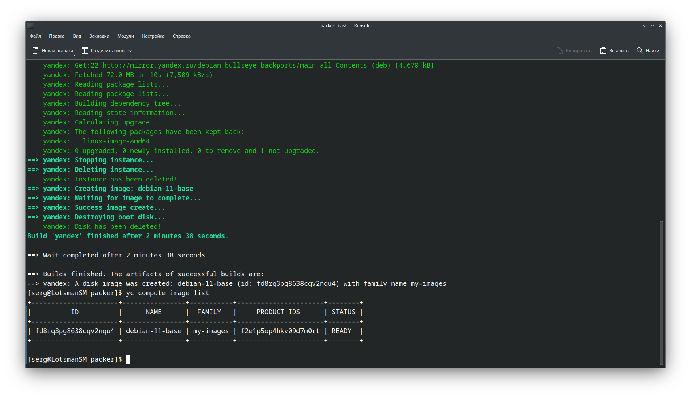

# Домашнее задание к занятию 4. «Оркестрация группой Docker-контейнеров на примере Docker Compose»

---

## Задача 1


Создайте собственный образ любой операционной системы (например, debian-11) с помощью Packer версии 1.7.0 ([инструкция](https://cloud.yandex.ru/docs/tutorials/infrastructure-management/packer-quickstart)). В инструкции указана минимальная версия 1.5, но нужно использовать 1.7, так как там есть нужный нам функционал


Чтобы получить зачёт, вам нужно предоставить скриншот страницы с созданным образом из личного кабинета YandexCloud.

## Решение 1
**Yandex.Cloud**

Установим Yandex.Cloud CLI и проверим версию:

```bash
╰─➤  curl https://storage.yandexcloud.net/yandexcloud-yc/install.sh | bash
╰─➤  yc --version
Yandex Cloud CLI 0.112.0 linux/amd64
```

Инициализируем профиль, сеть и подсеть:

```bash
╰─➤  yc init
Welcome! This command will take you through the configuration process.
Pick desired action:
 [1] Re-initialize this profile 'default' with new settings
 [2] Create a new profile
Please enter your numeric choice: 1
Please go to https://oauth.yandex.ru/authorize?response_type=token&client_id=1a6990aa636648e9b2ef855fa7bec2fb in order to obtain OAuth token.

Please enter OAuth token: [y0_AgAAAAAQFxg******************************aHoph48uofk6lY]
You have one cloud available: 'cloud-lotsmansm' (id = b1gc953ra7cl7jm5s3u4). It is going to be used by default.
Please choose folder to use:
 [1] default (id = b1gl6dqee4o5qromajnb)
 [2] Create a new folder
Please enter your numeric choice: 1
Your current folder has been set to 'default' (id = b1gl6dqee4o5qromajnb).
Do you want to configure a default Compute zone? [Y/n] y
Which zone do you want to use as a profile default?
 [1] ru-central1-a
 [2] ru-central1-b
 [3] ru-central1-c
 [4] Don't set default zone
Please enter your numeric choice: 1
Your profile default Compute zone has been set to 'ru-central1-a'.

╰─➤  yc config list                                                                                                                                                                                   127 ↵
token: y0_AgAAAAAQFxg6AATuwQAAAADwQLkMk-FvSMcBRwCoOaHoph48uofk6lY
cloud-id: b1gc953ra7cl7jm5s3u4
folder-id: b1gl6dqee4o5qromajnb
compute-default-zone: ru-central1-a

╰─➤  yc vpc network create --name net --labels my-label=netology --description "Network - netoligy"
id: enpm7gmn07i58p8eep4b
folder_id: b1gl6dqee4o5qromajnb
created_at: "2023-10-27T15:11:10Z"
name: net
description: Network - netoligy
labels:
  my-label: netology
default_security_group_id: enpk05kjvjs13gm44tas

╰─➤  yc vpc subnet create --name my-subnet-a --zone ru-central1-a --range 10.1.2.0/24 --network-name net --description "Subnet - netoligy"
id: e9bgfimof3iib4j62i0f
folder_id: b1gl6dqee4o5qromajnb
created_at: "2023-10-27T15:13:25Z"
name: my-subnet-a
description: Subnet - netoligy
network_id: enpm7gmn07i58p8eep4b
zone_id: ru-central1-a
v4_cidr_blocks:
  - 10.1.2.0/24
```

**Packer**

Скачаем Packer по [ссылке](https://hashicorp-releases.yandexcloud.net/packer/1.7.10/packer_1.7.10_linux_amd64.zip) и скопируем в папку `/usr/local/bin/`. Проверим версию `packer`:

```bash
╰─➤  wget https://hashicorp-releases.yandexcloud.net/packer/1.7.10/packer_1.7.10_linux_amd64.zip
╰─➤  unzip packer_1.7.10_linux_amd64.zip
╰─➤  sudo mv packer /usr/local/bin
╰─➤  packer --version
1.7.10
```

Настроим конфигурационный файл [debian-11-base.json](packer/debian-11-base.json) и запустим образ:

```bash
╰─➤  packer validate debian-11-base.json
The configuration is valid.

╰─➤  packer build debian-11-base.json
yandex: output will be in this color.

==> yandex: Creating temporary RSA SSH key for instance...
==> yandex: Using as source image: fd8dq1g8588brs6lfeeq (name: "debian-11-v20231023", family: "debian-11")
==> yandex: Use provided subnet id e9bgfimof3iib4j62i0f
==> yandex: Creating disk...
==> yandex: Creating instance...
==> yandex: Waiting for instance with id fhmp68lidph4a3fg08ae to become active...
    yandex: Detected instance IP: 84.252.128.213
==> yandex: Using SSH communicator to connect: 84.252.128.213
==> yandex: Waiting for SSH to become available...
==> yandex: Connected to SSH!
==> yandex: Provisioning with shell script: /tmp/packer-shell2440027471
    yandex: Get:1 http://mirror.yandex.ru/debian bullseye InRelease [116 kB]
    yandex: Get:2 http://mirror.yandex.ru/debian bullseye-updates InRelease [44.1 kB]
    yandex: Get:3 http://mirror.yandex.ru/debian bullseye-backports InRelease [49.0 kB]
    yandex: Get:4 http://security.debian.org bullseye-security InRelease [48.4 kB]
    yandex: Get:5 http://mirror.yandex.ru/debian bullseye/main Sources [8,502 kB]
    yandex: Get:6 http://mirror.yandex.ru/debian bullseye/main amd64 Packages [8,062 kB]
    yandex: Get:7 http://mirror.yandex.ru/debian bullseye/main Translation-en [6,236 kB]
    yandex: Get:8 http://mirror.yandex.ru/debian bullseye/main amd64 Contents (deb) [10.3 MB]
    yandex: Get:9 http://security.debian.org bullseye-security/main Sources [159 kB]
    yandex: Get:10 http://mirror.yandex.ru/debian bullseye/main all Contents (deb) [31.1 MB]
    yandex: Get:11 http://security.debian.org bullseye-security/main amd64 Packages [256 kB]
    yandex: Get:12 http://security.debian.org bullseye-security/main Translation-en [165 kB]
    yandex: Get:13 http://mirror.yandex.ru/debian bullseye-updates/main Sources [6,468 B]
    yandex: Get:14 http://mirror.yandex.ru/debian bullseye-updates/main amd64 Packages [17.4 kB]
    yandex: Get:15 http://mirror.yandex.ru/debian bullseye-updates/main Translation-en [10.1 kB]
    yandex: Get:16 http://mirror.yandex.ru/debian bullseye-updates/main amd64 Contents (deb) [86.7 kB]
    yandex: Get:17 http://mirror.yandex.ru/debian bullseye-updates/main all Contents (deb) [25.5 kB]
    yandex: Get:18 http://mirror.yandex.ru/debian bullseye-backports/main Sources [382 kB]
    yandex: Get:19 http://mirror.yandex.ru/debian bullseye-backports/main amd64 Packages [401 kB]
    yandex: Get:20 http://mirror.yandex.ru/debian bullseye-backports/main Translation-en [340 kB]
    yandex: Get:21 http://mirror.yandex.ru/debian bullseye-backports/main amd64 Contents (deb) [1,133 kB]
    yandex: Get:22 http://mirror.yandex.ru/debian bullseye-backports/main all Contents (deb) [4,670 kB]
    yandex: Fetched 72.0 MB in 9s (7,757 kB/s)
    yandex: Reading package lists...
    yandex: Reading package lists...
    yandex: Building dependency tree...
    yandex: Reading state information...
    yandex: Calculating upgrade...
    yandex: The following packages have been kept back:
    yandex:   linux-image-amd64
    yandex: 0 upgraded, 0 newly installed, 0 to remove and 1 not upgraded.
==> yandex: Stopping instance...
==> yandex: Deleting instance...
    yandex: Instance has been deleted!
==> yandex: Creating image: debian-11-base
==> yandex: Waiting for image to complete...
==> yandex: Success image create...
==> yandex: Destroying boot disk...
    yandex: Disk has been deleted!
Build 'yandex' finished after 2 minutes 38 seconds.

==> Wait completed after 2 minutes 38 seconds

==> Builds finished. The artifacts of successful builds are:
--> yandex: A disk image was created: debian-11-base (id: fd8rq3pg8638cqv2nqu4) with family name my-images
```

```bash
╰─➤  yc compute image list
+----------------------+----------------+-----------+----------------------+--------+
|          ID          |      NAME      |  FAMILY   |     PRODUCT IDS      | STATUS |
+----------------------+----------------+-----------+----------------------+--------+
| fd8rq3pg8638cqv2nqu4 | debian-11-base | my-images | f2e1p5op4hkv09d7m0rt | READY  |
+----------------------+----------------+-----------+----------------------+--------+
```

Результат:



По окончании работ удалим созданные сеть и подсеть:

```bash
yc vpc subnet delete --name my-subnet-a && yc vpc network delete --name net
done (2s)
```

---

## Задача 2

**2.1.** Создайте вашу первую виртуальную машину в YandexCloud с помощью web-интерфейса YandexCloud.        

**2.2.*** **(Необязательное задание)**      
Создайте вашу первую виртуальную машину в YandexCloud с помощью Terraform (вместо использования веб-интерфейса YandexCloud).
Используйте Terraform-код в директории ([src/terraform](https://github.com/netology-group/virt-homeworks/tree/virt-11/05-virt-04-docker-compose/src/terraform)).

Чтобы получить зачёт, вам нужно предоставить вывод команды terraform apply и страницы свойств, созданной ВМ из личного кабинета YandexCloud.

## Решение 2

Результат:

**2.1.** Создайте вашу первую виртуальную машину в YandexCloud с помощью web-интерфейса YandexCloud.


 **2.2.*** **(Необязательное задание)**

Скачаем Terraform по [ссылке](https://hashicorp-releases.yandexcloud.net/terraform/1.6.2/terraform_1.6.2_linux_amd64.zip) и скопируем в папку `/usr/local/bin/`. Проверим версию `terraform`:

 ```bash
╰─➤  wget https://hashicorp-releases.yandexcloud.net/terraform/1.6.2/terraform_1.6.2_linux_amd64.zip
╰─➤  unzip terraform_1.6.2_linux_amd64.zip
╰─➤  sudo mv terraform /usr/local/bin
╰─➤  terraform --version
Terraform v1.6.2
on linux_amd64
```

В интерфейсе Яндекс Облака создадим сервисный аккаунт `srv-test`. Для этого аккаунта создадим ключ авторизации:

```bash
╰─➤  yc iam key create --folder-name default --service-account-name srv-test --output key.json
id: ajevsiecoct01o1bn708
service_account_id: ajed1qs3on08tlekd17o
created_at: "2023-10-28T17:38:54.896347886Z"
key_algorithm: RSA_2048
```

Инициализируем `terraform`:

```bash
╰─➤  terraform init

Initializing the backend...

Initializing provider plugins...
- Finding latest version of yandex-cloud/yandex...
- Installing yandex-cloud/yandex v0.100.0...
- Installed yandex-cloud/yandex v0.100.0 (unauthenticated)

Terraform has created a lock file .terraform.lock.hcl to record the provider
selections it made above. Include this file in your version control repository
so that Terraform can guarantee to make the same selections by default when
you run "terraform init" in the future.

╷
│ Warning: Incomplete lock file information for providers
│
│ Due to your customized provider installation methods, Terraform was forced to calculate lock file checksums locally for the following providers:
│   - yandex-cloud/yandex
│
│ The current .terraform.lock.hcl file only includes checksums for linux_amd64, so Terraform running on another platform will fail to install these
│ providers.
│
│ To calculate additional checksums for another platform, run:
│   terraform providers lock -platform=linux_amd64
│ (where linux_amd64 is the platform to generate)
╵

Terraform has been successfully initialized!

You may now begin working with Terraform. Try running "terraform plan" to see
any changes that are required for your infrastructure. All Terraform commands
should now work.

If you ever set or change modules or backend configuration for Terraform,
rerun this command to reinitialize your working directory. If you forget, other
commands will detect it and remind you to do so if necessary.
```

После проверки плана `terraform plan` применим его:

```bash
╰─➤ terraform apply
...
yandex_compute_instance.node01: Creating...
yandex_compute_instance.node01: Still creating... [10s elapsed]
yandex_compute_instance.node01: Still creating... [20s elapsed]
yandex_compute_instance.node01: Still creating... [30s elapsed]
yandex_compute_instance.node01: Still creating... [40s elapsed]
yandex_compute_instance.node01: Creation complete after 43s [id=fhmeecvndu47ed0mgc9u]

Apply complete! Resources: 3 added, 0 changed, 0 destroyed.
```

Результат:


---

## Задача 3

С помощью Ansible и Docker Compose разверните на виртуальной машине из предыдущего задания систему мониторинга на основе Prometheus/Grafana.
Используйте Ansible-код в директории ([src/ansible](https://github.com/netology-group/virt-homeworks/tree/virt-11/05-virt-04-docker-compose/src/ansible)).

Чтобы получить зачёт, вам нужно предоставить вывод команды "docker ps" , все контейнеры, описанные в [docker-compose](https://github.com/netology-group/virt-homeworks/blob/virt-11/05-virt-04-docker-compose/src/ansible/stack/docker-compose.yaml),  должны быть в статусе "Up".

## Решение 3

Вывод команды `docker ps`: \


---

## Задача 4

1. Откройте веб-браузер, зайдите на страницу http://<внешний_ip_адрес_вашей_ВМ>:3000.
2. Используйте для авторизации логин и пароль из [.env-file](https://github.com/netology-group/virt-homeworks/blob/virt-11/05-virt-04-docker-compose/src/ansible/stack/.env).
3. Изучите доступный интерфейс, найдите в интерфейсе автоматически созданные docker-compose-панели с графиками([dashboards](https://grafana.com/docs/grafana/latest/dashboards/use-dashboards/)).
4. Подождите 5-10 минут, чтобы система мониторинга успела накопить данные.

Чтобы получить зачёт, предоставьте: 

- скриншот работающего веб-интерфейса Grafana с текущими метриками, как на примере ниже.

## Решение 4


---

## Задача 5 (*)

Создайте вторую ВМ и подключите её к мониторингу, развёрнутому на первом сервере.

Чтобы получить зачёт, предоставьте:

- скриншот из Grafana, на котором будут отображаться метрики добавленного вами сервера.


## Решение 5

Второй сервер Node02 поднял, установил и запустил Node Exporter.      \
Проверил через браузер, работает


Добавил на первом сервере Node01 в файл `prometheus.yml`              \

```bash
scrape_configs:
  - job_name: node02
    static_configs:
      - targets: ['10.128.0.19:9100']
```

Проверил через терминал

```bash
╰─➤  curl http://10.128.0.19:9100/metrics
```


Но при входе через браузер данные в Grafana данные отоборажаются.

Уже всё перепробывал, пересмотрел кучу инструкций, видео, смотрел документацию.

Ничего не помогает.

 ---
