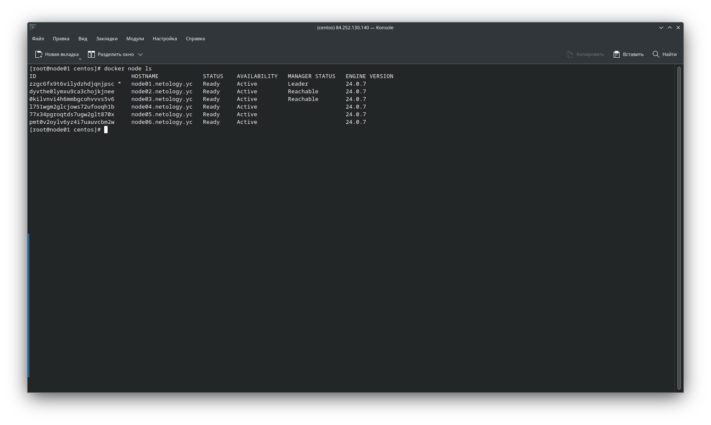
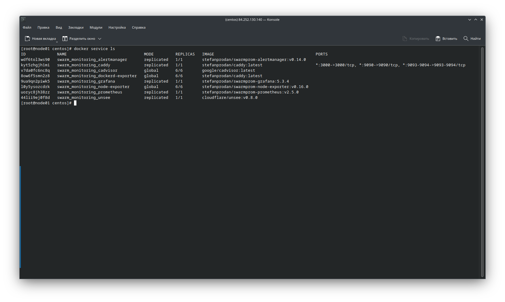

# Домашнее задание к занятию "5. Оркестрация кластером Docker контейнеров на примере Docker Swarm"

## Как сдавать задания

Обязательными к выполнению являются задачи без указания звездочки. Их выполнение необходимо для получения зачета и диплома о профессиональной переподготовке.

Задачи со звездочкой (*) являются дополнительными задачами и/или задачами повышенной сложности. Они не являются обязательными к выполнению, но помогут вам глубже понять тему.

Домашнее задание выполните в файле readme.md в github репозитории. В личном кабинете отправьте на проверку ссылку на .md-файл в вашем репозитории.

Любые вопросы по решению задач задавайте в чате учебной группы.

---


## Важно!

1. Перед отправкой работы на проверку удаляйте неиспользуемые ресурсы.
Это важно для того, чтоб предупредить неконтролируемый расход средств, полученных в результате использования промокода.
Подробные рекомендации [здесь](https://github.com/netology-code/virt-homeworks/blob/virt-11/r/README.md).

2. [Ссылки для установки открытого ПО](https://github.com/netology-code/devops-materials/blob/master/README.md)

---

## Задача 1

Дайте письменые ответы на следующие вопросы:

- В чём отличие режимов работы сервисов в Docker Swarm кластере: replication и global?
- Какой алгоритм выбора лидера используется в Docker Swarm кластере?
- Что такое Overlay Network?


## Решение 1

1. В чём отличие режимов работы сервисов в Docker Swarm кластере: replication и global?

Режим replication запускает сервис на указанном количестве нод. Количество задается командой `update --replicas=N`. Режим global запускает сервис на всех нодах кластера. [Источник](https://docs.docker.com/engine/swarm/how-swarm-mode-works/services/).

2. Какой алгоритм выбора лидера используется в Docker Swarm кластере?

Алгоритм Raft — лидером становится та нода, которая получила больше всего голосов.

3. Что такое Overlay Network?

Overlay Network — распределённая виртуальная сеть для обмена данными между контейнерами Docker Swarm.

---

## Задача 2

Создать ваш первый Docker Swarm кластер в Яндекс.Облаке

Для получения зачета, вам необходимо предоставить скриншот из терминала (консоли), с выводом команды:
```
docker node ls
```

## Решение 2

Создадим сеть и подсеть:

```bash
╰─➤  yc vpc network create --name net --labels my-label=netology --description "my first network via yc"
id: XXXXXXXXXXXXXXXXXXXX
folder_id: XXXXXXXXXXXXXXXXXXXX
created_at: "2023-10-30T17:48:10Z"
name: net
description: my first network via yc
labels:
  my-label: netology
default_security_group_id: XXXXXXXXXXXXXXXXXXXX
  
╰─➤  yc vpc subnet create --name my-subnet-a --zone ru-central1-a --range 10.1.2.0/24 --network-name net --description "my first subnet via yc"
id: XXXXXXXXXXXXXXXXXXXX
folder_id: XXXXXXXXXXXXXXXXXXXX
created_at: "2023-10-30T17:49:01Z"
name: my-subnet-a
description: my first subnet via yc
network_id: XXXXXXXXXXXXXXXXXXXX
zone_id: ru-central1-a
v4_cidr_blocks:
  - 10.1.2.0/24
```

Настроим [centos-7-base.json](src/packer/centos-7-base.json) и запустим Packer:

```bash
╰─➤  packer build centos-7-base.json
yandex: output will be in this color.

==> yandex: Creating temporary RSA SSH key for instance...
==> yandex: Using as source image: fd8mchbe4poo11chk2gb (name: "centos-7-v20231030", family: "centos-7")
==> yandex: Use provided subnet id e9bfjui1713v5l5h38u6
==> yandex: Creating disk...
==> yandex: Creating instance...
==> yandex: Waiting for instance with id fhmd1rq231hqe8rg0g2j to become active...
    yandex: Detected instance IP: 158.160.61.125
==> yandex: Using SSH communicator to connect: 158.160.61.125
==> yandex: Waiting for SSH to become available...
==> yandex: Connected to SSH!
==> yandex: Provisioning with shell script: /tmp/packer-shell2248351254
    yandex: Loaded plugins: fastestmirror
    yandex: Loading mirror speeds from cached hostfile
    yandex:  * base: mirror.yandex.ru
    yandex:  * extras: mirror.docker.ru
    yandex:  * updates: mirror.yandex.ru
    yandex: No packages marked for update
    yandex: Loaded plugins: fastestmirror
    yandex: Loading mirror speeds from cached hostfile
    yandex:  * base: mirror.yandex.ru
    yandex:  * extras: mirror.docker.ru
    yandex:  * updates: mirror.yandex.ru
    yandex: Package iptables-1.4.21-35.el7.x86_64 already installed and latest version
    yandex: Package curl-7.29.0-59.el7_9.1.x86_64 already installed and latest version
    yandex: Package net-tools-2.0-0.25.20131004git.el7.x86_64 already installed and latest version
    yandex: Package rsync-3.1.2-12.el7_9.x86_64 already installed and latest version
    yandex: Package openssh-server-7.4p1-23.el7_9.x86_64 already installed and latest version
    yandex: Resolving Dependencies
    yandex: --> Running transaction check
    yandex: ---> Package bind-utils.x86_64 32:9.11.4-26.P2.el7_9.15 will be installed
    yandex: --> Processing Dependency: bind-libs-lite(x86-64) = 32:9.11.4-26.P2.el7_9.15 for package: 32:bind-utils-9.11.4-26.P2.el7_9.15.x86_64
    yandex: --> Processing Dependency: bind-libs(x86-64) = 32:9.11.4-26.P2.el7_9.15 for package: 32:bind-utils-9.11.4-26.P2.el7_9.15.x86_64
    yandex: --> Processing Dependency: liblwres.so.160()(64bit) for package: 32:bind-utils-9.11.4-26.P2.el7_9.15.x86_64
    yandex: --> Processing Dependency: libisccfg.so.160()(64bit) for package: 32:bind-utils-9.11.4-26.P2.el7_9.15.x86_64
    yandex: --> Processing Dependency: libisc.so.169()(64bit) for package: 32:bind-utils-9.11.4-26.P2.el7_9.15.x86_64
    yandex: --> Processing Dependency: libirs.so.160()(64bit) for package: 32:bind-utils-9.11.4-26.P2.el7_9.15.x86_64
    yandex: --> Processing Dependency: libdns.so.1102()(64bit) for package: 32:bind-utils-9.11.4-26.P2.el7_9.15.x86_64
    yandex: --> Processing Dependency: libbind9.so.160()(64bit) for package: 32:bind-utils-9.11.4-26.P2.el7_9.15.x86_64
    yandex: --> Processing Dependency: libGeoIP.so.1()(64bit) for package: 32:bind-utils-9.11.4-26.P2.el7_9.15.x86_64
    yandex: ---> Package bridge-utils.x86_64 0:1.5-9.el7 will be installed
    yandex: ---> Package tcpdump.x86_64 14:4.9.2-4.el7_7.1 will be installed
    yandex: --> Processing Dependency: libpcap >= 14:1.5.3-10 for package: 14:tcpdump-4.9.2-4.el7_7.1.x86_64
    yandex: --> Processing Dependency: libpcap.so.1()(64bit) for package: 14:tcpdump-4.9.2-4.el7_7.1.x86_64
    yandex: ---> Package telnet.x86_64 1:0.17-66.el7 will be installed
    yandex: --> Running transaction check
    yandex: ---> Package GeoIP.x86_64 0:1.5.0-14.el7 will be installed
    yandex: --> Processing Dependency: geoipupdate for package: GeoIP-1.5.0-14.el7.x86_64
    yandex: ---> Package bind-libs.x86_64 32:9.11.4-26.P2.el7_9.15 will be installed
    yandex: --> Processing Dependency: bind-license = 32:9.11.4-26.P2.el7_9.15 for package: 32:bind-libs-9.11.4-26.P2.el7_9.15.x86_64
    yandex: ---> Package bind-libs-lite.x86_64 32:9.11.4-26.P2.el7_9.15 will be installed
    yandex: ---> Package libpcap.x86_64 14:1.5.3-13.el7_9 will be installed
    yandex: --> Running transaction check
    yandex: ---> Package bind-license.noarch 32:9.11.4-26.P2.el7_9.15 will be installed
    yandex: ---> Package geoipupdate.x86_64 0:2.5.0-2.el7 will be installed
    yandex: --> Finished Dependency Resolution
    yandex:
    yandex: Dependencies Resolved
    yandex:
    yandex: ================================================================================
    yandex:  Package            Arch       Version                        Repository   Size
    yandex: ================================================================================
    yandex: Installing:
    yandex:  bind-utils         x86_64     32:9.11.4-26.P2.el7_9.15       updates     262 k
    yandex:  bridge-utils       x86_64     1.5-9.el7                      base         32 k
    yandex:  tcpdump            x86_64     14:4.9.2-4.el7_7.1             base        422 k
    yandex:  telnet             x86_64     1:0.17-66.el7                  updates      64 k
    yandex: Installing for dependencies:
    yandex:  GeoIP              x86_64     1.5.0-14.el7                   base        1.5 M
    yandex:  bind-libs          x86_64     32:9.11.4-26.P2.el7_9.15       updates     158 k
    yandex:  bind-libs-lite     x86_64     32:9.11.4-26.P2.el7_9.15       updates     1.1 M
    yandex:  bind-license       noarch     32:9.11.4-26.P2.el7_9.15       updates      92 k
    yandex:  geoipupdate        x86_64     2.5.0-2.el7                    updates      35 k
    yandex:  libpcap            x86_64     14:1.5.3-13.el7_9              updates     139 k
    yandex:
    yandex: Transaction Summary
    yandex: ================================================================================
    yandex: Install  4 Packages (+6 Dependent packages)
    yandex:
    yandex: Total download size: 3.8 M
    yandex: Installed size: 9.0 M
    yandex: Downloading packages:
    yandex: --------------------------------------------------------------------------------
    yandex: Total                                               12 MB/s | 3.8 MB  00:00
    yandex: Running transaction check
    yandex: Running transaction test
    yandex: Transaction test succeeded
    yandex: Running transaction
    yandex:   Installing : 32:bind-license-9.11.4-26.P2.el7_9.15.noarch                1/10
    yandex:   Installing : geoipupdate-2.5.0-2.el7.x86_64                              2/10
    yandex:   Installing : GeoIP-1.5.0-14.el7.x86_64                                   3/10
    yandex:   Installing : 32:bind-libs-lite-9.11.4-26.P2.el7_9.15.x86_64              4/10
    yandex:   Installing : 32:bind-libs-9.11.4-26.P2.el7_9.15.x86_64                   5/10
    yandex:   Installing : 14:libpcap-1.5.3-13.el7_9.x86_64                            6/10
    yandex: pam_tally2: Error opening /var/log/tallylog for update: Permission denied
    yandex: pam_tally2: Authentication error
    yandex: useradd: failed to reset the tallylog entry of user "tcpdump"
    yandex:   Installing : 14:tcpdump-4.9.2-4.el7_7.1.x86_64                           7/10
    yandex:   Installing : 32:bind-utils-9.11.4-26.P2.el7_9.15.x86_64                  8/10
    yandex:   Installing : bridge-utils-1.5-9.el7.x86_64                               9/10
    yandex:   Installing : 1:telnet-0.17-66.el7.x86_64                                10/10
    yandex:   Verifying  : GeoIP-1.5.0-14.el7.x86_64                                   1/10
    yandex:   Verifying  : 14:libpcap-1.5.3-13.el7_9.x86_64                            2/10
    yandex:   Verifying  : 1:telnet-0.17-66.el7.x86_64                                 3/10
    yandex:   Verifying  : 32:bind-libs-9.11.4-26.P2.el7_9.15.x86_64                   4/10
    yandex:   Verifying  : geoipupdate-2.5.0-2.el7.x86_64                              5/10
    yandex:   Verifying  : 32:bind-libs-lite-9.11.4-26.P2.el7_9.15.x86_64              6/10
    yandex:   Verifying  : 32:bind-utils-9.11.4-26.P2.el7_9.15.x86_64                  7/10
    yandex:   Verifying  : 32:bind-license-9.11.4-26.P2.el7_9.15.noarch                8/10
    yandex:   Verifying  : 14:tcpdump-4.9.2-4.el7_7.1.x86_64                           9/10
    yandex:   Verifying  : bridge-utils-1.5-9.el7.x86_64                              10/10
    yandex:
    yandex: Installed:
    yandex:   bind-utils.x86_64 32:9.11.4-26.P2.el7_9.15   bridge-utils.x86_64 0:1.5-9.el7
    yandex:   tcpdump.x86_64 14:4.9.2-4.el7_7.1            telnet.x86_64 1:0.17-66.el7
    yandex:
    yandex: Dependency Installed:
    yandex:   GeoIP.x86_64 0:1.5.0-14.el7
    yandex:   bind-libs.x86_64 32:9.11.4-26.P2.el7_9.15
    yandex:   bind-libs-lite.x86_64 32:9.11.4-26.P2.el7_9.15
    yandex:   bind-license.noarch 32:9.11.4-26.P2.el7_9.15
    yandex:   geoipupdate.x86_64 0:2.5.0-2.el7
    yandex:   libpcap.x86_64 14:1.5.3-13.el7_9
    yandex:
    yandex: Complete!
==> yandex: Stopping instance...
==> yandex: Deleting instance...
    yandex: Instance has been deleted!
==> yandex: Creating image: centos-7-base
==> yandex: Waiting for image to complete...
==> yandex: Success image create...
==> yandex: Destroying boot disk...
    yandex: Disk has been deleted!
Build 'yandex' finished after 2 minutes 46 seconds.

==> Wait completed after 2 minutes 46 seconds

==> Builds finished. The artifacts of successful builds are:
--> yandex: A disk image was created: centos-7-base (id: fd8n3o9rb3cp87c9i6n7) with family name centos
```

Удалим созданные сеть и подсеть:

```bash
╰─➤  yc vpc subnet delete --name my-subnet-a && yc vpc network delete --name net
```

Скорректируем конфигурационные файлы Ansible (заменим `package` на `name`):
* [ansible/roles/docker-installation/tasks/main.yml](src/ansible/roles/docker-installation/tasks/main.yml) 
* [ansible/roles/install-tools/tasks/main.yml](src/ansible/roles/install-tools/tasks/main.yml)

Инициализируем Terraform `terraform init`, проверим план `terraform plan` и применим его:

```bash
╰─➤  terraform apply
...
null_resource.monitoring (local-exec): PLAY [nodes] *******************************************************************

null_resource.monitoring (local-exec): TASK [Gathering Facts] *********************************************************
null_resource.monitoring (local-exec): ok: [node03.netology.yc]
null_resource.monitoring (local-exec): ok: [node02.netology.yc]
null_resource.monitoring (local-exec): ok: [node01.netology.yc]

null_resource.monitoring (local-exec): TASK [Check Current Leader] ****************************************************
null_resource.monitoring (local-exec): ok: [node03.netology.yc]
null_resource.monitoring (local-exec): ok: [node02.netology.yc]
null_resource.monitoring (local-exec): ok: [node01.netology.yc]

null_resource.monitoring (local-exec): TASK [Run deploy, if node is leader] *******************************************
null_resource.monitoring: Still creating... [10s elapsed]
null_resource.monitoring: Still creating... [20s elapsed]
null_resource.monitoring (local-exec): skipping: [node02.netology.yc]
null_resource.monitoring (local-exec): skipping: [node03.netology.yc]
null_resource.monitoring (local-exec): changed: [node01.netology.yc]

null_resource.monitoring (local-exec): PLAY RECAP *********************************************************************
null_resource.monitoring (local-exec): node01.netology.yc         : ok=3    changed=1    unreachable=0    failed=0    skipped=0    rescued=0    ignored=0
null_resource.monitoring (local-exec): node02.netology.yc         : ok=2    changed=0    unreachable=0    failed=0    skipped=1    rescued=0    ignored=0
null_resource.monitoring (local-exec): node03.netology.yc         : ok=2    changed=0    unreachable=0    failed=0    skipped=1    rescued=0    ignored=0

null_resource.monitoring: Creation complete after 27s [id=5583559206839561435]

Apply complete! Resources: 13 added, 0 changed, 0 destroyed.

...
```

В результате проделанной работы в облаке развёрнут кластер на 6 нод: 



---

## Задача 3

Создать ваш первый, готовый к боевой эксплуатации кластер мониторинга, состоящий из стека микросервисов.

Для получения зачета, вам необходимо предоставить скриншот из терминала (консоли), с выводом команды:
```
docker service ls
```

## Решение 3

Инициализируем Terraform `terraform init`, проверим план `terraform plan` и применим его:

```bash
╰─➤  terraform apply
...
null_resource.monitoring (local-exec): PLAY [nodes] *******************************************************************

null_resource.monitoring (local-exec): TASK [Gathering Facts] *********************************************************
null_resource.monitoring (local-exec): ok: [node03.netology.yc]
null_resource.monitoring (local-exec): ok: [node02.netology.yc]
null_resource.monitoring (local-exec): ok: [node01.netology.yc]

null_resource.monitoring (local-exec): TASK [Check Current Leader] ****************************************************
null_resource.monitoring (local-exec): ok: [node03.netology.yc]
null_resource.monitoring (local-exec): ok: [node02.netology.yc]
null_resource.monitoring (local-exec): ok: [node01.netology.yc]

null_resource.monitoring (local-exec): TASK [Run deploy, if node is leader] *******************************************
null_resource.monitoring: Still creating... [10s elapsed]
null_resource.monitoring: Still creating... [20s elapsed]
null_resource.monitoring (local-exec): skipping: [node02.netology.yc]
null_resource.monitoring (local-exec): skipping: [node03.netology.yc]
null_resource.monitoring (local-exec): changed: [node01.netology.yc]

null_resource.monitoring (local-exec): PLAY RECAP *********************************************************************
null_resource.monitoring (local-exec): node01.netology.yc         : ok=3    changed=1    unreachable=0    failed=0    skipped=0    rescued=0    ignored=0
null_resource.monitoring (local-exec): node02.netology.yc         : ok=2    changed=0    unreachable=0    failed=0    skipped=1    rescued=0    ignored=0
null_resource.monitoring (local-exec): node03.netology.yc         : ok=2    changed=0    unreachable=0    failed=0    skipped=1    rescued=0    ignored=0

null_resource.monitoring: Creation complete after 27s [id=5583559206839561435]

Apply complete! Resources: 13 added, 0 changed, 0 destroyed.
...
```

В результате проделанной работы в облаке развёрнут кластер, в котором запущены различные сервисы:

```bash
╰─➤  docker service ls
ID             NAME                                MODE         REPLICAS   IMAGE                                          PORTS
wdf6tol3ws90   swarm_monitoring_alertmanager       replicated   1/1        stefanprodan/swarmprom-alertmanager:v0.14.0    
kyt5zhgjh1mi   swarm_monitoring_caddy              replicated   1/1        stefanprodan/caddy:latest                      *:3000->3000/tcp, *:9090->9090/tcp, *:9093-9094->9093-9094/tcp
v7da0fc6nc8q   swarm_monitoring_cadvisor           global       6/6        google/cadvisor:latest                         
8ow6f5smn2z8   swarm_monitoring_dockerd-exporter   global       6/6        stefanprodan/caddy:latest                      
9ua9qn2piwk5   swarm_monitoring_grafana            replicated   1/1        stefanprodan/swarmprom-grafana:5.3.4           
l0y5ysozcdrk   swarm_monitoring_node-exporter      global       6/6        stefanprodan/swarmprom-node-exporter:v0.16.0   
uoryc8jh38zz   swarm_monitoring_prometheus         replicated   1/1        stefanprodan/swarmprom-prometheus:v2.5.0       
44lii9ej0f8d   swarm_monitoring_unsee              replicated   1/1        cloudflare/unsee:v0.8.0 
```



Выполним `terraform destroy` для удаления созданного кластера.

---

## Задача 4 (*)

Выполнить на лидере Docker Swarm кластера команду (указанную ниже) и дать письменное описание её функционала, что она делает и зачем она нужна:
```
# см.документацию: https://docs.docker.com/engine/swarm/swarm_manager_locking/
docker swarm update --autolock=true
```

Выполнить на лидере Docker Swarm кластера команду (указанную ниже) и дать письменное описание её функционала, что она делает и зачем она нужна:
```
# см.документацию: https://docs.docker.com/engine/swarm/swarm_manager_locking/
```

## Решение 4 (*)

```shell
[root@node01 centos]# docker swarm update --autolock=true
Swarm updated.
To unlock a swarm manager after it restarts, run the `docker swarm unlock`
command and provide the following key:

    SWMKEY-1-COpQuoT/HQOkboPgPtzTSVgXHwSfIj+JYR8JDrPjep8

Please remember to store this key in a password manager, since without it you
will not be able to restart the manager.
[root@node01 centos]# service docker restart
Redirecting to /bin/systemctl restart docker.service
[root@node01 centos]# docker service ls
Error response from daemon: Swarm is encrypted and needs to be unlocked before it can be used. Please use "docker swarm unlock" to unlock it.
```

Команда `docker swarm update --autolock=true` создаёт ключ для шифрования/дешифрования логов Raft.

---
