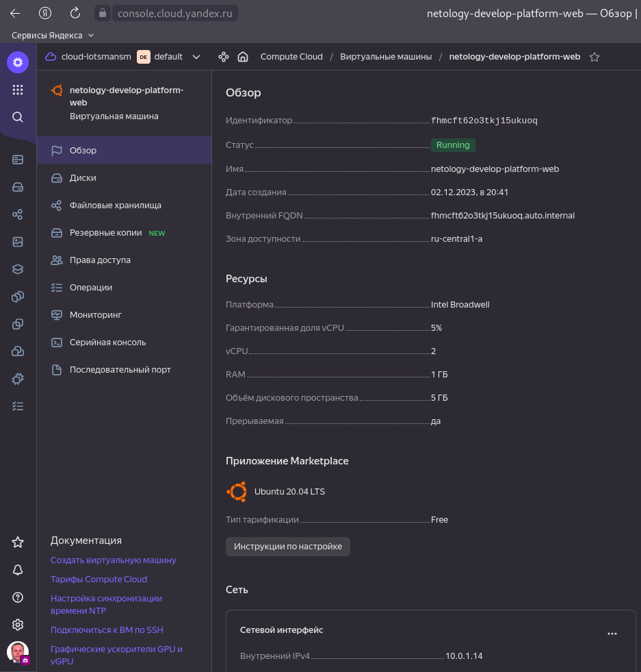
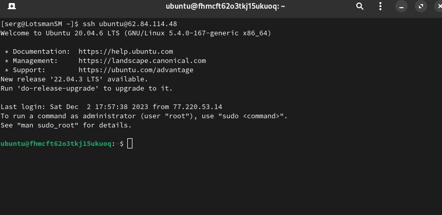
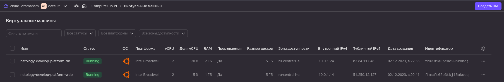

# Домашнее задание к занятию «Основы Terraform. Yandex Cloud»

### Решение задания 1
В качестве ответа всегда полностью прикладывайте ваш terraform-код в git.  Убедитесь что ваша версия **Terraform** =1.5.Х (версия 1.6.Х может вызывать проблемы с Яндекс провайдером) 

1. Изучите проект. В файле variables.tf объявлены переменные для Yandex provider.

Файл variables.tf нужен для того, чтобы определить типы переменных и при необходимости, установить их значения по умолчанию.


2. Переименуйте файл personal.auto.tfvars_example в personal.auto.tfvars. Заполните переменные: идентификаторы облака, токен доступа. Благодаря .gitignore этот файл не попадёт в публичный репозиторий. **Вы можете выбрать иной способ безопасно передать секретные данные в terraform.**

Переименовал файл personal.auto.tfvars_example в personal.auto.tfvars, заполнил переменные. Поскольку файл personal.auto.tfvars находится в .gitignore, то можно не опасаться утечки данных. Передавать секретные переменные можно и другими способами. Например, в секретной переменной можно указать ключ sensitive = true, тогда при выполнении ```terraform plan/apply/output/console``` его значение не будет выведено в консоль.

Также можно передавать секретные переменные в командной строке в ключе -var - ```terraform apply -var "token=***"```, использовать переменные окружения, предварительно их создав, например, командой export token=***, либо при выполнении ```terraform apply``` ссылаться на отдельный var файл вне рабочей директории проекта - ```terraform apply -var-file=~/.secret/private.tfvars```.

3. Сгенерируйте или используйте свой текущий ssh-ключ. Запишите его открытую часть в переменную **vms_ssh_root_key**.

Создал короткий ssh ключ используя ```ssh-keygen -t ed25519```, записал его pub часть в переменную ***vms_ssh_root_key***.

4. Инициализируйте проект, выполните код. Исправьте намеренно допущенные синтаксические ошибки. Ищите внимательно, посимвольно. Ответьте, в чём заключается их суть.

```bash
╰─➤terraform apply
data.yandex_compute_image.ubuntu: Reading...
yandex_vpc_network.develop: Refreshing state... [id=XXXXXXXXXXXXXXXXXXXX]
data.yandex_compute_image.ubuntu: Read complete after 0s [id=XXXXXXXXXXXXXXXXXXXX]
yandex_vpc_subnet.develop: Refreshing state... [id=XXXXXXXXXXXXXXXXXXXX]

Terraform used the selected providers to generate the following execution plan. Resource actions are indicated with the following symbols:
  + create

Terraform will perform the following actions:

  # yandex_compute_instance.platform will be created
  + resource "yandex_compute_instance" "platform" {
      + created_at                = (known after apply)
      + folder_id                 = (known after apply)
      + fqdn                      = (known after apply)
      + gpu_cluster_id            = (known after apply)
      + hostname                  = (known after apply)
      + id                        = (known after apply)
      + metadata                  = {
          + "serial-port-enable" = "1"
          + "ssh-keys"           = "ubuntu:ssh-ed25519 AXXXXXXXXXXXXXXXXXXXXXXXXXXXXXXXXXXXXXXXXXXXXXXXXXXXXXXXXXXXXXXXXXXXXXXXXXXXXXXXXXXXXXXXXXXXXXXXXXXXX"
        }
      + name                      = "netology-develop-platform-web"
      + network_acceleration_type = "standard"
      + platform_id               = "standart-v4"
      + service_account_id        = (known after apply)
      + status                    = (known after apply)
      + zone                      = (known after apply)

      + boot_disk {
          + auto_delete = true
          + device_name = (known after apply)
          + disk_id     = (known after apply)
          + mode        = (known after apply)

          + initialize_params {
              + block_size  = (known after apply)
              + description = (known after apply)
              + image_id    = "XXXXXXXXXXXXXXXXXXXX"
              + name        = (known after apply)
              + size        = (known after apply)
              + snapshot_id = (known after apply)
              + type        = "network-hdd"
            }
        }

      + network_interface {
          + index              = (known after apply)
          + ip_address         = (known after apply)
          + ipv4               = true
          + ipv6               = (known after apply)
          + ipv6_address       = (known after apply)
          + mac_address        = (known after apply)
          + nat                = true
          + nat_ip_address     = (known after apply)
          + nat_ip_version     = (known after apply)
          + security_group_ids = (known after apply)
          + subnet_id          = "XXXXXXXXXXXXXXXXXXXX"
        }

      + resources {
          + core_fraction = 5
          + cores         = 1
          + memory        = 1
        }

      + scheduling_policy {
          + preemptible = true
        }
    }

Plan: 1 to add, 0 to change, 0 to destroy.

Do you want to perform these actions?
  Terraform will perform the actions described above.
  Only 'yes' will be accepted to approve.

  Enter a value: yes

yandex_compute_instance.platform: Creating...
╷
│ Error: Error while requesting API to create instance: server-request-id = 82e12ed2-17c4-4a17-87a6-37621d9ab9a3 server-trace-id = 1343aa33290f1ff5:3eef0745aa66d0b0:1343aa33290f1ff5:1 client-request-id = 27e8c6ba-2928-41fe-9e23-96fe0261b287 client-trace-id = 350fd15f-d8a9-49e9-a243-506552311d7a rpc error: code = FailedPrecondition desc = Platform "standart-v4" not found
│ 
│   with yandex_compute_instance.platform,
│   on main.tf line 15, in resource "yandex_compute_instance" "platform":
│   15: resource "yandex_compute_instance" "platform" {
│ 
```
Строка 17 platform_id = "standart-v4"  Опечатка в слове standard. Cores нужно поставить 2 или 4 

```bash
╰─➤terraform apply
data.yandex_compute_image.ubuntu: Reading...
yandex_vpc_network.develop: Refreshing state... [id=XXXXXXXXXXXXXXXXXXXX]
data.yandex_compute_image.ubuntu: Read complete after 1s [id=XXXXXXXXXXXXXXXXXXXX]
yandex_vpc_subnet.develop: Refreshing state... [id=XXXXXXXXXXXXXXXXXXXX]
yandex_compute_instance.platform: Refreshing state... [id=XXXXXXXXXXXXXXXXXXXX]

Note: Objects have changed outside of Terraform

Terraform detected the following changes made outside of Terraform since the last "terraform apply" which may have affected this plan:

  # yandex_vpc_network.develop has been deleted
  - resource "yandex_vpc_network" "develop" {
      - id                        = "XXXXXXXXXXXXXXXXXXXX" -> null
        name                      = "develop"
        # (5 unchanged attributes hidden)
    }

  # yandex_vpc_subnet.develop has been deleted
  - resource "yandex_vpc_subnet" "develop" {
      - id             = "XXXXXXXXXXXXXXXXXXXX" -> null
        name           = "develop"
        # (7 unchanged attributes hidden)
    }


Unless you have made equivalent changes to your configuration, or ignored the relevant attributes using ignore_changes, the following plan may include actions to undo or respond to these changes.

────────────────────────────────────────────────────────────────────────────────────────────────────────────────────────────────────────────────────────────────────────────────────────────────────

Terraform used the selected providers to generate the following execution plan. Resource actions are indicated with the following symbols:
  + create

Terraform will perform the following actions:

  # yandex_compute_instance.platform will be created
  + resource "yandex_compute_instance" "platform" {
      + created_at                = (known after apply)
      + folder_id                 = (known after apply)
      + fqdn                      = (known after apply)
      + gpu_cluster_id            = (known after apply)
      + hostname                  = (known after apply)
      + id                        = (known after apply)
      + metadata                  = {
          + "serial-port-enable" = "1"
          + "ssh-keys"           = "ubuntu:ssh-ed25519 XXXXXXXXXXXXXXXXXXXXXXXXXXXXXXXXXXXXXXXXXXXXXXXXXXXXXXXXXXXXXXXXXXXXXXXXXXXXXXXX"
        }
      + name                      = "netology-develop-platform-web"
      + network_acceleration_type = "standard"
      + platform_id               = "standard-v1"
      + service_account_id        = (known after apply)
      + status                    = (known after apply)
      + zone                      = (known after apply)

      + boot_disk {
          + auto_delete = true
          + device_name = (known after apply)
          + disk_id     = (known after apply)
          + mode        = (known after apply)

          + initialize_params {
              + block_size  = (known after apply)
              + description = (known after apply)
              + image_id    = "XXXXXXXXXXXXXXXXXXXX"
              + name        = (known after apply)
              + size        = (known after apply)
              + snapshot_id = (known after apply)
              + type        = "network-hdd"
            }
        }

      + network_interface {
          + index              = (known after apply)
          + ip_address         = (known after apply)
          + ipv4               = true
          + ipv6               = (known after apply)
          + ipv6_address       = (known after apply)
          + mac_address        = (known after apply)
          + nat                = true
          + nat_ip_address     = (known after apply)
          + nat_ip_version     = (known after apply)
          + security_group_ids = (known after apply)
          + subnet_id          = (known after apply)
        }

      + resources {
          + core_fraction = 5
          + cores         = 2
          + memory        = 1
        }

      + scheduling_policy {
          + preemptible = true
        }
    }

  # yandex_vpc_network.develop will be created
  + resource "yandex_vpc_network" "develop" {
      + created_at                = (known after apply)
      + default_security_group_id = (known after apply)
      + folder_id                 = (known after apply)
      + id                        = (known after apply)
      + labels                    = (known after apply)
      + name                      = "develop"
      + subnet_ids                = (known after apply)
    }

  # yandex_vpc_subnet.develop will be created
  + resource "yandex_vpc_subnet" "develop" {
      + created_at     = (known after apply)
      + folder_id      = (known after apply)
      + id             = (known after apply)
      + labels         = (known after apply)
      + name           = "develop"
      + network_id     = (known after apply)
      + v4_cidr_blocks = [
          + "10.0.1.0/24",
        ]
      + v6_cidr_blocks = (known after apply)
      + zone           = "ru-central1-a"
    }

Plan: 3 to add, 0 to change, 0 to destroy.

Do you want to perform these actions?
  Terraform will perform the actions described above.
  Only 'yes' will be accepted to approve.

  Enter a value: yes

yandex_vpc_network.develop: Creating...
yandex_vpc_network.develop: Creation complete after 2s [id=enpqsgphvb5n50cc7smi]
yandex_vpc_subnet.develop: Creating...
yandex_vpc_subnet.develop: Creation complete after 1s [id=e9bd2480si9a1cs6vlen]
yandex_compute_instance.platform: Creating...
yandex_compute_instance.platform: Still creating... [10s elapsed]
yandex_compute_instance.platform: Still creating... [20s elapsed]
yandex_compute_instance.platform: Still creating... [30s elapsed]
yandex_compute_instance.platform: Still creating... [40s elapsed]
yandex_compute_instance.platform: Creation complete after 45s [id=fhmcft62o3tkj15ukuoq]

Apply complete! Resources: 3 added, 0 changed, 0 destroyed.
```


5. Ответьте, как в процессе обучения могут пригодиться параметры ```preemptible = true``` и ```core_fraction=5``` в параметрах ВМ. Ответ в документации Yandex Cloud.

Параметр ```preemptible = true``` применяется в том случае, если нужно сделать виртуальную машину прерываемой, то есть возможность остановки ВМ в любой момент. Применятся если с момента запуска машины прошло 24 часа либо возникает нехватка ресурсов для запуска ВМ. Прерываемые ВМ не обеспечивают отказоустойчивость.

Параметр ```core_fraction=5``` указывает базовую производительность ядра в процентах. Указывается для экономии ресурсов.

В качестве решения приложите:

- скриншот ЛК Yandex Cloud с созданной ВМ;



- скриншот успешного подключения к консоли ВМ через ssh. К OS ubuntu "out of a box, те из коробки" необходимо подключаться под пользователем ubuntu: ```"ssh ubuntu@vm_ip_address"```; Вы познакомитесь с тем как при создании ВМ кастомизировать пользователя в  блоке metadata в следующей лекции.



---

### Решение задание 2

1. Изучите файлы проекта.
2. Замените все хардкод-**значения** для ресурсов **yandex_compute_image** и **yandex_compute_instance** на **отдельные** переменные. К названиям переменных ВМ добавьте в начало префикс **vm_web_** .  Пример: **vm_web_name**.

Заменил хардкод-значения в файле `main.tf` для ресурсов yandex_compute_image и yandex_compute_instance с добавлением префикса ***vm_web_***:

```
data "yandex_compute_image" "ubuntu" {
  family = var.vm_web_family
}
resource "yandex_compute_instance" "platform" {
  name        = var.vm_web_name
  platform_id = var.vm_web_platform_id
  resources {
    cores         = var.vm_web_cores
    memory        = var.vm_web_memory
    core_fraction = var.vm_web_core_fraction
  }
```

2. Объявите нужные переменные в файле variables.tf, обязательно указывайте тип переменной. Заполните их **default** прежними значениями из main.tf. 

Объявил переменные в файле `variables.tf`:

```
variable "vm_web_family" {
  type        = string
  default     = "ubuntu-2004-lts"
  description = "Ububnu Version"
}

variable "vm_web_name" {
  type        = string
  default     = "netology-develop-platform-web"
  description = "Instant Name"
}

variable "vm_web_platform_id" {
  type        = string
  default     = "standard-v4"
  description = "Platform ID"
}

variable "vm_web_cores" {
  type        = string
  default     = "2"
  description = "vCPU"
}

variable "vm_web_memory" {
  type        = string
  default     = "1"
  description = "VM memory, Gb"
}

variable "vm_web_core_fraction" {
  type        = string
  default     = "5"
  description = "core fraction, %"
}
```

3. Проверьте terraform plan. Изменений быть не должно. 

```bash
╰─➤terraform plan
data.yandex_compute_image.ubuntu: Reading...
yandex_vpc_network.develop: Refreshing state... [id=XXXXXXXXXXXXXXXXXXXX]
data.yandex_compute_image.ubuntu: Read complete after 1s [id=XXXXXXXXXXXXXXXXXXXX]
yandex_vpc_subnet.develop: Refreshing state... [id=XXXXXXXXXXXXXXXXXXXX]
yandex_compute_instance.platform: Refreshing state... [id=XXXXXXXXXXXXXXXXXXXX]

No changes. Your infrastructure matches the configuration.

Terraform has compared your real infrastructure against your configuration and found no differences, so no changes are needed.
```
---

### Решение задания 3

1. Создайте в корне проекта файл 'vms_platform.tf' . Перенесите в него все переменные первой ВМ.

Создал в корне проекта файл `vms_platform.tf`. Перенес в него все переменные первой ВМ:

```
variable "vm_web_family" {
  type        = string
  default     = "ubuntu-2004-lts"
  description = "Ubuntu Version"
}

variable "vm_web_name" {
  type        = string
  default     = "netology-develop-platform-web"
  description = "Instant Name"
}

variable "vm_web_platform_id" {
  type        = string
  default     = "standard-v1"
  description = "Platform ID"
}

variable "vm_web_cores" {
  type        = string
  default     = "2"
  description = "vCPU"
}

variable "vm_web_memory" {
  type        = string
  default     = "1"
  description = "VM memory, Gb"
}

variable "vm_web_core_fraction" {
  type        = string
  default     = "5"
  description = "core fraction, %"
}
```


2. Скопируйте блок ресурса и создайте с его помощью вторую ВМ в файле main.tf: **"netology-develop-platform-db"** ,  cores  = 2, memory = 2, core_fraction = 20. Объявите её переменные с префиксом **vm_db_** в том же файле ('vms_platform.tf').

В блоке ресурса создал вторую ВМ с указанными параметрами и объявил её переменные с префиксом ***vm_db_*** в файле `vms_platform.tf`:

```
variable "vm_db_family" {
  type        = string
  default     = "ubuntu-2004-lts"
  description = "Ubuntu Version"
}

variable "vm_db_name" {
  type        = string
  default     = "netology-develop-platform-db"
  description = "Instant Name"
}

variable "vm_db_platform_id" {
  type        = string
  default     = "standard-v1"
  description = "Platform ID"
}

variable "vm_db_cores" {
  type        = string
  default     = "2"
  description = "vCPU"
}

variable "vm_db_memory" {
  type        = string
  default     = "2"
  description = "VM memory, Gb"
}

variable "vm_db_core_fraction" {
  type        = string
  default     = "20"
  description = "core fraction, %"
}
```

В файле `main.tf` создал вторую виртуальную машину

```
data "yandex_compute_image" "ubuntu2" {
  family = var.vm_db_family
}
resource "yandex_compute_instance" "platform2" {
  name        = var.vm_db_name
  platform_id = var.vm_db_platform_id
  resources {
    cores         = var.vm_db_cores
    memory        = var.vm_db_memory
    core_fraction = var.vm_db_core_fraction
  }
  boot_disk {
    initialize_params {
      image_id = data.yandex_compute_image.ubuntu.image_id
    }
  }
  scheduling_policy {
    preemptible = true
  }
  network_interface {
    subnet_id = yandex_vpc_subnet.develop.id
    nat       = true
  }
  metadata = {
    serial-port-enable = 1
    ssh-keys           = "ubuntu:${var.vms_ssh_root_key}"
  }

}
```

3. Примените изменения.

```bash
╰─➤terraform plan
data.yandex_compute_image.ubuntu: Reading...
yandex_vpc_network.develop: Refreshing state... [id=XXXXXXXXXXXXXXXXXXXX]
data.yandex_compute_image.ubuntu2: Reading...
data.yandex_compute_image.ubuntu: Read complete after 0s [id=XXXXXXXXXXXXXXXXXXXX]
data.yandex_compute_image.ubuntu2: Read complete after 0s [id=XXXXXXXXXXXXXXXXXXXX]
yandex_vpc_subnet.develop: Refreshing state... [id=XXXXXXXXXXXXXXXXXXXX]
yandex_compute_instance.platform: Refreshing state... [id=XXXXXXXXXXXXXXXXXXXX]

Terraform used the selected providers to generate the following execution plan. Resource actions are indicated with the following symbols:
  + create

Terraform will perform the following actions:

  # yandex_compute_instance.platform2 will be created
  + resource "yandex_compute_instance" "platform2" {
      + created_at                = (known after apply)
      + folder_id                 = (known after apply)
      + fqdn                      = (known after apply)
      + gpu_cluster_id            = (known after apply)
      + hostname                  = (known after apply)
      + id                        = (known after apply)
      + metadata                  = {
          + "serial-port-enable" = "1"
          + "ssh-keys"           = "ubuntu:ssh-ed25519 XXXXXXXXXXXXXXXXXXXXXXXXXXXXXXXXXXXXXXXXXXXXXXXXXXXXXXXXXXXXXXXXXXXXXXXXXXXXXXXX"
        }
      + name                      = "netology-develop-platform-db"
      + network_acceleration_type = "standard"
      + platform_id               = "standard-v1"
      + service_account_id        = (known after apply)
      + status                    = (known after apply)
      + zone                      = (known after apply)

      + boot_disk {
          + auto_delete = true
          + device_name = (known after apply)
          + disk_id     = (known after apply)
          + mode        = (known after apply)

          + initialize_params {
              + block_size  = (known after apply)
              + description = (known after apply)
              + image_id    = "fd8b6qcrqbaqtnuumbph"
              + name        = (known after apply)
              + size        = (known after apply)
              + snapshot_id = (known after apply)
              + type        = "network-hdd"
            }
        }

      + network_interface {
          + index              = (known after apply)
          + ip_address         = (known after apply)
          + ipv4               = true
          + ipv6               = (known after apply)
          + ipv6_address       = (known after apply)
          + mac_address        = (known after apply)
          + nat                = true
          + nat_ip_address     = (known after apply)
          + nat_ip_version     = (known after apply)
          + security_group_ids = (known after apply)
          + subnet_id          = "e9bd2480si9a1cs6vlen"
        }

      + resources {
          + core_fraction = 20
          + cores         = 2
          + memory        = 2
        }

      + scheduling_policy {
          + preemptible = true
        }
    }

Plan: 1 to add, 0 to change, 0 to destroy.

────────────────────────────────────────────────────────────────────────────────────────────────────────────────────────────────────────────────────────────────────────────────────────────────────

Note: You didn't use the -out option to save this plan, so Terraform can't guarantee to take exactly these actions if you run "terraform apply" now.
```

```bash
╰─➤terraform apply
data.yandex_compute_image.ubuntu2: Reading...
data.yandex_compute_image.ubuntu: Reading...
yandex_vpc_network.develop: Refreshing state... [id=XXXXXXXXXXXXXXXXXXXX]
data.yandex_compute_image.ubuntu2: Read complete after 0s [id=XXXXXXXXXXXXXXXXXXXX]
data.yandex_compute_image.ubuntu: Read complete after 0s [id=XXXXXXXXXXXXXXXXXXXX]
yandex_vpc_subnet.develop: Refreshing state... [id=XXXXXXXXXXXXXXXXXXXX]
yandex_compute_instance.platform: Refreshing state... [id=XXXXXXXXXXXXXXXXXXXX]

Terraform used the selected providers to generate the following execution plan. Resource actions are indicated with the following symbols:
  + create

Terraform will perform the following actions:

  # yandex_compute_instance.platform2 will be created
  + resource "yandex_compute_instance" "platform2" {
      + created_at                = (known after apply)
      + folder_id                 = (known after apply)
      + fqdn                      = (known after apply)
      + gpu_cluster_id            = (known after apply)
      + hostname                  = (known after apply)
      + id                        = (known after apply)
      + metadata                  = {
          + "serial-port-enable" = "1"
          + "ssh-keys"           = "ubuntu:ssh-ed25519 XXXXXXXXXXXXXXXXXXXXXXXXXXXXXXXXXXXXXXXXXXXXXXXXXXXXXXXXXXXXXXXXXXXXXXXXXXXXXXXX"
        }
      + name                      = "netology-develop-platform-db"
      + network_acceleration_type = "standard"
      + platform_id               = "standard-v1"
      + service_account_id        = (known after apply)
      + status                    = (known after apply)
      + zone                      = (known after apply)

      + boot_disk {
          + auto_delete = true
          + device_name = (known after apply)
          + disk_id     = (known after apply)
          + mode        = (known after apply)

          + initialize_params {
              + block_size  = (known after apply)
              + description = (known after apply)
              + image_id    = "XXXXXXXXXXXXXXXXXXXX"
              + name        = (known after apply)
              + size        = (known after apply)
              + snapshot_id = (known after apply)
              + type        = "network-hdd"
            }
        }

      + network_interface {
          + index              = (known after apply)
          + ip_address         = (known after apply)
          + ipv4               = true
          + ipv6               = (known after apply)
          + ipv6_address       = (known after apply)
          + mac_address        = (known after apply)
          + nat                = true
          + nat_ip_address     = (known after apply)
          + nat_ip_version     = (known after apply)
          + security_group_ids = (known after apply)
          + subnet_id          = "XXXXXXXXXXXXXXXXXXXX"
        }

      + resources {
          + core_fraction = 20
          + cores         = 2
          + memory        = 2
        }

      + scheduling_policy {
          + preemptible = true
        }
    }

Plan: 1 to add, 0 to change, 0 to destroy.

Do you want to perform these actions?
  Terraform will perform the actions described above.
  Only 'yes' will be accepted to approve.

  Enter a value: yes

yandex_compute_instance.platform2: Creating...
yandex_compute_instance.platform2: Still creating... [10s elapsed]
yandex_compute_instance.platform2: Still creating... [20s elapsed]
yandex_compute_instance.platform2: Still creating... [30s elapsed]
yandex_compute_instance.platform2: Creation complete after 34s [id=fhm181a3pcuc20hrnboj]

Apply complete! Resources: 1 added, 0 changed, 0 destroyed.
```



---

### Решение задания 4

1. Объявите в файле outputs.tf output типа map, содержащий { instance_name = external_ip } для каждой из ВМ.

Объявил в `outputs.tf` output типа map

```
output "VMs" {
  value = {
    instance_name1 = yandex_compute_instance.platform.name
    exterrnal_ip1 = yandex_compute_instance.platform.network_interface.0.nat_ip_address
    instance_name2 = yandex_compute_instance.platform2.name
    exterrnal_ip2 = yandex_compute_instance.platform2.network_interface.0.nat_ip_address
  }
}
```

2. Примените изменения.

В качестве решения приложите вывод значений ip-адресов команды ```terraform output```.

```bash
╰─➤terraform output
VMs = {
  "external_ip1" = "51.250.88.162"
  "external_ip2" = "84.201.156.114"
  "instance_name1" = "netology-develop-platform-web"
  "instance_name2" = "netology-develop-platform-db"
}
```

---

### Задание 5

1. В файле locals.tf опишите в **одном** local-блоке имя каждой ВМ, используйте интерполяцию ${..} с несколькими переменными по примеру из лекции.

В файле `locals.tf` применил интерполяцию, в одном блоке описал имена ВМ:

```
locals {
  project = "netology-develop-platform"
  env_web = "web"
  env_db = "db"
  vm_web_instance_name = "${local.project}-${local.env_web}"
  vm_db_instance_name = "${local.project}-${local.env_db}"
}
```

2. Замените переменные с именами ВМ из файла variables.tf на созданные вами local-переменные.

Закомментировал старые variables с именами, в `main.tf` сослался на созданный `local.tf`:

```
resource "yandex_compute_instance" "platform" {
#  name        = var.vm_web_name
  name        = local.vm_web_instance_name
```

```
resource "yandex_compute_instance" "platform2" {
#  name        = var.vm_db_name
name        = local.vm_db_instance_name
```

3. Примените изменения.

```bash
╰─➤terraform apply
data.yandex_compute_image.ubuntu2: Reading...
yandex_vpc_network.develop: Refreshing state... [id=XXXXXXXXXXXXXXXXXXXX]
data.yandex_compute_image.ubuntu: Reading...
data.yandex_compute_image.ubuntu: Read complete after 1s [id=XXXXXXXXXXXXXXXXXXXX]
data.yandex_compute_image.ubuntu2: Read complete after 1s [id=XXXXXXXXXXXXXXXXXXXX]
yandex_vpc_subnet.develop: Refreshing state... [id=XXXXXXXXXXXXXXXXXXXX]
yandex_compute_instance.platform2: Refreshing state... [id=XXXXXXXXXXXXXXXXXXXX]
yandex_compute_instance.platform: Refreshing state... [id=XXXXXXXXXXXXXXXXXXXX]

No changes. Your infrastructure matches the configuration.

Terraform has compared your real infrastructure against your configuration and found no differences, so no changes are needed.

Apply complete! Resources: 0 added, 0 changed, 0 destroyed.

Outputs:

VMs = {
  "external_ip1" = "51.250.88.162"
  "external_ip2" = "84.201.156.114"
  "instance_name1" = "netology-develop-platform-web"
  "instance_name2" = "netology-develop-platform-db"
}
```

---

### Решение задания 6

1. Вместо использования трёх переменных  ".._cores",".._memory",".._core_fraction" в блоке  resources {...}, объедините их в переменные типа **map** с именами "vm_web_resources" и "vm_db_resources". В качестве продвинутой практики попробуйте создать одну map-переменную **vms_resources** и уже внутри неё конфиги обеих ВМ — вложенный map.

Описываю переменные ".._cores",".._memory",".._core_fraction" в `vms_platform.tf`:

```
variable "vms_resources" {
  description = "Resources for VMs"
  type = map(map(number))
  default = {
    vm_web_resources = {
      cores         = 2
      memory        = 1
      core_fraction = 5
    }
    vm_db_resources = {
      cores         = 2
      memory        = 2
      core_fraction = 20
    }
  }
}
```
В `main.tf` в блоке resources применяю описанные выше переменные:

```
resource "yandex_compute_instance" "platform" {
  name        = local.vm_web_instance_name
  platform_id = var.vm_web_platform_id
resources {
    cores         = var.vms_resources.vm_web_resources.cores
    memory        = var.vms_resources.vm_web_resources.memory
    core_fraction = var.vms_resources.vm_web_resources.core_fraction
  }  
```

```
resource "yandex_compute_instance" "platform2" {
  name        = local.vm_db_instance_name
  platform_id = var.vm_db_platform_id
resources {
    cores         = var.vms_resources.vm_db_resources.cores
    memory        = var.vms_resources.vm_db_resources.memory
    core_fraction = var.vms_resources.vm_db_resources.core_fraction
  }  
```

2. Также поступите с блоком **metadata {serial-port-enable, ssh-keys}**, эта переменная должна быть общая для всех ваших ВМ.

Для блока metadata в `variables.tf` описываю переменные:

```
variable "common_metadata" {
  description = "metadata for VMs"
  type = map(string)
  default = {
    serial-port-enable = "1"
    ssh-keys           = "ubuntu:ssh-ed25519 XXXXXXXXXXXXXXXXXXXXXXXXXXXXXXXXXXXXXXXXXXXXXXXXXXXXXXXXXXXXXXXXXXXXXXXXXXXXXXXX"
  }
}
```
В `main.tf` в блоке resources применяю описанные выше переменные:

```
resource "yandex_compute_instance" "platform" {
  name        = local.vm_web_instance_name
  platform_id = var.vm_web_platform_id
  metadata    = var.common_metadata
```

```
resource "yandex_compute_instance" "platform2" {
  name        = local.vm_db_instance_name
  platform_id = var.vm_db_platform_id
  metadata    = var.common_metadata
```

3. Найдите и удалите все более не используемые переменные проекта.

Нашел и удалил неиспользуемые переменные.

4. Проверьте terraform plan. Изменений быть не должно.

Команда `terraform plan` изменение не выявила:

```bash
╰─➤terraform plan
data.yandex_compute_image.ubuntu: Reading...
data.yandex_compute_image.ubuntu2: Reading...
yandex_vpc_network.develop: Refreshing state... [id=XXXXXXXXXXXXXXXXXXXX]
data.yandex_compute_image.ubuntu2: Read complete after 0s [id=XXXXXXXXXXXXXXXXXXXX]
data.yandex_compute_image.ubuntu: Read complete after 0s [id=XXXXXXXXXXXXXXXXXXXX]
yandex_vpc_subnet.develop: Refreshing state... [id=XXXXXXXXXXXXXXXXXXXX]
yandex_compute_instance.platform: Refreshing state... [id=XXXXXXXXXXXXXXXXXXXX]
yandex_compute_instance.platform2: Refreshing state... [id=XXXXXXXXXXXXXXXXXXXX]

No changes. Your infrastructure matches the configuration.

Terraform has compared your real infrastructure against your configuration and found no differences, so no changes are needed.
```

------

## Дополнительное задание (со звёздочкой*)

### Решение задания 7*

Изучите содержимое файла console.tf. Откройте terraform console, выполните следующие задания: 

1. Напишите, какой командой можно отобразить **второй** элемент списка test_list.

Поскольку нумерация идет со значения 0, то второй элемент можно отобразить командой `local.test_list[1]`

```bash
╰─➤terraform console
> local.test_list[1]
"staging"
```

2. Найдите длину списка test_list с помощью функции length(<имя переменной>).

Длину списка test_list можно узнать командой `length(["develop", "staging", "production"])`. Длина списка равна 3:

```bash
╰─➤terraform console
> length(["develop", "staging", "production"])
3
```

3. Напишите, какой командой можно отобразить значение ключа admin из map test_map.

Отобразить значение ключа admin из map test_map можно командой `local.test_map["admin"]`:

```bash
╰─➤terraform console
> local.test_map["admin"]
"John"
```

4. Напишите interpolation-выражение, результатом которого будет: "John is admin for production server based on OS ubuntu-20-04 with X vcpu, Y ram and Z virtual disks", используйте данные из переменных test_list, test_map, servers и функцию length() для подстановки значений.

Для выполнения этого пункта я написал в `outputs.tf` такое выражение:

```
output "admin_server_info" {
  value = "${local.test_map.admin} is admin for ${local.test_list[length(local.test_list)-1]} server based on OS ${local.servers[local.test_list[length(local.test_list)-1]]["image"]} with ${local.servers[local.test_list[length(local.test_list)-1]]["cpu"]} vcpu, ${local.servers[local.test_list[length(local.test_list)-1]]["ram"]} ram, and ${local.servers.production["disks"][0]}, ${local.servers.production["disks"][1]}, ${local.servers.production["disks"][2]}, ${local.servers.production["disks"][3]} virtual disks."
}
```
А файле `locals.tf` добавил несколько строчек: 

```
  env_develop    = "develop"
  env_stage      = "stage"
  env_production = "production"
  vm_develop_instance_name = "${local.project}-${local.env_develop}"
  vm_stage_instance_name = "${local.project}-${local.env_stage}"
  vm_production_instance_name = "${local.project}-${local.env_production}"
```

Применил данную конфигурацию `terraform apply`:

```bash
╰─➤terraform apply
data.yandex_compute_image.ubuntu2: Reading...
data.yandex_compute_image.ubuntu: Reading...
yandex_vpc_network.develop: Refreshing state... [id=XXXXXXXXXXXXXXXXXXXX]
data.yandex_compute_image.ubuntu2: Read complete after 1s [id=XXXXXXXXXXXXXXXXXXXX]
data.yandex_compute_image.ubuntu: Read complete after 1s [id=XXXXXXXXXXXXXXXXXXXX]
yandex_vpc_subnet.develop: Refreshing state... [id=XXXXXXXXXXXXXXXXXXXX]
yandex_compute_instance.platform: Refreshing state... [id=XXXXXXXXXXXXXXXXXXXX]
yandex_compute_instance.platform2: Refreshing state... [id=XXXXXXXXXXXXXXXXXXXX]

Note: Objects have changed outside of Terraform

Terraform detected the following changes made outside of Terraform since the last "terraform apply" which may have affected this plan:

  # yandex_compute_instance.platform has changed
  ~ resource "yandex_compute_instance" "platform" {
        id                        = "XXXXXXXXXXXXXXXXXXXX"
        name                      = "netology-develop-platform-web"
        # (9 unchanged attributes hidden)

      ~ network_interface {
          + nat_ip_address     = "51.250.70.204"
            # (9 unchanged attributes hidden)
        }

        # (5 unchanged blocks hidden)
    }

  # yandex_compute_instance.platform2 has changed
  ~ resource "yandex_compute_instance" "platform2" {
        id                        = "XXXXXXXXXXXXXXXXXXXX"
        name                      = "netology-develop-platform-db"
        # (9 unchanged attributes hidden)

      ~ network_interface {
          + nat_ip_address     = "51.250.73.171"
            # (9 unchanged attributes hidden)
        }

        # (5 unchanged blocks hidden)
    }


Unless you have made equivalent changes to your configuration, or ignored the relevant attributes using ignore_changes, the following plan may include actions to undo or respond to these changes.

────────────────────────────────────────────────────────────────────────────────────────────────────────────────────────────────────────────────────────────────────────────────────────────────────

Changes to Outputs:
  ~ VMs               = {
      ~ external_ip1   = "" -> "51.250.70.204"
      ~ external_ip2   = "" -> "51.250.73.171"
        # (2 unchanged attributes hidden)
    }

You can apply this plan to save these new output values to the Terraform state, without changing any real infrastructure.

Do you want to perform these actions?
  Terraform will perform the actions described above.
  Only 'yes' will be accepted to approve.

  Enter a value: yes


Apply complete! Resources: 0 added, 0 changed, 0 destroyed.

Outputs:

VMs = {
  "external_ip1" = "51.250.70.204"
  "external_ip2" = "51.250.73.171"
  "instance_name1" = "netology-develop-platform-web"
  "instance_name2" = "netology-develop-platform-db"
}
admin_server_info = "John is admin for production server based on OS ubuntu-20-04 with 10 vcpu, 40 ram, and vda, vdb, vdc, vdd virtual disks."
```

Команда `terraform output` выводит нужный текст:

```bash
╰─➤terraform output
VMs = {
  "external_ip1" = "51.250.70.204"
  "external_ip2" = "51.250.73.171"
  "instance_name1" = "netology-develop-platform-web"
  "instance_name2" = "netology-develop-platform-db"
}
admin_server_info = "John is admin for production server based on OS ubuntu-20-04 with 10 vcpu, 40 ram, and vda, vdb, vdc, vdd virtual disks."
```

------

**Важно. Удалите все созданные ресурсы**.

Удаление созданных ресурсов.

```bash
╰─➤terraform destroy
data.yandex_compute_image.ubuntu2: Reading...
data.yandex_compute_image.ubuntu: Reading...
yandex_vpc_network.develop: Refreshing state... [id=XXXXXXXXXXXXXXXXXXXX]
data.yandex_compute_image.ubuntu: Read complete after 0s [id=XXXXXXXXXXXXXXXXXXXX]
data.yandex_compute_image.ubuntu2: Read complete after 0s [id=XXXXXXXXXXXXXXXXXXXX]
yandex_vpc_subnet.develop: Refreshing state... [id=XXXXXXXXXXXXXXXXXXXX]
yandex_compute_instance.platform2: Refreshing state... [id=XXXXXXXXXXXXXXXXXXXX]
yandex_compute_instance.platform: Refreshing state... [id=XXXXXXXXXXXXXXXXXXXX]

Terraform used the selected providers to generate the following execution plan. Resource actions are indicated with the following symbols:
  - destroy

Terraform will perform the following actions:

  # yandex_compute_instance.platform will be destroyed
  - resource "yandex_compute_instance" "platform" {
      - created_at                = "2023-12-02T17:41:22Z" -> null
      - folder_id                 = "XXXXXXXXXXXXXXXXXXXX" -> null
      - fqdn                      = "XXXXXXXXXXXXXXXXXXXX.auto.internal" -> null
      - id                        = "XXXXXXXXXXXXXXXXXXXX" -> null
      - labels                    = {} -> null
      - metadata                  = {
          - "serial-port-enable" = "1"
          - "ssh-keys"           = "ubuntu:ssh-ed25519 XXXXXXXXXXXXXXXXXXXXXXXXXXXXXXXXXXXXXXXXXXXXXXXXXXXXXXXXXXXX"
        } -> null
      - name                      = "netology-develop-platform-web" -> null
      - network_acceleration_type = "standard" -> null
      - platform_id               = "standard-v1" -> null
      - status                    = "running" -> null
      - zone                      = "ru-central1-a" -> null

      - boot_disk {
          - auto_delete = true -> null
          - device_name = "XXXXXXXXXXXXXXXXXXXX" -> null
          - disk_id     = "XXXXXXXXXXXXXXXXXXXX" -> null
          - mode        = "READ_WRITE" -> null

          - initialize_params {
              - block_size = 4096 -> null
              - image_id   = "XXXXXXXXXXXXXXXXXXXX" -> null
              - size       = 5 -> null
              - type       = "network-hdd" -> null
            }
        }

      - metadata_options {
          - aws_v1_http_endpoint = 1 -> null
          - aws_v1_http_token    = 2 -> null
          - gce_http_endpoint    = 1 -> null
          - gce_http_token       = 1 -> null
        }

      - network_interface {
          - index              = 0 -> null
          - ip_address         = "10.0.1.14" -> null
          - ipv4               = true -> null
          - ipv6               = false -> null
          - mac_address        = "d0:0d:c7:f4:c2:c0" -> null
          - nat                = true -> null
          - nat_ip_address     = "51.250.70.204" -> null
          - nat_ip_version     = "IPV4" -> null
          - security_group_ids = [] -> null
          - subnet_id          = "XXXXXXXXXXXXXXXXXXXX" -> null
        }

      - placement_policy {
          - host_affinity_rules = [] -> null
        }

      - resources {
          - core_fraction = 5 -> null
          - cores         = 2 -> null
          - gpus          = 0 -> null
          - memory        = 1 -> null
        }

      - scheduling_policy {
          - preemptible = true -> null
        }
    }

  # yandex_compute_instance.platform2 will be destroyed
  - resource "yandex_compute_instance" "platform2" {
      - created_at                = "2023-12-02T19:55:00Z" -> null
      - folder_id                 = "XXXXXXXXXXXXXXXXXXXX" -> null
      - fqdn                      = "XXXXXXXXXXXXXXXXXXXX.auto.internal" -> null
      - id                        = "XXXXXXXXXXXXXXXXXXXX" -> null
      - labels                    = {} -> null
      - metadata                  = {
          - "serial-port-enable" = "1"
          - "ssh-keys"           = "ubuntu:ssh-ed25519 XXXXXXXXXXXXXXXXXXXXXXXXXXXXXXXXXXXXXXXXXXXXXXXXXXXXXXXXXXXX"
        } -> null
      - name                      = "netology-develop-platform-db" -> null
      - network_acceleration_type = "standard" -> null
      - platform_id               = "standard-v1" -> null
      - status                    = "running" -> null
      - zone                      = "ru-central1-a" -> null

      - boot_disk {
          - auto_delete = true -> null
          - device_name = "XXXXXXXXXXXXXXXXXXXX" -> null
          - disk_id     = "XXXXXXXXXXXXXXXXXXXX" -> null
          - mode        = "READ_WRITE" -> null

          - initialize_params {
              - block_size = 4096 -> null
              - image_id   = "XXXXXXXXXXXXXXXXXXXX" -> null
              - size       = 5 -> null
              - type       = "network-hdd" -> null
            }
        }

      - metadata_options {
          - aws_v1_http_endpoint = 1 -> null
          - aws_v1_http_token    = 2 -> null
          - gce_http_endpoint    = 1 -> null
          - gce_http_token       = 1 -> null
        }

      - network_interface {
          - index              = 0 -> null
          - ip_address         = "10.0.1.24" -> null
          - ipv4               = true -> null
          - ipv6               = false -> null
          - mac_address        = "d0:0d:14:05:43:cb" -> null
          - nat                = true -> null
          - nat_ip_address     = "51.250.73.171" -> null
          - nat_ip_version     = "IPV4" -> null
          - security_group_ids = [] -> null
          - subnet_id          = "e9bd2480si9a1cs6vlen" -> null
        }

      - placement_policy {
          - host_affinity_rules = [] -> null
        }

      - resources {
          - core_fraction = 20 -> null
          - cores         = 2 -> null
          - gpus          = 0 -> null
          - memory        = 2 -> null
        }

      - scheduling_policy {
          - preemptible = true -> null
        }
    }

  # yandex_vpc_network.develop will be destroyed
  - resource "yandex_vpc_network" "develop" {
      - created_at                = "2023-12-02T17:41:19Z" -> null
      - default_security_group_id = "XXXXXXXXXXXXXXXXXXXX" -> null
      - folder_id                 = "XXXXXXXXXXXXXXXXXXXX" -> null
      - id                        = "XXXXXXXXXXXXXXXXXXXX" -> null
      - labels                    = {} -> null
      - name                      = "develop" -> null
      - subnet_ids                = [
          - "e9bd2480si9a1cs6vlen",
        ] -> null
    }

  # yandex_vpc_subnet.develop will be destroyed
  - resource "yandex_vpc_subnet" "develop" {
      - created_at     = "2023-12-02T17:41:21Z" -> null
      - folder_id      = "XXXXXXXXXXXXXXXXXXXX" -> null
      - id             = "XXXXXXXXXXXXXXXXXXXX" -> null
      - labels         = {} -> null
      - name           = "develop" -> null
      - network_id     = "XXXXXXXXXXXXXXXXXXXX" -> null
      - v4_cidr_blocks = [
          - "10.0.1.0/24",
        ] -> null
      - v6_cidr_blocks = [] -> null
      - zone           = "ru-central1-a" -> null
    }

Plan: 0 to add, 0 to change, 4 to destroy.

Changes to Outputs:
  - VMs               = {
      - external_ip1   = "51.250.70.204"
      - external_ip2   = "51.250.73.171"
      - instance_name1 = "netology-develop-platform-web"
      - instance_name2 = "netology-develop-platform-db"
    } -> null
  - admin_server_info = "John is admin for production server based on OS ubuntu-20-04 with 10 vcpu, 40 ram, and vda, vdb, vdc, vdd virtual disks." -> null

Do you really want to destroy all resources?
  Terraform will destroy all your managed infrastructure, as shown above.
  There is no undo. Only 'yes' will be accepted to confirm.

  Enter a value: yes

yandex_compute_instance.platform: Destroying... [id=XXXXXXXXXXXXXXXXXXXX]
yandex_compute_instance.platform2: Destroying... [id=XXXXXXXXXXXXXXXXXXXX]
yandex_compute_instance.platform: Still destroying... [id=XXXXXXXXXXXXXXXXXXXX, 10s elapsed]
yandex_compute_instance.platform2: Still destroying... [id=XXXXXXXXXXXXXXXXXXXX, 10s elapsed]
yandex_compute_instance.platform: Still destroying... [id=XXXXXXXXXXXXXXXXXXXX, 20s elapsed]
yandex_compute_instance.platform2: Still destroying... [id=XXXXXXXXXXXXXXXXXXXX, 20s elapsed]
yandex_compute_instance.platform: Still destroying... [id=XXXXXXXXXXXXXXXXXXXX, 30s elapsed]
yandex_compute_instance.platform2: Still destroying... [id=XXXXXXXXXXXXXXXXXXXX, 30s elapsed]
yandex_compute_instance.platform: Still destroying... [id=XXXXXXXXXXXXXXXXXXXX, 40s elapsed]
yandex_compute_instance.platform2: Still destroying... [id=XXXXXXXXXXXXXXXXXXXX, 40s elapsed]
yandex_compute_instance.platform2: Destruction complete after 41s
yandex_compute_instance.platform: Destruction complete after 43s
yandex_vpc_subnet.develop: Destroying... [id=XXXXXXXXXXXXXXXXXXXX]
yandex_vpc_subnet.develop: Destruction complete after 3s
yandex_vpc_network.develop: Destroying... [id=XXXXXXXXXXXXXXXXXXXX]
yandex_vpc_network.develop: Destruction complete after 1s

Destroy complete! Resources: 4 destroyed.
```