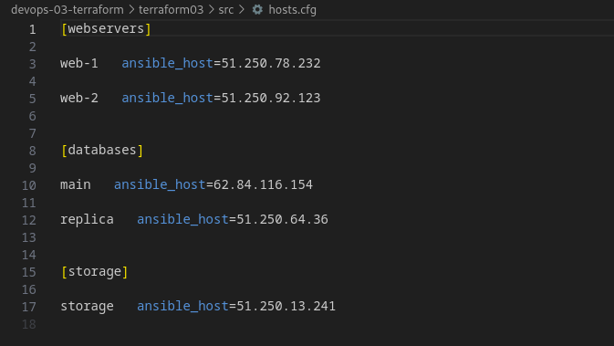

# Домашнее задание к занятию «Управляющие конструкции в коде Terraform»

### Решение задания 1

1. Изучите проект.

Изучил проект.

2. Заполните файл personal.auto.tfvars.

Заполнил токен, ID облака и ID папки пользователя в personal.auto.tfvars

3. Инициализируйте проект, выполните код. Он выполнится, даже если доступа к preview нет.

Инициализировал проект и выполнил код.

```bash
╰─➤terraform init

Initializing the backend...

Initializing provider plugins...
- Finding latest version of yandex-cloud/yandex...
- Installing yandex-cloud/yandex v0.103.0...
- Installed yandex-cloud/yandex v0.103.0 (unauthenticated)

Terraform has created a lock file .terraform.lock.hcl to record the provider
selections it made above. Include this file in your version control repository
so that Terraform can guarantee to make the same selections by default when
you run "terraform init" in the future.

╷
│ Warning: Incomplete lock file information for providers
│ 
│ Due to your customized provider installation methods, Terraform was forced to calculate lock file checksums locally for the following providers:
│   - yandex-cloud/yandex
│ 
│ The current .terraform.lock.hcl file only includes checksums for linux_amd64, so Terraform running on another platform will fail to install these providers.
│ 
│ To calculate additional checksums for another platform, run:
│   terraform providers lock -platform=linux_amd64
│ (where linux_amd64 is the platform to generate)
╵

Terraform has been successfully initialized!

You may now begin working with Terraform. Try running "terraform plan" to see
any changes that are required for your infrastructure. All Terraform commands
should now work.

If you ever set or change modules or backend configuration for Terraform,
rerun this command to reinitialize your working directory. If you forget, other
commands will detect it and remind you to do so if necessary.
```

```bash
╰─➤terraform apply

Terraform used the selected providers to generate the following execution plan. Resource actions are indicated with the following symbols:
  + create

Terraform will perform the following actions:

  # yandex_vpc_network.develop will be created
  + resource "yandex_vpc_network" "develop" {
      + created_at                = (known after apply)
      + default_security_group_id = (known after apply)
      + folder_id                 = (known after apply)
      + id                        = (known after apply)
      + labels                    = (known after apply)
      + name                      = "develop"
      + subnet_ids                = (known after apply)
    }

  # yandex_vpc_security_group.example will be created
  + resource "yandex_vpc_security_group" "example" {
      + created_at = (known after apply)
      + folder_id  = "b1gl6dqee4o5qromajnb"
      + id         = (known after apply)
      + labels     = (known after apply)
      + name       = "example_dynamic"
      + network_id = (known after apply)
      + status     = (known after apply)

      + egress {
          + description    = "разрешить весь исходящий трафик"
          + from_port      = 0
          + id             = (known after apply)
          + labels         = (known after apply)
          + port           = -1
          + protocol       = "TCP"
          + to_port        = 65365
          + v4_cidr_blocks = [
              + "0.0.0.0/0",
            ]
          + v6_cidr_blocks = []
        }

      + ingress {
          + description    = "разрешить входящий  http"
          + from_port      = -1
          + id             = (known after apply)
          + labels         = (known after apply)
          + port           = 80
          + protocol       = "TCP"
          + to_port        = -1
          + v4_cidr_blocks = [
              + "0.0.0.0/0",
            ]
          + v6_cidr_blocks = []
        }
      + ingress {
          + description    = "разрешить входящий https"
          + from_port      = -1
          + id             = (known after apply)
          + labels         = (known after apply)
          + port           = 443
          + protocol       = "TCP"
          + to_port        = -1
          + v4_cidr_blocks = [
              + "0.0.0.0/0",
            ]
          + v6_cidr_blocks = []
        }
      + ingress {
          + description    = "разрешить входящий ssh"
          + from_port      = -1
          + id             = (known after apply)
          + labels         = (known after apply)
          + port           = 22
          + protocol       = "TCP"
          + to_port        = -1
          + v4_cidr_blocks = [
              + "0.0.0.0/0",
            ]
          + v6_cidr_blocks = []
        }
    }

  # yandex_vpc_subnet.develop will be created
  + resource "yandex_vpc_subnet" "develop" {
      + created_at     = (known after apply)
      + folder_id      = (known after apply)
      + id             = (known after apply)
      + labels         = (known after apply)
      + name           = "develop"
      + network_id     = (known after apply)
      + v4_cidr_blocks = [
          + "10.0.1.0/24",
        ]
      + v6_cidr_blocks = (known after apply)
      + zone           = "ru-central1-a"
    }

Plan: 3 to add, 0 to change, 0 to destroy.

Do you want to perform these actions?
  Terraform will perform the actions described above.
  Only 'yes' will be accepted to approve.

  Enter a value: yes

yandex_vpc_network.develop: Creating...
yandex_vpc_network.develop: Creation complete after 2s [id=enpkuv2olqs5pnfobk6k]
yandex_vpc_subnet.develop: Creating...
yandex_vpc_security_group.example: Creating...
yandex_vpc_subnet.develop: Creation complete after 1s [id=e9bmnhr384ioqkqplvha]
yandex_vpc_security_group.example: Creation complete after 2s [id=enpeloi4dhiht9ktsb5j]

Apply complete! Resources: 3 added, 0 changed, 0 destroyed.
```

Создалась сеть и подсеть с именем develop и 2 группs безопасности с именами ***example_dynamic*** и ***default-sg-enpkuv2olqs5pnfobk6k*** и правилами трафика:


------

### Решение задания 2

1. Создайте файл count-vm.tf. Опишите в нём создание двух **одинаковых** ВМ  web-1 и web-2 (не web-0 и web-1) с минимальными параметрами, используя мета-аргумент **count loop**. Назначьте ВМ созданную в первом задании группу безопасности.(как это сделать узнайте в документации провайдера yandex/compute_instance )

Создал файл count-vm.tf и описал в нем 2 одинаковые виртуальные машины, которые будут называться web-1 и web-2:


Назначил виртуальной машине созданную в первом задании группу безопасности:


Код `count-vm.tf`

```
variable "os_image_web" {
  type    = string
  default = "ubuntu-2204-lts"
}

data "yandex_compute_image" "ubuntu-2204-lts" {
  family = var.os_image_web
}
variable "yandex_compute_instance_web" {
  type        = list(object({
    vm_name = string
    cores = number
    memory = number
    core_fraction = number
    count_vms = number
    platform_id = string
  }))

  default = [{
      vm_name = "web"
      cores         = 2
      memory        = 1
      core_fraction = 5
      count_vms = 2
      platform_id = "standard-v1"
    }]
}

variable "boot_disk_web" {
  type        = list(object({
    size = number
    type = string
    }))
    default = [ {
    size = 8
    type = "network-hdd"
  }]
}

resource "yandex_compute_instance" "web" {
  name        = "${var.yandex_compute_instance_web[0].vm_name}-${count.index+1}"
  platform_id = var.yandex_compute_instance_web[0].platform_id

  count = var.yandex_compute_instance_web[0].count_vms

  resources {
    cores         = var.yandex_compute_instance_web[0].cores
    memory        = var.yandex_compute_instance_web[0].memory
    core_fraction = var.yandex_compute_instance_web[0].core_fraction
  }

  boot_disk {
    initialize_params {
      image_id = data.yandex_compute_image.ubuntu-2204-lts.image_id
      type     = var.boot_disk_web[0].type
      size     = var.boot_disk_web[0].size
    }
  }

  metadata = {
    ssh-keys = "ubuntu:${local.ssh-keys}"
    serial-port-enable = "1"
  }

  network_interface {
    subnet_id = yandex_vpc_subnet.develop.id
    nat       = true
    security_group_ids = [
      yandex_vpc_security_group.example.id
    ]
  }
  scheduling_policy {
    preemptible = true
  }
}
```

2. Создайте файл for_each-vm.tf. Опишите в нём создание двух ВМ для баз данных с именами "main" и "replica" **разных** по cpu/ram/disk , используя мета-аргумент **for_each loop**. Используйте для обеих ВМ одну общую переменную типа:
```
variable "each_vm" {
  type = list(object({  vm_name=string, cpu=number, ram=number, disk=number }))
}
```  

Создал файл for_each-vm.tf. В нем описал создание двух ВМ с именами "main" и "replica" разных по cpu/ram/disk , используя мета-аргумент for_each loop:


Код `for_each-vm.tf`

```
variable "os_image" {
  type = string
  default = "ubuntu-2204-lts"
}

data "yandex_compute_image" "ubuntu" {
  family = var.os_image
}
variable "vm_resources" {
  type = list(object({
    vm_name = string
    cpu     = number
    ram     = number
    disk    = number
    platform_id = string
  }))
  default = [
    {
      vm_name = "main"
      cpu     = 2
      ram     = 2
      disk    = 8
      platform_id = "standard-v1"
    },
    {
      vm_name = "replica"
      cpu     = 2
      ram     = 2
      disk    = 10
      platform_id = "standard-v1"
    },
  ]
}

locals {
  ssh-keys = file("~/.ssh/id_ed25519.pub")
}

resource "yandex_compute_instance" "for_each" {
  depends_on = [yandex_compute_instance.web]
  for_each = { for i in var.vm_resources : i.vm_name => i }
  name          = each.value.vm_name

  platform_id = each.value.platform_id
  resources {
    cores         = each.value.cpu
    memory        = each.value.ram

  }
  boot_disk {
    initialize_params {
      image_id = data.yandex_compute_image.ubuntu.image_id
      size = each.value.disk
    }
  }

    metadata = {
    ssh-keys = "ubuntu:${local.ssh-keys}"
    serial-port-enable = "1"
  }

  network_interface {
    subnet_id = yandex_vpc_subnet.develop.id
    nat       = true
    security_group_ids = [
      yandex_vpc_security_group.example.id
    ]
  }
  scheduling_policy {
    preemptible = true
  }
}
```

При желании внесите в переменную все возможные параметры.
4. ВМ из пункта 2.1 должны создаваться после создания ВМ из пункта 2.2.

ВМ с именами "main" и "replica" создаются после создания ВМ web-1 и web-2:


5. Используйте функцию file в local-переменной для считывания ключа ~/.ssh/id_rsa.pub и его последующего использования в блоке metadata, взятому из ДЗ 2.

Для считывания файла ключа использую local-переменную и использую ее в блоке metadata:


6. Инициализируйте проект, выполните код.

Инициализировал проект, выполнил код. Создалось 7 объектов - сеть, подсеть, группа безопасности и 4 виртуальные машины:

```bash
╰─➤terraform apply
data.yandex_compute_image.ubuntu-2204-lts: Reading...
data.yandex_compute_image.ubuntu: Reading...
yandex_vpc_network.develop: Refreshing state... [id=enp28mn77qqrtek6ijc5]
data.yandex_compute_image.ubuntu: Read complete after 0s [id=fd8idfolcq1l43h1mlft]
data.yandex_compute_image.ubuntu-2204-lts: Read complete after 0s [id=fd8idfolcq1l43h1mlft]
yandex_vpc_subnet.develop: Refreshing state... [id=e9bu9egreq6qbrhg8o5d]
yandex_vpc_security_group.example: Refreshing state... [id=enpan0rlocnr4g8r0bsl]

Terraform used the selected providers to generate the following execution plan. Resource actions are indicated with the following symbols:
  + create

Terraform will perform the following actions:

  # yandex_compute_instance.for_each["main"] will be created
  + resource "yandex_compute_instance" "for_each" {
      + created_at                = (known after apply)
      + folder_id                 = (known after apply)
      + fqdn                      = (known after apply)
      + gpu_cluster_id            = (known after apply)
      + hostname                  = (known after apply)
      + id                        = (known after apply)
      + metadata                  = {
          + "serial-port-enable" = "1"
          + "ssh-keys"           = <<-EOT
                ubuntu:ssh-ed25519 AAAAC3NzaC1lZDI1NTE5AAAAIGx0BIRbchvLjnwhoUWvcGgKEWFs2AgF8r8AjUvmvrTE serg@LotsmanSM
            EOT
        }
      + name                      = "main"
      + network_acceleration_type = "standard"
      + platform_id               = "standard-v1"
      + service_account_id        = (known after apply)
      + status                    = (known after apply)
      + zone                      = (known after apply)

      + boot_disk {
          + auto_delete = true
          + device_name = (known after apply)
          + disk_id     = (known after apply)
          + mode        = (known after apply)

          + initialize_params {
              + block_size  = (known after apply)
              + description = (known after apply)
              + image_id    = "fd8idfolcq1l43h1mlft"
              + name        = (known after apply)
              + size        = 8
              + snapshot_id = (known after apply)
              + type        = "network-hdd"
            }
        }

      + network_interface {
          + index              = (known after apply)
          + ip_address         = (known after apply)
          + ipv4               = true
          + ipv6               = (known after apply)
          + ipv6_address       = (known after apply)
          + mac_address        = (known after apply)
          + nat                = true
          + nat_ip_address     = (known after apply)
          + nat_ip_version     = (known after apply)
          + security_group_ids = [
              + "enpan0rlocnr4g8r0bsl",
            ]
          + subnet_id          = "e9bu9egreq6qbrhg8o5d"
        }

      + resources {
          + core_fraction = 100
          + cores         = 2
          + memory        = 2
        }

      + scheduling_policy {
          + preemptible = true
        }
    }

  # yandex_compute_instance.for_each["replica"] will be created
  + resource "yandex_compute_instance" "for_each" {
      + created_at                = (known after apply)
      + folder_id                 = (known after apply)
      + fqdn                      = (known after apply)
      + gpu_cluster_id            = (known after apply)
      + hostname                  = (known after apply)
      + id                        = (known after apply)
      + metadata                  = {
          + "serial-port-enable" = "1"
          + "ssh-keys"           = <<-EOT
                ubuntu:ssh-ed25519 AAAAC3NzaC1lZDI1NTE5AAAAIGx0BIRbchvLjnwhoUWvcGgKEWFs2AgF8r8AjUvmvrTE serg@LotsmanSM
            EOT
        }
      + name                      = "replica"
      + network_acceleration_type = "standard"
      + platform_id               = "standard-v1"
      + service_account_id        = (known after apply)
      + status                    = (known after apply)
      + zone                      = (known after apply)

      + boot_disk {
          + auto_delete = true
          + device_name = (known after apply)
          + disk_id     = (known after apply)
          + mode        = (known after apply)

          + initialize_params {
              + block_size  = (known after apply)
              + description = (known after apply)
              + image_id    = "fd8idfolcq1l43h1mlft"
              + name        = (known after apply)
              + size        = 10
              + snapshot_id = (known after apply)
              + type        = "network-hdd"
            }
        }

      + network_interface {
          + index              = (known after apply)
          + ip_address         = (known after apply)
          + ipv4               = true
          + ipv6               = (known after apply)
          + ipv6_address       = (known after apply)
          + mac_address        = (known after apply)
          + nat                = true
          + nat_ip_address     = (known after apply)
          + nat_ip_version     = (known after apply)
          + security_group_ids = [
              + "enpan0rlocnr4g8r0bsl",
            ]
          + subnet_id          = "e9bu9egreq6qbrhg8o5d"
        }

      + resources {
          + core_fraction = 100
          + cores         = 2
          + memory        = 2
        }

      + scheduling_policy {
          + preemptible = true
        }
    }

  # yandex_compute_instance.web[0] will be created
  + resource "yandex_compute_instance" "web" {
      + created_at                = (known after apply)
      + folder_id                 = (known after apply)
      + fqdn                      = (known after apply)
      + gpu_cluster_id            = (known after apply)
      + hostname                  = (known after apply)
      + id                        = (known after apply)
      + metadata                  = {
          + "serial-port-enable" = "1"
          + "ssh-keys"           = <<-EOT
                ubuntu:ssh-ed25519 AAAAC3NzaC1lZDI1NTE5AAAAIGx0BIRbchvLjnwhoUWvcGgKEWFs2AgF8r8AjUvmvrTE serg@LotsmanSM
            EOT
        }
      + name                      = "web-1"
      + network_acceleration_type = "standard"
      + platform_id               = "standard-v1"
      + service_account_id        = (known after apply)
      + status                    = (known after apply)
      + zone                      = (known after apply)

      + boot_disk {
          + auto_delete = true
          + device_name = (known after apply)
          + disk_id     = (known after apply)
          + mode        = (known after apply)

          + initialize_params {
              + block_size  = (known after apply)
              + description = (known after apply)
              + image_id    = "fd8idfolcq1l43h1mlft"
              + name        = (known after apply)
              + size        = 8
              + snapshot_id = (known after apply)
              + type        = "network-hdd"
            }
        }

      + network_interface {
          + index              = (known after apply)
          + ip_address         = (known after apply)
          + ipv4               = true
          + ipv6               = (known after apply)
          + ipv6_address       = (known after apply)
          + mac_address        = (known after apply)
          + nat                = true
          + nat_ip_address     = (known after apply)
          + nat_ip_version     = (known after apply)
          + security_group_ids = [
              + "enpan0rlocnr4g8r0bsl",
            ]
          + subnet_id          = "e9bu9egreq6qbrhg8o5d"
        }

      + resources {
          + core_fraction = 5
          + cores         = 2
          + memory        = 1
        }

      + scheduling_policy {
          + preemptible = true
        }
    }

  # yandex_compute_instance.web[1] will be created
  + resource "yandex_compute_instance" "web" {
      + created_at                = (known after apply)
      + folder_id                 = (known after apply)
      + fqdn                      = (known after apply)
      + gpu_cluster_id            = (known after apply)
      + hostname                  = (known after apply)
      + id                        = (known after apply)
      + metadata                  = {
          + "serial-port-enable" = "1"
          + "ssh-keys"           = <<-EOT
                ubuntu:ssh-ed25519 AAAAC3NzaC1lZDI1NTE5AAAAIGx0BIRbchvLjnwhoUWvcGgKEWFs2AgF8r8AjUvmvrTE serg@LotsmanSM
            EOT
        }
      + name                      = "web-2"
      + network_acceleration_type = "standard"
      + platform_id               = "standard-v1"
      + service_account_id        = (known after apply)
      + status                    = (known after apply)
      + zone                      = (known after apply)

      + boot_disk {
          + auto_delete = true
          + device_name = (known after apply)
          + disk_id     = (known after apply)
          + mode        = (known after apply)

          + initialize_params {
              + block_size  = (known after apply)
              + description = (known after apply)
              + image_id    = "fd8idfolcq1l43h1mlft"
              + name        = (known after apply)
              + size        = 8
              + snapshot_id = (known after apply)
              + type        = "network-hdd"
            }
        }

      + network_interface {
          + index              = (known after apply)
          + ip_address         = (known after apply)
          + ipv4               = true
          + ipv6               = (known after apply)
          + ipv6_address       = (known after apply)
          + mac_address        = (known after apply)
          + nat                = true
          + nat_ip_address     = (known after apply)
          + nat_ip_version     = (known after apply)
          + security_group_ids = [
              + "enpan0rlocnr4g8r0bsl",
            ]
          + subnet_id          = "e9bu9egreq6qbrhg8o5d"
        }

      + resources {
          + core_fraction = 5
          + cores         = 2
          + memory        = 1
        }

      + scheduling_policy {
          + preemptible = true
        }
    }

Plan: 4 to add, 0 to change, 0 to destroy.

Do you want to perform these actions?
  Terraform will perform the actions described above.
  Only 'yes' will be accepted to approve.

  Enter a value: yes

yandex_compute_instance.web[1]: Creating...
yandex_compute_instance.web[0]: Creating...
yandex_compute_instance.web[0]: Still creating... [10s elapsed]
yandex_compute_instance.web[1]: Still creating... [10s elapsed]
yandex_compute_instance.web[1]: Still creating... [20s elapsed]
yandex_compute_instance.web[0]: Still creating... [20s elapsed]
yandex_compute_instance.web[0]: Still creating... [30s elapsed]
yandex_compute_instance.web[1]: Still creating... [30s elapsed]
yandex_compute_instance.web[1]: Still creating... [40s elapsed]
yandex_compute_instance.web[0]: Still creating... [40s elapsed]
yandex_compute_instance.web[0]: Still creating... [50s elapsed]
yandex_compute_instance.web[1]: Still creating... [50s elapsed]
yandex_compute_instance.web[1]: Still creating... [1m0s elapsed]
yandex_compute_instance.web[0]: Still creating... [1m0s elapsed]
yandex_compute_instance.web[0]: Creation complete after 1m2s [id=fhmmq5kobahp9rtp4b5q]
yandex_compute_instance.web[1]: Creation complete after 1m7s [id=fhmc6cpqa0l3tjia9dqj]
yandex_compute_instance.for_each["main"]: Creating...
yandex_compute_instance.for_each["replica"]: Creating...
yandex_compute_instance.for_each["main"]: Still creating... [10s elapsed]
yandex_compute_instance.for_each["replica"]: Still creating... [10s elapsed]
yandex_compute_instance.for_each["replica"]: Still creating... [20s elapsed]
yandex_compute_instance.for_each["main"]: Still creating... [20s elapsed]
yandex_compute_instance.for_each["main"]: Still creating... [30s elapsed]
yandex_compute_instance.for_each["replica"]: Still creating... [30s elapsed]
yandex_compute_instance.for_each["main"]: Still creating... [40s elapsed]
yandex_compute_instance.for_each["replica"]: Still creating... [40s elapsed]
yandex_compute_instance.for_each["replica"]: Creation complete after 44s [id=fhm6lfnn1jipb8sb2as7]
yandex_compute_instance.for_each["main"]: Still creating... [50s elapsed]
yandex_compute_instance.for_each["main"]: Still creating... [1m0s elapsed]
yandex_compute_instance.for_each["main"]: Creation complete after 1m3s [id=fhmjjee82eptg8onh7nr]

Apply complete! Resources: 4 added, 0 changed, 0 destroyed.
```


------

### Решение задания 3

1. Создайте 3 одинаковых виртуальных диска размером 1 Гб с помощью ресурса yandex_compute_disk и мета-аргумента count в файле **disk_vm.tf** .

Создал 3 одинаковых диска:

```
variable "storage_secondary_disk" {
  type = list(object({
    for_storage = object({
      type       = string
      size       = number
      count      = number
      block_size = number
      name = string
    })
  }))

  default = [
    {
      for_storage = {
        type       = "network-hdd"
        size       = 1
        count      = 3
        block_size = 4096
        name = "disk"
      }
    }
  ]
}

resource "yandex_compute_disk" "disks" {
  name  = "${var.storage_secondary_disk[0].for_storage.name}-${count.index+1}"
  type  = var.storage_secondary_disk[0].for_storage.type
  size  = var.storage_secondary_disk[0].for_storage.size
  count = var.storage_secondary_disk[0].for_storage.count
  block_size  = var.storage_secondary_disk[0].for_storage.block_size
}
```

2. Создайте в том же файле **одиночную**(использовать count или for_each запрещено из-за задания №4) ВМ c именем "storage"  . Используйте блок **dynamic secondary_disk{..}** и мета-аргумент for_each для подключения созданных вами дополнительных дисков.

Создал виртуальную машину storage и используя мета-аргумент for_each подключил к ней созданные диски:

```
resource "yandex_compute_instance" "storage" {
  name = var.yandex_compute_instance_storage.storage_resources.name
  zone = var.yandex_compute_instance_storage.storage_resources.zone

  resources {
    cores  = var.yandex_compute_instance_storage.storage_resources.cores
    memory = var.yandex_compute_instance_storage.storage_resources.memory
    core_fraction = var.yandex_compute_instance_storage.storage_resources.core_fraction
  }

  boot_disk {
    initialize_params {
      image_id = data.yandex_compute_image.ubuntu-2204-lts.image_id
      type     = var.boot_disk_storage.type
      size     = var.boot_disk_storage.size
    }
  }
      metadata = {
      ssh-keys           = "ubuntu:${local.ssh-keys}"
      serial-port-enable = "1"
    }
  network_interface {
    subnet_id = yandex_vpc_subnet.develop.id
    nat       = true
    security_group_ids = [
      yandex_vpc_security_group.example.id
    ]
  }
  dynamic "secondary_disk" {
    for_each = yandex_compute_disk.disks.*.id
    content {
      disk_id = secondary_disk.value
  }
  }
}
```

------

### Решение задания 4

1. В файле ansible.tf создайте inventory-файл для ansible.
Используйте функцию tepmplatefile и файл-шаблон для создания ansible inventory-файла из лекции.
Готовый код возьмите из демонстрации к лекции [**demonstration2**](https://github.com/netology-code/ter-homeworks/tree/main/03/demonstration2).
Передайте в него в качестве переменных группы виртуальных машин из задания 2.1, 2.2 и 3.2, т. е. 5 ВМ.

Создал файл ansible.tf, по примеру из лекции написал код с использованием функции tepmplatefile. Шаблон inventory-файла использовал также из лекции.:

```
resource "local_file" "hosts_cfg" {
  content = templatefile("${path.module}/hosts.tftpl",
   {webservers =  yandex_compute_instance.web
    databases = yandex_compute_instance.for_each
    storage = [yandex_compute_instance.storage]}
  )
  filename = "${abspath(path.module)}/hosts.cfg"
}
```

2. Инвентарь должен содержать 3 группы и быть динамическим, т. е. обработать как группу из 2-х ВМ, так и 999 ВМ.

Inventory-файл получился с 3 группами.


3. Добавьте в инвентарь переменную  [**fqdn**](https://cloud.yandex.ru/docs/compute/concepts/network#hostname).
``` 
[webservers]
web-1 ansible_host=<внешний ip-адрес> fqdn=<имя виртуальной машины>.<регион>.internal
web-2 ansible_host=<внешний ip-адрес> fqdn=<имя виртуальной машины>.<регион>.internal

[databases]
main ansible_host=<внешний ip-адрес> fqdn=<имя виртуальной машины>.<регион>.internal
replica ansible_host<внешний ip-адрес> fqdn=<имя виртуальной машины>.<регион>.internal

[storage]
storage ansible_host=<внешний ip-адрес> fqdn=<имя виртуальной машины>.<регион>.internal
```
4. Выполните код. Приложите скриншот получившегося файла. 

Инициализируем терраформ:

```bash
╰─➤terraform init

Initializing the backend...

Initializing provider plugins...
- Reusing previous version of yandex-cloud/yandex from the dependency lock file
- Finding latest version of hashicorp/local...
- Finding latest version of hashicorp/null...
- Installing hashicorp/local v2.4.0...
- Installed hashicorp/local v2.4.0 (unauthenticated)
- Installing hashicorp/null v3.2.2...
- Installed hashicorp/null v3.2.2 (unauthenticated)
- Using previously-installed yandex-cloud/yandex v0.103.0

Terraform has made some changes to the provider dependency selections recorded
in the .terraform.lock.hcl file. Review those changes and commit them to your
version control system if they represent changes you intended to make.

╷
│ Warning: Incomplete lock file information for providers
│ 
│ Due to your customized provider installation methods, Terraform was forced to calculate lock file checksums locally for the following providers:
│   - hashicorp/local
│   - hashicorp/null
│ 
│ The current .terraform.lock.hcl file only includes checksums for linux_amd64, so Terraform running on another platform will fail to install these providers.
│ 
│ To calculate additional checksums for another platform, run:
│   terraform providers lock -platform=linux_amd64
│ (where linux_amd64 is the platform to generate)
╵

Terraform has been successfully initialized!

You may now begin working with Terraform. Try running "terraform plan" to see
any changes that are required for your infrastructure. All Terraform commands
should now work.

If you ever set or change modules or backend configuration for Terraform,
rerun this command to reinitialize your working directory. If you forget, other
commands will detect it and remind you to do so if necessary.
```

Применим получившийся код:

```bash
╰─➤terraform apply
data.yandex_compute_image.ubuntu-2204-lts: Reading...
data.yandex_compute_image.ubuntu: Reading...
data.yandex_compute_image.ubuntu-2204-lts: Read complete after 0s [id=fd8idfolcq1l43h1mlft]
data.yandex_compute_image.ubuntu: Read complete after 1s [id=fd8idfolcq1l43h1mlft]

Terraform used the selected providers to generate the following execution plan. Resource actions are indicated with the following symbols:
  + create

Terraform will perform the following actions:

  # local_file.hosts_cfg will be created
  + resource "local_file" "hosts_cfg" {
      + content              = (known after apply)
      + content_base64sha256 = (known after apply)
      + content_base64sha512 = (known after apply)
      + content_md5          = (known after apply)
      + content_sha1         = (known after apply)
      + content_sha256       = (known after apply)
      + content_sha512       = (known after apply)
      + directory_permission = "0777"
      + file_permission      = "0777"
      + filename             = "/home/serg/DevOps-Netology/DevOps-35-Netology/devops-03-terraform/terraform03/src/hosts.cfg"
      + id                   = (known after apply)
    }

  # null_resource.web_hosts_provision will be created
  + resource "null_resource" "web_hosts_provision" {
      + id       = (known after apply)
      + triggers = {
          + "always_run"        = (known after apply)
          + "playbook_src_hash" = <<-EOT
                ---
                
                - name: test
                  gather_facts: false
                  hosts: all
                  vars:
                    ansible_user: ubuntu
                  become: yes
                  tasks:
                
                  - name: Install Nginx Web Server on Debian Family
                    apt:
                      name: nginx
                      state: latest
                      update_cache: yes
            EOT
          + "ssh_public_key"    = <<-EOT
                ssh-ed25519 AAAAC3NzaC1lZDI1NTE5AAAAIGx0BIRbchvLjnwhoUWvcGgKEWFs2AgF8r8AjUvmvrTE serg@LotsmanSM
            EOT
        }
    }

  # yandex_compute_disk.disks[0] will be created
  + resource "yandex_compute_disk" "disks" {
      + block_size  = 4096
      + created_at  = (known after apply)
      + folder_id   = (known after apply)
      + id          = (known after apply)
      + name        = "disk-1"
      + product_ids = (known after apply)
      + size        = 1
      + status      = (known after apply)
      + type        = "network-hdd"
      + zone        = (known after apply)
    }

  # yandex_compute_disk.disks[1] will be created
  + resource "yandex_compute_disk" "disks" {
      + block_size  = 4096
      + created_at  = (known after apply)
      + folder_id   = (known after apply)
      + id          = (known after apply)
      + name        = "disk-2"
      + product_ids = (known after apply)
      + size        = 1
      + status      = (known after apply)
      + type        = "network-hdd"
      + zone        = (known after apply)
    }

  # yandex_compute_disk.disks[2] will be created
  + resource "yandex_compute_disk" "disks" {
      + block_size  = 4096
      + created_at  = (known after apply)
      + folder_id   = (known after apply)
      + id          = (known after apply)
      + name        = "disk-3"
      + product_ids = (known after apply)
      + size        = 1
      + status      = (known after apply)
      + type        = "network-hdd"
      + zone        = (known after apply)
    }

  # yandex_compute_instance.for_each["main"] will be created
  + resource "yandex_compute_instance" "for_each" {
      + created_at                = (known after apply)
      + folder_id                 = (known after apply)
      + fqdn                      = (known after apply)
      + gpu_cluster_id            = (known after apply)
      + hostname                  = (known after apply)
      + id                        = (known after apply)
      + metadata                  = {
          + "serial-port-enable" = "1"
          + "ssh-keys"           = <<-EOT
                ubuntu:ssh-ed25519 AAAAC3NzaC1lZDI1NTE5AAAAIGx0BIRbchvLjnwhoUWvcGgKEWFs2AgF8r8AjUvmvrTE serg@LotsmanSM
            EOT
        }
      + name                      = "main"
      + network_acceleration_type = "standard"
      + platform_id               = "standard-v1"
      + service_account_id        = (known after apply)
      + status                    = (known after apply)
      + zone                      = (known after apply)

      + boot_disk {
          + auto_delete = true
          + device_name = (known after apply)
          + disk_id     = (known after apply)
          + mode        = (known after apply)

          + initialize_params {
              + block_size  = (known after apply)
              + description = (known after apply)
              + image_id    = "fd8idfolcq1l43h1mlft"
              + name        = (known after apply)
              + size        = 8
              + snapshot_id = (known after apply)
              + type        = "network-hdd"
            }
        }

      + network_interface {
          + index              = (known after apply)
          + ip_address         = (known after apply)
          + ipv4               = true
          + ipv6               = (known after apply)
          + ipv6_address       = (known after apply)
          + mac_address        = (known after apply)
          + nat                = true
          + nat_ip_address     = (known after apply)
          + nat_ip_version     = (known after apply)
          + security_group_ids = (known after apply)
          + subnet_id          = (known after apply)
        }

      + resources {
          + core_fraction = 100
          + cores         = 2
          + memory        = 2
        }

      + scheduling_policy {
          + preemptible = true
        }
    }

  # yandex_compute_instance.for_each["replica"] will be created
  + resource "yandex_compute_instance" "for_each" {
      + created_at                = (known after apply)
      + folder_id                 = (known after apply)
      + fqdn                      = (known after apply)
      + gpu_cluster_id            = (known after apply)
      + hostname                  = (known after apply)
      + id                        = (known after apply)
      + metadata                  = {
          + "serial-port-enable" = "1"
          + "ssh-keys"           = <<-EOT
                ubuntu:ssh-ed25519 AAAAC3NzaC1lZDI1NTE5AAAAIGx0BIRbchvLjnwhoUWvcGgKEWFs2AgF8r8AjUvmvrTE serg@LotsmanSM
            EOT
        }
      + name                      = "replica"
      + network_acceleration_type = "standard"
      + platform_id               = "standard-v1"
      + service_account_id        = (known after apply)
      + status                    = (known after apply)
      + zone                      = (known after apply)

      + boot_disk {
          + auto_delete = true
          + device_name = (known after apply)
          + disk_id     = (known after apply)
          + mode        = (known after apply)

          + initialize_params {
              + block_size  = (known after apply)
              + description = (known after apply)
              + image_id    = "fd8idfolcq1l43h1mlft"
              + name        = (known after apply)
              + size        = 10
              + snapshot_id = (known after apply)
              + type        = "network-hdd"
            }
        }

      + network_interface {
          + index              = (known after apply)
          + ip_address         = (known after apply)
          + ipv4               = true
          + ipv6               = (known after apply)
          + ipv6_address       = (known after apply)
          + mac_address        = (known after apply)
          + nat                = true
          + nat_ip_address     = (known after apply)
          + nat_ip_version     = (known after apply)
          + security_group_ids = (known after apply)
          + subnet_id          = (known after apply)
        }

      + resources {
          + core_fraction = 100
          + cores         = 2
          + memory        = 2
        }

      + scheduling_policy {
          + preemptible = true
        }
    }

  # yandex_compute_instance.storage will be created
  + resource "yandex_compute_instance" "storage" {
      + created_at                = (known after apply)
      + folder_id                 = (known after apply)
      + fqdn                      = (known after apply)
      + gpu_cluster_id            = (known after apply)
      + hostname                  = (known after apply)
      + id                        = (known after apply)
      + metadata                  = {
          + "serial-port-enable" = "1"
          + "ssh-keys"           = <<-EOT
                ubuntu:ssh-ed25519 AAAAC3NzaC1lZDI1NTE5AAAAIGx0BIRbchvLjnwhoUWvcGgKEWFs2AgF8r8AjUvmvrTE serg@LotsmanSM
            EOT
        }
      + name                      = "storage"
      + network_acceleration_type = "standard"
      + platform_id               = "standard-v1"
      + service_account_id        = (known after apply)
      + status                    = (known after apply)
      + zone                      = "ru-central1-a"

      + boot_disk {
          + auto_delete = true
          + device_name = (known after apply)
          + disk_id     = (known after apply)
          + mode        = (known after apply)

          + initialize_params {
              + block_size  = (known after apply)
              + description = (known after apply)
              + image_id    = "fd8idfolcq1l43h1mlft"
              + name        = (known after apply)
              + size        = 8
              + snapshot_id = (known after apply)
              + type        = "network-hdd"
            }
        }

      + network_interface {
          + index              = (known after apply)
          + ip_address         = (known after apply)
          + ipv4               = true
          + ipv6               = (known after apply)
          + ipv6_address       = (known after apply)
          + mac_address        = (known after apply)
          + nat                = true
          + nat_ip_address     = (known after apply)
          + nat_ip_version     = (known after apply)
          + security_group_ids = (known after apply)
          + subnet_id          = (known after apply)
        }

      + resources {
          + core_fraction = 5
          + cores         = 2
          + memory        = 2
        }

      + secondary_disk {
          + auto_delete = false
          + device_name = (known after apply)
          + disk_id     = (known after apply)
          + mode        = "READ_WRITE"
        }
      + secondary_disk {
          + auto_delete = false
          + device_name = (known after apply)
          + disk_id     = (known after apply)
          + mode        = "READ_WRITE"
        }
      + secondary_disk {
          + auto_delete = false
          + device_name = (known after apply)
          + disk_id     = (known after apply)
          + mode        = "READ_WRITE"
        }
    }

  # yandex_compute_instance.web[0] will be created
  + resource "yandex_compute_instance" "web" {
      + created_at                = (known after apply)
      + folder_id                 = (known after apply)
      + fqdn                      = (known after apply)
      + gpu_cluster_id            = (known after apply)
      + hostname                  = (known after apply)
      + id                        = (known after apply)
      + metadata                  = {
          + "serial-port-enable" = "1"
          + "ssh-keys"           = <<-EOT
                ubuntu:ssh-ed25519 AAAAC3NzaC1lZDI1NTE5AAAAIGx0BIRbchvLjnwhoUWvcGgKEWFs2AgF8r8AjUvmvrTE serg@LotsmanSM
            EOT
        }
      + name                      = "web-1"
      + network_acceleration_type = "standard"
      + platform_id               = "standard-v1"
      + service_account_id        = (known after apply)
      + status                    = (known after apply)
      + zone                      = (known after apply)

      + boot_disk {
          + auto_delete = true
          + device_name = (known after apply)
          + disk_id     = (known after apply)
          + mode        = (known after apply)

          + initialize_params {
              + block_size  = (known after apply)
              + description = (known after apply)
              + image_id    = "fd8idfolcq1l43h1mlft"
              + name        = (known after apply)
              + size        = 8
              + snapshot_id = (known after apply)
              + type        = "network-hdd"
            }
        }

      + network_interface {
          + index              = (known after apply)
          + ip_address         = (known after apply)
          + ipv4               = true
          + ipv6               = (known after apply)
          + ipv6_address       = (known after apply)
          + mac_address        = (known after apply)
          + nat                = true
          + nat_ip_address     = (known after apply)
          + nat_ip_version     = (known after apply)
          + security_group_ids = (known after apply)
          + subnet_id          = (known after apply)
        }

      + resources {
          + core_fraction = 5
          + cores         = 2
          + memory        = 1
        }

      + scheduling_policy {
          + preemptible = true
        }
    }

  # yandex_compute_instance.web[1] will be created
  + resource "yandex_compute_instance" "web" {
      + created_at                = (known after apply)
      + folder_id                 = (known after apply)
      + fqdn                      = (known after apply)
      + gpu_cluster_id            = (known after apply)
      + hostname                  = (known after apply)
      + id                        = (known after apply)
      + metadata                  = {
          + "serial-port-enable" = "1"
          + "ssh-keys"           = <<-EOT
                ubuntu:ssh-ed25519 AAAAC3NzaC1lZDI1NTE5AAAAIGx0BIRbchvLjnwhoUWvcGgKEWFs2AgF8r8AjUvmvrTE serg@LotsmanSM
            EOT
        }
      + name                      = "web-2"
      + network_acceleration_type = "standard"
      + platform_id               = "standard-v1"
      + service_account_id        = (known after apply)
      + status                    = (known after apply)
      + zone                      = (known after apply)

      + boot_disk {
          + auto_delete = true
          + device_name = (known after apply)
          + disk_id     = (known after apply)
          + mode        = (known after apply)

          + initialize_params {
              + block_size  = (known after apply)
              + description = (known after apply)
              + image_id    = "fd8idfolcq1l43h1mlft"
              + name        = (known after apply)
              + size        = 8
              + snapshot_id = (known after apply)
              + type        = "network-hdd"
            }
        }

      + network_interface {
          + index              = (known after apply)
          + ip_address         = (known after apply)
          + ipv4               = true
          + ipv6               = (known after apply)
          + ipv6_address       = (known after apply)
          + mac_address        = (known after apply)
          + nat                = true
          + nat_ip_address     = (known after apply)
          + nat_ip_version     = (known after apply)
          + security_group_ids = (known after apply)
          + subnet_id          = (known after apply)
        }

      + resources {
          + core_fraction = 5
          + cores         = 2
          + memory        = 1
        }

      + scheduling_policy {
          + preemptible = true
        }
    }

  # yandex_vpc_network.develop will be created
  + resource "yandex_vpc_network" "develop" {
      + created_at                = (known after apply)
      + default_security_group_id = (known after apply)
      + folder_id                 = (known after apply)
      + id                        = (known after apply)
      + labels                    = (known after apply)
      + name                      = "develop"
      + subnet_ids                = (known after apply)
    }

  # yandex_vpc_security_group.example will be created
  + resource "yandex_vpc_security_group" "example" {
      + created_at = (known after apply)
      + folder_id  = "b1gl6dqee4o5qromajnb"
      + id         = (known after apply)
      + labels     = (known after apply)
      + name       = "example_dynamic"
      + network_id = (known after apply)
      + status     = (known after apply)

      + egress {
          + description    = "разрешить весь исходящий трафик"
          + from_port      = 0
          + id             = (known after apply)
          + labels         = (known after apply)
          + port           = -1
          + protocol       = "TCP"
          + to_port        = 65365
          + v4_cidr_blocks = [
              + "0.0.0.0/0",
            ]
          + v6_cidr_blocks = []
        }

      + ingress {
          + description    = "разрешить входящий  http"
          + from_port      = -1
          + id             = (known after apply)
          + labels         = (known after apply)
          + port           = 80
          + protocol       = "TCP"
          + to_port        = -1
          + v4_cidr_blocks = [
              + "0.0.0.0/0",
            ]
          + v6_cidr_blocks = []
        }
      + ingress {
          + description    = "разрешить входящий https"
          + from_port      = -1
          + id             = (known after apply)
          + labels         = (known after apply)
          + port           = 443
          + protocol       = "TCP"
          + to_port        = -1
          + v4_cidr_blocks = [
              + "0.0.0.0/0",
            ]
          + v6_cidr_blocks = []
        }
      + ingress {
          + description    = "разрешить входящий ssh"
          + from_port      = -1
          + id             = (known after apply)
          + labels         = (known after apply)
          + port           = 22
          + protocol       = "TCP"
          + to_port        = -1
          + v4_cidr_blocks = [
              + "0.0.0.0/0",
            ]
          + v6_cidr_blocks = []
        }
    }

  # yandex_vpc_subnet.develop will be created
  + resource "yandex_vpc_subnet" "develop" {
      + created_at     = (known after apply)
      + folder_id      = (known after apply)
      + id             = (known after apply)
      + labels         = (known after apply)
      + name           = "develop"
      + network_id     = (known after apply)
      + v4_cidr_blocks = [
          + "10.0.1.0/24",
        ]
      + v6_cidr_blocks = (known after apply)
      + zone           = "ru-central1-a"
    }

Plan: 13 to add, 0 to change, 0 to destroy.

Do you want to perform these actions?
  Terraform will perform the actions described above.
  Only 'yes' will be accepted to approve.

  Enter a value: yes

yandex_vpc_network.develop: Creating...
yandex_compute_disk.disks[1]: Creating...
yandex_compute_disk.disks[0]: Creating...
yandex_compute_disk.disks[2]: Creating...
yandex_vpc_network.develop: Creation complete after 2s [id=enpau9d4fo1mjgga5hvv]
yandex_vpc_subnet.develop: Creating...
yandex_vpc_security_group.example: Creating...
yandex_vpc_subnet.develop: Creation complete after 1s [id=e9b8u0t3q8vuu5okg6jc]
yandex_vpc_security_group.example: Creation complete after 2s [id=enp09v4fqr0tk5peugkd]
yandex_compute_instance.web[1]: Creating...
yandex_compute_instance.web[0]: Creating...
yandex_compute_disk.disks[0]: Creation complete after 10s [id=fhmr1gsragpme3ds471m]
yandex_compute_disk.disks[2]: Still creating... [10s elapsed]
yandex_compute_disk.disks[1]: Still creating... [10s elapsed]
yandex_compute_disk.disks[1]: Creation complete after 10s [id=fhmnq5q60kouq3s303q1]
yandex_compute_disk.disks[2]: Creation complete after 11s [id=fhmvquk162ll6lmu0bh0]
yandex_compute_instance.storage: Creating...
yandex_compute_instance.web[1]: Still creating... [10s elapsed]
yandex_compute_instance.web[0]: Still creating... [10s elapsed]
yandex_compute_instance.storage: Still creating... [10s elapsed]
yandex_compute_instance.web[1]: Still creating... [20s elapsed]
yandex_compute_instance.web[0]: Still creating... [20s elapsed]
yandex_compute_instance.storage: Still creating... [20s elapsed]
yandex_compute_instance.web[0]: Still creating... [30s elapsed]
yandex_compute_instance.web[1]: Still creating... [30s elapsed]
yandex_compute_instance.web[0]: Creation complete after 35s [id=fhm9r4igbrkkrktnbf0c]
yandex_compute_instance.storage: Still creating... [30s elapsed]
yandex_compute_instance.web[1]: Still creating... [40s elapsed]
yandex_compute_instance.storage: Creation complete after 36s [id=fhm9djq35fni90bajat4]
null_resource.web_hosts_provision: Creating...
null_resource.web_hosts_provision: Provisioning with 'local-exec'...
null_resource.web_hosts_provision (local-exec): Executing: ["/bin/sh" "-c" "cat ~/.ssh/id_ed25519 | ssh-add -"]
null_resource.web_hosts_provision (local-exec): Identity added: (stdin) (serg@LotsmanSM)
null_resource.web_hosts_provision: Provisioning with 'local-exec'...
null_resource.web_hosts_provision (local-exec): Executing: ["/bin/sh" "-c" "sleep 120"]
yandex_compute_instance.web[1]: Creation complete after 43s [id=fhmio17ani7j1vn95tre]
yandex_compute_instance.for_each["main"]: Creating...
yandex_compute_instance.for_each["replica"]: Creating...
null_resource.web_hosts_provision: Still creating... [10s elapsed]
yandex_compute_instance.for_each["replica"]: Still creating... [10s elapsed]
yandex_compute_instance.for_each["main"]: Still creating... [10s elapsed]
null_resource.web_hosts_provision: Still creating... [20s elapsed]
yandex_compute_instance.for_each["main"]: Still creating... [20s elapsed]
yandex_compute_instance.for_each["replica"]: Still creating... [20s elapsed]
null_resource.web_hosts_provision: Still creating... [30s elapsed]
yandex_compute_instance.for_each["main"]: Still creating... [30s elapsed]
yandex_compute_instance.for_each["replica"]: Still creating... [30s elapsed]
yandex_compute_instance.for_each["main"]: Creation complete after 40s [id=fhmf9vqvbgngoot256ht]
null_resource.web_hosts_provision: Still creating... [40s elapsed]
yandex_compute_instance.for_each["replica"]: Still creating... [40s elapsed]
yandex_compute_instance.for_each["replica"]: Creation complete after 40s [id=fhm0g8v25vm9b22kbg95]
local_file.hosts_cfg: Creating...
local_file.hosts_cfg: Creation complete after 0s [id=08f3645e92f8d831bc11dcc785734560ba92e5dc]
null_resource.web_hosts_provision: Still creating... [50s elapsed]
null_resource.web_hosts_provision: Still creating... [1m0s elapsed]
null_resource.web_hosts_provision: Still creating... [1m10s elapsed]
null_resource.web_hosts_provision: Still creating... [1m20s elapsed]
null_resource.web_hosts_provision: Still creating... [1m30s elapsed]
null_resource.web_hosts_provision: Still creating... [1m40s elapsed]
null_resource.web_hosts_provision: Still creating... [1m50s elapsed]
null_resource.web_hosts_provision: Still creating... [2m0s elapsed]
null_resource.web_hosts_provision: Provisioning with 'local-exec'...
null_resource.web_hosts_provision (local-exec): Executing: ["/bin/sh" "-c" "export ANSIBLE_HOST_KEY_CHECKING=False; ansible-playbook -i /home/serg/DevOps-Netology/DevOps-35-Netology/devops-03-terraform/terraform03/src/hosts.cfg /home/serg/DevOps-Netology/DevOps-35-Netology/devops-03-terraform/terraform03/src/test.yml"]
null_resource.web_hosts_provision (local-exec): [WARNING]: Found both group and host with same name: storage

null_resource.web_hosts_provision (local-exec): PLAY [test] ********************************************************************

null_resource.web_hosts_provision (local-exec): TASK [Install Nginx Web Server on Debian Family] *******************************
null_resource.web_hosts_provision: Still creating... [2m10s elapsed]
null_resource.web_hosts_provision: Still creating... [2m20s elapsed]
null_resource.web_hosts_provision: Still creating... [2m30s elapsed]
null_resource.web_hosts_provision: Still creating... [2m40s elapsed]
null_resource.web_hosts_provision: Still creating... [2m50s elapsed]
null_resource.web_hosts_provision (local-exec): changed: [main]
null_resource.web_hosts_provision (local-exec): changed: [replica]
null_resource.web_hosts_provision (local-exec): changed: [storage]
null_resource.web_hosts_provision (local-exec): changed: [web-2]
null_resource.web_hosts_provision (local-exec): changed: [web-1]

null_resource.web_hosts_provision (local-exec): PLAY RECAP *********************************************************************
null_resource.web_hosts_provision (local-exec): main                       : ok=1    changed=1    unreachable=0    failed=0    skipped=0    rescued=0    ignored=0
null_resource.web_hosts_provision (local-exec): replica                    : ok=1    changed=1    unreachable=0    failed=0    skipped=0    rescued=0    ignored=0
null_resource.web_hosts_provision (local-exec): storage                    : ok=1    changed=1    unreachable=0    failed=0    skipped=0    rescued=0    ignored=0
null_resource.web_hosts_provision (local-exec): web-1                      : ok=1    changed=1    unreachable=0    failed=0    skipped=0    rescued=0    ignored=0
null_resource.web_hosts_provision (local-exec): web-2                      : ok=1    changed=1    unreachable=0    failed=0    skipped=0    rescued=0    ignored=0

null_resource.web_hosts_provision: Creation complete after 2m56s [id=5141200719983059564]

Apply complete! Resources: 13 added, 0 changed, 0 destroyed.
```

Скриншот результата:



Для общего зачёта создайте в вашем GitHub-репозитории новую ветку terraform-03. Закоммитьте в эту ветку свой финальный код проекта, пришлите ссылку на коммит.   
**Удалите все созданные ресурсы**.


------

## Дополнительные задания (со звездочкой*)

**Настоятельно рекомендуем выполнять все задания со звёздочкой.** Они помогут глубже разобраться в материале.   
Задания со звёздочкой дополнительные, не обязательные к выполнению и никак не повлияют на получение вами зачёта по этому домашнему заданию. 

### Задание 5* (необязательное)
1. Напишите output, который отобразит ВМ из ваших ресурсов count и for_each в виде списка словарей :
``` 
[
 {
  "name" = 'имя ВМ1'
  "id"   = 'идентификатор ВМ1'
  "fqdn" = 'Внутренний FQDN ВМ1'
 },
 {
  "name" = 'имя ВМ2'
  "id"   = 'идентификатор ВМ2'
  "fqdn" = 'Внутренний FQDN ВМ2'
 },
 ....
...итд любое количество ВМ в ресурсе(те требуется итерация по ресурсам, а не хардкод) !!!!!!!!!!!!!!!!!!!!!
]
```
Приложите скриншот вывода команды ```terrafrom output```.

Код из `output.tf`

```
output "all_vms" {
  value = flatten([
    [for i in yandex_compute_instance.web : {
      name = i.name
      id   = i.id
      fqdn = i.fqdn
    }],
    [for i in [yandex_compute_instance.storage] : {
      name = i.name
      id   = i.id
      fqdn = i.fqdn
    }],
    [for i in yandex_compute_instance.for_each : {
      name = i.name
      id   = i.id
      fqdn = i.fqdn
    }]
  ])
}
```
Применил конфигурацию

```bash
╰─➤terraform apply
data.yandex_compute_image.ubuntu: Reading...
data.yandex_compute_image.ubuntu-2204-lts: Reading...
yandex_vpc_network.develop: Refreshing state... [id=enpau9d4fo1mjgga5hvv]
yandex_compute_disk.disks[0]: Refreshing state... [id=fhmr1gsragpme3ds471m]
yandex_compute_disk.disks[2]: Refreshing state... [id=fhmvquk162ll6lmu0bh0]
yandex_compute_disk.disks[1]: Refreshing state... [id=fhmnq5q60kouq3s303q1]
data.yandex_compute_image.ubuntu: Read complete after 0s [id=fd8idfolcq1l43h1mlft]
yandex_vpc_subnet.develop: Refreshing state... [id=e9b8u0t3q8vuu5okg6jc]
yandex_vpc_security_group.example: Refreshing state... [id=enp09v4fqr0tk5peugkd]
data.yandex_compute_image.ubuntu-2204-lts: Read complete after 0s [id=fd8idfolcq1l43h1mlft]
yandex_compute_instance.web[0]: Refreshing state... [id=fhm9r4igbrkkrktnbf0c]
yandex_compute_instance.storage: Refreshing state... [id=fhm9djq35fni90bajat4]
yandex_compute_instance.web[1]: Refreshing state... [id=fhmio17ani7j1vn95tre]
yandex_compute_instance.for_each["replica"]: Refreshing state... [id=fhm0g8v25vm9b22kbg95]
yandex_compute_instance.for_each["main"]: Refreshing state... [id=fhmf9vqvbgngoot256ht]
null_resource.web_hosts_provision: Refreshing state... [id=5141200719983059564]
local_file.hosts_cfg: Refreshing state... [id=08f3645e92f8d831bc11dcc785734560ba92e5dc]

Note: Objects have changed outside of Terraform

Terraform detected the following changes made outside of Terraform since the last "terraform apply" which may have affected this plan:

  # yandex_compute_instance.storage has changed
  ~ resource "yandex_compute_instance" "storage" {
        id                        = "fhm9djq35fni90bajat4"
      + labels                    = {}
        name                      = "storage"
        # (8 unchanged attributes hidden)

        # (9 unchanged blocks hidden)
    }


Unless you have made equivalent changes to your configuration, or ignored the relevant attributes using ignore_changes, the following plan may include actions to undo or respond to these changes.

────────────────────────────────────────────────────────────────────────────────────────────────────────────────────────────────────────────────────────────────────────────────────────────────────

Terraform used the selected providers to generate the following execution plan. Resource actions are indicated with the following symbols:
-/+ destroy and then create replacement

Terraform will perform the following actions:

  # null_resource.web_hosts_provision must be replaced
-/+ resource "null_resource" "web_hosts_provision" {
      ~ id       = "5141200719983059564" -> (known after apply)
      ~ triggers = { # forces replacement
          ~ "always_run"        = "2023-12-07T19:50:19Z" -> (known after apply)
            # (2 unchanged elements hidden)
        }
    }

Plan: 1 to add, 0 to change, 1 to destroy.

Changes to Outputs:
  + all_vms = [
      + {
          + fqdn = "fhm9r4igbrkkrktnbf0c.auto.internal"
          + id   = "fhm9r4igbrkkrktnbf0c"
          + name = "web-1"
        },
      + {
          + fqdn = "fhmio17ani7j1vn95tre.auto.internal"
          + id   = "fhmio17ani7j1vn95tre"
          + name = "web-2"
        },
      + {
          + fqdn = "fhm9djq35fni90bajat4.auto.internal"
          + id   = "fhm9djq35fni90bajat4"
          + name = "storage"
        },
      + {
          + fqdn = "fhmf9vqvbgngoot256ht.auto.internal"
          + id   = "fhmf9vqvbgngoot256ht"
          + name = "main"
        },
      + {
          + fqdn = "fhm0g8v25vm9b22kbg95.auto.internal"
          + id   = "fhm0g8v25vm9b22kbg95"
          + name = "replica"
        },
    ]

Do you want to perform these actions?
  Terraform will perform the actions described above.
  Only 'yes' will be accepted to approve.

  Enter a value: yes

null_resource.web_hosts_provision: Destroying... [id=5141200719983059564]
null_resource.web_hosts_provision: Destruction complete after 0s
null_resource.web_hosts_provision: Creating...
null_resource.web_hosts_provision: Provisioning with 'local-exec'...
null_resource.web_hosts_provision (local-exec): Executing: ["/bin/sh" "-c" "cat ~/.ssh/id_ed25519 | ssh-add -"]
null_resource.web_hosts_provision (local-exec): Identity added: (stdin) (serg@LotsmanSM)
null_resource.web_hosts_provision: Provisioning with 'local-exec'...
null_resource.web_hosts_provision (local-exec): Executing: ["/bin/sh" "-c" "sleep 120"]
null_resource.web_hosts_provision: Still creating... [10s elapsed]
null_resource.web_hosts_provision: Still creating... [20s elapsed]
null_resource.web_hosts_provision: Still creating... [30s elapsed]
null_resource.web_hosts_provision: Still creating... [40s elapsed]
null_resource.web_hosts_provision: Still creating... [50s elapsed]
null_resource.web_hosts_provision: Still creating... [1m0s elapsed]
null_resource.web_hosts_provision: Still creating... [1m10s elapsed]
null_resource.web_hosts_provision: Still creating... [1m20s elapsed]
null_resource.web_hosts_provision: Still creating... [1m30s elapsed]
null_resource.web_hosts_provision: Still creating... [1m40s elapsed]
null_resource.web_hosts_provision: Still creating... [1m50s elapsed]
null_resource.web_hosts_provision: Still creating... [2m0s elapsed]
null_resource.web_hosts_provision: Provisioning with 'local-exec'...
null_resource.web_hosts_provision (local-exec): Executing: ["/bin/sh" "-c" "export ANSIBLE_HOST_KEY_CHECKING=False; ansible-playbook -i /home/serg/DevOps-Netology/DevOps-35-Netology/devops-03-terraform/terraform03/src/hosts.cfg /home/serg/DevOps-Netology/DevOps-35-Netology/devops-03-terraform/terraform03/src/test.yml"]
null_resource.web_hosts_provision (local-exec): [WARNING]: Found both group and host with same name: storage

null_resource.web_hosts_provision (local-exec): PLAY [test] ********************************************************************

null_resource.web_hosts_provision (local-exec): TASK [Install Nginx Web Server on Debian Family] *******************************
null_resource.web_hosts_provision: Still creating... [2m10s elapsed]
null_resource.web_hosts_provision (local-exec): ok: [main]
null_resource.web_hosts_provision (local-exec): ok: [replica]
null_resource.web_hosts_provision (local-exec): ok: [storage]
null_resource.web_hosts_provision (local-exec): ok: [web-2]
null_resource.web_hosts_provision (local-exec): ok: [web-1]

null_resource.web_hosts_provision (local-exec): PLAY RECAP *********************************************************************
null_resource.web_hosts_provision (local-exec): main                       : ok=1    changed=0    unreachable=0    failed=0    skipped=0    rescued=0    ignored=0
null_resource.web_hosts_provision (local-exec): replica                    : ok=1    changed=0    unreachable=0    failed=0    skipped=0    rescued=0    ignored=0
null_resource.web_hosts_provision (local-exec): storage                    : ok=1    changed=0    unreachable=0    failed=0    skipped=0    rescued=0    ignored=0
null_resource.web_hosts_provision (local-exec): web-1                      : ok=1    changed=0    unreachable=0    failed=0    skipped=0    rescued=0    ignored=0
null_resource.web_hosts_provision (local-exec): web-2                      : ok=1    changed=0    unreachable=0    failed=0    skipped=0    rescued=0    ignored=0

null_resource.web_hosts_provision: Creation complete after 2m16s [id=5177741461818192164]

Apply complete! Resources: 1 added, 0 changed, 1 destroyed.

Outputs:

all_vms = [
  {
    "fqdn" = "fhm9r4igbrkkrktnbf0c.auto.internal"
    "id" = "fhm9r4igbrkkrktnbf0c"
    "name" = "web-1"
  },
  {
    "fqdn" = "fhmio17ani7j1vn95tre.auto.internal"
    "id" = "fhmio17ani7j1vn95tre"
    "name" = "web-2"
  },
  {
    "fqdn" = "fhm9djq35fni90bajat4.auto.internal"
    "id" = "fhm9djq35fni90bajat4"
    "name" = "storage"
  },
  {
    "fqdn" = "fhmf9vqvbgngoot256ht.auto.internal"
    "id" = "fhmf9vqvbgngoot256ht"
    "name" = "main"
  },
  {
    "fqdn" = "fhm0g8v25vm9b22kbg95.auto.internal"
    "id" = "fhm0g8v25vm9b22kbg95"
    "name" = "replica"
  },
]
```

Cкриншот вывода команды `terraform output`


------

### Задание 6* (необязательное)

1. Используя null_resource и local-exec, примените ansible-playbook к ВМ из ansible inventory-файла.
Готовый код возьмите из демонстрации к лекции [**demonstration2**](https://github.com/netology-code/ter-homeworks/tree/main/demonstration2).

Создал null_resource по примеру из demonstration2.

Проверяю, результат работы Ansible, то есть установился ли Nginx:


Nginx установлен.

3. Модифицируйте файл-шаблон hosts.tftpl. Необходимо отредактировать переменную ```ansible_host="<внешний IP-address или внутренний IP-address если у ВМ отсутвует внешний адрес>```.

Для проверки работы уберите у ВМ внешние адреса(nat=false). Этот вариант используется при работе через bastion-сервер.
Для зачёта предоставьте код вместе с основной частью задания.

Модифицировал файл hosts.tftpl. Запись ansible_host=${i["network_interface"][0]["nat_ip_address"]==null ? i["network_interface"][0]["ip_address"] : i["network_interface"][0]["nat_ip_address"]} устанавливает переменную ansible_host и проверяет, есть ли у хоста nat_ip_address. Если nat_ip_address равен null, то используется ip_address. В противном случае, если nat_ip_address не является null, то используется nat_ip_address.

```
[webservers]

%{~ for i in webservers ~}

${i["name"]}   ansible_host=${i["network_interface"][0]["nat_ip_address"]==null ? i["network_interface"][0]["ip_address"] : i["network_interface"][0]["nat_ip_address"]}

%{~ endfor ~}


[databases]

%{~ for i in databases ~}

${i["name"]}   ansible_host=${i["network_interface"][0]["nat_ip_address"]==null ? i["network_interface"][0]["ip_address"] : i["network_interface"][0]["nat_ip_address"]}

%{~ endfor ~}


[storage]

%{~ for i in storage ~}

${i["name"]}   ansible_host=${i["network_interface"][0]["nat_ip_address"]==null ? i["network_interface"][0]["ip_address"] : i["network_interface"][0]["nat_ip_address"]}

%{~ endfor ~}
```

Удаление созданных ресурсов.

```bash
╰─➤terraform destroy
data.yandex_compute_image.ubuntu-2204-lts: Reading...
yandex_vpc_network.develop: Refreshing state... [id=enpau9d4fo1mjgga5hvv]
data.yandex_compute_image.ubuntu: Reading...
yandex_compute_disk.disks[1]: Refreshing state... [id=fhmnq5q60kouq3s303q1]
yandex_compute_disk.disks[2]: Refreshing state... [id=fhmvquk162ll6lmu0bh0]
yandex_compute_disk.disks[0]: Refreshing state... [id=fhmr1gsragpme3ds471m]
data.yandex_compute_image.ubuntu-2204-lts: Read complete after 0s [id=fd8idfolcq1l43h1mlft]
data.yandex_compute_image.ubuntu: Read complete after 0s [id=fd8idfolcq1l43h1mlft]
yandex_vpc_subnet.develop: Refreshing state... [id=e9b8u0t3q8vuu5okg6jc]
yandex_vpc_security_group.example: Refreshing state... [id=enp09v4fqr0tk5peugkd]
yandex_compute_instance.web[1]: Refreshing state... [id=fhmio17ani7j1vn95tre]
yandex_compute_instance.storage: Refreshing state... [id=fhm9djq35fni90bajat4]
yandex_compute_instance.web[0]: Refreshing state... [id=fhm9r4igbrkkrktnbf0c]
null_resource.web_hosts_provision: Refreshing state... [id=5177741461818192164]
yandex_compute_instance.for_each["main"]: Refreshing state... [id=fhmf9vqvbgngoot256ht]
yandex_compute_instance.for_each["replica"]: Refreshing state... [id=fhm0g8v25vm9b22kbg95]
local_file.hosts_cfg: Refreshing state... [id=08f3645e92f8d831bc11dcc785734560ba92e5dc]

Terraform used the selected providers to generate the following execution plan. Resource actions are indicated with the following symbols:
  - destroy

Terraform will perform the following actions:

  # local_file.hosts_cfg will be destroyed
  - resource "local_file" "hosts_cfg" {
      - content              = <<-EOT
            [webservers]
            
            web-1   ansible_host=51.250.78.232
            
            web-2   ansible_host=51.250.92.123
            
            
            [databases]
            
            main   ansible_host=62.84.116.154
            
            replica   ansible_host=51.250.64.36
            
            
            [storage]
            
            storage   ansible_host=51.250.13.241
        EOT -> null
      - content_base64sha256 = "wSabL+nkKBbIPdObE4iMkF3uLO+pjvxbsYcX4hOVYi4=" -> null
      - content_base64sha512 = "UPwSYsv7g6vSoavK+AO0NLV0lYw8HiuBvugrYUlutcCimffWFHd3gSRgGU4eIDEPEpJZF5+bRkfSa8QVqHD8lw==" -> null
      - content_md5          = "104bc42cfbe41057a798f37cedbcd318" -> null
      - content_sha1         = "08f3645e92f8d831bc11dcc785734560ba92e5dc" -> null
      - content_sha256       = "c1269b2fe9e42816c83dd39b13888c905dee2cefa98efc5bb18717e21395622e" -> null
      - content_sha512       = "50fc1262cbfb83abd2a1abcaf803b434b574958c3c1e2b81bee82b61496eb5c0a299f7d6147777812460194e1e20310f129259179f9b4647d26bc415a870fc97" -> null
      - directory_permission = "0777" -> null
      - file_permission      = "0777" -> null
      - filename             = "/home/serg/DevOps-Netology/DevOps-35-Netology/devops-03-terraform/terraform03/src/hosts.cfg" -> null
      - id                   = "08f3645e92f8d831bc11dcc785734560ba92e5dc" -> null
    }

  # null_resource.web_hosts_provision will be destroyed
  - resource "null_resource" "web_hosts_provision" {
      - id       = "5177741461818192164" -> null
      - triggers = {
          - "always_run"        = "2023-12-07T20:20:26Z"
          - "playbook_src_hash" = <<-EOT
                ---
                
                - name: test
                  gather_facts: false
                  hosts: all
                  vars:
                    ansible_user: ubuntu
                  become: yes
                  tasks:
                
                  - name: Install Nginx Web Server on Debian Family
                    apt:
                      name: nginx
                      state: latest
                      update_cache: yes
            EOT
          - "ssh_public_key"    = <<-EOT
                ssh-ed25519 AAAAC3NzaC1lZDI1NTE5AAAAIGx0BIRbchvLjnwhoUWvcGgKEWFs2AgF8r8AjUvmvrTE serg@LotsmanSM
            EOT
        } -> null
    }

  # yandex_compute_disk.disks[0] will be destroyed
  - resource "yandex_compute_disk" "disks" {
      - block_size  = 4096 -> null
      - created_at  = "2023-12-07T19:49:33Z" -> null
      - folder_id   = "b1gl6dqee4o5qromajnb" -> null
      - id          = "fhmr1gsragpme3ds471m" -> null
      - labels      = {} -> null
      - name        = "disk-1" -> null
      - product_ids = [] -> null
      - size        = 1 -> null
      - status      = "ready" -> null
      - type        = "network-hdd" -> null
      - zone        = "ru-central1-a" -> null

      - disk_placement_policy {}
    }

  # yandex_compute_disk.disks[1] will be destroyed
  - resource "yandex_compute_disk" "disks" {
      - block_size  = 4096 -> null
      - created_at  = "2023-12-07T19:49:33Z" -> null
      - folder_id   = "b1gl6dqee4o5qromajnb" -> null
      - id          = "fhmnq5q60kouq3s303q1" -> null
      - labels      = {} -> null
      - name        = "disk-2" -> null
      - product_ids = [] -> null
      - size        = 1 -> null
      - status      = "ready" -> null
      - type        = "network-hdd" -> null
      - zone        = "ru-central1-a" -> null

      - disk_placement_policy {}
    }

  # yandex_compute_disk.disks[2] will be destroyed
  - resource "yandex_compute_disk" "disks" {
      - block_size  = 4096 -> null
      - created_at  = "2023-12-07T19:49:33Z" -> null
      - folder_id   = "b1gl6dqee4o5qromajnb" -> null
      - id          = "fhmvquk162ll6lmu0bh0" -> null
      - labels      = {} -> null
      - name        = "disk-3" -> null
      - product_ids = [] -> null
      - size        = 1 -> null
      - status      = "ready" -> null
      - type        = "network-hdd" -> null
      - zone        = "ru-central1-a" -> null

      - disk_placement_policy {}
    }

  # yandex_compute_instance.for_each["main"] will be destroyed
  - resource "yandex_compute_instance" "for_each" {
      - created_at                = "2023-12-07T19:50:20Z" -> null
      - folder_id                 = "b1gl6dqee4o5qromajnb" -> null
      - fqdn                      = "fhmf9vqvbgngoot256ht.auto.internal" -> null
      - id                        = "fhmf9vqvbgngoot256ht" -> null
      - labels                    = {} -> null
      - metadata                  = {
          - "serial-port-enable" = "1"
          - "ssh-keys"           = <<-EOT
                ubuntu:ssh-ed25519 AAAAC3NzaC1lZDI1NTE5AAAAIGx0BIRbchvLjnwhoUWvcGgKEWFs2AgF8r8AjUvmvrTE serg@LotsmanSM
            EOT
        } -> null
      - name                      = "main" -> null
      - network_acceleration_type = "standard" -> null
      - platform_id               = "standard-v1" -> null
      - status                    = "running" -> null
      - zone                      = "ru-central1-a" -> null

      - boot_disk {
          - auto_delete = true -> null
          - device_name = "fhmafilcp8shcaqq1ffj" -> null
          - disk_id     = "fhmafilcp8shcaqq1ffj" -> null
          - mode        = "READ_WRITE" -> null

          - initialize_params {
              - block_size = 4096 -> null
              - image_id   = "fd8idfolcq1l43h1mlft" -> null
              - size       = 8 -> null
              - type       = "network-hdd" -> null
            }
        }

      - metadata_options {
          - aws_v1_http_endpoint = 1 -> null
          - aws_v1_http_token    = 2 -> null
          - gce_http_endpoint    = 1 -> null
          - gce_http_token       = 1 -> null
        }

      - network_interface {
          - index              = 0 -> null
          - ip_address         = "10.0.1.22" -> null
          - ipv4               = true -> null
          - ipv6               = false -> null
          - mac_address        = "d0:0d:f4:ff:5f:5c" -> null
          - nat                = true -> null
          - nat_ip_address     = "62.84.116.154" -> null
          - nat_ip_version     = "IPV4" -> null
          - security_group_ids = [
              - "enp09v4fqr0tk5peugkd",
            ] -> null
          - subnet_id          = "e9b8u0t3q8vuu5okg6jc" -> null
        }

      - placement_policy {
          - host_affinity_rules = [] -> null
        }

      - resources {
          - core_fraction = 100 -> null
          - cores         = 2 -> null
          - gpus          = 0 -> null
          - memory        = 2 -> null
        }

      - scheduling_policy {
          - preemptible = true -> null
        }
    }

  # yandex_compute_instance.for_each["replica"] will be destroyed
  - resource "yandex_compute_instance" "for_each" {
      - created_at                = "2023-12-07T19:50:20Z" -> null
      - folder_id                 = "b1gl6dqee4o5qromajnb" -> null
      - fqdn                      = "fhm0g8v25vm9b22kbg95.auto.internal" -> null
      - id                        = "fhm0g8v25vm9b22kbg95" -> null
      - labels                    = {} -> null
      - metadata                  = {
          - "serial-port-enable" = "1"
          - "ssh-keys"           = <<-EOT
                ubuntu:ssh-ed25519 AAAAC3NzaC1lZDI1NTE5AAAAIGx0BIRbchvLjnwhoUWvcGgKEWFs2AgF8r8AjUvmvrTE serg@LotsmanSM
            EOT
        } -> null
      - name                      = "replica" -> null
      - network_acceleration_type = "standard" -> null
      - platform_id               = "standard-v1" -> null
      - status                    = "running" -> null
      - zone                      = "ru-central1-a" -> null

      - boot_disk {
          - auto_delete = true -> null
          - device_name = "fhmmun0v5dn1f2nqf3gl" -> null
          - disk_id     = "fhmmun0v5dn1f2nqf3gl" -> null
          - mode        = "READ_WRITE" -> null

          - initialize_params {
              - block_size = 4096 -> null
              - image_id   = "fd8idfolcq1l43h1mlft" -> null
              - size       = 10 -> null
              - type       = "network-hdd" -> null
            }
        }

      - metadata_options {
          - aws_v1_http_endpoint = 1 -> null
          - aws_v1_http_token    = 2 -> null
          - gce_http_endpoint    = 1 -> null
          - gce_http_token       = 1 -> null
        }

      - network_interface {
          - index              = 0 -> null
          - ip_address         = "10.0.1.16" -> null
          - ipv4               = true -> null
          - ipv6               = false -> null
          - mac_address        = "d0:0d:82:3e:22:fe" -> null
          - nat                = true -> null
          - nat_ip_address     = "51.250.64.36" -> null
          - nat_ip_version     = "IPV4" -> null
          - security_group_ids = [
              - "enp09v4fqr0tk5peugkd",
            ] -> null
          - subnet_id          = "e9b8u0t3q8vuu5okg6jc" -> null
        }

      - placement_policy {
          - host_affinity_rules = [] -> null
        }

      - resources {
          - core_fraction = 100 -> null
          - cores         = 2 -> null
          - gpus          = 0 -> null
          - memory        = 2 -> null
        }

      - scheduling_policy {
          - preemptible = true -> null
        }
    }

  # yandex_compute_instance.storage will be destroyed
  - resource "yandex_compute_instance" "storage" {
      - created_at                = "2023-12-07T19:49:44Z" -> null
      - folder_id                 = "b1gl6dqee4o5qromajnb" -> null
      - fqdn                      = "fhm9djq35fni90bajat4.auto.internal" -> null
      - id                        = "fhm9djq35fni90bajat4" -> null
      - labels                    = {} -> null
      - metadata                  = {
          - "serial-port-enable" = "1"
          - "ssh-keys"           = <<-EOT
                ubuntu:ssh-ed25519 AAAAC3NzaC1lZDI1NTE5AAAAIGx0BIRbchvLjnwhoUWvcGgKEWFs2AgF8r8AjUvmvrTE serg@LotsmanSM
            EOT
        } -> null
      - name                      = "storage" -> null
      - network_acceleration_type = "standard" -> null
      - platform_id               = "standard-v1" -> null
      - status                    = "running" -> null
      - zone                      = "ru-central1-a" -> null

      - boot_disk {
          - auto_delete = true -> null
          - device_name = "fhmouvlbmfetdm6hsdb6" -> null
          - disk_id     = "fhmouvlbmfetdm6hsdb6" -> null
          - mode        = "READ_WRITE" -> null

          - initialize_params {
              - block_size = 4096 -> null
              - image_id   = "fd8idfolcq1l43h1mlft" -> null
              - size       = 8 -> null
              - type       = "network-hdd" -> null
            }
        }

      - metadata_options {
          - aws_v1_http_endpoint = 1 -> null
          - aws_v1_http_token    = 2 -> null
          - gce_http_endpoint    = 1 -> null
          - gce_http_token       = 1 -> null
        }

      - network_interface {
          - index              = 0 -> null
          - ip_address         = "10.0.1.26" -> null
          - ipv4               = true -> null
          - ipv6               = false -> null
          - mac_address        = "d0:0d:96:cf:43:2b" -> null
          - nat                = true -> null
          - nat_ip_address     = "51.250.13.241" -> null
          - nat_ip_version     = "IPV4" -> null
          - security_group_ids = [
              - "enp09v4fqr0tk5peugkd",
            ] -> null
          - subnet_id          = "e9b8u0t3q8vuu5okg6jc" -> null
        }

      - placement_policy {
          - host_affinity_rules = [] -> null
        }

      - resources {
          - core_fraction = 5 -> null
          - cores         = 2 -> null
          - gpus          = 0 -> null
          - memory        = 2 -> null
        }

      - scheduling_policy {
          - preemptible = false -> null
        }

      - secondary_disk {
          - auto_delete = false -> null
          - device_name = "fhmr1gsragpme3ds471m" -> null
          - disk_id     = "fhmr1gsragpme3ds471m" -> null
          - mode        = "READ_WRITE" -> null
        }
      - secondary_disk {
          - auto_delete = false -> null
          - device_name = "fhmnq5q60kouq3s303q1" -> null
          - disk_id     = "fhmnq5q60kouq3s303q1" -> null
          - mode        = "READ_WRITE" -> null
        }
      - secondary_disk {
          - auto_delete = false -> null
          - device_name = "fhmvquk162ll6lmu0bh0" -> null
          - disk_id     = "fhmvquk162ll6lmu0bh0" -> null
          - mode        = "READ_WRITE" -> null
        }
    }

  # yandex_compute_instance.web[0] will be destroyed
  - resource "yandex_compute_instance" "web" {
      - created_at                = "2023-12-07T19:49:37Z" -> null
      - folder_id                 = "b1gl6dqee4o5qromajnb" -> null
      - fqdn                      = "fhm9r4igbrkkrktnbf0c.auto.internal" -> null
      - id                        = "fhm9r4igbrkkrktnbf0c" -> null
      - labels                    = {} -> null
      - metadata                  = {
          - "serial-port-enable" = "1"
          - "ssh-keys"           = <<-EOT
                ubuntu:ssh-ed25519 AAAAC3NzaC1lZDI1NTE5AAAAIGx0BIRbchvLjnwhoUWvcGgKEWFs2AgF8r8AjUvmvrTE serg@LotsmanSM
            EOT
        } -> null
      - name                      = "web-1" -> null
      - network_acceleration_type = "standard" -> null
      - platform_id               = "standard-v1" -> null
      - status                    = "running" -> null
      - zone                      = "ru-central1-a" -> null

      - boot_disk {
          - auto_delete = true -> null
          - device_name = "fhm4b1052q3ktj8m1lj6" -> null
          - disk_id     = "fhm4b1052q3ktj8m1lj6" -> null
          - mode        = "READ_WRITE" -> null

          - initialize_params {
              - block_size = 4096 -> null
              - image_id   = "fd8idfolcq1l43h1mlft" -> null
              - size       = 8 -> null
              - type       = "network-hdd" -> null
            }
        }

      - metadata_options {
          - aws_v1_http_endpoint = 1 -> null
          - aws_v1_http_token    = 2 -> null
          - gce_http_endpoint    = 1 -> null
          - gce_http_token       = 1 -> null
        }

      - network_interface {
          - index              = 0 -> null
          - ip_address         = "10.0.1.7" -> null
          - ipv4               = true -> null
          - ipv6               = false -> null
          - mac_address        = "d0:0d:9d:92:50:5e" -> null
          - nat                = true -> null
          - nat_ip_address     = "51.250.78.232" -> null
          - nat_ip_version     = "IPV4" -> null
          - security_group_ids = [
              - "enp09v4fqr0tk5peugkd",
            ] -> null
          - subnet_id          = "e9b8u0t3q8vuu5okg6jc" -> null
        }

      - placement_policy {
          - host_affinity_rules = [] -> null
        }

      - resources {
          - core_fraction = 5 -> null
          - cores         = 2 -> null
          - gpus          = 0 -> null
          - memory        = 1 -> null
        }

      - scheduling_policy {
          - preemptible = true -> null
        }
    }

  # yandex_compute_instance.web[1] will be destroyed
  - resource "yandex_compute_instance" "web" {
      - created_at                = "2023-12-07T19:49:37Z" -> null
      - folder_id                 = "b1gl6dqee4o5qromajnb" -> null
      - fqdn                      = "fhmio17ani7j1vn95tre.auto.internal" -> null
      - id                        = "fhmio17ani7j1vn95tre" -> null
      - labels                    = {} -> null
      - metadata                  = {
          - "serial-port-enable" = "1"
          - "ssh-keys"           = <<-EOT
                ubuntu:ssh-ed25519 AAAAC3NzaC1lZDI1NTE5AAAAIGx0BIRbchvLjnwhoUWvcGgKEWFs2AgF8r8AjUvmvrTE serg@LotsmanSM
            EOT
        } -> null
      - name                      = "web-2" -> null
      - network_acceleration_type = "standard" -> null
      - platform_id               = "standard-v1" -> null
      - status                    = "running" -> null
      - zone                      = "ru-central1-a" -> null

      - boot_disk {
          - auto_delete = true -> null
          - device_name = "fhmp68kq9dtgftr05chg" -> null
          - disk_id     = "fhmp68kq9dtgftr05chg" -> null
          - mode        = "READ_WRITE" -> null

          - initialize_params {
              - block_size = 4096 -> null
              - image_id   = "fd8idfolcq1l43h1mlft" -> null
              - size       = 8 -> null
              - type       = "network-hdd" -> null
            }
        }

      - metadata_options {
          - aws_v1_http_endpoint = 1 -> null
          - aws_v1_http_token    = 2 -> null
          - gce_http_endpoint    = 1 -> null
          - gce_http_token       = 1 -> null
        }

      - network_interface {
          - index              = 0 -> null
          - ip_address         = "10.0.1.29" -> null
          - ipv4               = true -> null
          - ipv6               = false -> null
          - mac_address        = "d0:0d:12:c0:4e:ab" -> null
          - nat                = true -> null
          - nat_ip_address     = "51.250.92.123" -> null
          - nat_ip_version     = "IPV4" -> null
          - security_group_ids = [
              - "enp09v4fqr0tk5peugkd",
            ] -> null
          - subnet_id          = "e9b8u0t3q8vuu5okg6jc" -> null
        }

      - placement_policy {
          - host_affinity_rules = [] -> null
        }

      - resources {
          - core_fraction = 5 -> null
          - cores         = 2 -> null
          - gpus          = 0 -> null
          - memory        = 1 -> null
        }

      - scheduling_policy {
          - preemptible = true -> null
        }
    }

  # yandex_vpc_network.develop will be destroyed
  - resource "yandex_vpc_network" "develop" {
      - created_at                = "2023-12-07T19:49:33Z" -> null
      - default_security_group_id = "enp49f1f2p0nlipbdsuv" -> null
      - folder_id                 = "b1gl6dqee4o5qromajnb" -> null
      - id                        = "enpau9d4fo1mjgga5hvv" -> null
      - labels                    = {} -> null
      - name                      = "develop" -> null
      - subnet_ids                = [
          - "e9b8u0t3q8vuu5okg6jc",
        ] -> null
    }

  # yandex_vpc_security_group.example will be destroyed
  - resource "yandex_vpc_security_group" "example" {
      - created_at = "2023-12-07T19:49:36Z" -> null
      - folder_id  = "b1gl6dqee4o5qromajnb" -> null
      - id         = "enp09v4fqr0tk5peugkd" -> null
      - labels     = {} -> null
      - name       = "example_dynamic" -> null
      - network_id = "enpau9d4fo1mjgga5hvv" -> null
      - status     = "ACTIVE" -> null

      - egress {
          - description    = "разрешить весь исходящий трафик" -> null
          - from_port      = 0 -> null
          - id             = "enps7gk3fmnhh4d20ste" -> null
          - labels         = {} -> null
          - port           = -1 -> null
          - protocol       = "TCP" -> null
          - to_port        = 65365 -> null
          - v4_cidr_blocks = [
              - "0.0.0.0/0",
            ] -> null
          - v6_cidr_blocks = [] -> null
        }

      - ingress {
          - description    = "разрешить входящий  http" -> null
          - from_port      = -1 -> null
          - id             = "enp00jhdr116k817vq93" -> null
          - labels         = {} -> null
          - port           = 80 -> null
          - protocol       = "TCP" -> null
          - to_port        = -1 -> null
          - v4_cidr_blocks = [
              - "0.0.0.0/0",
            ] -> null
          - v6_cidr_blocks = [] -> null
        }
      - ingress {
          - description    = "разрешить входящий https" -> null
          - from_port      = -1 -> null
          - id             = "enph8lb5dfq21vod0cji" -> null
          - labels         = {} -> null
          - port           = 443 -> null
          - protocol       = "TCP" -> null
          - to_port        = -1 -> null
          - v4_cidr_blocks = [
              - "0.0.0.0/0",
            ] -> null
          - v6_cidr_blocks = [] -> null
        }
      - ingress {
          - description    = "разрешить входящий ssh" -> null
          - from_port      = -1 -> null
          - id             = "enp1o4sua0fdfo84vve0" -> null
          - labels         = {} -> null
          - port           = 22 -> null
          - protocol       = "TCP" -> null
          - to_port        = -1 -> null
          - v4_cidr_blocks = [
              - "0.0.0.0/0",
            ] -> null
          - v6_cidr_blocks = [] -> null
        }
    }

  # yandex_vpc_subnet.develop will be destroyed
  - resource "yandex_vpc_subnet" "develop" {
      - created_at     = "2023-12-07T19:49:35Z" -> null
      - folder_id      = "b1gl6dqee4o5qromajnb" -> null
      - id             = "e9b8u0t3q8vuu5okg6jc" -> null
      - labels         = {} -> null
      - name           = "develop" -> null
      - network_id     = "enpau9d4fo1mjgga5hvv" -> null
      - v4_cidr_blocks = [
          - "10.0.1.0/24",
        ] -> null
      - v6_cidr_blocks = [] -> null
      - zone           = "ru-central1-a" -> null
    }

Plan: 0 to add, 0 to change, 13 to destroy.

Changes to Outputs:
  - all_vms = [
      - {
          - fqdn = "fhm9r4igbrkkrktnbf0c.auto.internal"
          - id   = "fhm9r4igbrkkrktnbf0c"
          - name = "web-1"
        },
      - {
          - fqdn = "fhmio17ani7j1vn95tre.auto.internal"
          - id   = "fhmio17ani7j1vn95tre"
          - name = "web-2"
        },
      - {
          - fqdn = "fhm9djq35fni90bajat4.auto.internal"
          - id   = "fhm9djq35fni90bajat4"
          - name = "storage"
        },
      - {
          - fqdn = "fhmf9vqvbgngoot256ht.auto.internal"
          - id   = "fhmf9vqvbgngoot256ht"
          - name = "main"
        },
      - {
          - fqdn = "fhm0g8v25vm9b22kbg95.auto.internal"
          - id   = "fhm0g8v25vm9b22kbg95"
          - name = "replica"
        },
    ] -> null

Do you really want to destroy all resources?
  Terraform will destroy all your managed infrastructure, as shown above.
  There is no undo. Only 'yes' will be accepted to confirm.

  Enter a value: yes

null_resource.web_hosts_provision: Destroying... [id=5177741461818192164]
null_resource.web_hosts_provision: Destruction complete after 0s
local_file.hosts_cfg: Destroying... [id=08f3645e92f8d831bc11dcc785734560ba92e5dc]
local_file.hosts_cfg: Destruction complete after 0s
yandex_compute_instance.for_each["replica"]: Destroying... [id=fhm0g8v25vm9b22kbg95]
yandex_compute_instance.for_each["main"]: Destroying... [id=fhmf9vqvbgngoot256ht]
yandex_compute_instance.storage: Destroying... [id=fhm9djq35fni90bajat4]
yandex_compute_instance.for_each["main"]: Still destroying... [id=fhmf9vqvbgngoot256ht, 10s elapsed]
yandex_compute_instance.for_each["replica"]: Still destroying... [id=fhm0g8v25vm9b22kbg95, 10s elapsed]
yandex_compute_instance.storage: Still destroying... [id=fhm9djq35fni90bajat4, 10s elapsed]
yandex_compute_instance.for_each["main"]: Still destroying... [id=fhmf9vqvbgngoot256ht, 20s elapsed]
yandex_compute_instance.for_each["replica"]: Still destroying... [id=fhm0g8v25vm9b22kbg95, 20s elapsed]
yandex_compute_instance.storage: Still destroying... [id=fhm9djq35fni90bajat4, 20s elapsed]
yandex_compute_instance.for_each["replica"]: Still destroying... [id=fhm0g8v25vm9b22kbg95, 30s elapsed]
yandex_compute_instance.for_each["main"]: Still destroying... [id=fhmf9vqvbgngoot256ht, 30s elapsed]
yandex_compute_instance.storage: Still destroying... [id=fhm9djq35fni90bajat4, 30s elapsed]
yandex_compute_instance.for_each["main"]: Still destroying... [id=fhmf9vqvbgngoot256ht, 40s elapsed]
yandex_compute_instance.for_each["replica"]: Still destroying... [id=fhm0g8v25vm9b22kbg95, 40s elapsed]
yandex_compute_instance.storage: Still destroying... [id=fhm9djq35fni90bajat4, 40s elapsed]
yandex_compute_instance.storage: Destruction complete after 41s
yandex_compute_disk.disks[2]: Destroying... [id=fhmvquk162ll6lmu0bh0]
yandex_compute_disk.disks[1]: Destroying... [id=fhmnq5q60kouq3s303q1]
yandex_compute_disk.disks[0]: Destroying... [id=fhmr1gsragpme3ds471m]
yandex_compute_instance.for_each["main"]: Destruction complete after 43s
yandex_compute_instance.for_each["replica"]: Destruction complete after 49s
yandex_compute_instance.web[1]: Destroying... [id=fhmio17ani7j1vn95tre]
yandex_compute_instance.web[0]: Destroying... [id=fhm9r4igbrkkrktnbf0c]
yandex_compute_disk.disks[1]: Still destroying... [id=fhmnq5q60kouq3s303q1, 10s elapsed]
yandex_compute_disk.disks[0]: Still destroying... [id=fhmr1gsragpme3ds471m, 10s elapsed]
yandex_compute_disk.disks[2]: Still destroying... [id=fhmvquk162ll6lmu0bh0, 10s elapsed]
yandex_compute_disk.disks[0]: Destruction complete after 12s
yandex_compute_instance.web[1]: Still destroying... [id=fhmio17ani7j1vn95tre, 10s elapsed]
yandex_compute_instance.web[0]: Still destroying... [id=fhm9r4igbrkkrktnbf0c, 10s elapsed]
yandex_compute_disk.disks[1]: Destruction complete after 18s
yandex_compute_disk.disks[2]: Destruction complete after 19s
yandex_compute_instance.web[1]: Still destroying... [id=fhmio17ani7j1vn95tre, 20s elapsed]
yandex_compute_instance.web[0]: Still destroying... [id=fhm9r4igbrkkrktnbf0c, 20s elapsed]
yandex_compute_instance.web[0]: Still destroying... [id=fhm9r4igbrkkrktnbf0c, 30s elapsed]
yandex_compute_instance.web[1]: Still destroying... [id=fhmio17ani7j1vn95tre, 30s elapsed]
yandex_compute_instance.web[1]: Still destroying... [id=fhmio17ani7j1vn95tre, 40s elapsed]
yandex_compute_instance.web[0]: Still destroying... [id=fhm9r4igbrkkrktnbf0c, 40s elapsed]
yandex_compute_instance.web[0]: Still destroying... [id=fhm9r4igbrkkrktnbf0c, 50s elapsed]
yandex_compute_instance.web[1]: Still destroying... [id=fhmio17ani7j1vn95tre, 50s elapsed]
yandex_compute_instance.web[1]: Destruction complete after 51s
yandex_compute_instance.web[0]: Destruction complete after 52s
yandex_vpc_subnet.develop: Destroying... [id=e9b8u0t3q8vuu5okg6jc]
yandex_vpc_security_group.example: Destroying... [id=enp09v4fqr0tk5peugkd]
yandex_vpc_security_group.example: Destruction complete after 0s
yandex_vpc_subnet.develop: Destruction complete after 2s
yandex_vpc_network.develop: Destroying... [id=enpau9d4fo1mjgga5hvv]
yandex_vpc_network.develop: Destruction complete after 1s

Destroy complete! Resources: 13 destroyed.
```