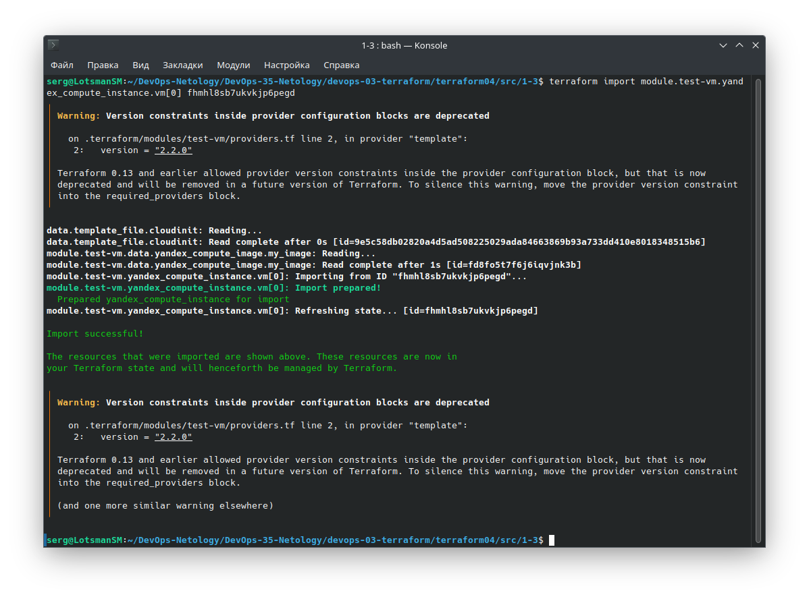

# Домашнее задание к занятию «Продвинутые методы работы с Terraform»

### Решение задания 1

1. Возьмите из [демонстрации к лекции готовый код](https://github.com/netology-code/ter-homeworks/tree/main/04/demonstration1) для создания ВМ с помощью remote-модуля.

Склонировал код из демонстрации, изучал его.

2. Создайте одну ВМ, используя этот модуль. В файле cloud-init.yml необходимо использовать переменную для ssh-ключа вместо хардкода. Передайте ssh-ключ в функцию template_file в блоке vars ={} .
Воспользуйтесь [**примером**](https://grantorchard.com/dynamic-cloudinit-content-with-terraform-file-templates/). Обратите внимание, что ssh-authorized-keys принимает в себя список, а не строку.

Чтобы передать ssh-ключ используя функцию template_file пишу в блок vars следующий код:

```
data "template_file" "cloudinit" {
  template = file("./cloud-init.yml")
  vars     = {
    ssh-authorized-keys = file(var.ssh-authorized-keys[0])
  }
}
```

Использую такую конструкцию именно потому, что в задании указано условие, что переменная authorized-keys должна принимать в себя список, а не строку.

Сама переменная ssh-authorized-keys выглядит следующим образом:

```
variable "ssh-authorized-keys" {
  description = "Path to public SSH key file"
  type        = list(string)
  default     = ["~/.ssh/id_ed25519.pub"]
}
```

3. Добавьте в файл cloud-init.yml установку nginx.

Чтобы установить nginx на хост используя `cloud-init.yml`, нужно в секцию `packages` добавить строку  `- nginx`. В нашем случае после запуска виртуальной машины выполняются следующие действия: обновляется кэш пакетов системы, устанавливается текстовый редактор vim и устанавливается nginx.

```
#cloud-config
users:
  - name: ubuntu
    groups: sudo
    shell: /bin/bash
    sudo: ['ALL=(ALL) NOPASSWD:ALL']
    ssh_authorized_keys:
      - ${ssh-authorized-keys}
package_update: true
package_upgrade: false
packages:
 - vim
 - nginx
```

4. Предоставьте скриншот подключения к консоли и вывод команды ```sudo nginx -t```.

Инициализирую terraform

```bash
╰─➤terraform init -upgrade

Initializing the backend...
Upgrading modules...
Downloading git::https://github.com/udjin10/yandex_compute_instance.git?ref=main for test-vm...
- test-vm in .terraform/modules/test-vm
- vpc_dev in vpc

Initializing provider plugins...
- Finding hashicorp/template versions matching "2.2.0"...
- Finding latest version of yandex-cloud/yandex...
- Using previously-installed hashicorp/template v2.2.0
- Using previously-installed yandex-cloud/yandex v0.104.0

╷
│ Warning: Version constraints inside provider configuration blocks are deprecated
│ 
│   on .terraform/modules/test-vm/providers.tf line 2, in provider "template":
│    2:   version = "2.2.0"
│ 
│ Terraform 0.13 and earlier allowed provider version constraints inside the provider configuration block, but that is now deprecated and will be removed in a future version of Terraform. To
│ silence this warning, move the provider version constraint into the required_providers block.
│ 
│ (and one more similar warning elsewhere)
╵

Terraform has been successfully initialized!

You may now begin working with Terraform. Try running "terraform plan" to see
any changes that are required for your infrastructure. All Terraform commands
should now work.

If you ever set or change modules or backend configuration for Terraform,
rerun this command to reinitialize your working directory. If you forget, other
commands will detect it and remind you to do so if necessary.
```

Выполню `terraform apply`

```bash
╰─➤terraform apply
data.template_file.cloudinit: Reading...
data.template_file.cloudinit: Read complete after 0s [id=9e5c58db02820a4d5ad508225029ada84663869b93a733dd410e8018348515b6]
module.test-vm.data.yandex_compute_image.my_image: Reading...
module.test-vm.data.yandex_compute_image.my_image: Read complete after 0s [id=fd8fo5t7f6j6iqvjnk3b]

Terraform used the selected providers to generate the following execution plan. Resource actions are indicated with the following symbols:
  + create

Terraform will perform the following actions:

  # module.test-vm.yandex_compute_instance.vm[0] will be created
  + resource "yandex_compute_instance" "vm" {
      + allow_stopping_for_update = true
      + created_at                = (known after apply)
      + description               = "TODO: description; {{terraform managed}}"
      + folder_id                 = (known after apply)
      + fqdn                      = (known after apply)
      + gpu_cluster_id            = (known after apply)
      + hostname                  = "develop-web-0"
      + id                        = (known after apply)
      + labels                    = {
          + "env"     = "develop"
          + "project" = "undefined"
        }
      + metadata                  = {
          + "serial-port-enable" = "1"
          + "user-data"          = <<-EOT
                #cloud-config
                users:
                  - name: ubuntu
                    groups: sudo
                    shell: /bin/bash
                    sudo: ['ALL=(ALL) NOPASSWD:ALL']
                    ssh_authorized_keys:
                      - ssh-ed25519 AAAAC3NzaC1lZDI1NTE5AAAAIGx0BIRbchvLjnwhoUWvcGgKEWFs2AgF8r8AjUvmvrTE serg@LotsmanSM
                
                package_update: true
                package_upgrade: false
                packages:
                 - vim
                 - nginx
            EOT
        }
      + name                      = "develop-web-0"
      + network_acceleration_type = "standard"
      + platform_id               = "standard-v1"
      + service_account_id        = (known after apply)
      + status                    = (known after apply)
      + zone                      = "ru-central1-a"

      + boot_disk {
          + auto_delete = true
          + device_name = (known after apply)
          + disk_id     = (known after apply)
          + mode        = (known after apply)

          + initialize_params {
              + block_size  = (known after apply)
              + description = (known after apply)
              + image_id    = "fd8fo5t7f6j6iqvjnk3b"
              + name        = (known after apply)
              + size        = 10
              + snapshot_id = (known after apply)
              + type        = "network-hdd"
            }
        }

      + network_interface {
          + index              = (known after apply)
          + ip_address         = (known after apply)
          + ipv4               = true
          + ipv6               = (known after apply)
          + ipv6_address       = (known after apply)
          + mac_address        = (known after apply)
          + nat                = true
          + nat_ip_address     = (known after apply)
          + nat_ip_version     = (known after apply)
          + security_group_ids = (known after apply)
          + subnet_id          = (known after apply)
        }

      + resources {
          + core_fraction = 5
          + cores         = 2
          + memory        = 1
        }

      + scheduling_policy {
          + preemptible = true
        }
    }

  # module.vpc_dev.yandex_vpc_network.vpc will be created
  + resource "yandex_vpc_network" "vpc" {
      + created_at                = (known after apply)
      + default_security_group_id = (known after apply)
      + folder_id                 = (known after apply)
      + id                        = (known after apply)
      + labels                    = (known after apply)
      + name                      = "develop"
      + subnet_ids                = (known after apply)
    }

  # module.vpc_dev.yandex_vpc_subnet.subnet will be created
  + resource "yandex_vpc_subnet" "subnet" {
      + created_at     = (known after apply)
      + folder_id      = (known after apply)
      + id             = (known after apply)
      + labels         = (known after apply)
      + name           = "develop-ru-central1-a"
      + network_id     = (known after apply)
      + v4_cidr_blocks = [
          + "10.0.1.0/24",
        ]
      + v6_cidr_blocks = (known after apply)
      + zone           = "ru-central1-a"
    }

Plan: 3 to add, 0 to change, 0 to destroy.
╷
│ Warning: Version constraints inside provider configuration blocks are deprecated
│ 
│   on .terraform/modules/test-vm/providers.tf line 2, in provider "template":
│    2:   version = "2.2.0"
│ 
│ Terraform 0.13 and earlier allowed provider version constraints inside the provider configuration block, but that is now deprecated and will be removed in a future version of Terraform. To
│ silence this warning, move the provider version constraint into the required_providers block.
╵

Do you want to perform these actions?
  Terraform will perform the actions described above.
  Only 'yes' will be accepted to approve.

  Enter a value: yes

module.vpc_dev.yandex_vpc_network.vpc: Creating...
module.vpc_dev.yandex_vpc_network.vpc: Creation complete after 2s [id=enparmr9jpl99mj3sp7o]
module.vpc_dev.yandex_vpc_subnet.subnet: Creating...
module.vpc_dev.yandex_vpc_subnet.subnet: Creation complete after 0s [id=e9bpk3p9iak1cl1oe3fu]
module.test-vm.yandex_compute_instance.vm[0]: Creating...
module.test-vm.yandex_compute_instance.vm[0]: Still creating... [10s elapsed]
module.test-vm.yandex_compute_instance.vm[0]: Still creating... [20s elapsed]
module.test-vm.yandex_compute_instance.vm[0]: Still creating... [30s elapsed]
module.test-vm.yandex_compute_instance.vm[0]: Still creating... [40s elapsed]
module.test-vm.yandex_compute_instance.vm[0]: Still creating... [50s elapsed]
module.test-vm.yandex_compute_instance.vm[0]: Still creating... [1m0s elapsed]
module.test-vm.yandex_compute_instance.vm[0]: Still creating... [1m10s elapsed]
module.test-vm.yandex_compute_instance.vm[0]: Still creating... [1m20s elapsed]
module.test-vm.yandex_compute_instance.vm[0]: Still creating... [1m30s elapsed]
module.test-vm.yandex_compute_instance.vm[0]: Creation complete after 1m33s [id=fhmhl8sb7ukvkjp6pegd]

Apply complete! Resources: 3 added, 0 changed, 0 destroyed.

```


Проверяю, что nginx установился:


------

### Решение задания 2

1. Напишите локальный модуль vpc, который будет создавать 2 ресурса: **одну** сеть и **одну** подсеть в зоне, объявленной при вызове модуля, например: ```ru-central1-a```.

Написал локальный модуль с одной сетью и одной подсетью в зоне `ru-central1-a`

2. Вы должны передать в модуль переменные с названием сети, zone и v4_cidr_blocks.

```
variable "env_name" {
  type    = string
  description = "Имя облачной сети"
}

variable "zone" {
  type    = string
  description = "Зона, в которой создать подсеть"
}

variable "cidr" {
  type    = string
  description = "CIDR-блок для подсети"
}
```

3. Модуль должен возвращать в root module с помощью output информацию о yandex_vpc_subnet. Пришлите скриншот информации из terraform console о своем модуле. Пример: > module.vpc_dev  

В terraform console проверю, какой output будет показан при вызове модуля `module.vpc_dev`:


4. Замените ресурсы yandex_vpc_network и yandex_vpc_subnet созданным модулем. Не забудьте передать необходимые параметры сети из модуля vpc в модуль с виртуальной машиной.

Заменил сетевые ресурсы созданным модулем:

```
module "test-vm" {
  source          = "git::https://github.com/udjin10/yandex_compute_instance.git?ref=main"
  env_name        = "develop"
  network_id      = module.vpc_dev.network_id
  subnet_zones    = ["ru-central1-a"]
  subnet_ids      = [module.vpc_dev.subnet_id]
  instance_name   = "web"
  instance_count  = 1
  image_family    = "ubuntu-2004-lts"
  public_ip       = true
```

5. Откройте terraform console и предоставьте скриншот содержимого модуля. Пример: > module.vpc_dev.

В root модуле написал следующий `output.tf`:

```
output "dev_network_id" {
  value = module.vpc_dev.network_id
}

output "dev_subnet_id" {
  value = module.vpc_dev.subnet_id
}
```

Вывод `module.vpc_dev` не изменился:


6. Сгенерируйте документацию к модулю с помощью terraform-docs.    
 
Пример вызова

```
module "vpc_dev" {
  source       = "./vpc"
  env_name     = "develop"
  zone = "ru-central1-a"
  cidr = "10.0.1.0/24"
}
```

С помощью terraform-docs сгенерировал файл документации. Смотреть файл [DOCS.md](src/1-3/vpc/DOC.md).

```bash
╰─➤terraform-docs markdown table --output-file DOC.md ./vpc/
```
------
### Решение задания 3
1. Выведите список ресурсов в стейте.


2. Полностью удалите из стейта модуль vpc.

Полностью удалил из стейта модуль vpc_dev:


3. Полностью удалите из стейта модуль vm.

Полностью удалил из стейта модуль test-vm:


4. Импортируйте всё обратно. Проверьте terraform plan. Изменений быть не должно.
Приложите список выполненных команд и скриншоты процессы.

Обратно импортирую удаленные стейты:


Аналогичными командами импортирую остальные стейты:




После импортирования модулей изменений не последовало.

### Листинг кода по заданиям 1-3 можно посмотреть по [ссылке](src/1-3).

------

### Решение задания 4*

1. Измените модуль vpc так, чтобы он мог создать подсети во всех зонах доступности, переданных в переменной типа list(object) при вызове модуля.  
  
Пример вызова
```
module "vpc_prod" {
  source       = "./vpc"
  env_name     = "production"
  subnets = [
    { zone = "ru-central1-a", cidr = "10.0.1.0/24" },
    { zone = "ru-central1-b", cidr = "10.0.2.0/24" },
    { zone = "ru-central1-c", cidr = "10.0.3.0/24" },
  ]
}

module "vpc_dev" {
  source       = "./vpc"
  env_name     = "develop"
  subnets = [
    { zone = "ru-central1-a", cidr = "10.0.1.0/24" },
  ]
}
```

Предоставьте код, план выполнения, результат из консоли YC.

Изменил модуль vpc, использовал переменную типа list. В YC получил следующий результат:

```
variable "subnets" {
   type = list(object({
    zone = string,
    cidr = string
    }))
  default     = []
}
```

```bash
╰─➤terraform apply
data.template_file.cloudinit: Reading...
data.template_file.cloudinit: Read complete after 0s [id=9e5c58db02820a4d5ad508225029ada84663869b93a733dd410e8018348515b6]
module.test-vm.data.yandex_compute_image.my_image: Reading...
module.test-vm.data.yandex_compute_image.my_image: Read complete after 1s [id=fd8fo5t7f6j6iqvjnk3b]

Terraform used the selected providers to generate the following execution plan. Resource actions are indicated with the following symbols:
  + create

Terraform will perform the following actions:

  # module.test-vm.yandex_compute_instance.vm[0] will be created
  + resource "yandex_compute_instance" "vm" {
      + allow_stopping_for_update = true
      + created_at                = (known after apply)
      + description               = "TODO: description; {{terraform managed}}"
      + folder_id                 = (known after apply)
      + fqdn                      = (known after apply)
      + gpu_cluster_id            = (known after apply)
      + hostname                  = "develop-web-0"
      + id                        = (known after apply)
      + labels                    = {
          + "env"     = "develop"
          + "project" = "undefined"
        }
      + metadata                  = {
          + "serial-port-enable" = "1"
          + "user-data"          = <<-EOT
                #cloud-config
                users:
                  - name: ubuntu
                    groups: sudo
                    shell: /bin/bash
                    sudo: ['ALL=(ALL) NOPASSWD:ALL']
                    ssh_authorized_keys:
                      - ssh-ed25519 AAAAC3NzaC1lZDI1NTE5AAAAIGx0BIRbchvLjnwhoUWvcGgKEWFs2AgF8r8AjUvmvrTE serg@LotsmanSM
                
                package_update: true
                package_upgrade: false
                packages:
                 - vim
                 - nginx
            EOT
        }
      + name                      = "develop-web-0"
      + network_acceleration_type = "standard"
      + platform_id               = "standard-v1"
      + service_account_id        = (known after apply)
      + status                    = (known after apply)
      + zone                      = "ru-central1-a"

      + boot_disk {
          + auto_delete = true
          + device_name = (known after apply)
          + disk_id     = (known after apply)
          + mode        = (known after apply)

          + initialize_params {
              + block_size  = (known after apply)
              + description = (known after apply)
              + image_id    = "fd8fo5t7f6j6iqvjnk3b"
              + name        = (known after apply)
              + size        = 10
              + snapshot_id = (known after apply)
              + type        = "network-hdd"
            }
        }

      + network_interface {
          + index              = (known after apply)
          + ip_address         = (known after apply)
          + ipv4               = true
          + ipv6               = (known after apply)
          + ipv6_address       = (known after apply)
          + mac_address        = (known after apply)
          + nat                = true
          + nat_ip_address     = (known after apply)
          + nat_ip_version     = (known after apply)
          + security_group_ids = (known after apply)
          + subnet_id          = (known after apply)
        }

      + resources {
          + core_fraction = 5
          + cores         = 2
          + memory        = 1
        }

      + scheduling_policy {
          + preemptible = true
        }
    }

  # module.vpc_dev.yandex_vpc_network.vpc_net will be created
  + resource "yandex_vpc_network" "vpc_net" {
      + created_at                = (known after apply)
      + default_security_group_id = (known after apply)
      + folder_id                 = (known after apply)
      + id                        = (known after apply)
      + labels                    = (known after apply)
      + name                      = "develop-network"
      + subnet_ids                = (known after apply)
    }

  # module.vpc_dev.yandex_vpc_subnet.vpc_subnet["ru-central1-a"] will be created
  + resource "yandex_vpc_subnet" "vpc_subnet" {
      + created_at     = (known after apply)
      + folder_id      = (known after apply)
      + id             = (known after apply)
      + labels         = (known after apply)
      + name           = "develop-ru-central1-a"
      + network_id     = (known after apply)
      + v4_cidr_blocks = [
          + "10.0.1.0/24",
        ]
      + v6_cidr_blocks = (known after apply)
      + zone           = "ru-central1-a"
    }

  # module.vpc_prod.yandex_vpc_network.vpc_net will be created
  + resource "yandex_vpc_network" "vpc_net" {
      + created_at                = (known after apply)
      + default_security_group_id = (known after apply)
      + folder_id                 = (known after apply)
      + id                        = (known after apply)
      + labels                    = (known after apply)
      + name                      = "production-network"
      + subnet_ids                = (known after apply)
    }

  # module.vpc_prod.yandex_vpc_subnet.vpc_subnet["ru-central1-a"] will be created
  + resource "yandex_vpc_subnet" "vpc_subnet" {
      + created_at     = (known after apply)
      + folder_id      = (known after apply)
      + id             = (known after apply)
      + labels         = (known after apply)
      + name           = "production-ru-central1-a"
      + network_id     = (known after apply)
      + v4_cidr_blocks = [
          + "10.0.1.0/24",
        ]
      + v6_cidr_blocks = (known after apply)
      + zone           = "ru-central1-a"
    }

  # module.vpc_prod.yandex_vpc_subnet.vpc_subnet["ru-central1-b"] will be created
  + resource "yandex_vpc_subnet" "vpc_subnet" {
      + created_at     = (known after apply)
      + folder_id      = (known after apply)
      + id             = (known after apply)
      + labels         = (known after apply)
      + name           = "production-ru-central1-b"
      + network_id     = (known after apply)
      + v4_cidr_blocks = [
          + "10.0.2.0/24",
        ]
      + v6_cidr_blocks = (known after apply)
      + zone           = "ru-central1-b"
    }

  # module.vpc_prod.yandex_vpc_subnet.vpc_subnet["ru-central1-c"] will be created
  + resource "yandex_vpc_subnet" "vpc_subnet" {
      + created_at     = (known after apply)
      + folder_id      = (known after apply)
      + id             = (known after apply)
      + labels         = (known after apply)
      + name           = "production-ru-central1-c"
      + network_id     = (known after apply)
      + v4_cidr_blocks = [
          + "10.0.3.0/24",
        ]
      + v6_cidr_blocks = (known after apply)
      + zone           = "ru-central1-c"
    }

Plan: 7 to add, 0 to change, 0 to destroy.

Changes to Outputs:
  + dev_network_id = (known after apply)
  + dev_subnet_id  = (known after apply)
╷
│ Warning: Version constraints inside provider configuration blocks are deprecated
│ 
│   on .terraform/modules/test-vm/providers.tf line 2, in provider "template":
│    2:   version = "2.2.0"
│ 
│ Terraform 0.13 and earlier allowed provider version constraints inside the provider configuration block, but that is now deprecated and will be removed in a future version of
│ Terraform. To silence this warning, move the provider version constraint into the required_providers block.
╵

Do you want to perform these actions?
  Terraform will perform the actions described above.
  Only 'yes' will be accepted to approve.

  Enter a value: yes

module.vpc_prod.yandex_vpc_network.vpc_net: Creating...
module.vpc_dev.yandex_vpc_network.vpc_net: Creating...
module.vpc_prod.yandex_vpc_network.vpc_net: Creation complete after 2s [id=enphva2rbtrqhhq1576g]
module.vpc_prod.yandex_vpc_subnet.vpc_subnet["ru-central1-c"]: Creating...
module.vpc_prod.yandex_vpc_subnet.vpc_subnet["ru-central1-a"]: Creating...
module.vpc_prod.yandex_vpc_subnet.vpc_subnet["ru-central1-b"]: Creating...
module.vpc_prod.yandex_vpc_subnet.vpc_subnet["ru-central1-a"]: Creation complete after 0s [id=e9bpd87dh72rp17esg2a]
module.vpc_prod.yandex_vpc_subnet.vpc_subnet["ru-central1-c"]: Creation complete after 1s [id=b0c7l4932f37itcn9b46]
module.vpc_dev.yandex_vpc_network.vpc_net: Creation complete after 3s [id=enpp7c7i0r80b2htm57e]
module.vpc_dev.yandex_vpc_subnet.vpc_subnet["ru-central1-a"]: Creating...
module.vpc_prod.yandex_vpc_subnet.vpc_subnet["ru-central1-b"]: Creation complete after 1s [id=e2ls632nl8nfkb79h85a]
module.vpc_dev.yandex_vpc_subnet.vpc_subnet["ru-central1-a"]: Creation complete after 1s [id=e9bp153ld6l24ae6tig1]
module.test-vm.yandex_compute_instance.vm[0]: Creating...
module.test-vm.yandex_compute_instance.vm[0]: Still creating... [10s elapsed]
module.test-vm.yandex_compute_instance.vm[0]: Still creating... [20s elapsed]
module.test-vm.yandex_compute_instance.vm[0]: Still creating... [30s elapsed]
module.test-vm.yandex_compute_instance.vm[0]: Still creating... [40s elapsed]
module.test-vm.yandex_compute_instance.vm[0]: Still creating... [50s elapsed]
module.test-vm.yandex_compute_instance.vm[0]: Creation complete after 54s [id=fhmv0bmspq7fhv8g56lk]

Apply complete! Resources: 7 added, 0 changed, 0 destroyed.

Outputs:

dev_network_id = "enpp7c7i0r80b2htm57e"
dev_subnet_id = "e9bp153ld6l24ae6tig1"
```


### Листинг кода по заданиям 4 можно посмотреть по [ссылке](src/4).
------

# Решений заданий 5*, 6* и 7* нет 

------


### Задание 5*

1. Напишите модуль для создания кластера managed БД Mysql в Yandex Cloud с одним или несколькими(2 по умолчанию) хостами в зависимости от переменной HA=true или HA=false. Используйте ресурс yandex_mdb_mysql_cluster: передайте имя кластера и id сети.
2. Напишите модуль для создания базы данных и пользователя в уже существующем кластере managed БД Mysql. Используйте ресурсы yandex_mdb_mysql_database и yandex_mdb_mysql_user: передайте имя базы данных, имя пользователя и id кластера при вызове модуля.
3. Используя оба модуля, создайте кластер example из одного хоста, а затем добавьте в него БД test и пользователя app. Затем измените переменную и превратите сингл хост в кластер из 2-х серверов.
4. Предоставьте план выполнения и по возможности результат. Сразу же удаляйте созданные ресурсы, так как кластер может стоить очень дорого. Используйте минимальную конфигурацию.

### Задание 6*

1. Разверните у себя локально vault, используя docker-compose.yml в проекте.
2. Для входа в web-интерфейс и авторизации terraform в vault используйте токен "education".
3. Создайте новый секрет по пути http://127.0.0.1:8200/ui/vault/secrets/secret/create
Path: example  
secret data key: test 
secret data value: congrats!  
4. Считайте этот секрет с помощью terraform и выведите его в output по примеру:
```
provider "vault" {
 address = "http://<IP_ADDRESS>:<PORT_NUMBER>"
 skip_tls_verify = true
 token = "education"
}
data "vault_generic_secret" "vault_example"{
 path = "secret/example"
}

output "vault_example" {
 value = "${nonsensitive(data.vault_generic_secret.vault_example.data)}"
} 

Можно обратиться не к словарю, а конкретному ключу:
terraform console: >nonsensitive(data.vault_generic_secret.vault_example.data.<имя ключа в секрете>)
```
5. Попробуйте самостоятельно разобраться в документации и записать новый секрет в vault с помощью terraform. 

### Задание 7*
Попробуйте самостоятельно разобраться в документаци и с помощью terraform remote state разделить корневой модуль на два отдельных: создание VPC от создание ВМ в этом vpc. 