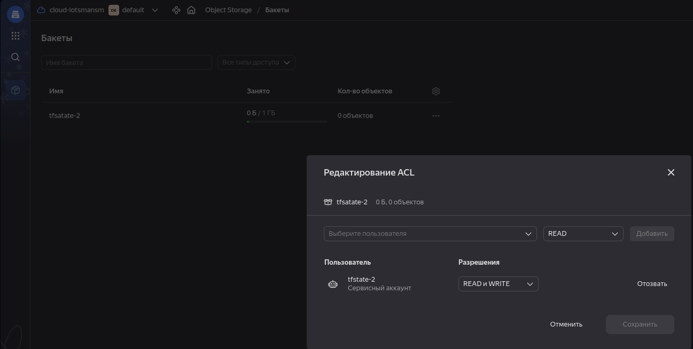
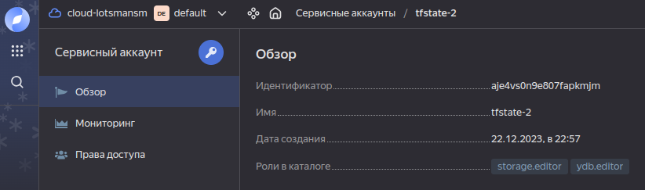
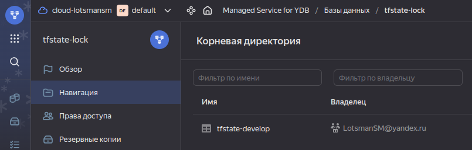
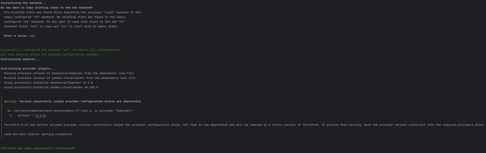
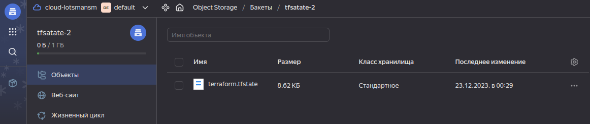
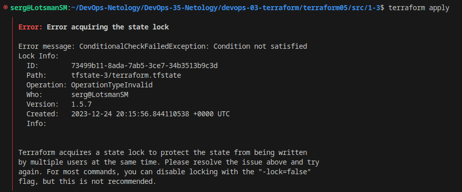
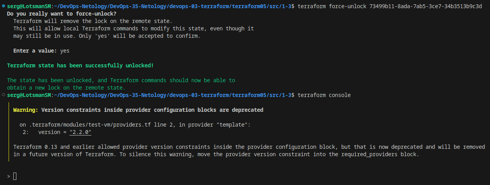

# Домашнее задание к занятию «Использование Terraform в команде»

### Решение задания 1

1. Возьмите код:
- из [ДЗ к лекции 4](https://github.com/netology-code/ter-homeworks/tree/main/04/src),
- из [демо к лекции 4](https://github.com/netology-code/ter-homeworks/tree/main/04/demonstration1).
2. Проверьте код с помощью tflint и checkov. Вам не нужно инициализировать этот проект.

С помощью docker контейнера tflint проверяю первый код и получаю результат:

```bash
╰─➤docker run --rm -v $(pwd):/data -t ghcr.io/terraform-linters/tflint
Unable to find image 'ghcr.io/terraform-linters/tflint:latest' locally
latest: Pulling from terraform-linters/tflint
96526aa774ef: Pull complete 
7b4804d498f0: Pull complete 
47cbbdbea012: Pull complete 
2b4ec4a992aa: Pull complete 
Digest: sha256:3f567269172bce107ca9c05e9e91ad3ccebb6e9ab3871f4e5b80bee1ef89db60
Status: Downloaded newer image for ghcr.io/terraform-linters/tflint:latest
4 issue(s) found:

Warning: Missing version constraint for provider "yandex" in `required_providers` (terraform_required_providers)

  on providers.tf line 3:
   3:     yandex = {
   4:       source = "yandex-cloud/yandex"
   5:     }

Reference: https://github.com/terraform-linters/tflint-ruleset-terraform/blob/v0.5.0/docs/rules/terraform_required_providers.md

Warning: [Fixable] variable "vms_ssh_root_key" is declared but not used (terraform_unused_declarations)

  on variables.tf line 36:
  36: variable "vms_ssh_root_key" {

Reference: https://github.com/terraform-linters/tflint-ruleset-terraform/blob/v0.5.0/docs/rules/terraform_unused_declarations.md

Warning: [Fixable] variable "vm_web_name" is declared but not used (terraform_unused_declarations)

  on variables.tf line 43:
  43: variable "vm_web_name" {

Reference: https://github.com/terraform-linters/tflint-ruleset-terraform/blob/v0.5.0/docs/rules/terraform_unused_declarations.md

Warning: [Fixable] variable "vm_db_name" is declared but not used (terraform_unused_declarations)

  on variables.tf line 50:
  50: variable "vm_db_name" {

Reference: https://github.com/terraform-linters/tflint-ruleset-terraform/blob/v0.5.0/docs/rules/terraform_unused_declarations.md
```

С помощью checkov проверяю ошибки во втором коде:

```bash
╰─➤docker run --rm --tty --volume $(pwd):/tf --workdir /tf bridgecrew/checkov --download-external-modules true --directory /tf


       _               _              
   ___| |__   ___  ___| | _______   __
  / __| '_ \ / _ \/ __| |/ / _ \ \ / /
 | (__| | | |  __/ (__|   < (_) \ V / 
  \___|_| |_|\___|\___|_|\_\___/ \_/  
                                      
By Prisma Cloud | version: 3.1.41 
Update available 3.1.41 -> 3.1.42
Run pip3 install -U checkov to update 


terraform scan results:

Passed checks: 2, Failed checks: 5, Skipped checks: 0

Check: CKV_YC_4: "Ensure compute instance does not have serial console enabled."
        PASSED for resource: module.test-vm.yandex_compute_instance.vm[0]
        File: /.external_modules/github.com/udjin10/yandex_compute_instance/main/main.tf:24-73
        Calling File: /main.tf:32-48
Check: CKV_YC_4: "Ensure compute instance does not have serial console enabled."
        PASSED for resource: module.test-vm.yandex_compute_instance.vm[1]
        File: /.external_modules/github.com/udjin10/yandex_compute_instance/main/main.tf:24-73
        Calling File: /main.tf:32-48
Check: CKV_YC_2: "Ensure compute instance does not have public IP."
        FAILED for resource: module.test-vm.yandex_compute_instance.vm[0]
        File: /.external_modules/github.com/udjin10/yandex_compute_instance/main/main.tf:24-73
        Calling File: /main.tf:32-48

                Code lines for this resource are too many. Please use IDE of your choice to review the file.
Check: CKV_YC_11: "Ensure security group is assigned to network interface."
        FAILED for resource: module.test-vm.yandex_compute_instance.vm[0]
        File: /.external_modules/github.com/udjin10/yandex_compute_instance/main/main.tf:24-73
        Calling File: /main.tf:32-48

                Code lines for this resource are too many. Please use IDE of your choice to review the file.
Check: CKV_YC_2: "Ensure compute instance does not have public IP."
        FAILED for resource: module.test-vm.yandex_compute_instance.vm[1]
        File: /.external_modules/github.com/udjin10/yandex_compute_instance/main/main.tf:24-73
        Calling File: /main.tf:32-48

                Code lines for this resource are too many. Please use IDE of your choice to review the file.
Check: CKV_YC_11: "Ensure security group is assigned to network interface."
        FAILED for resource: module.test-vm.yandex_compute_instance.vm[1]
        File: /.external_modules/github.com/udjin10/yandex_compute_instance/main/main.tf:24-73
        Calling File: /main.tf:32-48

                Code lines for this resource are too many. Please use IDE of your choice to review the file.
Check: CKV_TF_1: "Ensure Terraform module sources use a commit hash"
        FAILED for resource: test-vm
        File: /main.tf:32-48
        Guide: https://docs.prismacloud.io/en/enterprise-edition/policy-reference/supply-chain-policies/terraform-policies/ensure-terraform-module-sources-use-git-url-with-commit-hash-revision

                32 | module "test-vm" {
                33 |   source          = "git::https://github.com/udjin10/yandex_compute_instance.git?ref=main"
                34 |   env_name        = "develop"
                35 |   network_id      = yandex_vpc_network.develop.id
                36 |   subnet_zones    = ["ru-central1-a"]
                37 |   subnet_ids      = [ yandex_vpc_subnet.develop.id ]
                38 |   instance_name   = "web"
                39 |   instance_count  = 2
                40 |   image_family    = "ubuntu-2004-lts"
                41 |   public_ip       = true
                42 |   
                43 |   metadata = {
                44 |       user-data          = data.template_file.cloudinit.rendered #Для демонстрации №3
                45 |       serial-port-enable = 1
                46 |   }
                47 | 
                48 | }

```

3. Перечислите, какие **типы** ошибок обнаружены в проекте (без дублей).

Обнаружены следующие ошибки:

Не был инициализирован проект, соответственно нет установленного Terraform провайдера, есть объявленные, но неиспользуемые переменные, в модуле test-vm присутствует ссылка на ветку main без указания конкретного коммита. Если ветка main изменится, то после выполнения кода может быть непредсказуемый результат.

------

### Решение задания 2

1. Возьмите ваш GitHub-репозиторий с **выполненным ДЗ 4** в ветке 'terraform-04' и сделайте из него ветку 'terraform-05'.

Сделал копию репозитория прошлого ДЗ.

2. Повторите демонстрацию лекции: настройте YDB, S3 bucket, yandex service account, права доступа и мигрируйте state проекта в S3 с блокировками. Предоставьте скриншоты процесса в качестве ответа.

Создал S3 bucket, yandex service account, назначил права доступа, YDB:







Мигрировал state проекта в S3:





3. Закоммитьте в ветку 'terraform-05' все изменения.

Закоммитил изменения в ветку terraform05. [Ссылка](https://github.com/LotsmanSM/DevOps-35-Netology/tree/main/devops-03-terraform/terraform05)

4. Откройте в проекте terraform console, а в другом окне из этой же директории попробуйте запустить terraform apply.

Открываю `terraform console`, а в другом окне из этой же директории запускаю `terraform apply`.

5. Пришлите ответ об ошибке доступа к state.

Ответ об ошибке доступа к state:



6. Принудительно разблокируйте state. Пришлите команду и вывод.

Принудительно разблокирую state:



------
### Решение задания  3  

1. Сделайте в GitHub из ветки 'terraform-05' новую ветку 'terraform-hotfix'.

2. Проверье код с помощью tflint и checkov, исправьте все предупреждения и ошибки в 'terraform-hotfix', сделайте коммит.

3. Откройте новый pull request 'terraform-hotfix' --> 'terraform05'.

4. Вставьте в комментарий PR результат анализа tflint и checkov, план изменений инфраструктуры из вывода команды terraform plan.

5. Пришлите ссылку на PR для ревью. Вливать код в 'terraform-05' не нужно.

------
### Задание 4

1. Напишите переменные с валидацией и протестируйте их, заполнив default верными и неверными значениями. Предоставьте скриншоты проверок из terraform console. 

- type=string, description="ip-адрес" — проверка, что значение переменной содержит верный IP-адрес с помощью функций cidrhost() или regex(). Тесты:  "192.168.0.1" и "1920.1680.0.1";
- type=list(string), description="список ip-адресов" — проверка, что все адреса верны. Тесты:  ["192.168.0.1", "1.1.1.1", "127.0.0.1"] и ["192.168.0.1", "1.1.1.1", "1270.0.0.1"].

## Дополнительные задания (со звёздочкой*)

**Настоятельно рекомендуем выполнять все задания со звёздочкой.** Их выполнение поможет глубже разобраться в материале.   
Задания со звёздочкой дополнительные, не обязательные к выполнению и никак не повлияют на получение вами зачёта по этому домашнему заданию. 
------
### Задание 5*
1. Напишите переменные с валидацией:
- type=string, description="любая строка" — проверка, что строка не содержит символов верхнего регистра;
- type=object — проверка, что одно из значений равно true, а второе false, т. е. не допускается false false и true true:
```
variable "in_the_end_there_can_be_only_one" {
    description="Who is better Connor or Duncan?"
    type = object({
        Dunkan = optional(bool)
        Connor = optional(bool)
    })

    default = {
        Dunkan = true
        Connor = false
    }

    validation {
        error_message = "There can be only one MacLeod"
        condition = <проверка>
    }
}
```
------
### Задание 6*

1. Настройте любую известную вам CI/CD-систему. Если вы ещё не знакомы с CI/CD-системами, настоятельно рекомендуем вернуться к этому заданию после изучения Jenkins/Teamcity/Gitlab.
2. Скачайте с её помощью ваш репозиторий с кодом и инициализируйте инфраструктуру.
3. Уничтожьте инфраструктуру тем же способом.


------
### Задание 7*
1. Настройте отдельный terraform root модуль, который будет создавать YDB, s3 bucket для tfstate и сервисный аккаунт с необходимыми правами. 
