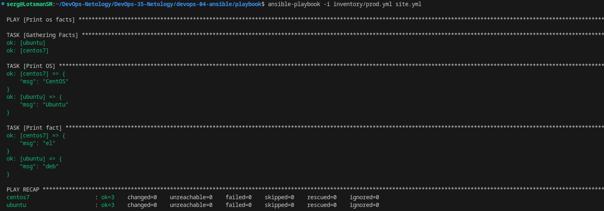
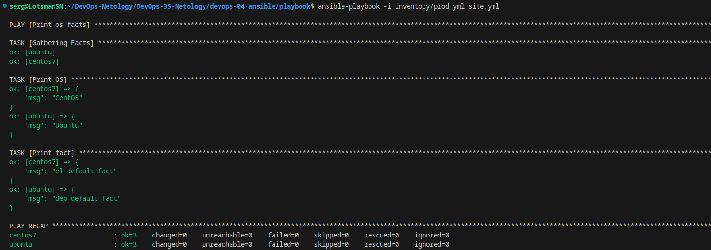
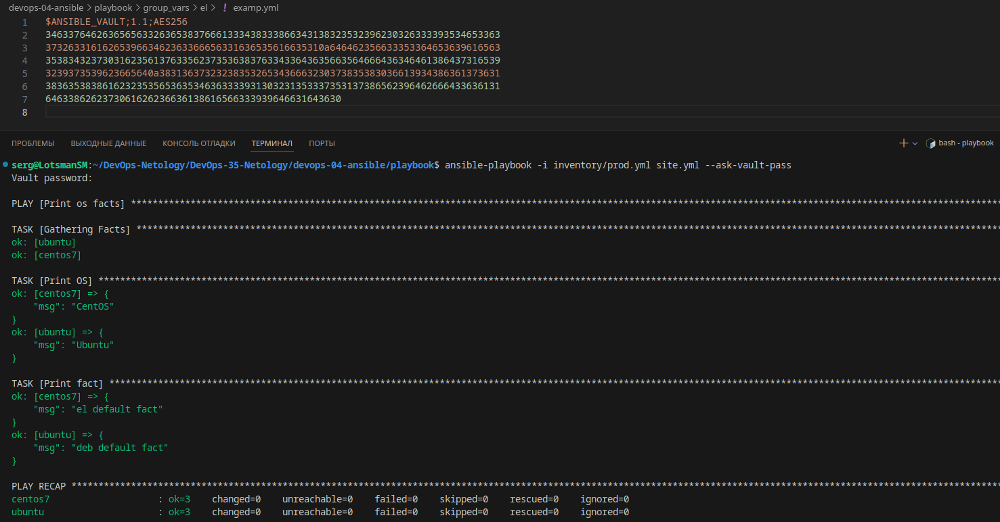
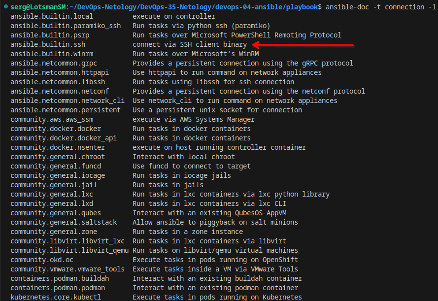
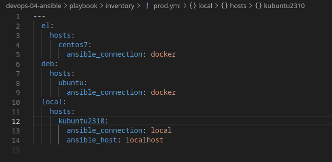
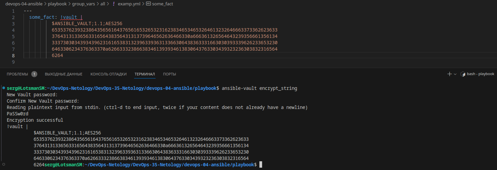
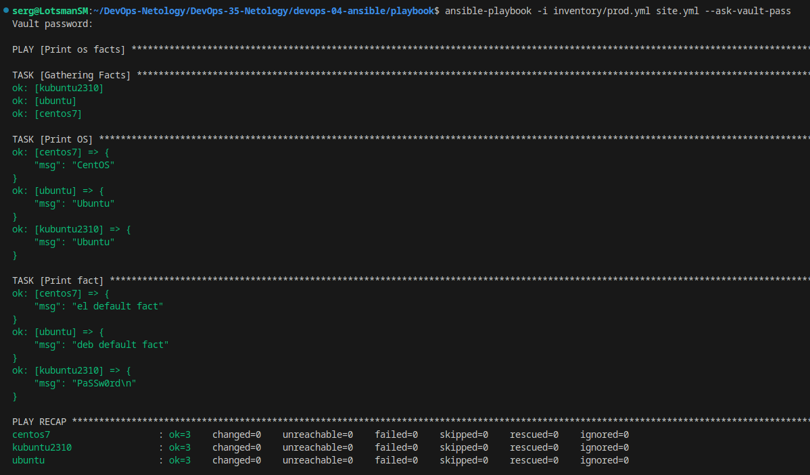
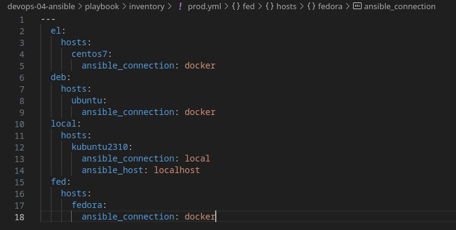

# Домашнее задание к занятию 1 «Введение в Ansible»

## Решение основной части

1. Попробуйте запустить playbook на окружении из `test.yml`, зафиксируйте значение, которое имеет факт `some_fact` для указанного хоста при выполнении playbook.

Запускаю playbook, вижу что значение, которое находится в `some_fact` - 12:

```bash
╰─➤ansible-playbook -i inventory/test.yml site.yml 
```


2. Найдите файл с переменными (group_vars), в котором задаётся найденное в первом пункте значение, и поменяйте его на `all default fact`.

Меняю найденное значение на `all default fact`


3. Воспользуйтесь подготовленным (используется `docker`) или создайте собственное окружение для проведения дальнейших испытаний.

Буду использовать готовое `docker` окружение.

```bash
╰─➤docker run --name centos7 -d pycontribs/centos:7 sleep 36000000
╰─➤docker run --name ubuntu -d pycontribs/ubuntu sleep 36000000
```

4. Проведите запуск playbook на окружении из `prod.yml`. Зафиксируйте полученные значения `some_fact` для каждого из `managed host`.

Запускаю playbook на окружении из prod. Получаю следующие значения `some_fact`:

```bash
╰─➤ansible-playbook -i inventory/prod.yml site.yml
```



5. Добавьте факты в `group_vars` каждой из групп хостов так, чтобы для `some_fact` получились значения: для `deb` — `deb default fact`, для `el` — `el default fact`.

Меняю факты в `group_vars`, до `deb default fact` и `el default fact`

6. Повторите запуск playbook на окружении `prod.yml`. Убедитесь, что выдаются корректные значения для всех хостов.

Повторяю запуск окружения `prod.yml`. Получаю следующие значения `some_fact`:



7. При помощи `ansible-vault` зашифруйте факты в `group_vars/deb` и `group_vars/el` с паролем `netology`.

```bash
╰─➤ansible-vault encrypt group_vars/deb/examp.yml
╰─➤ansible-vault encrypt group_vars/el/examp.yml
```


8. Запустите playbook на окружении `prod.yml`. При запуске `ansible` должен запросить у вас пароль. Убедитесь в работоспособности.

```bash
╰─➤ansible-playbook -i inventory/prod.yml site.yml --ask-vault-pass
```



9. Посмотрите при помощи `ansible-doc` список плагинов для подключения. Выберите подходящий для работы на `control node`.

При помощи `ansible-doc` смотрю список плагинов для подключения. Подходящий для работы на `control node`

```bash
╰─➤ansible-doc -t connection -l
```



10. В `prod.yml` добавьте новую группу хостов с именем  `local`, в ней разместите localhost с необходимым типом подключения.

В `prod.yml` добавил новую группу хостов с именем  `local`, в ней разместил localhost с необходимым типом подключения:



11. Запустите playbook на окружении `prod.yml`. При запуске `ansible` должен запросить у вас пароль. Убедитесь, что факты `some_fact` для каждого из хостов определены из верных `group_vars`.

Запустил playbook на окружении `prod.yml`. При запуске `ansible` запросил пароль. Факты `some_fact` для каждого из хостов получились следующими:


12. Заполните `README.md` ответами на вопросы. Сделайте `git push` в ветку `master`. В ответе отправьте ссылку на ваш открытый репозиторий с изменённым `playbook` и заполненным `README.md`.
13. Предоставьте скриншоты результатов запуска команд.

---

## Решение необязательной части

1. При помощи `ansible-vault` расшифруйте все зашифрованные файлы с переменными.

При помощи `ansible-vault` расшифровал все зашифрованные файлы с переменными:

```bash
╰─➤ansible-vault decrypt group_vars/deb/examp.yml
╰─➤ansible-vault decrypt group_vars/el/examp.yml
```


2. Зашифруйте отдельное значение `PaSSw0rd` для переменной `some_fact` паролем `netology`. Добавьте полученное значение в `group_vars/all/exmp.yml`.

```bash
╰─➤ansible-vault encrypt_string
```



3. Запустите `playbook`, убедитесь, что для нужных хостов применился новый `fact`.



4. Добавьте новую группу хостов `fedora`, самостоятельно придумайте для неё переменную. В качестве образа можно использовать [этот вариант](https://hub.docker.com/r/pycontribs/fedora).

Добавил новую группу хостов `fedora`, написал для неё переменную.



```bash
╰─➤docker run --name fedora -d pycontribs/fedora sleep 36000000
```

Новый факт выглядит так:


5. Напишите скрипт на bash: автоматизируйте поднятие необходимых контейнеров, запуск ansible-playbook и остановку контейнеров.

Написал скрипт на bash, который пуллит контейнеры, запускает их, выполняет playbook и останавливает контейнеры. [Ссылка на скрипт](playbook/script.sh)

6. Все изменения должны быть зафиксированы и отправлены в ваш личный репозиторий.

Запушил изменения кода и скрипт в репозиторий. [Ссылка](playbook/)

---
