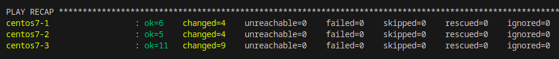
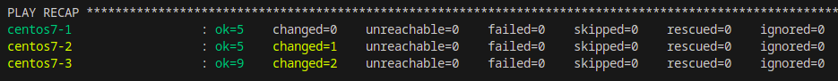

# Домашнее задание к занятию 3 «Использование Ansible»

## Подготовка к выполнению

1. Подготовьте в Yandex Cloud три хоста: для `clickhouse`, для `vector` и для `lighthouse`.

Подготовил с помощью Terraform на Yandex Cloud 3 виртуальные машины.

Код Terraform доступен [по ссылке] (src/terraform)

2. Репозиторий LightHouse находится [по ссылке](https://github.com/VKCOM/lighthouse).

## Основная часть

1. Допишите playbook: нужно сделать ещё один play, который устанавливает и настраивает LightHouse.
2. При создании tasks рекомендую использовать модули: `get_url`, `template`, `yum`, `apt`.
3. Tasks должны: скачать статику LightHouse, установить Nginx или любой другой веб-сервер, настроить его конфиг для открытия LightHouse, запустить веб-сервер.

Дописал еще один play, который устанавливает LightHouse. Использую модули  `get_url`, `template`, `yum`, `service`, `file`. Происходит установка и конфигурирование веб-сервера Nginx, установка и конфигурирование LightHouse, запуск служб Nginx и LightHouse.

4. Подготовьте свой inventory-файл `prod.yml`.

Подготовил свой inventory-файл `prod.yml`:

```
---
clickhouse:
  hosts:
    centos7-1:
      ansible_connection: ssh
      ansible_host: 62.84.126.84
      ansible_ssh_user: centos
      ansible_private_key_file: ~/.ssh/id_ed25519
vector:
  hosts:
    centos7-2:
      ansible_connection: ssh
      ansible_host: 62.84.117.153
      ansible_ssh_user: centos
      ansible_private_key_file: ~/.ssh/id_ed25519
lighthouse:
  hosts:
    centos7-3:
      ansible_connection: ssh
      ansible_host: 130.193.38.45
      ansible_ssh_user: centos
      ansible_private_key_file: ~/.ssh/id_ed25519
```

5. Запустите `ansible-lint site.yml` и исправьте ошибки, если они есть.

Запустил ansible-lint site.yml. Были ошибки в использовании старых наименований модулей, отсутствии прав на скачиваемые или создаваемые файлы. Ошибки исправлены.

6. Попробуйте запустить playbook на этом окружении с флагом `--check`.

Запустил playbook с флагом `--check`. Выполнение playbook завершилось с ошибкой, т.к. этот флаг не вносит изменения в системы, а выполнение playbook требует скачивания и установки пакетов приложений.

```bash
╰─➤ansible-playbook -i inventory/prod.yml site.yml --check

PLAY [Install Nginx] **********************************************************************************************************************************************************************

TASK [Gathering Facts] ********************************************************************************************************************************************************************
ok: [centos7-3]

TASK [Nginx | Install epel-release] *******************************************************************************************************************************************************
changed: [centos7-3]

TASK [Nginx | Install Nginx] **************************************************************************************************************************************************************
fatal: [centos7-3]: FAILED! => {"changed": false, "msg": "No package matching 'nginx' found available, installed or updated", "rc": 126, "results": ["No package matching 'nginx' found available, installed or updated"]}

PLAY RECAP ********************************************************************************************************************************************************************************
centos7-3                  : ok=2    changed=1    unreachable=0    failed=1    skipped=0    rescued=0    ignored=0
```

7. Запустите playbook на `prod.yml` окружении с флагом `--diff`. Убедитесь, что изменения на системе произведены.

Запускаю playbook на `prod.yml` окружении с флагом `--diff`. Изменения в систему внесены:



```bash
╰─➤ansible-playbook -i inventory/prod.yml site.yml --diff

PLAY [Install Nginx] **********************************************************************************************************************************************************************

TASK [Gathering Facts] ********************************************************************************************************************************************************************
ok: [centos7-3]

TASK [Nginx | Install epel-release] *******************************************************************************************************************************************************
changed: [centos7-3]

TASK [Nginx | Install Nginx] **************************************************************************************************************************************************************
changed: [centos7-3]

TASK [Nginx | Create config] **************************************************************************************************************************************************************
--- before: /etc/nginx/nginx.conf
+++ after: /home/serg/.ansible/tmp/ansible-local-282870glhwk3sa/tmpmxomlt9a/nginx.conf.j2
@@ -1,9 +1,5 @@
-# For more information on configuration, see:
-#   * Official English Documentation: http://nginx.org/en/docs/
-#   * Official Russian Documentation: http://nginx.org/ru/docs/
-
-user nginx;
-worker_processes auto;
+user root;
+worker_processes 1;
 error_log /var/log/nginx/error.log;
 pid /run/nginx.pid;
 
@@ -52,33 +48,4 @@
         location = /50x.html {
         }
     }
-
-# Settings for a TLS enabled server.
-#
-#    server {
-#        listen       443 ssl http2;
-#        listen       [::]:443 ssl http2;
-#        server_name  _;
-#        root         /usr/share/nginx/html;
-#
-#        ssl_certificate "/etc/pki/nginx/server.crt";
-#        ssl_certificate_key "/etc/pki/nginx/private/server.key";
-#        ssl_session_cache shared:SSL:1m;
-#        ssl_session_timeout  10m;
-#        ssl_ciphers HIGH:!aNULL:!MD5;
-#        ssl_prefer_server_ciphers on;
-#
-#        # Load configuration files for the default server block.
-#        include /etc/nginx/default.d/*.conf;
-#
-#        error_page 404 /404.html;
-#            location = /40x.html {
-#        }
-#
-#        error_page 500 502 503 504 /50x.html;
-#            location = /50x.html {
-#        }
-#    }
-
-}
-
+}
\ No newline at end of file

changed: [centos7-3]

RUNNING HANDLER [start-nginx] *************************************************************************************************************************************************************
changed: [centos7-3]

PLAY [Install Lighthouse] *****************************************************************************************************************************************************************

TASK [Gathering Facts] ********************************************************************************************************************************************************************
ok: [centos7-3]

TASK [Lighthouse | Install Dependencies] **************************************************************************************************************************************************
changed: [centos7-3]

TASK [Create Lighthouse directory] ********************************************************************************************************************************************************
--- before
+++ after
@@ -1,6 +1,6 @@
 {
-    "group": 0,
-    "owner": 0,
+    "group": 994,
+    "owner": 997,
     "path": "/var/www/lighthouse",
-    "state": "absent"
+    "state": "directory"
 }

changed: [centos7-3]

TASK [Lighthouse | Clone from Git] ********************************************************************************************************************************************************
>> Newly checked out d701335c25cd1bb9b5155711190bad8ab852c2ce
changed: [centos7-3]

TASK [Lighthouse | Create lighthouse config] **********************************************************************************************************************************************
--- before
+++ after: /home/serg/.ansible/tmp/ansible-local-282870glhwk3sa/tmpvkaxh4p7/lighthouse.conf.j2
@@ -0,0 +1,11 @@
+server {
+  listen        80;
+  server_name   localhost;
+
+  access_log    /var/log/nginx/lighthouse.log main;
+
+  location / {
+    root  /var/www/lighthouse;
+    index index.html;
+  }
+}
\ No newline at end of file

changed: [centos7-3]

RUNNING HANDLER [restart-nginx] ***********************************************************************************************************************************************************
changed: [centos7-3]

PLAY [Install Clickhouse] *****************************************************************************************************************************************************************

TASK [Gathering Facts] ********************************************************************************************************************************************************************
ok: [centos7-1]

TASK [Get clickhouse] *********************************************************************************************************************************************************************
changed: [centos7-1] => (item=clickhouse-client)
changed: [centos7-1] => (item=clickhouse-server)
changed: [centos7-1] => (item=clickhouse-common-static)

TASK [Install clickhouse packages] ********************************************************************************************************************************************************
changed: [centos7-1]

TASK [Pause 20 sec] ***********************************************************************************************************************************************************************
Pausing for 20 seconds
(ctrl+C then 'C' = continue early, ctrl+C then 'A' = abort)
ok: [centos7-1]

TASK [Flush handlers] *********************************************************************************************************************************************************************

RUNNING HANDLER [Start clickhouse service] ************************************************************************************************************************************************
changed: [centos7-1]

TASK [Create database] ********************************************************************************************************************************************************************
changed: [centos7-1]

PLAY [Install Vector] *********************************************************************************************************************************************************************

TASK [Gathering Facts] ********************************************************************************************************************************************************************
ok: [centos7-2]

TASK [Vector | Install RPM] ***************************************************************************************************************************************************************
changed: [centos7-2]

TASK [Vector | Template file] *************************************************************************************************************************************************************
--- before
+++ after: /home/serg/.ansible/tmp/ansible-local-282870glhwk3sa/tmpo2vtsqce/vector.yml.j2
@@ -0,0 +1,45 @@
+#TEST config from Ansible
+#                                    __   __  __
+#                                    \ \ / / / /
+#                                     \ V / / /
+#                                      \_/  \/
+#
+#                                    V E C T O R
+#                                   Configuration
+#
+# ------------------------------------------------------------------------------
+# Website: https://vector.dev
+# Docs: https://vector.dev/docs
+# Chat: https://chat.vector.dev
+# ------------------------------------------------------------------------------
+
+# Change this to use a non-default directory for Vector data storage:
+# data_dir = "/var/lib/vector"
+
+# Random Syslog-formatted logs
+[sources.dummy_logs]
+type = "demo_logs"
+format = "syslog"
+interval = 1
+
+# Parse Syslog logs
+# See the Vector Remap Language reference for more info: https://vrl.dev
+[transforms.parse_logs]
+type = "remap"
+inputs = ["dummy_logs"]
+source = '''
+. = parse_syslog!(string!(.message))
+'''
+
+# Print parsed logs to stdout
+[sinks.print]
+type = "console"
+inputs = ["parse_logs"]
+encoding.codec = "json"
+
+# Vector's GraphQL API (disabled by default)
+# Uncomment to try it out with the `vector top` command or
+# in your browser at http://localhost:8686
+#[api]
+#enabled = true
+#address = "127.0.0.1:8686"
\ No newline at end of file

changed: [centos7-2]

TASK [Vector | Create Vector service] *****************************************************************************************************************************************************
--- before
+++ after: /home/serg/.ansible/tmp/ansible-local-282870glhwk3sa/tmpw27vi783/vector.service.j2
@@ -0,0 +1,10 @@
+[Unit]
+Description=Vector Service
+After=network.target
+Requires=network-online.target
+[Service]
+User=centos
+Group=1000
+ExecStart=/usr/bin/vector --config-yaml /etc/vector/vector.yml --watch-config true
+Restart=always
+WantedBy=multi-user.target%
\ No newline at end of file

changed: [centos7-2]

TASK [Vector | Start service] *************************************************************************************************************************************************************
changed: [centos7-2]

PLAY RECAP ********************************************************************************************************************************************************************************
centos7-1                  : ok=6    changed=4    unreachable=0    failed=0    skipped=0    rescued=0    ignored=0   
centos7-2                  : ok=5    changed=4    unreachable=0    failed=0    skipped=0    rescued=0    ignored=0   
centos7-3                  : ok=11   changed=9    unreachable=0    failed=0    skipped=0    rescued=0    ignored=0 
```

8. Повторно запустите playbook с флагом `--diff` и убедитесь, что playbook идемпотентен.

Повторно запускаю playbook с флагом `--diff`. Playbook идемпотентен, изменения связаны с перезапуском сервиса Vector:



```bash
╰─➤ansible-playbook -i inventory/prod.yml site.yml --diff

PLAY [Install Nginx] **********************************************************************************************************************************************************************

TASK [Gathering Facts] ********************************************************************************************************************************************************************
ok: [centos7-3]

TASK [Nginx | Install epel-release] *******************************************************************************************************************************************************
ok: [centos7-3]

TASK [Nginx | Install Nginx] **************************************************************************************************************************************************************
ok: [centos7-3]

TASK [Nginx | Create config] **************************************************************************************************************************************************************
ok: [centos7-3]

PLAY [Install Lighthouse] *****************************************************************************************************************************************************************

TASK [Gathering Facts] ********************************************************************************************************************************************************************
ok: [centos7-3]

TASK [Lighthouse | Install Dependencies] **************************************************************************************************************************************************
ok: [centos7-3]

TASK [Create Lighthouse directory] ********************************************************************************************************************************************************
changed: [centos7-3]

TASK [Lighthouse | Clone from Git] ********************************************************************************************************************************************************
changed: [centos7-3]

TASK [Lighthouse | Create lighthouse config] **********************************************************************************************************************************************
ok: [centos7-3]

PLAY [Install Clickhouse] *****************************************************************************************************************************************************************

TASK [Gathering Facts] ********************************************************************************************************************************************************************
ok: [centos7-1]

TASK [Get clickhouse] *********************************************************************************************************************************************************************
ok: [centos7-1] => (item=clickhouse-client)
ok: [centos7-1] => (item=clickhouse-server)
ok: [centos7-1] => (item=clickhouse-common-static)

TASK [Install clickhouse packages] ********************************************************************************************************************************************************
ok: [centos7-1]

TASK [Pause 20 sec] ***********************************************************************************************************************************************************************
Pausing for 20 seconds
(ctrl+C then 'C' = continue early, ctrl+C then 'A' = abort)
ok: [centos7-1]

TASK [Flush handlers] *********************************************************************************************************************************************************************

TASK [Create database] ********************************************************************************************************************************************************************
ok: [centos7-1]

PLAY [Install Vector] *********************************************************************************************************************************************************************

TASK [Gathering Facts] ********************************************************************************************************************************************************************
ok: [centos7-2]

TASK [Vector | Install RPM] ***************************************************************************************************************************************************************
ok: [centos7-2]

TASK [Vector | Template file] *************************************************************************************************************************************************************
ok: [centos7-2]

TASK [Vector | Create Vector service] *****************************************************************************************************************************************************
ok: [centos7-2]

TASK [Vector | Start service] *************************************************************************************************************************************************************
changed: [centos7-2]

PLAY RECAP ********************************************************************************************************************************************************************************
centos7-1                  : ok=5    changed=0    unreachable=0    failed=0    skipped=0    rescued=0    ignored=0   
centos7-2                  : ok=5    changed=1    unreachable=0    failed=0    skipped=0    rescued=0    ignored=0   
centos7-3                  : ok=9    changed=2    unreachable=0    failed=0    skipped=0    rescued=0    ignored=0
```

9. Подготовьте README.md-файл по своему playbook. В нём должно быть описано: что делает playbook, какие у него есть параметры и теги.

Подготовил `README.md`-файл по своему playbook. 
[Ссылка на README.md](src/playbook/README.md)

10. Готовый playbook выложите в свой репозиторий, поставьте тег `08-ansible-03-yandex` на фиксирующий коммит, в ответ предоставьте ссылку на него.

---
