# Домашнее задание к занятию 9 «Процессы CI/CD»

## Подготовка к выполнению

1. Создайте два VM в Yandex Cloud с параметрами: 2CPU 4RAM Centos7 (остальное по минимальным требованиям).

Создал две VM в Yandex Cloud с параметрами: 2CPU 4RAM Centos7. Для создания использовал Terraform, [ссылка](/src/terraform/) на код.

2. Пропишите в [inventory](./infrastructure/inventory/cicd/hosts.yml) [playbook](./infrastructure/site.yml) созданные хосты.

Прописал в inventory созданные [хосты](/src/infrastructure/inventory/cicd/hosts.yml).

3. Добавьте в [files](./infrastructure/files/) файл со своим публичным ключом (id_rsa.pub). Если ключ называется иначе — найдите таску в плейбуке, которая использует id_rsa.pub имя, и исправьте на своё.

Добавил в директорию files файл со своим публичным ключом (id_ed25519.pub) и изменил в плейбуке таску на id_ed25519.pub.

4. Запустите playbook, ожидайте успешного завершения.

Установил роль `community.general`

```bash
╰─➤ansible-galaxy collection install community.general
Starting galaxy collection install process
Process install dependency map
Starting collection install process
Downloading https://galaxy.ansible.com/api/v3/plugin/ansible/content/published/collections/artifacts/community-general-8.3.0.tar.gz to /home/serg/.ansible/tmp/ansible-local-92247kn6wswk7/tmpd0_u1roj/community-general-8.3.0-nflqz4hn
Installing 'community.general:8.3.0' to '/home/serg/.ansible/collections/ansible_collections/community/general'
community.general:8.3.0 was installed successfully
```
Запустив playbook, обнаружил что пакет `postgresql11-server` отсутствует в репозитории:

```bash
╰─➤ansible-playbook -i inventory/cicd/hosts.yml site.yml

PLAY [Get OpenJDK installed] ********************************************************************************************************************************************************************

TASK [Gathering Facts] **************************************************************************************************************************************************************************
ok: [sonar-01]

TASK [install unzip] ****************************************************************************************************************************************************************************
changed: [sonar-01]

TASK [Upload .tar.gz file conaining binaries from remote storage] *******************************************************************************************************************************
changed: [sonar-01]

TASK [Ensure installation dir exists] ***********************************************************************************************************************************************************
changed: [sonar-01]

TASK [Extract java in the installation directory] ***********************************************************************************************************************************************
changed: [sonar-01]

TASK [Export environment variables] *************************************************************************************************************************************************************
changed: [sonar-01]

PLAY [Get PostgreSQL installed] *****************************************************************************************************************************************************************

TASK [Gathering Facts] **************************************************************************************************************************************************************************
ok: [sonar-01]

TASK [Change repo file] *************************************************************************************************************************************************************************
changed: [sonar-01]

TASK [Install PostgreSQL repos] *****************************************************************************************************************************************************************
changed: [sonar-01]

TASK [Install PostgreSQL] ***********************************************************************************************************************************************************************
fatal: [sonar-01]: FAILED! => {"changed": false, "msg": "No package matching 'postgresql11-server' found available, installed or updated", "rc": 126, "results": ["No package matching 'postgresql11-server' found available, installed or updated"]}

PLAY RECAP **************************************************************************************************************************************************************************************
sonar-01                   : ok=9    changed=7    unreachable=0    failed=1    skipped=0    rescued=0    ignored=0
```

Принял решение установить PostreSQL 12. В связи с новыми обстоятельствами, иправил файлы `postgres.yml` и `site.yml`. Снова запустил playbook и дождался успешного завершения:

```bash
╰─➤ansible-playbook -i inventory/cicd/hosts.yml site.yml

PLAY [Get OpenJDK installed] ********************************************************************************************************************************************************************

TASK [Gathering Facts] **************************************************************************************************************************************************************************
ok: [sonar-01]

TASK [install unzip] ****************************************************************************************************************************************************************************
ok: [sonar-01]

TASK [Upload .tar.gz file conaining binaries from remote storage] *******************************************************************************************************************************
ok: [sonar-01]

TASK [Ensure installation dir exists] ***********************************************************************************************************************************************************
ok: [sonar-01]

TASK [Extract java in the installation directory] ***********************************************************************************************************************************************
skipping: [sonar-01]

TASK [Export environment variables] *************************************************************************************************************************************************************
ok: [sonar-01]

PLAY [Get PostgreSQL installed] *****************************************************************************************************************************************************************

TASK [Gathering Facts] **************************************************************************************************************************************************************************
ok: [sonar-01]

TASK [Change repo file] *************************************************************************************************************************************************************************
ok: [sonar-01]

TASK [Install PostgreSQL repos] *****************************************************************************************************************************************************************
ok: [sonar-01]

TASK [Install PostgreSQL] ***********************************************************************************************************************************************************************
changed: [sonar-01]

TASK [Init template1 DB] ************************************************************************************************************************************************************************
changed: [sonar-01]

TASK [Start pgsql service] **********************************************************************************************************************************************************************
changed: [sonar-01]

TASK [Create user in system] ********************************************************************************************************************************************************************
changed: [sonar-01]

TASK [Create user for Sonar in PostgreSQL] ******************************************************************************************************************************************************
[WARNING]: Module remote_tmp /var/lib/pgsql/.ansible/tmp did not exist and was created with a mode of 0700, this may cause issues when running as another user. To avoid this, create the
remote_tmp dir with the correct permissions manually
changed: [sonar-01]

TASK [Change password for Sonar user in PostgreSQL] *********************************************************************************************************************************************
changed: [sonar-01]

TASK [Create Sonar DB] **************************************************************************************************************************************************************************
changed: [sonar-01]

TASK [Copy pg_hba.conf] *************************************************************************************************************************************************************************
changed: [sonar-01]

PLAY [Prepare Sonar host] ***********************************************************************************************************************************************************************

TASK [Gathering Facts] **************************************************************************************************************************************************************************
ok: [sonar-01]

TASK [Create group in system] *******************************************************************************************************************************************************************
ok: [sonar-01]

TASK [Create user in system] ********************************************************************************************************************************************************************
ok: [sonar-01]

TASK [Set up ssh key to access for managed node] ************************************************************************************************************************************************
changed: [sonar-01]

TASK [Allow group to have passwordless sudo] ****************************************************************************************************************************************************
changed: [sonar-01]

TASK [Increase Virtual Memory] ******************************************************************************************************************************************************************
changed: [sonar-01]

TASK [Reboot VM] ********************************************************************************************************************************************************************************
changed: [sonar-01]

PLAY [Get Sonarqube installed] ******************************************************************************************************************************************************************

TASK [Gathering Facts] **************************************************************************************************************************************************************************
ok: [sonar-01]

TASK [Get distrib ZIP] **************************************************************************************************************************************************************************
changed: [sonar-01]

TASK [Unzip Sonar] ******************************************************************************************************************************************************************************
changed: [sonar-01]

TASK [Move Sonar into place.] *******************************************************************************************************************************************************************
changed: [sonar-01]

TASK [Configure SonarQube JDBC settings for PostgreSQL.] ****************************************************************************************************************************************
changed: [sonar-01] => (item={'regexp': '^sonar.jdbc.username', 'line': 'sonar.jdbc.username=sonar'})
changed: [sonar-01] => (item={'regexp': '^sonar.jdbc.password', 'line': 'sonar.jdbc.password=sonar'})
changed: [sonar-01] => (item={'regexp': '^sonar.jdbc.url', 'line': 'sonar.jdbc.url=jdbc:postgresql://localhost:5432/sonar?useUnicode=true&characterEncoding=utf8&rewriteBatchedStatements=true&useConfigs=maxPerformance'})
changed: [sonar-01] => (item={'regexp': '^sonar.web.context', 'line': 'sonar.web.context='})

TASK [Generate wrapper.conf] ********************************************************************************************************************************************************************
changed: [sonar-01]

TASK [Symlink sonar bin.] ***********************************************************************************************************************************************************************
changed: [sonar-01]

TASK [Copy SonarQube systemd unit file into place (for systemd systems).] ***********************************************************************************************************************
changed: [sonar-01]

TASK [Ensure Sonar is running and set to start on boot.] ****************************************************************************************************************************************
changed: [sonar-01]

TASK [Allow Sonar time to build on first start.] ************************************************************************************************************************************************
Pausing for 180 seconds
(ctrl+C then 'C' = continue early, ctrl+C then 'A' = abort)
ok: [sonar-01]

TASK [Make sure Sonar is responding on the configured port.] ************************************************************************************************************************************
ok: [sonar-01]

PLAY [Get Nexus installed] **********************************************************************************************************************************************************************

TASK [Gathering Facts] **************************************************************************************************************************************************************************
ok: [nexus-01]

TASK [Create Nexus group] ***********************************************************************************************************************************************************************
changed: [nexus-01]

TASK [Create Nexus user] ************************************************************************************************************************************************************************
changed: [nexus-01]

TASK [Install JDK] ******************************************************************************************************************************************************************************
changed: [nexus-01]

TASK [Create Nexus directories] *****************************************************************************************************************************************************************
changed: [nexus-01] => (item=/home/nexus/log)
changed: [nexus-01] => (item=/home/nexus/sonatype-work/nexus3)
changed: [nexus-01] => (item=/home/nexus/sonatype-work/nexus3/etc)
changed: [nexus-01] => (item=/home/nexus/pkg)
changed: [nexus-01] => (item=/home/nexus/tmp)

TASK [Download Nexus] ***************************************************************************************************************************************************************************
[WARNING]: Module remote_tmp /home/nexus/.ansible/tmp did not exist and was created with a mode of 0700, this may cause issues when running as another user. To avoid this, create the
remote_tmp dir with the correct permissions manually
changed: [nexus-01]

TASK [Unpack Nexus] *****************************************************************************************************************************************************************************
changed: [nexus-01]

TASK [Link to Nexus Directory] ******************************************************************************************************************************************************************
changed: [nexus-01]

TASK [Add NEXUS_HOME for Nexus user] ************************************************************************************************************************************************************
changed: [nexus-01]

TASK [Add run_as_user to Nexus.rc] **************************************************************************************************************************************************************
changed: [nexus-01]

TASK [Raise nofile limit for Nexus user] ********************************************************************************************************************************************************
changed: [nexus-01]

TASK [Create Nexus service for SystemD] *********************************************************************************************************************************************************
changed: [nexus-01]

TASK [Ensure Nexus service is enabled for SystemD] **********************************************************************************************************************************************
changed: [nexus-01]

TASK [Create Nexus vmoptions] *******************************************************************************************************************************************************************
changed: [nexus-01]

TASK [Create Nexus properties] ******************************************************************************************************************************************************************
changed: [nexus-01]

TASK [Lower Nexus disk space threshold] *********************************************************************************************************************************************************
skipping: [nexus-01]

TASK [Start Nexus service if enabled] ***********************************************************************************************************************************************************
changed: [nexus-01]

TASK [Ensure Nexus service is restarted] ********************************************************************************************************************************************************
skipping: [nexus-01]

TASK [Wait for Nexus port if started] ***********************************************************************************************************************************************************
ok: [nexus-01]

PLAY RECAP **************************************************************************************************************************************************************************************
nexus-01                   : ok=17   changed=15   unreachable=0    failed=0    skipped=2    rescued=0    ignored=0   
sonar-01                   : ok=34   changed=20   unreachable=0    failed=0    skipped=1    rescued=0    ignored=0   
```

5. Проверьте готовность SonarQube через [браузер](http://localhost:9000).

Открыл браузер, проверил готовность SonarQube через браузер:

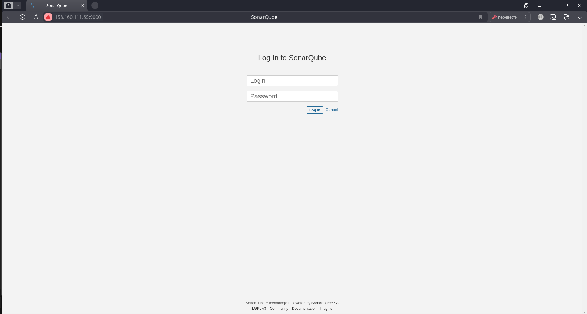

6. Зайдите под admin\admin, поменяйте пароль на свой.

Поменял штатный пароль на свой и вошел в систему:

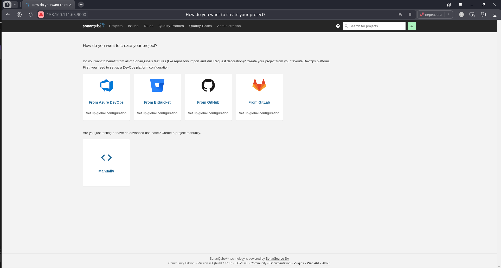

7. Проверьте готовность Nexus через [браузер](http://localhost:8081).

Проверил готовность Nexus через бразуер:

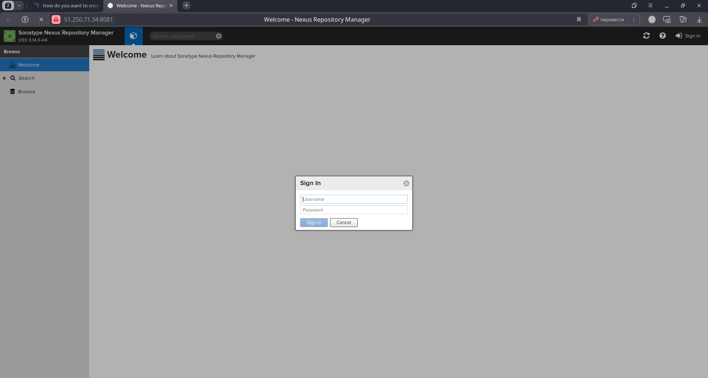

8. Подключитесь под admin\admin123, поменяйте пароль, сохраните анонимный доступ.

Подключился под admin\admin123, поменял пароль, сохранил анонимный доступ.


## Знакомоство с SonarQube

### Основная часть

1. Создайте новый проект, название произвольное.

Создал новый проект, назвал ProjectX и сгенерировал token.

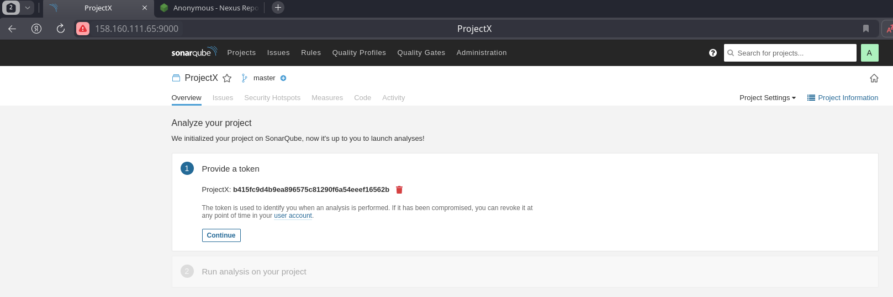

2. Скачайте пакет sonar-scanner, который вам предлагает скачать SonarQube.

Скачаваю пакет `sonar-scanner`. 

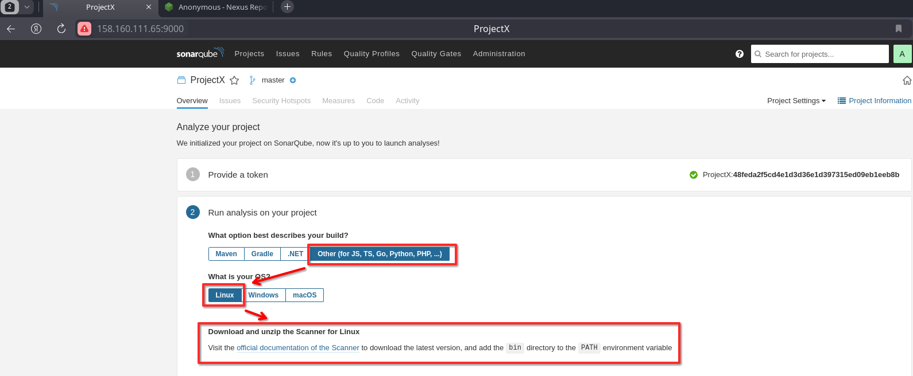

Распаковываю `sonar-scanner` в `/opt/sonat-scanner/`.

3. Сделайте так, чтобы binary был доступен через вызов в shell (или поменяйте переменную PATH, или любой другой, удобный вам способ).

Чтобы бинарник Sonar-scanner был доступен, добавляю его в переменную PATH.

```bash
╰─➤export PATH=$PATH:/opt/sonar-scanner/bin
```

4. Проверьте `sonar-scanner --version`.

Проверяю версию `sonar-scanner`

```bash
╰─➤sonar-scanner --version
INFO: Scanner configuration file: /opt/sonar-scanner/conf/sonar-scanner.properties
INFO: Project root configuration file: NONE
INFO: SonarScanner 5.0.1.3006
INFO: Java 17.0.7 Eclipse Adoptium (64-bit)
INFO: Linux 6.7.0-204.fsync.fc39.x86_64 amd64
```
Редактирую настройки сканера, указывая на удаленный хост с сервером SonarQube в облаке YC

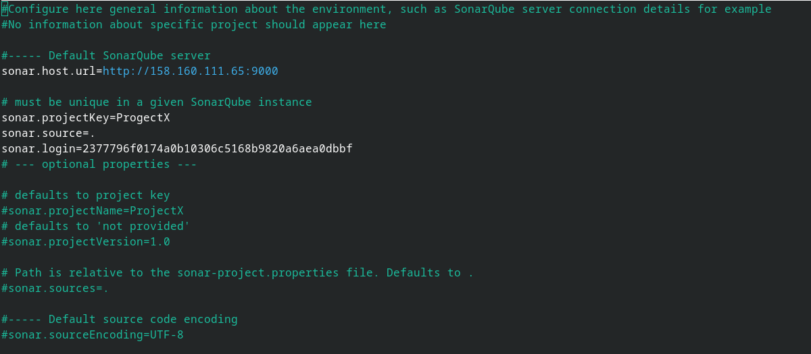

5. Запустите анализатор против кода из директории [example](./example) с дополнительным ключом `-Dsonar.coverage.exclusions=fail.py`.

Запускаю анализатор против кода 'sonar-scanner -Dsonar.coverage.exclusions=fail.py'

```bash
╰─➤sonar-scanner -Dsonar.coverage.exclusions=fail.py
INFO: Scanner configuration file: /opt/sonar-scanner/conf/sonar-scanner.properties
INFO: Project root configuration file: NONE
INFO: SonarScanner 5.0.1.3006
INFO: Java 17.0.7 Eclipse Adoptium (64-bit)
INFO: Linux 6.7.0-204.fsync.fc39.x86_64 amd64
INFO: User cache: /home/serg/.sonar/cache
INFO: Analyzing on SonarQube server 9.1.0
INFO: Default locale: "ru_RU", source code encoding: "UTF-8" (analysis is platform dependent)
INFO: Load global settings
INFO: Load global settings (done) | time=150ms
INFO: Server id: 9CFC3560-AY227qapiq9kpKw-juEd
INFO: User cache: /home/serg/.sonar/cache
INFO: Load/download plugins
INFO: Load plugins index
INFO: Load plugins index (done) | time=96ms
INFO: Load/download plugins (done) | time=10231ms
INFO: Process project properties
INFO: Process project properties (done) | time=1ms
INFO: Execute project builders
INFO: Execute project builders (done) | time=1ms
INFO: Project key: ProgectX
INFO: Base dir: /home/serg/DevOps-Netology/DevOps-35-Netology/devops-05-ci/ci-03-cicd/src/example
INFO: Working dir: /home/serg/DevOps-Netology/DevOps-35-Netology/devops-05-ci/ci-03-cicd/src/example/.scannerwork
INFO: Load project settings for component key: 'ProgectX'
INFO: Load quality profiles
INFO: Load quality profiles (done) | time=127ms
INFO: Load active rules
INFO: Load active rules (done) | time=2075ms
INFO: Indexing files...
INFO: Project configuration:
INFO:   Excluded sources for coverage: fail.py
INFO: 1 file indexed
INFO: 0 files ignored because of scm ignore settings
INFO: Quality profile for py: Sonar way
INFO: ------------- Run sensors on module ProgectX
INFO: Load metrics repository
INFO: Load metrics repository (done) | time=39ms
INFO: Sensor Python Sensor [python]
WARN: Your code is analyzed as compatible with python 2 and 3 by default. This will prevent the detection of issues specific to python 2 or python 3. You can get a more precise analysis by setting a python version in your configuration via the parameter "sonar.python.version"
INFO: Starting global symbols computation
INFO: 1 source file to be analyzed
INFO: Load project repositories
INFO: Load project repositories (done) | time=17ms
INFO: 1/1 source file has been analyzed
INFO: Starting rules execution
INFO: 1 source file to be analyzed
INFO: 1/1 source file has been analyzed
INFO: Sensor Python Sensor [python] (done) | time=563ms
INFO: Sensor Cobertura Sensor for Python coverage [python]
INFO: Sensor Cobertura Sensor for Python coverage [python] (done) | time=5ms
INFO: Sensor PythonXUnitSensor [python]
INFO: Sensor PythonXUnitSensor [python] (done) | time=1ms
INFO: Sensor CSS Rules [cssfamily]
INFO: No CSS, PHP, HTML or VueJS files are found in the project. CSS analysis is skipped.
INFO: Sensor CSS Rules [cssfamily] (done) | time=0ms
INFO: Sensor JaCoCo XML Report Importer [jacoco]
INFO: 'sonar.coverage.jacoco.xmlReportPaths' is not defined. Using default locations: target/site/jacoco/jacoco.xml,target/site/jacoco-it/jacoco.xml,build/reports/jacoco/test/jacocoTestReport.xml
INFO: No report imported, no coverage information will be imported by JaCoCo XML Report Importer
INFO: Sensor JaCoCo XML Report Importer [jacoco] (done) | time=2ms
INFO: Sensor C# Project Type Information [csharp]
INFO: Sensor C# Project Type Information [csharp] (done) | time=0ms
INFO: Sensor C# Analysis Log [csharp]
INFO: Sensor C# Analysis Log [csharp] (done) | time=8ms
INFO: Sensor C# Properties [csharp]
INFO: Sensor C# Properties [csharp] (done) | time=0ms
INFO: Sensor JavaXmlSensor [java]
INFO: Sensor JavaXmlSensor [java] (done) | time=1ms
INFO: Sensor HTML [web]
INFO: Sensor HTML [web] (done) | time=2ms
INFO: Sensor VB.NET Project Type Information [vbnet]
INFO: Sensor VB.NET Project Type Information [vbnet] (done) | time=0ms
INFO: Sensor VB.NET Analysis Log [vbnet]
INFO: Sensor VB.NET Analysis Log [vbnet] (done) | time=9ms
INFO: Sensor VB.NET Properties [vbnet]
INFO: Sensor VB.NET Properties [vbnet] (done) | time=0ms
INFO: ------------- Run sensors on project
INFO: Sensor Zero Coverage Sensor
INFO: Sensor Zero Coverage Sensor (done) | time=0ms
INFO: SCM Publisher SCM provider for this project is: git
INFO: SCM Publisher 1 source file to be analyzed
INFO: SCM Publisher 0/1 source files have been analyzed (done) | time=50ms
WARN: Missing blame information for the following files:
WARN:   * fail.py
WARN: This may lead to missing/broken features in SonarQube
INFO: CPD Executor Calculating CPD for 1 file
INFO: CPD Executor CPD calculation finished (done) | time=6ms
INFO: Analysis report generated in 76ms, dir size=103,3 kB
INFO: Analysis report compressed in 18ms, zip size=14,2 kB
INFO: Analysis report uploaded in 543ms
INFO: ANALYSIS SUCCESSFUL, you can browse http://158.160.111.65:9000/dashboard?id=ProgectX
INFO: Note that you will be able to access the updated dashboard once the server has processed the submitted analysis report
INFO: More about the report processing at http://158.160.111.65:9000/api/ce/task?id=AY238creiq9kpKw-jzJ0
INFO: Analysis total time: 5.143 s
INFO: ------------------------------------------------------------------------
INFO: EXECUTION SUCCESS
INFO: ------------------------------------------------------------------------
INFO: Total time: 16.319s
INFO: Final Memory: 11M/80M
INFO: ------------------------------------------------------------------------
```

6. Посмотрите результат в интерфейсе.

После анализа получаю ссылку на дашборд с результатом анализа:

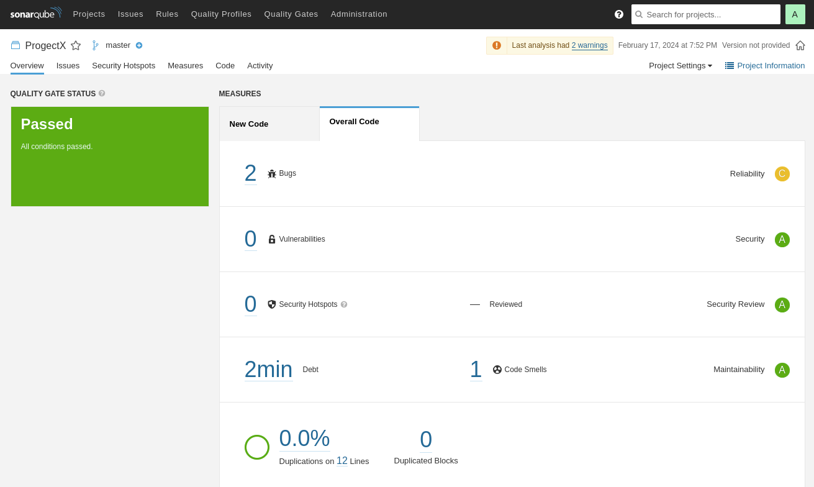

Смотрю результат в интерфейсе, вижу, что есть 2 бага и 1 Code Smells:

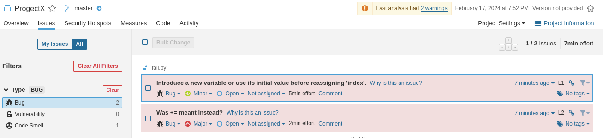

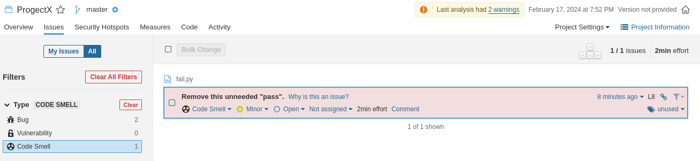

7. Исправьте ошибки, которые он выявил, включая warnings.

Исправляю ошибки.

8. Запустите анализатор повторно — проверьте, что QG пройдены успешно.

Заново запускаю анализатор, вижу, что ошибок и предупреждений нет.

```bash
╰─➤sonar-scanner -Dsonar.coverage.exclusions=fail.py
INFO: Scanner configuration file: /opt/sonar-scanner/conf/sonar-scanner.properties
INFO: Project root configuration file: NONE
INFO: SonarScanner 5.0.1.3006
INFO: Java 17.0.7 Eclipse Adoptium (64-bit)
INFO: Linux 6.7.0-204.fsync.fc39.x86_64 amd64
INFO: User cache: /home/serg/.sonar/cache
INFO: Analyzing on SonarQube server 9.1.0
INFO: Default locale: "ru_RU", source code encoding: "UTF-8" (analysis is platform dependent)
INFO: Load global settings
INFO: Load global settings (done) | time=101ms
INFO: Server id: 9CFC3560-AY227qapiq9kpKw-juEd
INFO: User cache: /home/serg/.sonar/cache
INFO: Load/download plugins
INFO: Load plugins index
INFO: Load plugins index (done) | time=48ms
INFO: Load/download plugins (done) | time=117ms
INFO: Process project properties
INFO: Process project properties (done) | time=1ms
INFO: Execute project builders
INFO: Execute project builders (done) | time=1ms
INFO: Project key: ProgectX
INFO: Base dir: /home/serg/DevOps-Netology/DevOps-35-Netology/devops-05-ci/ci-03-cicd/src/example
INFO: Working dir: /home/serg/DevOps-Netology/DevOps-35-Netology/devops-05-ci/ci-03-cicd/src/example/.scannerwork
INFO: Load project settings for component key: 'ProgectX'
INFO: Load project settings for component key: 'ProgectX' (done) | time=27ms
INFO: Load quality profiles
INFO: Load quality profiles (done) | time=143ms
INFO: Load active rules
INFO: Load active rules (done) | time=3216ms
INFO: Indexing files...
INFO: Project configuration:
INFO:   Excluded sources for coverage: fail.py
INFO: 1 file indexed
INFO: 0 files ignored because of scm ignore settings
INFO: Quality profile for py: Sonar way
INFO: ------------- Run sensors on module ProgectX
INFO: Load metrics repository
INFO: Load metrics repository (done) | time=45ms
INFO: Sensor Python Sensor [python]
WARN: Your code is analyzed as compatible with python 2 and 3 by default. This will prevent the detection of issues specific to python 2 or python 3. You can get a more precise analysis by setting a python version in your configuration via the parameter "sonar.python.version"
INFO: Starting global symbols computation
INFO: 1 source file to be analyzed
INFO: Load project repositories
INFO: Load project repositories (done) | time=36ms
INFO: 1/1 source file has been analyzed
INFO: Starting rules execution
INFO: 1 source file to be analyzed
INFO: 1/1 source file has been analyzed
INFO: Sensor Python Sensor [python] (done) | time=608ms
INFO: Sensor Cobertura Sensor for Python coverage [python]
INFO: Sensor Cobertura Sensor for Python coverage [python] (done) | time=7ms
INFO: Sensor PythonXUnitSensor [python]
INFO: Sensor PythonXUnitSensor [python] (done) | time=0ms
INFO: Sensor CSS Rules [cssfamily]
INFO: No CSS, PHP, HTML or VueJS files are found in the project. CSS analysis is skipped.
INFO: Sensor CSS Rules [cssfamily] (done) | time=1ms
INFO: Sensor JaCoCo XML Report Importer [jacoco]
INFO: 'sonar.coverage.jacoco.xmlReportPaths' is not defined. Using default locations: target/site/jacoco/jacoco.xml,target/site/jacoco-it/jacoco.xml,build/reports/jacoco/test/jacocoTestReport.xml
INFO: No report imported, no coverage information will be imported by JaCoCo XML Report Importer
INFO: Sensor JaCoCo XML Report Importer [jacoco] (done) | time=2ms
INFO: Sensor C# Project Type Information [csharp]
INFO: Sensor C# Project Type Information [csharp] (done) | time=1ms
INFO: Sensor C# Analysis Log [csharp]
INFO: Sensor C# Analysis Log [csharp] (done) | time=20ms
INFO: Sensor C# Properties [csharp]
INFO: Sensor C# Properties [csharp] (done) | time=0ms
INFO: Sensor JavaXmlSensor [java]
INFO: Sensor JavaXmlSensor [java] (done) | time=1ms
INFO: Sensor HTML [web]
INFO: Sensor HTML [web] (done) | time=3ms
INFO: Sensor VB.NET Project Type Information [vbnet]
INFO: Sensor VB.NET Project Type Information [vbnet] (done) | time=1ms
INFO: Sensor VB.NET Analysis Log [vbnet]
INFO: Sensor VB.NET Analysis Log [vbnet] (done) | time=11ms
INFO: Sensor VB.NET Properties [vbnet]
INFO: Sensor VB.NET Properties [vbnet] (done) | time=0ms
INFO: ------------- Run sensors on project
INFO: Sensor Zero Coverage Sensor
INFO: Sensor Zero Coverage Sensor (done) | time=0ms
INFO: SCM Publisher SCM provider for this project is: git
INFO: SCM Publisher 1 source file to be analyzed
INFO: SCM Publisher 0/1 source files have been analyzed (done) | time=44ms
WARN: Missing blame information for the following files:
WARN:   * fail.py
WARN: This may lead to missing/broken features in SonarQube
INFO: CPD Executor Calculating CPD for 1 file
INFO: CPD Executor CPD calculation finished (done) | time=5ms
INFO: Analysis report generated in 66ms, dir size=103,3 kB
INFO: Analysis report compressed in 14ms, zip size=14,2 kB
INFO: Analysis report uploaded in 62ms
INFO: ANALYSIS SUCCESSFUL, you can browse http://158.160.111.65:9000/dashboard?id=ProgectX
INFO: Note that you will be able to access the updated dashboard once the server has processed the submitted analysis report
INFO: More about the report processing at http://158.160.111.65:9000/api/ce/task?id=AY24EsNfiq9kpKw-jzKY
INFO: Analysis total time: 5.818 s
INFO: ------------------------------------------------------------------------
INFO: EXECUTION SUCCESS
INFO: ------------------------------------------------------------------------
INFO: Total time: 6.726s
INFO: Final Memory: 11M/68M
INFO: ------------------------------------------------------------------------
```

9. Сделайте скриншот успешного прохождения анализа, приложите к решению ДЗ.

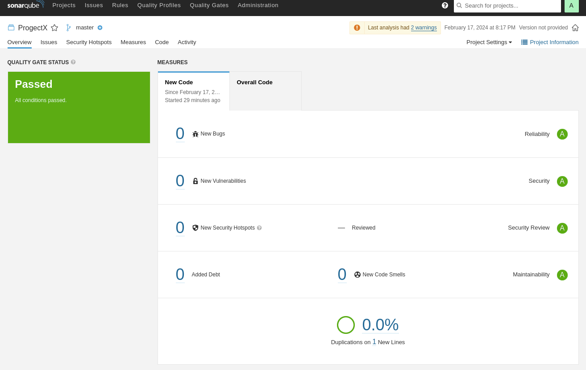

## Знакомство с Nexus

### Основная часть

1. В репозиторий `maven-public` загрузите артефакт с GAV-параметрами:

 *    groupId: netology;
 *    artifactId: java;
 *    version: 8_282;
 *    classifier: distrib;
 *    type: tar.gz.

В репозиторий maven-public загружаю артефакт с указанными параметрами:

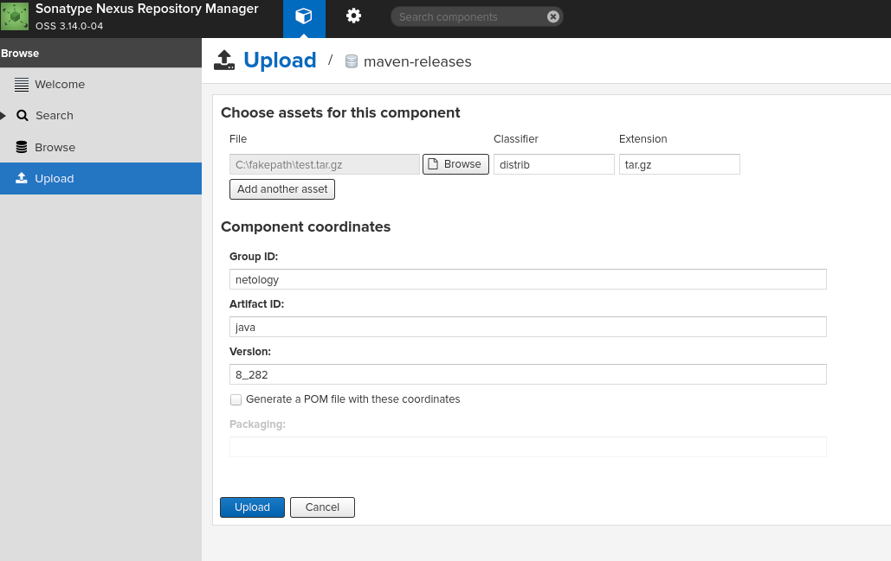

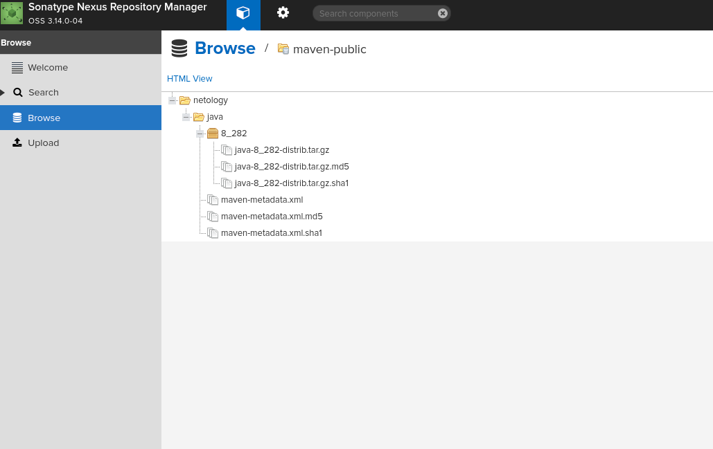

2. В него же загрузите такой же артефакт, но с version: 8_102.

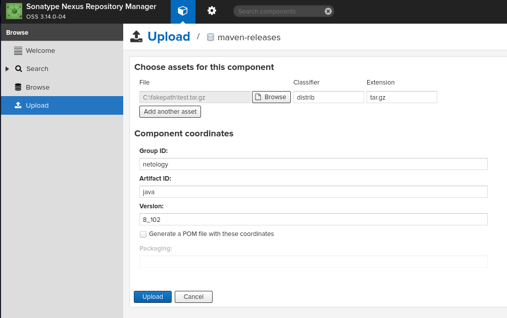

3. Проверьте, что все файлы загрузились успешно.

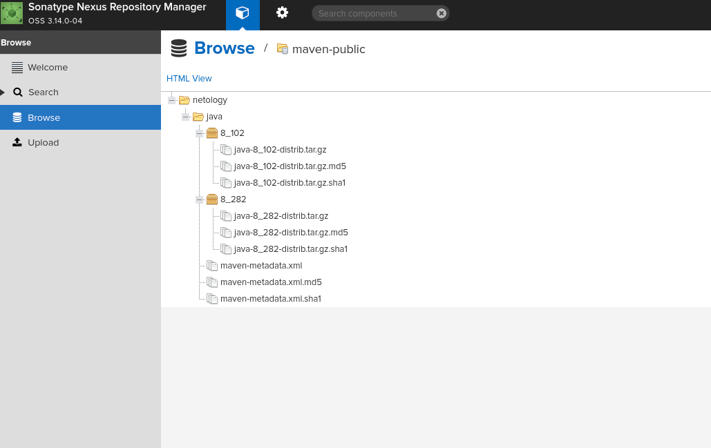

4. В ответе пришлите файл `maven-metadata.xml` для этого артефекта.

[Ссылка на maven-metadata.xml](src/example/maven-metadata.xml)

### Знакомство с Maven

### Подготовка к выполнению

1. Скачайте дистрибутив с [maven](https://maven.apache.org/download.cgi).

Скачаваю по ссылке `apache-maven-3.9.6-bin.tar.gz`.

2. Разархивируйте, сделайте так, чтобы binary был доступен через вызов в shell (или поменяйте переменную PATH, или любой другой, удобный вам способ).

Распаковываю `apache-maven-3.9.6-bin.tar.gz` в `/opt/apache-maven/`

Добавил путь к бинарнику в переменную PATH.

```bash
╰─➤export PATH=$PATH:/opt/apache-maven/bin
```

Проверяем все варианты JAVA-релизов на management-хосте .

```bash
╰─➤java -version
openjdk version "17.0.9" 2023-10-17
OpenJDK Runtime Environment (Red_Hat-17.0.9.0.9-4) (build 17.0.9+9)
OpenJDK 64-Bit Server VM (Red_Hat-17.0.9.0.9-4) (build 17.0.9+9, mixed mode, sharing)
```

```bash
╰─➤alternatives --list | grep java
java                    auto    /usr/lib/jvm/java-17-openjdk-17.0.9.0.9-3.fc39.x86_64/bin/java
jre_openjdk             auto    /usr/lib/jvm/java-17-openjdk-17.0.9.0.9-3.fc39.x86_64
jre_17                  auto    /usr/lib/jvm/java-17-openjdk-17.0.9.0.9-3.fc39.x86_64
```

```bash
╰─➤export JAVA_HOME=/usr/lib/jvm/java-17-openjdk-17.0.9.0.9-3.fc39.x86_64
```

```bash
╰─➤echo $JAVA_HOME
/usr/lib/jvm/java-17-openjdk-17.0.9.0.9-3.fc39.x86_64
```

3. Удалите из `apache-maven-<version>/conf/settings.xml` упоминание о правиле, отвергающем HTTP- соединение — раздел mirrors —> id: my-repository-http-unblocker.

Удаляем блок:

```
    <mirror>
      <id>maven-default-http-blocker</id>
      <mirrorOf>external:http:*</mirrorOf>
      <name>Pseudo repository to mirror external repositories initially using HTTP.</name>
      <url>http://0.0.0.0/</url>
      <blocked>true</blocked>
    </mirror>

```

4. Проверьте `mvn --version`.

Проверяю 'mvn --version'

```bash
╰─➤mvn --version
Apache Maven 3.9.6 (bc0240f3c744dd6b6ec2920b3cd08dcc295161ae)
Maven home: /opt/apache-maven
Java version: 17.0.9, vendor: Red Hat, Inc., runtime: /usr/lib/jvm/java-17-openjdk-17.0.9.0.9-3.fc39.x86_64
Default locale: ru_RU, platform encoding: UTF-8
OS name: "linux", version: "6.7.0-204.fsync.fc39.x86_64", arch: "amd64", family: "unix"
```

5. Заберите директорию [mvn](./mvn) с pom.

### Основная часть

1. Поменяйте в `pom.xml` блок с зависимостями под ваш артефакт из первого пункта задания для Nexus (java с версией 8_282).
2. Запустите команду `mvn package` в директории с `pom.xml`, ожидайте успешного окончания.

```bash
╰─➤mvn package
[INFO] Scanning for projects...
[INFO] 
[INFO] ---------------------------< netology:java >----------------------------
[INFO] Building java 8_282
[INFO]   from pom.xml
[INFO] --------------------------------[ jar ]---------------------------------
Downloading from central: https://repo.maven.apache.org/maven2/org/apache/maven/plugins/maven-resources-plugin/3.3.1/maven-resources-plugin-3.3.1.pom
Downloaded from central: https://repo.maven.apache.org/maven2/org/apache/maven/plugins/maven-resources-plugin/3.3.1/maven-resources-plugin-3.3.1.pom (8.2 kB at 15 kB/s)
Downloading from central: https://repo.maven.apache.org/maven2/org/apache/maven/plugins/maven-plugins/39/maven-plugins-39.pom
Downloaded from central: https://repo.maven.apache.org/maven2/org/apache/maven/plugins/maven-plugins/39/maven-plugins-39.pom (8.1 kB at 137 kB/s)
Downloading from central: https://repo.maven.apache.org/maven2/org/apache/maven/maven-parent/39/maven-parent-39.pom
Downloaded from central: https://repo.maven.apache.org/maven2/org/apache/maven/maven-parent/39/maven-parent-39.pom (48 kB at 448 kB/s)
Downloading from central: https://repo.maven.apache.org/maven2/org/apache/apache/29/apache-29.pom
Downloaded from central: https://repo.maven.apache.org/maven2/org/apache/apache/29/apache-29.pom (21 kB at 377 kB/s)
Downloading from central: https://repo.maven.apache.org/maven2/org/apache/maven/plugins/maven-resources-plugin/3.3.1/maven-resources-plugin-3.3.1.jar
Downloaded from central: https://repo.maven.apache.org/maven2/org/apache/maven/plugins/maven-resources-plugin/3.3.1/maven-resources-plugin-3.3.1.jar (31 kB at 436 kB/s)
Downloading from central: https://repo.maven.apache.org/maven2/org/apache/maven/plugins/maven-compiler-plugin/3.11.0/maven-compiler-plugin-3.11.0.pom
Downloaded from central: https://repo.maven.apache.org/maven2/org/apache/maven/plugins/maven-compiler-plugin/3.11.0/maven-compiler-plugin-3.11.0.pom (9.8 kB at 175 kB/s)
Downloading from central: https://repo.maven.apache.org/maven2/org/apache/maven/plugins/maven-compiler-plugin/3.11.0/maven-compiler-plugin-3.11.0.jar
Downloaded from central: https://repo.maven.apache.org/maven2/org/apache/maven/plugins/maven-compiler-plugin/3.11.0/maven-compiler-plugin-3.11.0.jar (66 kB at 692 kB/s)
Downloading from central: https://repo.maven.apache.org/maven2/org/apache/maven/plugins/maven-surefire-plugin/3.2.2/maven-surefire-plugin-3.2.2.pom
Downloaded from central: https://repo.maven.apache.org/maven2/org/apache/maven/plugins/maven-surefire-plugin/3.2.2/maven-surefire-plugin-3.2.2.pom (5.1 kB at 103 kB/s)
Downloading from central: https://repo.maven.apache.org/maven2/org/apache/maven/surefire/surefire/3.2.2/surefire-3.2.2.pom
Downloaded from central: https://repo.maven.apache.org/maven2/org/apache/maven/surefire/surefire/3.2.2/surefire-3.2.2.pom (21 kB at 403 kB/s)
Downloading from central: https://repo.maven.apache.org/maven2/org/apache/maven/maven-parent/40/maven-parent-40.pom
Downloaded from central: https://repo.maven.apache.org/maven2/org/apache/maven/maven-parent/40/maven-parent-40.pom (49 kB at 556 kB/s)
Downloading from central: https://repo.maven.apache.org/maven2/org/apache/apache/30/apache-30.pom
Downloaded from central: https://repo.maven.apache.org/maven2/org/apache/apache/30/apache-30.pom (23 kB at 415 kB/s)
Downloading from central: https://repo.maven.apache.org/maven2/org/junit/junit-bom/5.9.3/junit-bom-5.9.3.pom
Downloaded from central: https://repo.maven.apache.org/maven2/org/junit/junit-bom/5.9.3/junit-bom-5.9.3.pom (5.6 kB at 101 kB/s)
Downloading from central: https://repo.maven.apache.org/maven2/org/apache/maven/plugins/maven-surefire-plugin/3.2.2/maven-surefire-plugin-3.2.2.jar
Downloaded from central: https://repo.maven.apache.org/maven2/org/apache/maven/plugins/maven-surefire-plugin/3.2.2/maven-surefire-plugin-3.2.2.jar (45 kB at 809 kB/s)
Downloading from central: https://repo.maven.apache.org/maven2/org/apache/maven/plugins/maven-jar-plugin/3.3.0/maven-jar-plugin-3.3.0.pom
Downloaded from central: https://repo.maven.apache.org/maven2/org/apache/maven/plugins/maven-jar-plugin/3.3.0/maven-jar-plugin-3.3.0.pom (6.8 kB at 119 kB/s)
Downloading from central: https://repo.maven.apache.org/maven2/org/apache/maven/plugins/maven-plugins/37/maven-plugins-37.pom
Downloaded from central: https://repo.maven.apache.org/maven2/org/apache/maven/plugins/maven-plugins/37/maven-plugins-37.pom (9.9 kB at 190 kB/s)
Downloading from central: https://repo.maven.apache.org/maven2/org/apache/maven/maven-parent/37/maven-parent-37.pom
Downloaded from central: https://repo.maven.apache.org/maven2/org/apache/maven/maven-parent/37/maven-parent-37.pom (46 kB at 787 kB/s)
Downloading from central: https://repo.maven.apache.org/maven2/org/apache/apache/27/apache-27.pom
Downloaded from central: https://repo.maven.apache.org/maven2/org/apache/apache/27/apache-27.pom (20 kB at 345 kB/s)
Downloading from central: https://repo.maven.apache.org/maven2/org/apache/maven/plugins/maven-jar-plugin/3.3.0/maven-jar-plugin-3.3.0.jar
Downloaded from central: https://repo.maven.apache.org/maven2/org/apache/maven/plugins/maven-jar-plugin/3.3.0/maven-jar-plugin-3.3.0.jar (27 kB at 434 kB/s)
[INFO] 
[INFO] --- resources:3.3.1:resources (default-resources) @ java ---
Downloading from central: https://repo.maven.apache.org/maven2/org/codehaus/plexus/plexus-interpolation/1.26/plexus-interpolation-1.26.pom
Downloaded from central: https://repo.maven.apache.org/maven2/org/codehaus/plexus/plexus-interpolation/1.26/plexus-interpolation-1.26.pom (2.7 kB at 55 kB/s)
Downloading from central: https://repo.maven.apache.org/maven2/org/codehaus/plexus/plexus/5.1/plexus-5.1.pom
Downloaded from central: https://repo.maven.apache.org/maven2/org/codehaus/plexus/plexus/5.1/plexus-5.1.pom (23 kB at 388 kB/s)
Downloading from central: https://repo.maven.apache.org/maven2/org/codehaus/plexus/plexus-utils/3.5.1/plexus-utils-3.5.1.pom
Downloaded from central: https://repo.maven.apache.org/maven2/org/codehaus/plexus/plexus-utils/3.5.1/plexus-utils-3.5.1.pom (8.8 kB at 172 kB/s)
Downloading from central: https://repo.maven.apache.org/maven2/org/codehaus/plexus/plexus/10/plexus-10.pom
Downloaded from central: https://repo.maven.apache.org/maven2/org/codehaus/plexus/plexus/10/plexus-10.pom (25 kB at 446 kB/s)
Downloading from central: https://repo.maven.apache.org/maven2/org/apache/maven/shared/maven-filtering/3.3.1/maven-filtering-3.3.1.pom
Downloaded from central: https://repo.maven.apache.org/maven2/org/apache/maven/shared/maven-filtering/3.3.1/maven-filtering-3.3.1.pom (6.0 kB at 116 kB/s)
Downloading from central: https://repo.maven.apache.org/maven2/org/apache/maven/shared/maven-shared-components/39/maven-shared-components-39.pom
Downloaded from central: https://repo.maven.apache.org/maven2/org/apache/maven/shared/maven-shared-components/39/maven-shared-components-39.pom (3.2 kB at 63 kB/s)
Downloading from central: https://repo.maven.apache.org/maven2/javax/inject/javax.inject/1/javax.inject-1.pom
Downloaded from central: https://repo.maven.apache.org/maven2/javax/inject/javax.inject/1/javax.inject-1.pom (612 B at 12 kB/s)
Downloading from central: https://repo.maven.apache.org/maven2/org/slf4j/slf4j-api/1.7.36/slf4j-api-1.7.36.pom
Downloaded from central: https://repo.maven.apache.org/maven2/org/slf4j/slf4j-api/1.7.36/slf4j-api-1.7.36.pom (2.7 kB at 53 kB/s)
Downloading from central: https://repo.maven.apache.org/maven2/org/slf4j/slf4j-parent/1.7.36/slf4j-parent-1.7.36.pom
Downloaded from central: https://repo.maven.apache.org/maven2/org/slf4j/slf4j-parent/1.7.36/slf4j-parent-1.7.36.pom (14 kB at 174 kB/s)
Downloading from central: https://repo.maven.apache.org/maven2/org/sonatype/plexus/plexus-build-api/0.0.7/plexus-build-api-0.0.7.pom
Downloaded from central: https://repo.maven.apache.org/maven2/org/sonatype/plexus/plexus-build-api/0.0.7/plexus-build-api-0.0.7.pom (3.2 kB at 60 kB/s)
Downloading from central: https://repo.maven.apache.org/maven2/org/sonatype/spice/spice-parent/15/spice-parent-15.pom
Downloaded from central: https://repo.maven.apache.org/maven2/org/sonatype/spice/spice-parent/15/spice-parent-15.pom (8.4 kB at 149 kB/s)
Downloading from central: https://repo.maven.apache.org/maven2/org/sonatype/forge/forge-parent/5/forge-parent-5.pom
Downloaded from central: https://repo.maven.apache.org/maven2/org/sonatype/forge/forge-parent/5/forge-parent-5.pom (8.4 kB at 152 kB/s)
Downloading from central: https://repo.maven.apache.org/maven2/org/codehaus/plexus/plexus-utils/3.5.0/plexus-utils-3.5.0.pom
Downloaded from central: https://repo.maven.apache.org/maven2/org/codehaus/plexus/plexus-utils/3.5.0/plexus-utils-3.5.0.pom (8.0 kB at 167 kB/s)
Downloading from central: https://repo.maven.apache.org/maven2/commons-io/commons-io/2.11.0/commons-io-2.11.0.pom
Downloaded from central: https://repo.maven.apache.org/maven2/commons-io/commons-io/2.11.0/commons-io-2.11.0.pom (20 kB at 379 kB/s)
Downloading from central: https://repo.maven.apache.org/maven2/org/apache/commons/commons-parent/52/commons-parent-52.pom
Downloaded from central: https://repo.maven.apache.org/maven2/org/apache/commons/commons-parent/52/commons-parent-52.pom (79 kB at 1.3 MB/s)
Downloading from central: https://repo.maven.apache.org/maven2/org/apache/apache/23/apache-23.pom
Downloaded from central: https://repo.maven.apache.org/maven2/org/apache/apache/23/apache-23.pom (18 kB at 354 kB/s)
Downloading from central: https://repo.maven.apache.org/maven2/org/junit/junit-bom/5.7.2/junit-bom-5.7.2.pom
Downloaded from central: https://repo.maven.apache.org/maven2/org/junit/junit-bom/5.7.2/junit-bom-5.7.2.pom (5.1 kB at 108 kB/s)
Downloading from central: https://repo.maven.apache.org/maven2/org/apache/commons/commons-lang3/3.12.0/commons-lang3-3.12.0.pom
Downloaded from central: https://repo.maven.apache.org/maven2/org/apache/commons/commons-lang3/3.12.0/commons-lang3-3.12.0.pom (31 kB at 613 kB/s)
Downloading from central: https://repo.maven.apache.org/maven2/org/junit/junit-bom/5.7.1/junit-bom-5.7.1.pom
Downloaded from central: https://repo.maven.apache.org/maven2/org/junit/junit-bom/5.7.1/junit-bom-5.7.1.pom (5.1 kB at 113 kB/s)
Downloading from central: https://repo.maven.apache.org/maven2/org/codehaus/plexus/plexus-interpolation/1.26/plexus-interpolation-1.26.jar
Downloaded from central: https://repo.maven.apache.org/maven2/org/codehaus/plexus/plexus-interpolation/1.26/plexus-interpolation-1.26.jar (85 kB at 1.4 MB/s)
Downloading from central: https://repo.maven.apache.org/maven2/org/codehaus/plexus/plexus-utils/3.5.1/plexus-utils-3.5.1.jar
Downloading from central: https://repo.maven.apache.org/maven2/org/apache/maven/shared/maven-filtering/3.3.1/maven-filtering-3.3.1.jar
Downloading from central: https://repo.maven.apache.org/maven2/javax/inject/javax.inject/1/javax.inject-1.jar
Downloading from central: https://repo.maven.apache.org/maven2/org/slf4j/slf4j-api/1.7.36/slf4j-api-1.7.36.jar
Downloading from central: https://repo.maven.apache.org/maven2/org/sonatype/plexus/plexus-build-api/0.0.7/plexus-build-api-0.0.7.jar
Downloaded from central: https://repo.maven.apache.org/maven2/org/codehaus/plexus/plexus-utils/3.5.1/plexus-utils-3.5.1.jar (269 kB at 1.9 MB/s)
Downloading from central: https://repo.maven.apache.org/maven2/commons-io/commons-io/2.11.0/commons-io-2.11.0.jar
Downloaded from central: https://repo.maven.apache.org/maven2/javax/inject/javax.inject/1/javax.inject-1.jar (2.5 kB at 11 kB/s)
Downloading from central: https://repo.maven.apache.org/maven2/org/apache/commons/commons-lang3/3.12.0/commons-lang3-3.12.0.jar
Downloaded from central: https://repo.maven.apache.org/maven2/org/sonatype/plexus/plexus-build-api/0.0.7/plexus-build-api-0.0.7.jar (8.5 kB at 36 kB/s)
Downloaded from central: https://repo.maven.apache.org/maven2/org/slf4j/slf4j-api/1.7.36/slf4j-api-1.7.36.jar (41 kB at 147 kB/s)
Downloaded from central: https://repo.maven.apache.org/maven2/commons-io/commons-io/2.11.0/commons-io-2.11.0.jar (327 kB at 1.2 MB/s)
Downloaded from central: https://repo.maven.apache.org/maven2/org/apache/maven/shared/maven-filtering/3.3.1/maven-filtering-3.3.1.jar (55 kB at 171 kB/s)
Downloaded from central: https://repo.maven.apache.org/maven2/org/apache/commons/commons-lang3/3.12.0/commons-lang3-3.12.0.jar (587 kB at 1.3 MB/s)
[WARNING] Using platform encoding (UTF-8 actually) to copy filtered resources, i.e. build is platform dependent!
[INFO] skip non existing resourceDirectory /home/serg/DevOps-Netology/DevOps-35-Netology/devops-05-ci/ci-03-cicd/src/mvn/src/main/resources
[INFO] 
[INFO] --- compiler:3.11.0:compile (default-compile) @ java ---
Downloading from central: https://repo.maven.apache.org/maven2/org/apache/maven/shared/maven-shared-utils/3.3.4/maven-shared-utils-3.3.4.pom
Downloaded from central: https://repo.maven.apache.org/maven2/org/apache/maven/shared/maven-shared-utils/3.3.4/maven-shared-utils-3.3.4.pom (5.8 kB at 124 kB/s)
Downloading from central: https://repo.maven.apache.org/maven2/org/apache/maven/shared/maven-shared-components/34/maven-shared-components-34.pom
Downloaded from central: https://repo.maven.apache.org/maven2/org/apache/maven/shared/maven-shared-components/34/maven-shared-components-34.pom (5.1 kB at 94 kB/s)
Downloading from central: https://repo.maven.apache.org/maven2/org/apache/maven/maven-parent/34/maven-parent-34.pom
Downloaded from central: https://repo.maven.apache.org/maven2/org/apache/maven/maven-parent/34/maven-parent-34.pom (43 kB at 892 kB/s)
Downloading from central: https://repo.maven.apache.org/maven2/commons-io/commons-io/2.6/commons-io-2.6.pom
Downloaded from central: https://repo.maven.apache.org/maven2/commons-io/commons-io/2.6/commons-io-2.6.pom (14 kB at 303 kB/s)
Downloading from central: https://repo.maven.apache.org/maven2/org/apache/commons/commons-parent/42/commons-parent-42.pom
Downloaded from central: https://repo.maven.apache.org/maven2/org/apache/commons/commons-parent/42/commons-parent-42.pom (68 kB at 1.3 MB/s)
Downloading from central: https://repo.maven.apache.org/maven2/org/apache/apache/18/apache-18.pom
Downloaded from central: https://repo.maven.apache.org/maven2/org/apache/apache/18/apache-18.pom (16 kB at 313 kB/s)
Downloading from central: https://repo.maven.apache.org/maven2/org/apache/maven/shared/maven-shared-incremental/1.1/maven-shared-incremental-1.1.pom
Downloaded from central: https://repo.maven.apache.org/maven2/org/apache/maven/shared/maven-shared-incremental/1.1/maven-shared-incremental-1.1.pom (4.7 kB at 95 kB/s)
Downloading from central: https://repo.maven.apache.org/maven2/org/apache/maven/shared/maven-shared-components/19/maven-shared-components-19.pom
Downloaded from central: https://repo.maven.apache.org/maven2/org/apache/maven/shared/maven-shared-components/19/maven-shared-components-19.pom (6.4 kB at 88 kB/s)
Downloading from central: https://repo.maven.apache.org/maven2/org/apache/maven/maven-parent/23/maven-parent-23.pom
Downloaded from central: https://repo.maven.apache.org/maven2/org/apache/maven/maven-parent/23/maven-parent-23.pom (33 kB at 526 kB/s)
Downloading from central: https://repo.maven.apache.org/maven2/org/apache/apache/13/apache-13.pom
Downloaded from central: https://repo.maven.apache.org/maven2/org/apache/apache/13/apache-13.pom (14 kB at 233 kB/s)
Downloading from central: https://repo.maven.apache.org/maven2/org/codehaus/plexus/plexus-component-annotations/1.5.5/plexus-component-annotations-1.5.5.pom
Downloaded from central: https://repo.maven.apache.org/maven2/org/codehaus/plexus/plexus-component-annotations/1.5.5/plexus-component-annotations-1.5.5.pom (815 B at 16 kB/s)
Downloading from central: https://repo.maven.apache.org/maven2/org/codehaus/plexus/plexus-containers/1.5.5/plexus-containers-1.5.5.pom
Downloaded from central: https://repo.maven.apache.org/maven2/org/codehaus/plexus/plexus-containers/1.5.5/plexus-containers-1.5.5.pom (4.2 kB at 96 kB/s)
Downloading from central: https://repo.maven.apache.org/maven2/org/codehaus/plexus/plexus/2.0.7/plexus-2.0.7.pom
Downloaded from central: https://repo.maven.apache.org/maven2/org/codehaus/plexus/plexus/2.0.7/plexus-2.0.7.pom (17 kB at 368 kB/s)
Downloading from central: https://repo.maven.apache.org/maven2/org/codehaus/plexus/plexus-java/1.1.2/plexus-java-1.1.2.pom
Downloaded from central: https://repo.maven.apache.org/maven2/org/codehaus/plexus/plexus-java/1.1.2/plexus-java-1.1.2.pom (5.0 kB at 108 kB/s)
Downloading from central: https://repo.maven.apache.org/maven2/org/codehaus/plexus/plexus-languages/1.1.2/plexus-languages-1.1.2.pom
Downloaded from central: https://repo.maven.apache.org/maven2/org/codehaus/plexus/plexus-languages/1.1.2/plexus-languages-1.1.2.pom (4.1 kB at 85 kB/s)
Downloading from central: https://repo.maven.apache.org/maven2/org/ow2/asm/asm/9.4/asm-9.4.pom
Downloaded from central: https://repo.maven.apache.org/maven2/org/ow2/asm/asm/9.4/asm-9.4.pom (2.4 kB at 48 kB/s)
Downloading from central: https://repo.maven.apache.org/maven2/org/ow2/ow2/1.5.1/ow2-1.5.1.pom
Downloaded from central: https://repo.maven.apache.org/maven2/org/ow2/ow2/1.5.1/ow2-1.5.1.pom (11 kB at 134 kB/s)
Downloading from central: https://repo.maven.apache.org/maven2/com/thoughtworks/qdox/qdox/2.0.3/qdox-2.0.3.pom
Downloaded from central: https://repo.maven.apache.org/maven2/com/thoughtworks/qdox/qdox/2.0.3/qdox-2.0.3.pom (17 kB at 359 kB/s)
Downloading from central: https://repo.maven.apache.org/maven2/org/sonatype/oss/oss-parent/9/oss-parent-9.pom
Downloaded from central: https://repo.maven.apache.org/maven2/org/sonatype/oss/oss-parent/9/oss-parent-9.pom (6.6 kB at 137 kB/s)
Downloading from central: https://repo.maven.apache.org/maven2/org/codehaus/plexus/plexus-compiler-api/2.13.0/plexus-compiler-api-2.13.0.pom
Downloaded from central: https://repo.maven.apache.org/maven2/org/codehaus/plexus/plexus-compiler-api/2.13.0/plexus-compiler-api-2.13.0.pom (1.1 kB at 22 kB/s)
Downloading from central: https://repo.maven.apache.org/maven2/org/codehaus/plexus/plexus-compiler/2.13.0/plexus-compiler-2.13.0.pom
Downloaded from central: https://repo.maven.apache.org/maven2/org/codehaus/plexus/plexus-compiler/2.13.0/plexus-compiler-2.13.0.pom (8.4 kB at 168 kB/s)
Downloading from central: https://repo.maven.apache.org/maven2/org/codehaus/plexus/plexus-components/10.0/plexus-components-10.0.pom
Downloaded from central: https://repo.maven.apache.org/maven2/org/codehaus/plexus/plexus-components/10.0/plexus-components-10.0.pom (2.7 kB at 56 kB/s)
Downloading from central: https://repo.maven.apache.org/maven2/org/junit/junit-bom/5.9.1/junit-bom-5.9.1.pom
Downloaded from central: https://repo.maven.apache.org/maven2/org/junit/junit-bom/5.9.1/junit-bom-5.9.1.pom (5.6 kB at 125 kB/s)
Downloading from central: https://repo.maven.apache.org/maven2/org/codehaus/plexus/plexus-compiler-manager/2.13.0/plexus-compiler-manager-2.13.0.pom
Downloaded from central: https://repo.maven.apache.org/maven2/org/codehaus/plexus/plexus-compiler-manager/2.13.0/plexus-compiler-manager-2.13.0.pom (1.1 kB at 25 kB/s)
Downloading from central: https://repo.maven.apache.org/maven2/org/codehaus/plexus/plexus-component-annotations/2.1.1/plexus-component-annotations-2.1.1.pom
Downloaded from central: https://repo.maven.apache.org/maven2/org/codehaus/plexus/plexus-component-annotations/2.1.1/plexus-component-annotations-2.1.1.pom (770 B at 16 kB/s)
Downloading from central: https://repo.maven.apache.org/maven2/org/codehaus/plexus/plexus-containers/2.1.1/plexus-containers-2.1.1.pom
Downloaded from central: https://repo.maven.apache.org/maven2/org/codehaus/plexus/plexus-containers/2.1.1/plexus-containers-2.1.1.pom (6.0 kB at 128 kB/s)
Downloading from central: https://repo.maven.apache.org/maven2/org/codehaus/plexus/plexus/6.5/plexus-6.5.pom
Downloaded from central: https://repo.maven.apache.org/maven2/org/codehaus/plexus/plexus/6.5/plexus-6.5.pom (26 kB at 536 kB/s)
Downloading from central: https://repo.maven.apache.org/maven2/org/codehaus/plexus/plexus-compiler-javac/2.13.0/plexus-compiler-javac-2.13.0.pom
Downloaded from central: https://repo.maven.apache.org/maven2/org/codehaus/plexus/plexus-compiler-javac/2.13.0/plexus-compiler-javac-2.13.0.pom (1.2 kB at 26 kB/s)
Downloading from central: https://repo.maven.apache.org/maven2/org/codehaus/plexus/plexus-compilers/2.13.0/plexus-compilers-2.13.0.pom
Downloaded from central: https://repo.maven.apache.org/maven2/org/codehaus/plexus/plexus-compilers/2.13.0/plexus-compilers-2.13.0.pom (1.3 kB at 29 kB/s)
Downloading from central: https://repo.maven.apache.org/maven2/org/apache/maven/shared/maven-shared-utils/3.3.4/maven-shared-utils-3.3.4.jar
Downloaded from central: https://repo.maven.apache.org/maven2/org/apache/maven/shared/maven-shared-utils/3.3.4/maven-shared-utils-3.3.4.jar (153 kB at 2.9 MB/s)
Downloading from central: https://repo.maven.apache.org/maven2/commons-io/commons-io/2.6/commons-io-2.6.jar
Downloading from central: https://repo.maven.apache.org/maven2/org/apache/maven/shared/maven-shared-incremental/1.1/maven-shared-incremental-1.1.jar
Downloading from central: https://repo.maven.apache.org/maven2/org/codehaus/plexus/plexus-component-annotations/1.5.5/plexus-component-annotations-1.5.5.jar
Downloading from central: https://repo.maven.apache.org/maven2/org/codehaus/plexus/plexus-java/1.1.2/plexus-java-1.1.2.jar
Downloading from central: https://repo.maven.apache.org/maven2/org/ow2/asm/asm/9.4/asm-9.4.jar
Downloaded from central: https://repo.maven.apache.org/maven2/org/apache/maven/shared/maven-shared-incremental/1.1/maven-shared-incremental-1.1.jar (14 kB at 255 kB/s)
Downloaded from central: https://repo.maven.apache.org/maven2/org/codehaus/plexus/plexus-component-annotations/1.5.5/plexus-component-annotations-1.5.5.jar (4.2 kB at 78 kB/s)
Downloading from central: https://repo.maven.apache.org/maven2/org/codehaus/plexus/plexus-compiler-api/2.13.0/plexus-compiler-api-2.13.0.jar
Downloading from central: https://repo.maven.apache.org/maven2/com/thoughtworks/qdox/qdox/2.0.3/qdox-2.0.3.jar
Downloaded from central: https://repo.maven.apache.org/maven2/commons-io/commons-io/2.6/commons-io-2.6.jar (215 kB at 2.5 MB/s)
Downloading from central: https://repo.maven.apache.org/maven2/org/codehaus/plexus/plexus-utils/3.5.0/plexus-utils-3.5.0.jar
Downloaded from central: https://repo.maven.apache.org/maven2/org/codehaus/plexus/plexus-java/1.1.2/plexus-java-1.1.2.jar (55 kB at 557 kB/s)
Downloading from central: https://repo.maven.apache.org/maven2/org/codehaus/plexus/plexus-compiler-manager/2.13.0/plexus-compiler-manager-2.13.0.jar
Downloaded from central: https://repo.maven.apache.org/maven2/org/codehaus/plexus/plexus-compiler-api/2.13.0/plexus-compiler-api-2.13.0.jar (27 kB at 253 kB/s)
Downloading from central: https://repo.maven.apache.org/maven2/org/codehaus/plexus/plexus-compiler-javac/2.13.0/plexus-compiler-javac-2.13.0.jar
Downloaded from central: https://repo.maven.apache.org/maven2/org/codehaus/plexus/plexus-compiler-manager/2.13.0/plexus-compiler-manager-2.13.0.jar (4.7 kB at 31 kB/s)
Downloaded from central: https://repo.maven.apache.org/maven2/org/ow2/asm/asm/9.4/asm-9.4.jar (122 kB at 811 kB/s)
Downloaded from central: https://repo.maven.apache.org/maven2/org/codehaus/plexus/plexus-utils/3.5.0/plexus-utils-3.5.0.jar (267 kB at 1.7 MB/s)
Downloaded from central: https://repo.maven.apache.org/maven2/org/codehaus/plexus/plexus-compiler-javac/2.13.0/plexus-compiler-javac-2.13.0.jar (23 kB at 146 kB/s)
Downloaded from central: https://repo.maven.apache.org/maven2/com/thoughtworks/qdox/qdox/2.0.3/qdox-2.0.3.jar (334 kB at 1.7 MB/s)
[INFO] No sources to compile
[INFO] 
[INFO] --- resources:3.3.1:testResources (default-testResources) @ java ---
[WARNING] Using platform encoding (UTF-8 actually) to copy filtered resources, i.e. build is platform dependent!
[INFO] skip non existing resourceDirectory /home/serg/DevOps-Netology/DevOps-35-Netology/devops-05-ci/ci-03-cicd/src/mvn/src/test/resources
[INFO] 
[INFO] --- compiler:3.11.0:testCompile (default-testCompile) @ java ---
[INFO] No sources to compile
[INFO] 
[INFO] --- surefire:3.2.2:test (default-test) @ java ---
Downloading from central: https://repo.maven.apache.org/maven2/org/apache/maven/surefire/maven-surefire-common/3.2.2/maven-surefire-common-3.2.2.pom
Downloaded from central: https://repo.maven.apache.org/maven2/org/apache/maven/surefire/maven-surefire-common/3.2.2/maven-surefire-common-3.2.2.pom (6.1 kB at 129 kB/s)
Downloading from central: https://repo.maven.apache.org/maven2/org/apache/maven/surefire/surefire-api/3.2.2/surefire-api-3.2.2.pom
Downloaded from central: https://repo.maven.apache.org/maven2/org/apache/maven/surefire/surefire-api/3.2.2/surefire-api-3.2.2.pom (3.4 kB at 75 kB/s)
Downloading from central: https://repo.maven.apache.org/maven2/org/apache/maven/surefire/surefire-logger-api/3.2.2/surefire-logger-api-3.2.2.pom
Downloaded from central: https://repo.maven.apache.org/maven2/org/apache/maven/surefire/surefire-logger-api/3.2.2/surefire-logger-api-3.2.2.pom (3.2 kB at 55 kB/s)
Downloading from central: https://repo.maven.apache.org/maven2/org/apache/maven/surefire/surefire-shared-utils/3.2.2/surefire-shared-utils-3.2.2.pom
Downloaded from central: https://repo.maven.apache.org/maven2/org/apache/maven/surefire/surefire-shared-utils/3.2.2/surefire-shared-utils-3.2.2.pom (4.1 kB at 83 kB/s)
Downloading from central: https://repo.maven.apache.org/maven2/org/apache/maven/surefire/surefire-extensions-api/3.2.2/surefire-extensions-api-3.2.2.pom
Downloaded from central: https://repo.maven.apache.org/maven2/org/apache/maven/surefire/surefire-extensions-api/3.2.2/surefire-extensions-api-3.2.2.pom (3.2 kB at 43 kB/s)
Downloading from central: https://repo.maven.apache.org/maven2/org/apache/maven/surefire/surefire-booter/3.2.2/surefire-booter-3.2.2.pom
Downloaded from central: https://repo.maven.apache.org/maven2/org/apache/maven/surefire/surefire-booter/3.2.2/surefire-booter-3.2.2.pom (4.3 kB at 79 kB/s)
Downloading from central: https://repo.maven.apache.org/maven2/org/apache/maven/surefire/surefire-extensions-spi/3.2.2/surefire-extensions-spi-3.2.2.pom
Downloaded from central: https://repo.maven.apache.org/maven2/org/apache/maven/surefire/surefire-extensions-spi/3.2.2/surefire-extensions-spi-3.2.2.pom (1.7 kB at 32 kB/s)
Downloading from central: https://repo.maven.apache.org/maven2/org/eclipse/aether/aether-util/1.0.0.v20140518/aether-util-1.0.0.v20140518.pom
Downloaded from central: https://repo.maven.apache.org/maven2/org/eclipse/aether/aether-util/1.0.0.v20140518/aether-util-1.0.0.v20140518.pom (2.2 kB at 45 kB/s)
Downloading from central: https://repo.maven.apache.org/maven2/org/eclipse/aether/aether/1.0.0.v20140518/aether-1.0.0.v20140518.pom
Downloaded from central: https://repo.maven.apache.org/maven2/org/eclipse/aether/aether/1.0.0.v20140518/aether-1.0.0.v20140518.pom (30 kB at 628 kB/s)
Downloading from central: https://repo.maven.apache.org/maven2/org/eclipse/aether/aether-api/1.0.0.v20140518/aether-api-1.0.0.v20140518.pom
Downloaded from central: https://repo.maven.apache.org/maven2/org/eclipse/aether/aether-api/1.0.0.v20140518/aether-api-1.0.0.v20140518.pom (1.9 kB at 40 kB/s)
Downloading from central: https://repo.maven.apache.org/maven2/org/apache/maven/shared/maven-common-artifact-filters/3.1.1/maven-common-artifact-filters-3.1.1.pom
Downloaded from central: https://repo.maven.apache.org/maven2/org/apache/maven/shared/maven-common-artifact-filters/3.1.1/maven-common-artifact-filters-3.1.1.pom (5.8 kB at 116 kB/s)
Downloading from central: https://repo.maven.apache.org/maven2/org/apache/maven/maven-artifact/3.2.5/maven-artifact-3.2.5.pom
Downloaded from central: https://repo.maven.apache.org/maven2/org/apache/maven/maven-artifact/3.2.5/maven-artifact-3.2.5.pom (2.3 kB at 37 kB/s)
Downloading from central: https://repo.maven.apache.org/maven2/org/apache/maven/maven/3.2.5/maven-3.2.5.pom
Downloaded from central: https://repo.maven.apache.org/maven2/org/apache/maven/maven/3.2.5/maven-3.2.5.pom (22 kB at 447 kB/s)
Downloading from central: https://repo.maven.apache.org/maven2/org/apache/maven/maven-parent/25/maven-parent-25.pom
Downloaded from central: https://repo.maven.apache.org/maven2/org/apache/maven/maven-parent/25/maven-parent-25.pom (37 kB at 764 kB/s)
Downloading from central: https://repo.maven.apache.org/maven2/org/apache/apache/15/apache-15.pom
Downloaded from central: https://repo.maven.apache.org/maven2/org/apache/apache/15/apache-15.pom (15 kB at 317 kB/s)
Downloading from central: https://repo.maven.apache.org/maven2/org/codehaus/plexus/plexus-utils/4.0.0/plexus-utils-4.0.0.pom
Downloaded from central: https://repo.maven.apache.org/maven2/org/codehaus/plexus/plexus-utils/4.0.0/plexus-utils-4.0.0.pom (8.7 kB at 180 kB/s)
Downloading from central: https://repo.maven.apache.org/maven2/org/codehaus/plexus/plexus/13/plexus-13.pom
Downloaded from central: https://repo.maven.apache.org/maven2/org/codehaus/plexus/plexus/13/plexus-13.pom (27 kB at 570 kB/s)
Downloading from central: https://repo.maven.apache.org/maven2/org/apache/maven/maven-core/3.2.5/maven-core-3.2.5.pom
Downloaded from central: https://repo.maven.apache.org/maven2/org/apache/maven/maven-core/3.2.5/maven-core-3.2.5.pom (8.1 kB at 141 kB/s)
Downloading from central: https://repo.maven.apache.org/maven2/org/apache/maven/maven-settings/3.2.5/maven-settings-3.2.5.pom
Downloaded from central: https://repo.maven.apache.org/maven2/org/apache/maven/maven-settings/3.2.5/maven-settings-3.2.5.pom (2.2 kB at 48 kB/s)
Downloading from central: https://repo.maven.apache.org/maven2/org/apache/maven/maven-settings-builder/3.2.5/maven-settings-builder-3.2.5.pom
Downloaded from central: https://repo.maven.apache.org/maven2/org/apache/maven/maven-settings-builder/3.2.5/maven-settings-builder-3.2.5.pom (2.6 kB at 59 kB/s)
Downloading from central: https://repo.maven.apache.org/maven2/org/codehaus/plexus/plexus-interpolation/1.21/plexus-interpolation-1.21.pom
Downloaded from central: https://repo.maven.apache.org/maven2/org/codehaus/plexus/plexus-interpolation/1.21/plexus-interpolation-1.21.pom (1.5 kB at 33 kB/s)
Downloading from central: https://repo.maven.apache.org/maven2/org/codehaus/plexus/plexus-components/1.3.1/plexus-components-1.3.1.pom
Downloaded from central: https://repo.maven.apache.org/maven2/org/codehaus/plexus/plexus-components/1.3.1/plexus-components-1.3.1.pom (3.1 kB at 63 kB/s)
Downloading from central: https://repo.maven.apache.org/maven2/org/codehaus/plexus/plexus/3.3.1/plexus-3.3.1.pom
Downloaded from central: https://repo.maven.apache.org/maven2/org/codehaus/plexus/plexus/3.3.1/plexus-3.3.1.pom (20 kB at 426 kB/s)
Downloading from central: https://repo.maven.apache.org/maven2/org/sonatype/spice/spice-parent/17/spice-parent-17.pom
Downloaded from central: https://repo.maven.apache.org/maven2/org/sonatype/spice/spice-parent/17/spice-parent-17.pom (6.8 kB at 144 kB/s)
Downloading from central: https://repo.maven.apache.org/maven2/org/sonatype/forge/forge-parent/10/forge-parent-10.pom
Downloaded from central: https://repo.maven.apache.org/maven2/org/sonatype/forge/forge-parent/10/forge-parent-10.pom (14 kB at 282 kB/s)
Downloading from central: https://repo.maven.apache.org/maven2/org/sonatype/plexus/plexus-sec-dispatcher/1.3/plexus-sec-dispatcher-1.3.pom
Downloaded from central: https://repo.maven.apache.org/maven2/org/sonatype/plexus/plexus-sec-dispatcher/1.3/plexus-sec-dispatcher-1.3.pom (3.0 kB at 63 kB/s)
Downloading from central: https://repo.maven.apache.org/maven2/org/sonatype/spice/spice-parent/12/spice-parent-12.pom
Downloaded from central: https://repo.maven.apache.org/maven2/org/sonatype/spice/spice-parent/12/spice-parent-12.pom (6.8 kB at 145 kB/s)
Downloading from central: https://repo.maven.apache.org/maven2/org/sonatype/forge/forge-parent/4/forge-parent-4.pom
Downloaded from central: https://repo.maven.apache.org/maven2/org/sonatype/forge/forge-parent/4/forge-parent-4.pom (8.4 kB at 138 kB/s)
Downloading from central: https://repo.maven.apache.org/maven2/org/sonatype/plexus/plexus-cipher/1.4/plexus-cipher-1.4.pom
Downloaded from central: https://repo.maven.apache.org/maven2/org/sonatype/plexus/plexus-cipher/1.4/plexus-cipher-1.4.pom (2.1 kB at 42 kB/s)
Downloading from central: https://repo.maven.apache.org/maven2/org/apache/maven/maven-repository-metadata/3.2.5/maven-repository-metadata-3.2.5.pom
Downloaded from central: https://repo.maven.apache.org/maven2/org/apache/maven/maven-repository-metadata/3.2.5/maven-repository-metadata-3.2.5.pom (2.2 kB at 45 kB/s)
Downloading from central: https://repo.maven.apache.org/maven2/org/apache/maven/maven-plugin-api/3.2.5/maven-plugin-api-3.2.5.pom
Downloaded from central: https://repo.maven.apache.org/maven2/org/apache/maven/maven-plugin-api/3.2.5/maven-plugin-api-3.2.5.pom (3.0 kB at 64 kB/s)
Downloading from central: https://repo.maven.apache.org/maven2/org/eclipse/sisu/org.eclipse.sisu.plexus/0.9.0.M2/org.eclipse.sisu.plexus-0.9.0.M2.pom
Downloaded from central: https://repo.maven.apache.org/maven2/org/eclipse/sisu/org.eclipse.sisu.plexus/0.9.0.M2/org.eclipse.sisu.plexus-0.9.0.M2.pom (15 kB at 318 kB/s)
Downloading from central: https://repo.maven.apache.org/maven2/org/eclipse/sisu/sisu-plexus/0.9.0.M2/sisu-plexus-0.9.0.M2.pom
Downloaded from central: https://repo.maven.apache.org/maven2/org/eclipse/sisu/sisu-plexus/0.9.0.M2/sisu-plexus-0.9.0.M2.pom (15 kB at 309 kB/s)
Downloading from central: https://repo.maven.apache.org/maven2/javax/annotation/javax.annotation-api/1.2/javax.annotation-api-1.2.pom
Downloaded from central: https://repo.maven.apache.org/maven2/javax/annotation/javax.annotation-api/1.2/javax.annotation-api-1.2.pom (13 kB at 263 kB/s)
Downloading from central: https://repo.maven.apache.org/maven2/net/java/jvnet-parent/3/jvnet-parent-3.pom
Downloaded from central: https://repo.maven.apache.org/maven2/net/java/jvnet-parent/3/jvnet-parent-3.pom (4.8 kB at 104 kB/s)
Downloading from central: https://repo.maven.apache.org/maven2/javax/enterprise/cdi-api/1.2/cdi-api-1.2.pom
Downloaded from central: https://repo.maven.apache.org/maven2/javax/enterprise/cdi-api/1.2/cdi-api-1.2.pom (6.3 kB at 131 kB/s)
Downloading from central: https://repo.maven.apache.org/maven2/org/jboss/weld/weld-parent/26/weld-parent-26.pom
Downloaded from central: https://repo.maven.apache.org/maven2/org/jboss/weld/weld-parent/26/weld-parent-26.pom (32 kB at 610 kB/s)
Downloading from central: https://repo.maven.apache.org/maven2/org/eclipse/sisu/org.eclipse.sisu.inject/0.9.0.M2/org.eclipse.sisu.inject-0.9.0.M2.pom
Downloaded from central: https://repo.maven.apache.org/maven2/org/eclipse/sisu/org.eclipse.sisu.inject/0.9.0.M2/org.eclipse.sisu.inject-0.9.0.M2.pom (17 kB at 304 kB/s)
Downloading from central: https://repo.maven.apache.org/maven2/org/eclipse/sisu/sisu-inject/0.9.0.M2/sisu-inject-0.9.0.M2.pom
Downloaded from central: https://repo.maven.apache.org/maven2/org/eclipse/sisu/sisu-inject/0.9.0.M2/sisu-inject-0.9.0.M2.pom (15 kB at 296 kB/s)
Downloading from central: https://repo.maven.apache.org/maven2/org/codehaus/plexus/plexus-component-annotations/2.1.0/plexus-component-annotations-2.1.0.pom
Downloaded from central: https://repo.maven.apache.org/maven2/org/codehaus/plexus/plexus-component-annotations/2.1.0/plexus-component-annotations-2.1.0.pom (750 B at 16 kB/s)
Downloading from central: https://repo.maven.apache.org/maven2/org/codehaus/plexus/plexus-containers/2.1.0/plexus-containers-2.1.0.pom
Downloaded from central: https://repo.maven.apache.org/maven2/org/codehaus/plexus/plexus-containers/2.1.0/plexus-containers-2.1.0.pom (4.8 kB at 96 kB/s)
Downloading from central: https://repo.maven.apache.org/maven2/org/codehaus/plexus/plexus-classworlds/2.6.0/plexus-classworlds-2.6.0.pom
Downloaded from central: https://repo.maven.apache.org/maven2/org/codehaus/plexus/plexus-classworlds/2.6.0/plexus-classworlds-2.6.0.pom (7.9 kB at 161 kB/s)
Downloading from central: https://repo.maven.apache.org/maven2/org/apache/maven/maven-model-builder/3.2.5/maven-model-builder-3.2.5.pom
Downloaded from central: https://repo.maven.apache.org/maven2/org/apache/maven/maven-model-builder/3.2.5/maven-model-builder-3.2.5.pom (3.0 kB at 55 kB/s)
Downloading from central: https://repo.maven.apache.org/maven2/org/apache/maven/maven-aether-provider/3.2.5/maven-aether-provider-3.2.5.pom
Downloaded from central: https://repo.maven.apache.org/maven2/org/apache/maven/maven-aether-provider/3.2.5/maven-aether-provider-3.2.5.pom (4.2 kB at 83 kB/s)
Downloading from central: https://repo.maven.apache.org/maven2/org/eclipse/aether/aether-spi/1.0.0.v20140518/aether-spi-1.0.0.v20140518.pom
Downloaded from central: https://repo.maven.apache.org/maven2/org/eclipse/aether/aether-spi/1.0.0.v20140518/aether-spi-1.0.0.v20140518.pom (2.1 kB at 43 kB/s)
Downloading from central: https://repo.maven.apache.org/maven2/org/eclipse/aether/aether-impl/1.0.0.v20140518/aether-impl-1.0.0.v20140518.pom
Downloaded from central: https://repo.maven.apache.org/maven2/org/eclipse/aether/aether-impl/1.0.0.v20140518/aether-impl-1.0.0.v20140518.pom (3.5 kB at 72 kB/s)
Downloading from central: https://repo.maven.apache.org/maven2/org/sonatype/sisu/sisu-guice/3.2.3/sisu-guice-3.2.3.pom
Downloaded from central: https://repo.maven.apache.org/maven2/org/sonatype/sisu/sisu-guice/3.2.3/sisu-guice-3.2.3.pom (11 kB at 223 kB/s)
Downloading from central: https://repo.maven.apache.org/maven2/org/sonatype/sisu/inject/guice-parent/3.2.3/guice-parent-3.2.3.pom
Downloaded from central: https://repo.maven.apache.org/maven2/org/sonatype/sisu/inject/guice-parent/3.2.3/guice-parent-3.2.3.pom (13 kB at 275 kB/s)
Downloading from central: https://repo.maven.apache.org/maven2/org/sonatype/forge/forge-parent/38/forge-parent-38.pom
Downloaded from central: https://repo.maven.apache.org/maven2/org/sonatype/forge/forge-parent/38/forge-parent-38.pom (19 kB at 390 kB/s)
Downloading from central: https://repo.maven.apache.org/maven2/aopalliance/aopalliance/1.0/aopalliance-1.0.pom
Downloaded from central: https://repo.maven.apache.org/maven2/aopalliance/aopalliance/1.0/aopalliance-1.0.pom (363 B at 7.6 kB/s)
Downloading from central: https://repo.maven.apache.org/maven2/com/google/guava/guava/16.0.1/guava-16.0.1.pom
Downloaded from central: https://repo.maven.apache.org/maven2/com/google/guava/guava/16.0.1/guava-16.0.1.pom (6.1 kB at 125 kB/s)
Downloading from central: https://repo.maven.apache.org/maven2/com/google/guava/guava-parent/16.0.1/guava-parent-16.0.1.pom
Downloaded from central: https://repo.maven.apache.org/maven2/com/google/guava/guava-parent/16.0.1/guava-parent-16.0.1.pom (7.3 kB at 159 kB/s)
Downloading from central: https://repo.maven.apache.org/maven2/org/sonatype/oss/oss-parent/7/oss-parent-7.pom
Downloaded from central: https://repo.maven.apache.org/maven2/org/sonatype/oss/oss-parent/7/oss-parent-7.pom (4.8 kB at 105 kB/s)
Downloading from central: https://repo.maven.apache.org/maven2/org/codehaus/plexus/plexus-classworlds/2.5.2/plexus-classworlds-2.5.2.pom
Downloaded from central: https://repo.maven.apache.org/maven2/org/codehaus/plexus/plexus-classworlds/2.5.2/plexus-classworlds-2.5.2.pom (7.3 kB at 155 kB/s)
Downloading from central: https://repo.maven.apache.org/maven2/commons-io/commons-io/2.12.0/commons-io-2.12.0.pom
Downloaded from central: https://repo.maven.apache.org/maven2/commons-io/commons-io/2.12.0/commons-io-2.12.0.pom (20 kB at 432 kB/s)
Downloading from central: https://repo.maven.apache.org/maven2/org/apache/commons/commons-parent/57/commons-parent-57.pom
Downloaded from central: https://repo.maven.apache.org/maven2/org/apache/commons/commons-parent/57/commons-parent-57.pom (83 kB at 1.5 MB/s)
Downloading from central: https://repo.maven.apache.org/maven2/org/junit/junit-bom/5.9.2/junit-bom-5.9.2.pom
Downloaded from central: https://repo.maven.apache.org/maven2/org/junit/junit-bom/5.9.2/junit-bom-5.9.2.pom (5.6 kB at 120 kB/s)
Downloading from central: https://repo.maven.apache.org/maven2/org/codehaus/plexus/plexus-java/1.2.0/plexus-java-1.2.0.pom
Downloaded from central: https://repo.maven.apache.org/maven2/org/codehaus/plexus/plexus-java/1.2.0/plexus-java-1.2.0.pom (4.3 kB at 89 kB/s)
Downloading from central: https://repo.maven.apache.org/maven2/org/codehaus/plexus/plexus-languages/1.2.0/plexus-languages-1.2.0.pom
Downloaded from central: https://repo.maven.apache.org/maven2/org/codehaus/plexus/plexus-languages/1.2.0/plexus-languages-1.2.0.pom (3.2 kB at 71 kB/s)
Downloading from central: https://repo.maven.apache.org/maven2/org/codehaus/plexus/plexus/15/plexus-15.pom
Downloaded from central: https://repo.maven.apache.org/maven2/org/codehaus/plexus/plexus/15/plexus-15.pom (28 kB at 591 kB/s)
Downloading from central: https://repo.maven.apache.org/maven2/org/junit/junit-bom/5.10.0/junit-bom-5.10.0.pom
Downloaded from central: https://repo.maven.apache.org/maven2/org/junit/junit-bom/5.10.0/junit-bom-5.10.0.pom (5.6 kB at 126 kB/s)
Downloading from central: https://repo.maven.apache.org/maven2/org/ow2/asm/asm/9.6/asm-9.6.pom
Downloaded from central: https://repo.maven.apache.org/maven2/org/ow2/asm/asm/9.6/asm-9.6.pom (2.4 kB at 52 kB/s)
Downloading from central: https://repo.maven.apache.org/maven2/org/apache/maven/surefire/maven-surefire-common/3.2.2/maven-surefire-common-3.2.2.jar
Downloaded from central: https://repo.maven.apache.org/maven2/org/apache/maven/surefire/maven-surefire-common/3.2.2/maven-surefire-common-3.2.2.jar (309 kB at 4.6 MB/s)
Downloading from central: https://repo.maven.apache.org/maven2/org/apache/maven/surefire/surefire-api/3.2.2/surefire-api-3.2.2.jar
Downloading from central: https://repo.maven.apache.org/maven2/org/apache/maven/surefire/surefire-logger-api/3.2.2/surefire-logger-api-3.2.2.jar
Downloading from central: https://repo.maven.apache.org/maven2/org/apache/maven/surefire/surefire-extensions-api/3.2.2/surefire-extensions-api-3.2.2.jar
Downloading from central: https://repo.maven.apache.org/maven2/org/apache/maven/surefire/surefire-booter/3.2.2/surefire-booter-3.2.2.jar
Downloading from central: https://repo.maven.apache.org/maven2/org/apache/maven/surefire/surefire-extensions-spi/3.2.2/surefire-extensions-spi-3.2.2.jar
Downloaded from central: https://repo.maven.apache.org/maven2/org/apache/maven/surefire/surefire-extensions-api/3.2.2/surefire-extensions-api-3.2.2.jar (26 kB at 474 kB/s)
Downloading from central: https://repo.maven.apache.org/maven2/org/eclipse/aether/aether-util/1.0.0.v20140518/aether-util-1.0.0.v20140518.jar
Downloaded from central: https://repo.maven.apache.org/maven2/org/apache/maven/surefire/surefire-extensions-spi/3.2.2/surefire-extensions-spi-3.2.2.jar (8.2 kB at 141 kB/s)
Downloading from central: https://repo.maven.apache.org/maven2/org/eclipse/aether/aether-api/1.0.0.v20140518/aether-api-1.0.0.v20140518.jar
Downloaded from central: https://repo.maven.apache.org/maven2/org/apache/maven/surefire/surefire-logger-api/3.2.2/surefire-logger-api-3.2.2.jar (14 kB at 219 kB/s)
Downloading from central: https://repo.maven.apache.org/maven2/org/apache/maven/shared/maven-common-artifact-filters/3.1.1/maven-common-artifact-filters-3.1.1.jar
Downloaded from central: https://repo.maven.apache.org/maven2/org/apache/maven/surefire/surefire-api/3.2.2/surefire-api-3.2.2.jar (171 kB at 2.5 MB/s)
Downloading from central: https://repo.maven.apache.org/maven2/commons-io/commons-io/2.12.0/commons-io-2.12.0.jar
Downloaded from central: https://repo.maven.apache.org/maven2/org/apache/maven/surefire/surefire-booter/3.2.2/surefire-booter-3.2.2.jar (118 kB at 1.7 MB/s)
Downloading from central: https://repo.maven.apache.org/maven2/org/codehaus/plexus/plexus-java/1.2.0/plexus-java-1.2.0.jar
Downloaded from central: https://repo.maven.apache.org/maven2/org/eclipse/aether/aether-util/1.0.0.v20140518/aether-util-1.0.0.v20140518.jar (146 kB at 1.3 MB/s)
Downloading from central: https://repo.maven.apache.org/maven2/org/ow2/asm/asm/9.6/asm-9.6.jar
Downloaded from central: https://repo.maven.apache.org/maven2/org/eclipse/aether/aether-api/1.0.0.v20140518/aether-api-1.0.0.v20140518.jar (136 kB at 1.1 MB/s)
Downloading from central: https://repo.maven.apache.org/maven2/org/apache/maven/surefire/surefire-shared-utils/3.2.2/surefire-shared-utils-3.2.2.jar
Downloaded from central: https://repo.maven.apache.org/maven2/org/apache/maven/shared/maven-common-artifact-filters/3.1.1/maven-common-artifact-filters-3.1.1.jar (61 kB at 483 kB/s)
Downloaded from central: https://repo.maven.apache.org/maven2/org/codehaus/plexus/plexus-java/1.2.0/plexus-java-1.2.0.jar (58 kB at 457 kB/s)
Downloaded from central: https://repo.maven.apache.org/maven2/org/ow2/asm/asm/9.6/asm-9.6.jar (124 kB at 694 kB/s)
Downloaded from central: https://repo.maven.apache.org/maven2/commons-io/commons-io/2.12.0/commons-io-2.12.0.jar (474 kB at 2.6 MB/s)
Downloaded from central: https://repo.maven.apache.org/maven2/org/apache/maven/surefire/surefire-shared-utils/3.2.2/surefire-shared-utils-3.2.2.jar (2.3 MB at 6.2 MB/s)
[INFO] No tests to run.
[INFO] 
[INFO] --- jar:3.3.0:jar (default-jar) @ java ---
Downloading from central: https://repo.maven.apache.org/maven2/org/apache/maven/shared/file-management/3.1.0/file-management-3.1.0.pom
Downloaded from central: https://repo.maven.apache.org/maven2/org/apache/maven/shared/file-management/3.1.0/file-management-3.1.0.pom (4.5 kB at 102 kB/s)
Downloading from central: https://repo.maven.apache.org/maven2/org/apache/maven/shared/maven-shared-components/36/maven-shared-components-36.pom
Downloaded from central: https://repo.maven.apache.org/maven2/org/apache/maven/shared/maven-shared-components/36/maven-shared-components-36.pom (4.9 kB at 86 kB/s)
Downloading from central: https://repo.maven.apache.org/maven2/org/apache/maven/maven-parent/36/maven-parent-36.pom
Downloaded from central: https://repo.maven.apache.org/maven2/org/apache/maven/maven-parent/36/maven-parent-36.pom (45 kB at 892 kB/s)
Downloading from central: https://repo.maven.apache.org/maven2/org/apache/apache/26/apache-26.pom
Downloaded from central: https://repo.maven.apache.org/maven2/org/apache/apache/26/apache-26.pom (21 kB at 428 kB/s)
Downloading from central: https://repo.maven.apache.org/maven2/org/codehaus/plexus/plexus-utils/3.3.0/plexus-utils-3.3.0.pom
Downloaded from central: https://repo.maven.apache.org/maven2/org/codehaus/plexus/plexus-utils/3.3.0/plexus-utils-3.3.0.pom (5.2 kB at 91 kB/s)
Downloading from central: https://repo.maven.apache.org/maven2/org/apache/maven/maven-archiver/3.6.0/maven-archiver-3.6.0.pom
Downloaded from central: https://repo.maven.apache.org/maven2/org/apache/maven/maven-archiver/3.6.0/maven-archiver-3.6.0.pom (3.9 kB at 78 kB/s)
Downloading from central: https://repo.maven.apache.org/maven2/org/codehaus/plexus/plexus-io/3.4.0/plexus-io-3.4.0.pom
Downloaded from central: https://repo.maven.apache.org/maven2/org/codehaus/plexus/plexus-io/3.4.0/plexus-io-3.4.0.pom (6.0 kB at 137 kB/s)
Downloading from central: https://repo.maven.apache.org/maven2/org/codehaus/plexus/plexus-archiver/4.4.0/plexus-archiver-4.4.0.pom
Downloaded from central: https://repo.maven.apache.org/maven2/org/codehaus/plexus/plexus-archiver/4.4.0/plexus-archiver-4.4.0.pom (6.3 kB at 139 kB/s)
Downloading from central: https://repo.maven.apache.org/maven2/org/apache/commons/commons-compress/1.21/commons-compress-1.21.pom
Downloaded from central: https://repo.maven.apache.org/maven2/org/apache/commons/commons-compress/1.21/commons-compress-1.21.pom (20 kB at 402 kB/s)
Downloading from central: https://repo.maven.apache.org/maven2/org/iq80/snappy/snappy/0.4/snappy-0.4.pom
Downloaded from central: https://repo.maven.apache.org/maven2/org/iq80/snappy/snappy/0.4/snappy-0.4.pom (15 kB at 316 kB/s)
Downloading from central: https://repo.maven.apache.org/maven2/org/tukaani/xz/1.9/xz-1.9.pom
Downloaded from central: https://repo.maven.apache.org/maven2/org/tukaani/xz/1.9/xz-1.9.pom (2.0 kB at 44 kB/s)
Downloading from central: https://repo.maven.apache.org/maven2/org/codehaus/plexus/plexus-utils/3.4.2/plexus-utils-3.4.2.pom
Downloaded from central: https://repo.maven.apache.org/maven2/org/codehaus/plexus/plexus-utils/3.4.2/plexus-utils-3.4.2.pom (8.2 kB at 175 kB/s)
Downloading from central: https://repo.maven.apache.org/maven2/org/codehaus/plexus/plexus/8/plexus-8.pom
Downloaded from central: https://repo.maven.apache.org/maven2/org/codehaus/plexus/plexus/8/plexus-8.pom (25 kB at 519 kB/s)
Downloading from central: https://repo.maven.apache.org/maven2/org/apache/maven/shared/file-management/3.1.0/file-management-3.1.0.jar
Downloaded from central: https://repo.maven.apache.org/maven2/org/apache/maven/shared/file-management/3.1.0/file-management-3.1.0.jar (36 kB at 741 kB/s)
Downloading from central: https://repo.maven.apache.org/maven2/org/apache/maven/maven-archiver/3.6.0/maven-archiver-3.6.0.jar
Downloading from central: https://repo.maven.apache.org/maven2/org/codehaus/plexus/plexus-io/3.4.0/plexus-io-3.4.0.jar
Downloading from central: https://repo.maven.apache.org/maven2/org/codehaus/plexus/plexus-archiver/4.4.0/plexus-archiver-4.4.0.jar
Downloading from central: https://repo.maven.apache.org/maven2/org/apache/commons/commons-compress/1.21/commons-compress-1.21.jar
Downloading from central: https://repo.maven.apache.org/maven2/org/iq80/snappy/snappy/0.4/snappy-0.4.jar
Downloaded from central: https://repo.maven.apache.org/maven2/org/codehaus/plexus/plexus-io/3.4.0/plexus-io-3.4.0.jar (79 kB at 1.4 MB/s)
Downloading from central: https://repo.maven.apache.org/maven2/org/tukaani/xz/1.9/xz-1.9.jar
Downloaded from central: https://repo.maven.apache.org/maven2/org/iq80/snappy/snappy/0.4/snappy-0.4.jar (58 kB at 950 kB/s)
Downloading from central: https://repo.maven.apache.org/maven2/org/codehaus/plexus/plexus-utils/3.4.2/plexus-utils-3.4.2.jar
Downloaded from central: https://repo.maven.apache.org/maven2/org/apache/maven/maven-archiver/3.6.0/maven-archiver-3.6.0.jar (26 kB at 410 kB/s)
Downloaded from central: https://repo.maven.apache.org/maven2/org/codehaus/plexus/plexus-archiver/4.4.0/plexus-archiver-4.4.0.jar (211 kB at 3.0 MB/s)
Downloaded from central: https://repo.maven.apache.org/maven2/org/tukaani/xz/1.9/xz-1.9.jar (116 kB at 1.1 MB/s)
Downloaded from central: https://repo.maven.apache.org/maven2/org/codehaus/plexus/plexus-utils/3.4.2/plexus-utils-3.4.2.jar (267 kB at 2.1 MB/s)
Downloaded from central: https://repo.maven.apache.org/maven2/org/apache/commons/commons-compress/1.21/commons-compress-1.21.jar (1.0 MB at 7.5 MB/s)
[WARNING] JAR will be empty - no content was marked for inclusion!
[INFO] Building jar: /home/serg/DevOps-Netology/DevOps-35-Netology/devops-05-ci/ci-03-cicd/src/mvn/target/java-8_282.jar
[INFO] ------------------------------------------------------------------------
[INFO] BUILD SUCCESS
[INFO] ------------------------------------------------------------------------
[INFO] Total time:  11.301 s
[INFO] Finished at: 2024-02-17T21:40:16+03:00
[INFO] ------------------------------------------------------------------------
```

3. Проверьте директорию `~/.m2/repository/`, найдите ваш артефакт.

Проверяем директорию ~/.m2/repository/, находим наши артефакты

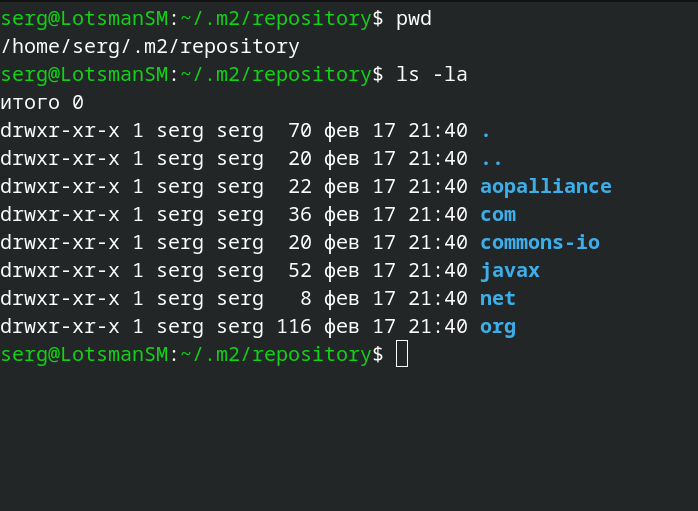

Находим скомпилированный JAR-файл

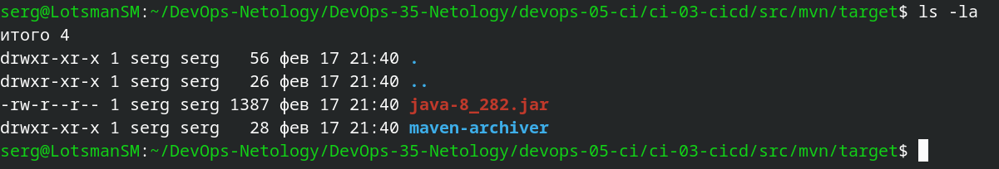

4. В ответе пришлите исправленный файл `pom.xml`.

Исправленный файл [pom.xml](src/mvn/pom.xml)

---