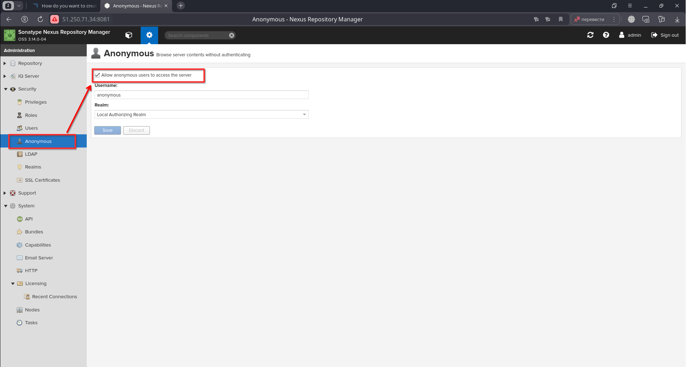

# Домашнее задание к занятию 9 «Процессы CI/CD»

## Подготовка к выполнению

1. Создайте два VM в Yandex Cloud с параметрами: 2CPU 4RAM Centos7 (остальное по минимальным требованиям).

Создал две VM в Yandex Cloud с параметрами: 2CPU 4RAM Centos7. Для создания использовал Terraform, [ссылка](/src/terraform/) на код.

2. Пропишите в [inventory](./infrastructure/inventory/cicd/hosts.yml) [playbook](./infrastructure/site.yml) созданные хосты.

Прописал в inventory созданные [хосты](/src/infrastructure/inventory/cicd/hosts.yml).

3. Добавьте в [files](./infrastructure/files/) файл со своим публичным ключом (id_rsa.pub). Если ключ называется иначе — найдите таску в плейбуке, которая использует id_rsa.pub имя, и исправьте на своё.

Добавил в директорию files файл со своим публичным ключом (id_ed25519.pub) и изменил в плейбуке таску на id_ed25519.pub.

4. Запустите playbook, ожидайте успешного завершения.

Установил роль `community.general`

```bash
╰─➤ansible-galaxy collection install community.general
Starting galaxy collection install process
Process install dependency map
Starting collection install process
Downloading https://galaxy.ansible.com/api/v3/plugin/ansible/content/published/collections/artifacts/community-general-8.3.0.tar.gz to /home/serg/.ansible/tmp/ansible-local-92247kn6wswk7/tmpd0_u1roj/community-general-8.3.0-nflqz4hn
Installing 'community.general:8.3.0' to '/home/serg/.ansible/collections/ansible_collections/community/general'
community.general:8.3.0 was installed successfully
```
Запустив playbook, обнаружил что пакет `postgresql11-server` отсутствует в репозитории:

```bash
╰─➤ansible-playbook -i inventory/cicd/hosts.yml site.yml

PLAY [Get OpenJDK installed] ********************************************************************************************************************************************************************

TASK [Gathering Facts] **************************************************************************************************************************************************************************
ok: [sonar-01]

TASK [install unzip] ****************************************************************************************************************************************************************************
changed: [sonar-01]

TASK [Upload .tar.gz file conaining binaries from remote storage] *******************************************************************************************************************************
changed: [sonar-01]

TASK [Ensure installation dir exists] ***********************************************************************************************************************************************************
changed: [sonar-01]

TASK [Extract java in the installation directory] ***********************************************************************************************************************************************
changed: [sonar-01]

TASK [Export environment variables] *************************************************************************************************************************************************************
changed: [sonar-01]

PLAY [Get PostgreSQL installed] *****************************************************************************************************************************************************************

TASK [Gathering Facts] **************************************************************************************************************************************************************************
ok: [sonar-01]

TASK [Change repo file] *************************************************************************************************************************************************************************
changed: [sonar-01]

TASK [Install PostgreSQL repos] *****************************************************************************************************************************************************************
changed: [sonar-01]

TASK [Install PostgreSQL] ***********************************************************************************************************************************************************************
fatal: [sonar-01]: FAILED! => {"changed": false, "msg": "No package matching 'postgresql11-server' found available, installed or updated", "rc": 126, "results": ["No package matching 'postgresql11-server' found available, installed or updated"]}

PLAY RECAP **************************************************************************************************************************************************************************************
sonar-01                   : ok=9    changed=7    unreachable=0    failed=1    skipped=0    rescued=0    ignored=0
```

Принял решение установить PostreSQL 12. В связи с новыми обстоятельствами, иправил файлы `postgres.yml` и `site.yml`. Снова запустил playbook и дождался успешного завершения:

```bash
╰─➤ansible-playbook -i inventory/cicd/hosts.yml site.yml

PLAY [Get OpenJDK installed] ********************************************************************************************************************************************************************

TASK [Gathering Facts] **************************************************************************************************************************************************************************
ok: [sonar-01]

TASK [install unzip] ****************************************************************************************************************************************************************************
ok: [sonar-01]

TASK [Upload .tar.gz file conaining binaries from remote storage] *******************************************************************************************************************************
ok: [sonar-01]

TASK [Ensure installation dir exists] ***********************************************************************************************************************************************************
ok: [sonar-01]

TASK [Extract java in the installation directory] ***********************************************************************************************************************************************
skipping: [sonar-01]

TASK [Export environment variables] *************************************************************************************************************************************************************
ok: [sonar-01]

PLAY [Get PostgreSQL installed] *****************************************************************************************************************************************************************

TASK [Gathering Facts] **************************************************************************************************************************************************************************
ok: [sonar-01]

TASK [Change repo file] *************************************************************************************************************************************************************************
ok: [sonar-01]

TASK [Install PostgreSQL repos] *****************************************************************************************************************************************************************
ok: [sonar-01]

TASK [Install PostgreSQL] ***********************************************************************************************************************************************************************
changed: [sonar-01]

TASK [Init template1 DB] ************************************************************************************************************************************************************************
changed: [sonar-01]

TASK [Start pgsql service] **********************************************************************************************************************************************************************
changed: [sonar-01]

TASK [Create user in system] ********************************************************************************************************************************************************************
changed: [sonar-01]

TASK [Create user for Sonar in PostgreSQL] ******************************************************************************************************************************************************
[WARNING]: Module remote_tmp /var/lib/pgsql/.ansible/tmp did not exist and was created with a mode of 0700, this may cause issues when running as another user. To avoid this, create the
remote_tmp dir with the correct permissions manually
changed: [sonar-01]

TASK [Change password for Sonar user in PostgreSQL] *********************************************************************************************************************************************
changed: [sonar-01]

TASK [Create Sonar DB] **************************************************************************************************************************************************************************
changed: [sonar-01]

TASK [Copy pg_hba.conf] *************************************************************************************************************************************************************************
changed: [sonar-01]

PLAY [Prepare Sonar host] ***********************************************************************************************************************************************************************

TASK [Gathering Facts] **************************************************************************************************************************************************************************
ok: [sonar-01]

TASK [Create group in system] *******************************************************************************************************************************************************************
ok: [sonar-01]

TASK [Create user in system] ********************************************************************************************************************************************************************
ok: [sonar-01]

TASK [Set up ssh key to access for managed node] ************************************************************************************************************************************************
changed: [sonar-01]

TASK [Allow group to have passwordless sudo] ****************************************************************************************************************************************************
changed: [sonar-01]

TASK [Increase Virtual Memory] ******************************************************************************************************************************************************************
changed: [sonar-01]

TASK [Reboot VM] ********************************************************************************************************************************************************************************
changed: [sonar-01]

PLAY [Get Sonarqube installed] ******************************************************************************************************************************************************************

TASK [Gathering Facts] **************************************************************************************************************************************************************************
ok: [sonar-01]

TASK [Get distrib ZIP] **************************************************************************************************************************************************************************
changed: [sonar-01]

TASK [Unzip Sonar] ******************************************************************************************************************************************************************************
changed: [sonar-01]

TASK [Move Sonar into place.] *******************************************************************************************************************************************************************
changed: [sonar-01]

TASK [Configure SonarQube JDBC settings for PostgreSQL.] ****************************************************************************************************************************************
changed: [sonar-01] => (item={'regexp': '^sonar.jdbc.username', 'line': 'sonar.jdbc.username=sonar'})
changed: [sonar-01] => (item={'regexp': '^sonar.jdbc.password', 'line': 'sonar.jdbc.password=sonar'})
changed: [sonar-01] => (item={'regexp': '^sonar.jdbc.url', 'line': 'sonar.jdbc.url=jdbc:postgresql://localhost:5432/sonar?useUnicode=true&characterEncoding=utf8&rewriteBatchedStatements=true&useConfigs=maxPerformance'})
changed: [sonar-01] => (item={'regexp': '^sonar.web.context', 'line': 'sonar.web.context='})

TASK [Generate wrapper.conf] ********************************************************************************************************************************************************************
changed: [sonar-01]

TASK [Symlink sonar bin.] ***********************************************************************************************************************************************************************
changed: [sonar-01]

TASK [Copy SonarQube systemd unit file into place (for systemd systems).] ***********************************************************************************************************************
changed: [sonar-01]

TASK [Ensure Sonar is running and set to start on boot.] ****************************************************************************************************************************************
changed: [sonar-01]

TASK [Allow Sonar time to build on first start.] ************************************************************************************************************************************************
Pausing for 180 seconds
(ctrl+C then 'C' = continue early, ctrl+C then 'A' = abort)
ok: [sonar-01]

TASK [Make sure Sonar is responding on the configured port.] ************************************************************************************************************************************
ok: [sonar-01]

PLAY [Get Nexus installed] **********************************************************************************************************************************************************************

TASK [Gathering Facts] **************************************************************************************************************************************************************************
ok: [nexus-01]

TASK [Create Nexus group] ***********************************************************************************************************************************************************************
changed: [nexus-01]

TASK [Create Nexus user] ************************************************************************************************************************************************************************
changed: [nexus-01]

TASK [Install JDK] ******************************************************************************************************************************************************************************
changed: [nexus-01]

TASK [Create Nexus directories] *****************************************************************************************************************************************************************
changed: [nexus-01] => (item=/home/nexus/log)
changed: [nexus-01] => (item=/home/nexus/sonatype-work/nexus3)
changed: [nexus-01] => (item=/home/nexus/sonatype-work/nexus3/etc)
changed: [nexus-01] => (item=/home/nexus/pkg)
changed: [nexus-01] => (item=/home/nexus/tmp)

TASK [Download Nexus] ***************************************************************************************************************************************************************************
[WARNING]: Module remote_tmp /home/nexus/.ansible/tmp did not exist and was created with a mode of 0700, this may cause issues when running as another user. To avoid this, create the
remote_tmp dir with the correct permissions manually
changed: [nexus-01]

TASK [Unpack Nexus] *****************************************************************************************************************************************************************************
changed: [nexus-01]

TASK [Link to Nexus Directory] ******************************************************************************************************************************************************************
changed: [nexus-01]

TASK [Add NEXUS_HOME for Nexus user] ************************************************************************************************************************************************************
changed: [nexus-01]

TASK [Add run_as_user to Nexus.rc] **************************************************************************************************************************************************************
changed: [nexus-01]

TASK [Raise nofile limit for Nexus user] ********************************************************************************************************************************************************
changed: [nexus-01]

TASK [Create Nexus service for SystemD] *********************************************************************************************************************************************************
changed: [nexus-01]

TASK [Ensure Nexus service is enabled for SystemD] **********************************************************************************************************************************************
changed: [nexus-01]

TASK [Create Nexus vmoptions] *******************************************************************************************************************************************************************
changed: [nexus-01]

TASK [Create Nexus properties] ******************************************************************************************************************************************************************
changed: [nexus-01]

TASK [Lower Nexus disk space threshold] *********************************************************************************************************************************************************
skipping: [nexus-01]

TASK [Start Nexus service if enabled] ***********************************************************************************************************************************************************
changed: [nexus-01]

TASK [Ensure Nexus service is restarted] ********************************************************************************************************************************************************
skipping: [nexus-01]

TASK [Wait for Nexus port if started] ***********************************************************************************************************************************************************
ok: [nexus-01]

PLAY RECAP **************************************************************************************************************************************************************************************
nexus-01                   : ok=17   changed=15   unreachable=0    failed=0    skipped=2    rescued=0    ignored=0   
sonar-01                   : ok=34   changed=20   unreachable=0    failed=0    skipped=1    rescued=0    ignored=0   
```

5. Проверьте готовность SonarQube через [браузер](http://localhost:9000).

Открыл браузер, проверил готовность SonarQube через браузер:


6. Зайдите под admin\admin, поменяйте пароль на свой.

Поменял штатный пароль на свой и вошел в систему:


7. Проверьте готовность Nexus через [браузер](http://localhost:8081).

Проверил готовность Nexus через бразуер:


8. Подключитесь под admin\admin123, поменяйте пароль, сохраните анонимный доступ.

Подключился под admin\admin123, поменял пароль, сохранил анонимный доступ.



## Знакомоство с SonarQube

### Основная часть

1. Создайте новый проект, название произвольное.

Создал новый проект, назвал ProjectX и сгенерировал token.


2. Скачайте пакет sonar-scanner, который вам предлагает скачать SonarQube.

Скачаваю пакет `sonar-scanner`. 


Распаковываю `sonar-scanner` в `/opt/sonat-scanner/`.

3. Сделайте так, чтобы binary был доступен через вызов в shell (или поменяйте переменную PATH, или любой другой, удобный вам способ).

Чтобы бинарник Sonar-scanner был доступен, добавляю его в переменную PATH.

```bash
╰─➤export PATH=$PATH:/opt/sonar-scanner/bin
```

4. Проверьте `sonar-scanner --version`.

Проверяю версию `sonar-scanner`

```bash
╰─➤sonar-scanner --version
INFO: Scanner configuration file: /opt/sonar-scanner/conf/sonar-scanner.properties
INFO: Project root configuration file: NONE
INFO: SonarScanner 5.0.1.3006
INFO: Java 17.0.7 Eclipse Adoptium (64-bit)
INFO: Linux 6.7.0-204.fsync.fc39.x86_64 amd64
```
Редактирую настройки сканера, указывая на удаленный хост с сервером SonarQube в облаке YC


5. Запустите анализатор против кода из директории [example](./example) с дополнительным ключом `-Dsonar.coverage.exclusions=fail.py`.

Запускаю анализатор против кода 'sonar-scanner -Dsonar.coverage.exclusions=fail.py'

```bash
╰─➤sonar-scanner -Dsonar.coverage.exclusions=fail.py
INFO: Scanner configuration file: /opt/sonar-scanner/conf/sonar-scanner.properties
INFO: Project root configuration file: NONE
INFO: SonarScanner 5.0.1.3006
INFO: Java 17.0.7 Eclipse Adoptium (64-bit)
INFO: Linux 6.7.0-204.fsync.fc39.x86_64 amd64
INFO: User cache: /home/serg/.sonar/cache
INFO: Analyzing on SonarQube server 9.1.0
INFO: Default locale: "ru_RU", source code encoding: "UTF-8" (analysis is platform dependent)
INFO: Load global settings
INFO: Load global settings (done) | time=150ms
INFO: Server id: 9CFC3560-AY227qapiq9kpKw-juEd
INFO: User cache: /home/serg/.sonar/cache
INFO: Load/download plugins
INFO: Load plugins index
INFO: Load plugins index (done) | time=96ms
INFO: Load/download plugins (done) | time=10231ms
INFO: Process project properties
INFO: Process project properties (done) | time=1ms
INFO: Execute project builders
INFO: Execute project builders (done) | time=1ms
INFO: Project key: ProgectX
INFO: Base dir: /home/serg/DevOps-Netology/DevOps-35-Netology/devops-05-ci/ci-03-cicd/src/example
INFO: Working dir: /home/serg/DevOps-Netology/DevOps-35-Netology/devops-05-ci/ci-03-cicd/src/example/.scannerwork
INFO: Load project settings for component key: 'ProgectX'
INFO: Load quality profiles
INFO: Load quality profiles (done) | time=127ms
INFO: Load active rules
INFO: Load active rules (done) | time=2075ms
INFO: Indexing files...
INFO: Project configuration:
INFO:   Excluded sources for coverage: fail.py
INFO: 1 file indexed
INFO: 0 files ignored because of scm ignore settings
INFO: Quality profile for py: Sonar way
INFO: ------------- Run sensors on module ProgectX
INFO: Load metrics repository
INFO: Load metrics repository (done) | time=39ms
INFO: Sensor Python Sensor [python]
WARN: Your code is analyzed as compatible with python 2 and 3 by default. This will prevent the detection of issues specific to python 2 or python 3. You can get a more precise analysis by setting a python version in your configuration via the parameter "sonar.python.version"
INFO: Starting global symbols computation
INFO: 1 source file to be analyzed
INFO: Load project repositories
INFO: Load project repositories (done) | time=17ms
INFO: 1/1 source file has been analyzed
INFO: Starting rules execution
INFO: 1 source file to be analyzed
INFO: 1/1 source file has been analyzed
INFO: Sensor Python Sensor [python] (done) | time=563ms
INFO: Sensor Cobertura Sensor for Python coverage [python]
INFO: Sensor Cobertura Sensor for Python coverage [python] (done) | time=5ms
INFO: Sensor PythonXUnitSensor [python]
INFO: Sensor PythonXUnitSensor [python] (done) | time=1ms
INFO: Sensor CSS Rules [cssfamily]
INFO: No CSS, PHP, HTML or VueJS files are found in the project. CSS analysis is skipped.
INFO: Sensor CSS Rules [cssfamily] (done) | time=0ms
INFO: Sensor JaCoCo XML Report Importer [jacoco]
INFO: 'sonar.coverage.jacoco.xmlReportPaths' is not defined. Using default locations: target/site/jacoco/jacoco.xml,target/site/jacoco-it/jacoco.xml,build/reports/jacoco/test/jacocoTestReport.xml
INFO: No report imported, no coverage information will be imported by JaCoCo XML Report Importer
INFO: Sensor JaCoCo XML Report Importer [jacoco] (done) | time=2ms
INFO: Sensor C# Project Type Information [csharp]
INFO: Sensor C# Project Type Information [csharp] (done) | time=0ms
INFO: Sensor C# Analysis Log [csharp]
INFO: Sensor C# Analysis Log [csharp] (done) | time=8ms
INFO: Sensor C# Properties [csharp]
INFO: Sensor C# Properties [csharp] (done) | time=0ms
INFO: Sensor JavaXmlSensor [java]
INFO: Sensor JavaXmlSensor [java] (done) | time=1ms
INFO: Sensor HTML [web]
INFO: Sensor HTML [web] (done) | time=2ms
INFO: Sensor VB.NET Project Type Information [vbnet]
INFO: Sensor VB.NET Project Type Information [vbnet] (done) | time=0ms
INFO: Sensor VB.NET Analysis Log [vbnet]
INFO: Sensor VB.NET Analysis Log [vbnet] (done) | time=9ms
INFO: Sensor VB.NET Properties [vbnet]
INFO: Sensor VB.NET Properties [vbnet] (done) | time=0ms
INFO: ------------- Run sensors on project
INFO: Sensor Zero Coverage Sensor
INFO: Sensor Zero Coverage Sensor (done) | time=0ms
INFO: SCM Publisher SCM provider for this project is: git
INFO: SCM Publisher 1 source file to be analyzed
INFO: SCM Publisher 0/1 source files have been analyzed (done) | time=50ms
WARN: Missing blame information for the following files:
WARN:   * fail.py
WARN: This may lead to missing/broken features in SonarQube
INFO: CPD Executor Calculating CPD for 1 file
INFO: CPD Executor CPD calculation finished (done) | time=6ms
INFO: Analysis report generated in 76ms, dir size=103,3 kB
INFO: Analysis report compressed in 18ms, zip size=14,2 kB
INFO: Analysis report uploaded in 543ms
INFO: ANALYSIS SUCCESSFUL, you can browse http://158.160.111.65:9000/dashboard?id=ProgectX
INFO: Note that you will be able to access the updated dashboard once the server has processed the submitted analysis report
INFO: More about the report processing at http://158.160.111.65:9000/api/ce/task?id=AY238creiq9kpKw-jzJ0
INFO: Analysis total time: 5.143 s
INFO: ------------------------------------------------------------------------
INFO: EXECUTION SUCCESS
INFO: ------------------------------------------------------------------------
INFO: Total time: 16.319s
INFO: Final Memory: 11M/80M
INFO: ------------------------------------------------------------------------
```

6. Посмотрите результат в интерфейсе.

После анализа получаю ссылку на дашборд с результатом анализа:


Смотрю результат в интерфейсе, вижу, что есть 2 бага и 1 Code Smells:


7. Исправьте ошибки, которые он выявил, включая warnings.

Исправляю ошибки.

8. Запустите анализатор повторно — проверьте, что QG пройдены успешно.

Заново запускаю анализатор, вижу, что ошибок и предупреждений нет.

```bash
╰─➤sonar-scanner -Dsonar.coverage.exclusions=fail.py
INFO: Scanner configuration file: /opt/sonar-scanner/conf/sonar-scanner.properties
INFO: Project root configuration file: NONE
INFO: SonarScanner 5.0.1.3006
INFO: Java 17.0.7 Eclipse Adoptium (64-bit)
INFO: Linux 6.7.0-204.fsync.fc39.x86_64 amd64
INFO: User cache: /home/serg/.sonar/cache
INFO: Analyzing on SonarQube server 9.1.0
INFO: Default locale: "ru_RU", source code encoding: "UTF-8" (analysis is platform dependent)
INFO: Load global settings
INFO: Load global settings (done) | time=101ms
INFO: Server id: 9CFC3560-AY227qapiq9kpKw-juEd
INFO: User cache: /home/serg/.sonar/cache
INFO: Load/download plugins
INFO: Load plugins index
INFO: Load plugins index (done) | time=48ms
INFO: Load/download plugins (done) | time=117ms
INFO: Process project properties
INFO: Process project properties (done) | time=1ms
INFO: Execute project builders
INFO: Execute project builders (done) | time=1ms
INFO: Project key: ProgectX
INFO: Base dir: /home/serg/DevOps-Netology/DevOps-35-Netology/devops-05-ci/ci-03-cicd/src/example
INFO: Working dir: /home/serg/DevOps-Netology/DevOps-35-Netology/devops-05-ci/ci-03-cicd/src/example/.scannerwork
INFO: Load project settings for component key: 'ProgectX'
INFO: Load project settings for component key: 'ProgectX' (done) | time=27ms
INFO: Load quality profiles
INFO: Load quality profiles (done) | time=143ms
INFO: Load active rules
INFO: Load active rules (done) | time=3216ms
INFO: Indexing files...
INFO: Project configuration:
INFO:   Excluded sources for coverage: fail.py
INFO: 1 file indexed
INFO: 0 files ignored because of scm ignore settings
INFO: Quality profile for py: Sonar way
INFO: ------------- Run sensors on module ProgectX
INFO: Load metrics repository
INFO: Load metrics repository (done) | time=45ms
INFO: Sensor Python Sensor [python]
WARN: Your code is analyzed as compatible with python 2 and 3 by default. This will prevent the detection of issues specific to python 2 or python 3. You can get a more precise analysis by setting a python version in your configuration via the parameter "sonar.python.version"
INFO: Starting global symbols computation
INFO: 1 source file to be analyzed
INFO: Load project repositories
INFO: Load project repositories (done) | time=36ms
INFO: 1/1 source file has been analyzed
INFO: Starting rules execution
INFO: 1 source file to be analyzed
INFO: 1/1 source file has been analyzed
INFO: Sensor Python Sensor [python] (done) | time=608ms
INFO: Sensor Cobertura Sensor for Python coverage [python]
INFO: Sensor Cobertura Sensor for Python coverage [python] (done) | time=7ms
INFO: Sensor PythonXUnitSensor [python]
INFO: Sensor PythonXUnitSensor [python] (done) | time=0ms
INFO: Sensor CSS Rules [cssfamily]
INFO: No CSS, PHP, HTML or VueJS files are found in the project. CSS analysis is skipped.
INFO: Sensor CSS Rules [cssfamily] (done) | time=1ms
INFO: Sensor JaCoCo XML Report Importer [jacoco]
INFO: 'sonar.coverage.jacoco.xmlReportPaths' is not defined. Using default locations: target/site/jacoco/jacoco.xml,target/site/jacoco-it/jacoco.xml,build/reports/jacoco/test/jacocoTestReport.xml
INFO: No report imported, no coverage information will be imported by JaCoCo XML Report Importer
INFO: Sensor JaCoCo XML Report Importer [jacoco] (done) | time=2ms
INFO: Sensor C# Project Type Information [csharp]
INFO: Sensor C# Project Type Information [csharp] (done) | time=1ms
INFO: Sensor C# Analysis Log [csharp]
INFO: Sensor C# Analysis Log [csharp] (done) | time=20ms
INFO: Sensor C# Properties [csharp]
INFO: Sensor C# Properties [csharp] (done) | time=0ms
INFO: Sensor JavaXmlSensor [java]
INFO: Sensor JavaXmlSensor [java] (done) | time=1ms
INFO: Sensor HTML [web]
INFO: Sensor HTML [web] (done) | time=3ms
INFO: Sensor VB.NET Project Type Information [vbnet]
INFO: Sensor VB.NET Project Type Information [vbnet] (done) | time=1ms
INFO: Sensor VB.NET Analysis Log [vbnet]
INFO: Sensor VB.NET Analysis Log [vbnet] (done) | time=11ms
INFO: Sensor VB.NET Properties [vbnet]
INFO: Sensor VB.NET Properties [vbnet] (done) | time=0ms
INFO: ------------- Run sensors on project
INFO: Sensor Zero Coverage Sensor
INFO: Sensor Zero Coverage Sensor (done) | time=0ms
INFO: SCM Publisher SCM provider for this project is: git
INFO: SCM Publisher 1 source file to be analyzed
INFO: SCM Publisher 0/1 source files have been analyzed (done) | time=44ms
WARN: Missing blame information for the following files:
WARN:   * fail.py
WARN: This may lead to missing/broken features in SonarQube
INFO: CPD Executor Calculating CPD for 1 file
INFO: CPD Executor CPD calculation finished (done) | time=5ms
INFO: Analysis report generated in 66ms, dir size=103,3 kB
INFO: Analysis report compressed in 14ms, zip size=14,2 kB
INFO: Analysis report uploaded in 62ms
INFO: ANALYSIS SUCCESSFUL, you can browse http://158.160.111.65:9000/dashboard?id=ProgectX
INFO: Note that you will be able to access the updated dashboard once the server has processed the submitted analysis report
INFO: More about the report processing at http://158.160.111.65:9000/api/ce/task?id=AY24EsNfiq9kpKw-jzKY
INFO: Analysis total time: 5.818 s
INFO: ------------------------------------------------------------------------
INFO: EXECUTION SUCCESS
INFO: ------------------------------------------------------------------------
INFO: Total time: 6.726s
INFO: Final Memory: 11M/68M
INFO: ------------------------------------------------------------------------
```

9. Сделайте скриншот успешного прохождения анализа, приложите к решению ДЗ.


## Знакомство с Nexus

### Основная часть

1. В репозиторий `maven-public` загрузите артефакт с GAV-параметрами:

 *    groupId: netology;
 *    artifactId: java;
 *    version: 8_282;
 *    classifier: distrib;
 *    type: tar.gz.

В репозиторий maven-public загружаю артефакт с указанными параметрами:


2. В него же загрузите такой же артефакт, но с version: 8_102.


3. Проверьте, что все файлы загрузились успешно.


4. В ответе пришлите файл `maven-metadata.xml` для этого артефекта.

[Ссылка на maven-metadata.xml](src/example/maven-metadata.xml)

### Знакомство с Maven

### Подготовка к выполнению

1. Скачайте дистрибутив с [maven](https://maven.apache.org/download.cgi).

Скачаваю по ссылке `apache-maven-3.9.6-bin.tar.gz`.

2. Разархивируйте, сделайте так, чтобы binary был доступен через вызов в shell (или поменяйте переменную PATH, или любой другой, удобный вам способ).

Распаковываю `apache-maven-3.9.6-bin.tar.gz` в `/opt/apache-maven/`

Добавил путь к бинарнику в переменную PATH.

```bash
╰─➤export PATH=$PATH:/opt/apache-maven/bin
```

Проверяем все варианты JAVA-релизов на management-хосте .

```bash
╰─➤java -version
openjdk version "17.0.9" 2023-10-17
OpenJDK Runtime Environment (Red_Hat-17.0.9.0.9-4) (build 17.0.9+9)
OpenJDK 64-Bit Server VM (Red_Hat-17.0.9.0.9-4) (build 17.0.9+9, mixed mode, sharing)
```

```bash
╰─➤alternatives --list | grep java
java                    auto    /usr/lib/jvm/java-17-openjdk-17.0.9.0.9-3.fc39.x86_64/bin/java
jre_openjdk             auto    /usr/lib/jvm/java-17-openjdk-17.0.9.0.9-3.fc39.x86_64
jre_17                  auto    /usr/lib/jvm/java-17-openjdk-17.0.9.0.9-3.fc39.x86_64
```

```bash
╰─➤export JAVA_HOME=/usr/lib/jvm/java-17-openjdk-17.0.9.0.9-3.fc39.x86_64
```

```bash
╰─➤echo $JAVA_HOME
/usr/lib/jvm/java-17-openjdk-17.0.9.0.9-3.fc39.x86_64
```

3. Удалите из `apache-maven-<version>/conf/settings.xml` упоминание о правиле, отвергающем HTTP- соединение — раздел mirrors —> id: my-repository-http-unblocker.

Удаляем блок:

```
    <mirror>
      <id>maven-default-http-blocker</id>
      <mirrorOf>external:http:*</mirrorOf>
      <name>Pseudo repository to mirror external repositories initially using HTTP.</name>
      <url>http://0.0.0.0/</url>
      <blocked>true</blocked>
    </mirror>

```

4. Проверьте `mvn --version`.
5. Заберите директорию [mvn](./mvn) с pom.

### Основная часть

1. Поменяйте в `pom.xml` блок с зависимостями под ваш артефакт из первого пункта задания для Nexus (java с версией 8_282).
2. Запустите команду `mvn package` в директории с `pom.xml`, ожидайте успешного окончания.
3. Проверьте директорию `~/.m2/repository/`, найдите ваш артефакт.
4. В ответе пришлите исправленный файл `pom.xml`.

---

### Как оформить решение задания

Выполненное домашнее задание пришлите в виде ссылки на .md-файл в вашем репозитории.

---
