# Домашнее задание к занятию 10 «Jenkins»

## Подготовка к выполнению

1. Создать два VM: для jenkins-master и jenkins-agent.

Создал две VM с AlmaLinux 9 на борту с помощью Terraform. [ссылка на код](/src/terraform/)

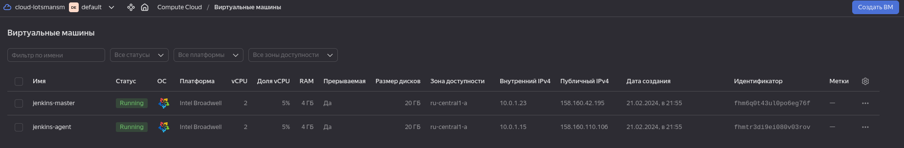

2. Установить Jenkins при помощи playbook.

Исправил playbook для установки на AlmaLinux 9. Для установки Jenkins использовал java-17 и python 3.9
Установил Jenkins при помощи ansible:

```bash
╰─➤ansible-playbook -i inventory/cicd/hosts.yml site.yml

PLAY [Preapre all hosts] *********************************************************************************************************************************

TASK [Gathering Facts] ***********************************************************************************************************************************
ok: [jenkins-agent-01]
ok: [jenkins-master-01]

TASK [Create group] **************************************************************************************************************************************
changed: [jenkins-agent-01]
changed: [jenkins-master-01]

TASK [Create user] ***************************************************************************************************************************************
changed: [jenkins-master-01]
changed: [jenkins-agent-01]

TASK [Install JDK] ***************************************************************************************************************************************
changed: [jenkins-agent-01]
changed: [jenkins-master-01]

PLAY [Get Jenkins master installed] **********************************************************************************************************************

TASK [Gathering Facts] ***********************************************************************************************************************************
ok: [jenkins-master-01]

TASK [Get repo Jenkins] **********************************************************************************************************************************
changed: [jenkins-master-01]

TASK [Add Jenkins key] ***********************************************************************************************************************************
changed: [jenkins-master-01]

TASK [Install epel-release] ******************************************************************************************************************************
changed: [jenkins-master-01]

TASK [Install Jenkins and requirements] ******************************************************************************************************************
changed: [jenkins-master-01]

TASK [Ensure jenkins agents are present in known_hosts file] *********************************************************************************************
# 51.250.83.187:22 SSH-2.0-OpenSSH_8.0
# 51.250.83.187:22 SSH-2.0-OpenSSH_8.0
# 51.250.83.187:22 SSH-2.0-OpenSSH_8.0
# 51.250.83.187:22 SSH-2.0-OpenSSH_8.0
# 51.250.83.187:22 SSH-2.0-OpenSSH_8.0
changed: [jenkins-master-01] => (item=jenkins-agent-01)
[WARNING]: Module remote_tmp /home/jenkins/.ansible/tmp did not exist and was created with a mode of 0700, this may cause issues when running as another
user. To avoid this, create the remote_tmp dir with the correct permissions manually

TASK [Start Jenkins] *************************************************************************************************************************************
changed: [jenkins-master-01]

PLAY [Prepare jenkins agent] *****************************************************************************************************************************

TASK [Gathering Facts] ***********************************************************************************************************************************
ok: [jenkins-agent-01]

TASK [Add master publickey into authorized_key] **********************************************************************************************************
changed: [jenkins-agent-01]

TASK [Create agent_dir] **********************************************************************************************************************************
changed: [jenkins-agent-01]

TASK [Add docker repo] ***********************************************************************************************************************************
changed: [jenkins-agent-01]

TASK [Install some required] *****************************************************************************************************************************
changed: [jenkins-agent-01]

TASK [Update pip] ****************************************************************************************************************************************
changed: [jenkins-agent-01]

TASK [Install Ansible] ***********************************************************************************************************************************
changed: [jenkins-agent-01]

TASK [Reinstall Selinux] *********************************************************************************************************************************
changed: [jenkins-agent-01]

TASK [Add local to PATH] *********************************************************************************************************************************
changed: [jenkins-agent-01]

TASK [Create docker group] *******************************************************************************************************************************
ok: [jenkins-agent-01]

TASK [Add jenkinsuser to dockergroup] ********************************************************************************************************************
changed: [jenkins-agent-01]

TASK [Restart docker] ************************************************************************************************************************************
changed: [jenkins-agent-01]

TASK [Install agent.jar] *********************************************************************************************************************************
changed: [jenkins-agent-01]

PLAY RECAP ***********************************************************************************************************************************************
jenkins-agent-01           : ok=17   changed=14   unreachable=0    failed=0    skipped=0    rescued=0    ignored=0   
jenkins-master-01          : ok=11   changed=9    unreachable=0    failed=0    skipped=0    rescued=0    ignored=0
```

3. Запустить и проверить работоспособность.

Вхожу на удаленный хост.

```bash
╰─➤ssh almalinux@51.250.77.205
```

Узнаю дефолтовый пароль

```bash
╰─➤sudo cat /var/lib/jenkins/secrets/initialAdminPassword
aa93cff6900f42b382872a86ddd76f95
```

4. Сделать первоначальную настройку.

Вхожу в интерфейс через браузер http://51.250.77.205:8080/ и ввожу вышеуказанный пароль чтобы разблокировать.

Запускаю установку плагинов, а затем создаю нового админа и его пароль.

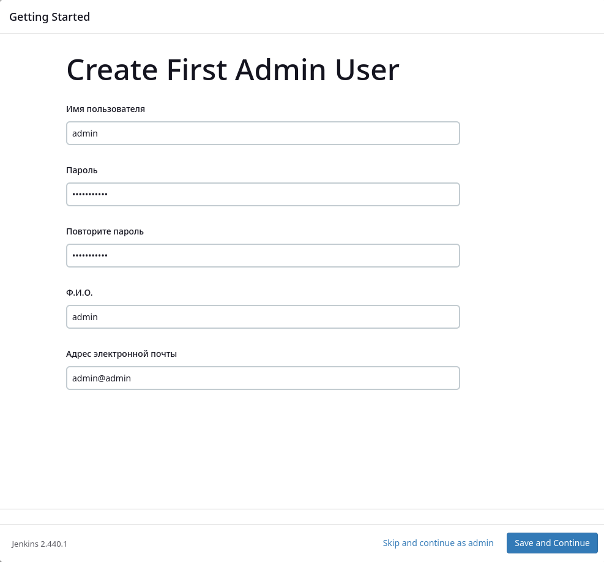

Записываю строку подключения со стороны внешних репозиториев. (Это параметр указывается в параметрах мастер-хоста [http://51.250.77.205:8080/manage/configure](http://51.250.77.205:8080/manage/configure). При рестарсте хоста на YC необходимо его поменять.)

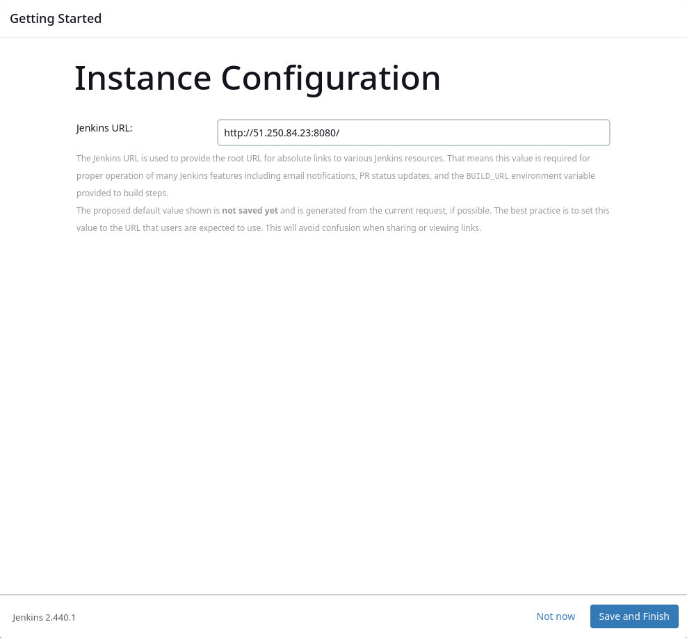

Установить плагин `command-launcher` для отображения пункта `Launch agent via execution of commander on the controller` в способе запуска агента и перегрузить Jenkins

Добавляю новый узел (агента)

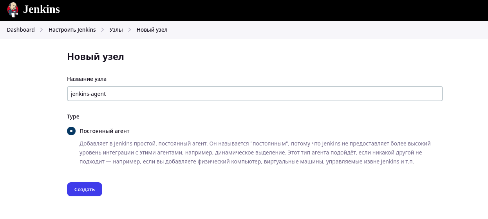

Указываю рабочий каталог и команду запуска процесса JAVA на узле-агенте. Путь `/opt/jenkins_agent` берем из переменной jenkins_agent_dir в плейбуке проекта

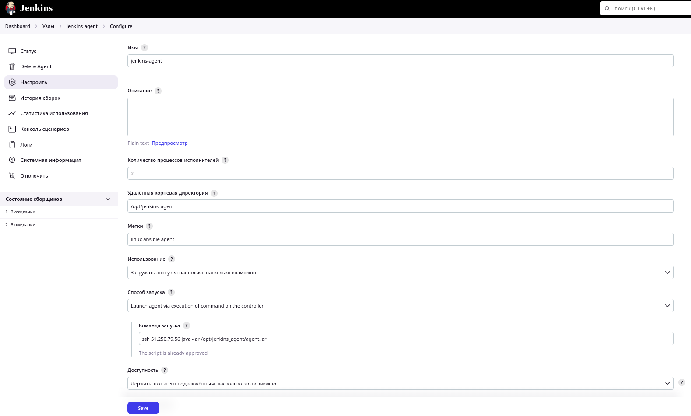

Отключаю все внутренние executors-сборщики на мастере.

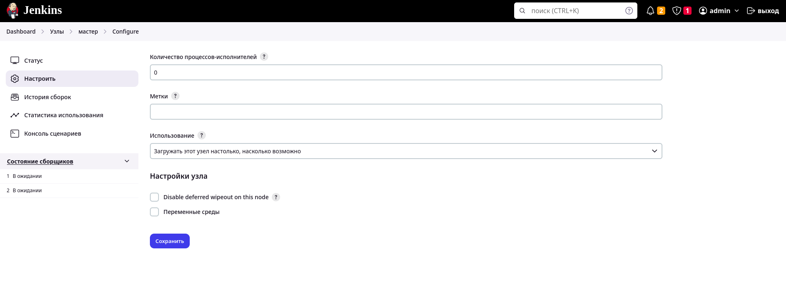

Убеждась, что используются только сборщики на удаленном агенте.

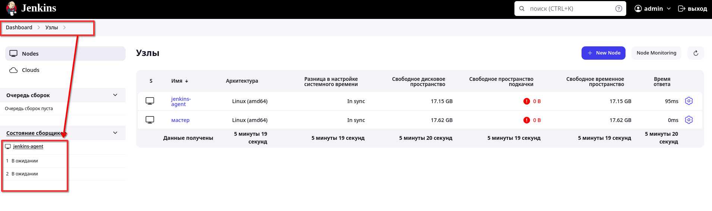

Установлю подключаемые модули, необходимые для поддержки Docker - "Docker" и "Docker Pipeline" и перезагружаем master-хост

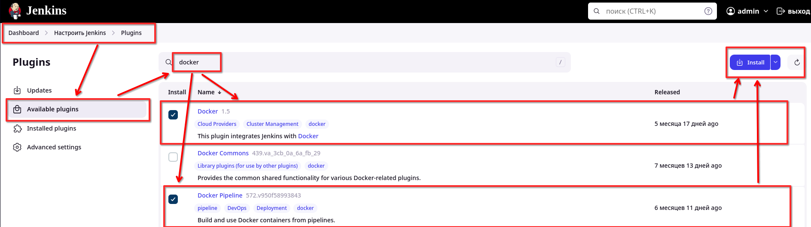

## Основная часть

1. Сделать Freestyle Job, который будет запускать `molecule test` из любого вашего репозитория с ролью.

Создал Freestyle Job, который запускает molecule test из моего репозитория с ролью [vector-role-molecule](https://github.com/LotsmanSM/vector-role-molecule)

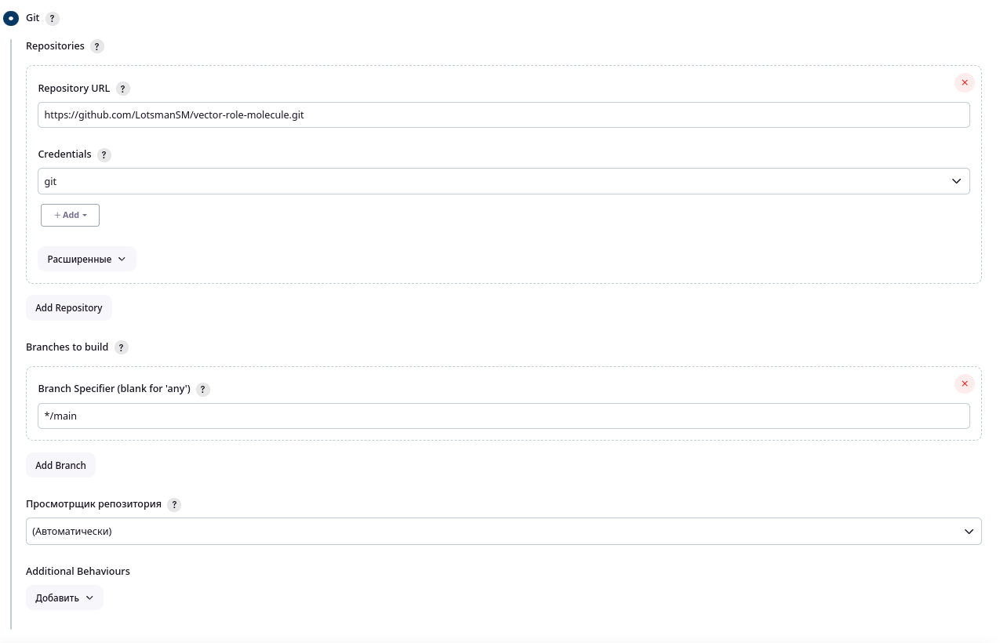

Во время сборки выполняются следующий команды:

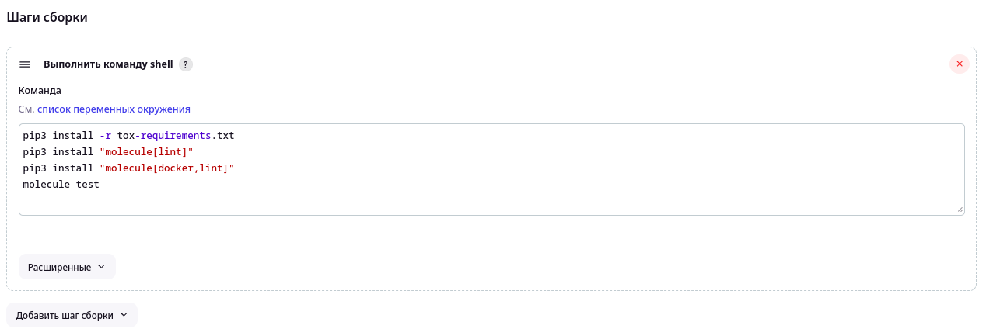

Сборка завершается успешно:

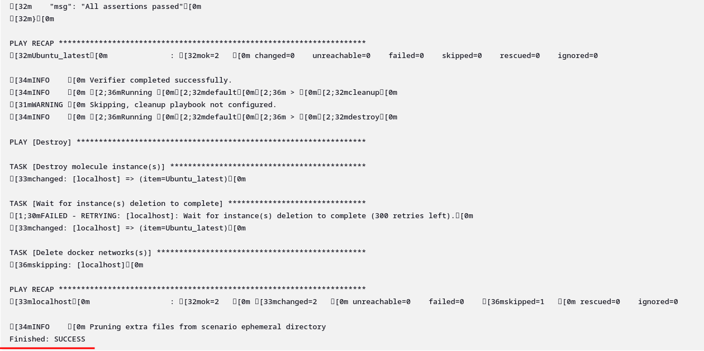

2. Сделать Declarative Pipeline Job, который будет запускать `molecule test` из любого вашего репозитория с ролью.

Создал Declarative Pipeline Job, который запускает molecule test из того же репозитория

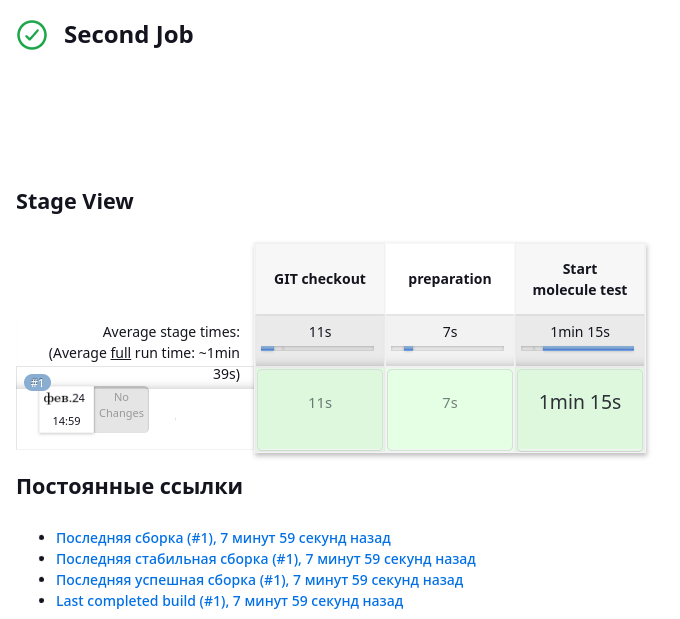

Выполняется следующий код:

```
pipeline {
    agent any

    stages {
        stage('GIT checkout') {
            steps {
                echo 'Get from GIT repository'
                git credentialsId: 'git_ssh', 
                url: 'https://github.com/LotsmanSM/vector-role-molecule',
                branch: 'main'
            }
        }
        stage('preparation') {
            steps {
                echo 'Start preparation'
                sh 'pip3 install -r tox-requirements.txt'
                sh 'pip3 install "molecule[lint]"'
                sh 'pip3 install "molecule[docker,lint]"'
            }
        }
        stage('Start molecule test') {
            steps {
                echo 'Run molecule test'
                sh 'molecule test'
            }
        }
    }
}
```

Сборка завершилась успешно:

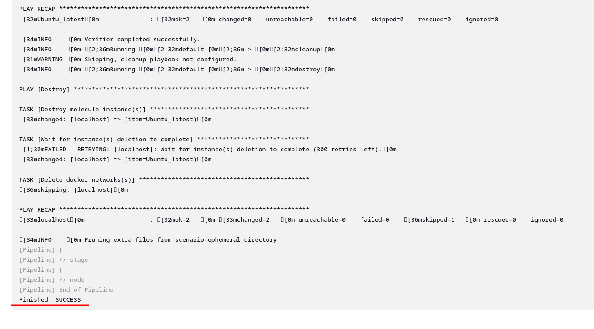

3. Перенести Declarative Pipeline в репозиторий в файл `Jenkinsfile`.

Перенес Declarative Pipeline в файл [Jenkinsfile](https://github.com/LotsmanSM/vector-role-molecule/blob/main/Jenkinsfile)

4. Создать Multibranch Pipeline на запуск `Jenkinsfile` из репозитория.

Создал Multibranch Pipeline на запуск `Jenkinsfile` из репозитория.

Сначала выполняется сканирование удаленного репозитория для поиска веток, обнаружения Jenkinsfile, проверки изменения репозитория или изменения Jenkinsfile. После запуска сборка Multibranch Pipeline выполняется успешно:

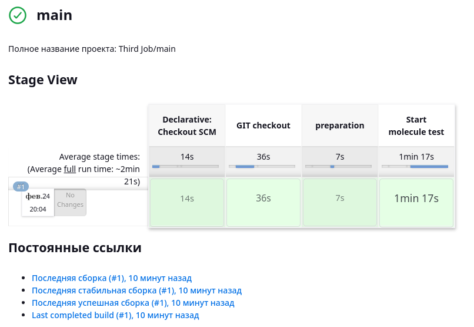

5. Создать Scripted Pipeline, наполнить его скриптом из [pipeline](./pipeline).

Создал Scripted Pipeline, наполнил его скриптом из [pipeline](https://github.com/netology-code/mnt-homeworks/blob/MNT-video/09-ci-04-jenkins/pipeline)

6. Внести необходимые изменения, чтобы Pipeline запускал `ansible-playbook` без флагов `--check --diff`, если не установлен параметр при запуске джобы (prod_run = True). По умолчанию параметр имеет значение False и запускает прогон с флагами `--check --diff`.

Внес необходимые изменения так, чтобы Pipeline запускал `ansible-playbook` без флагов `--check --diff`, если не установлен параметр при запуске джобы (prod_run = True).

Сборка без параметра prod_run = True запустилась без флага `--check --diff`:

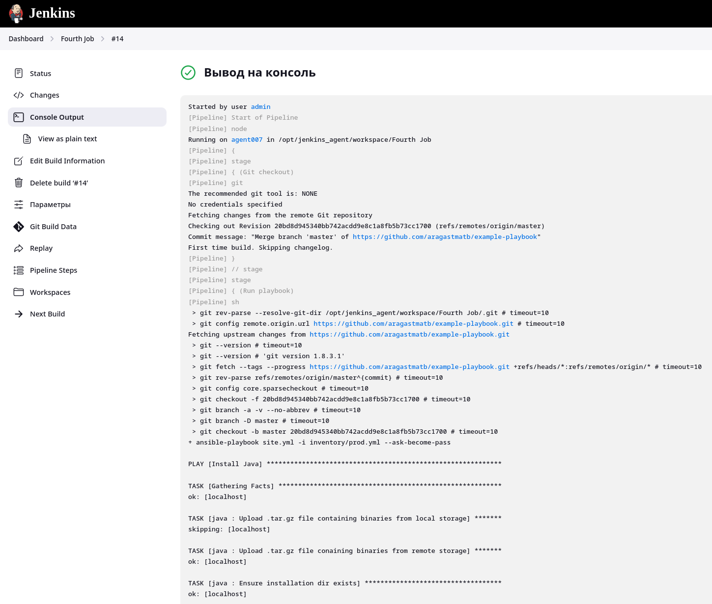

Сборка с параметром prod_run = True запустилась с флагом --check --diff:

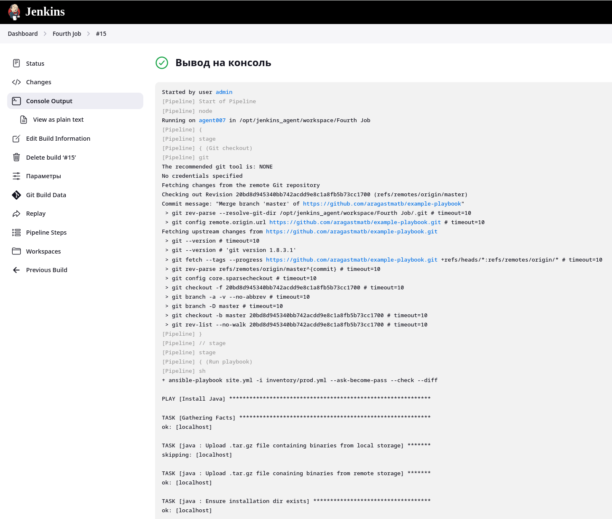

7. Проверить работоспособность, исправить ошибки, исправленный Pipeline вложить в репозиторий в файл `ScriptedJenkinsfile`.

Изменения внесенные в Pipeline находятся в файле [ScriptedJenkinsfile](/src/ScriptedJenkinsfile)

8. Отправить ссылку на репозиторий с ролью и Declarative Pipeline и Scripted Pipeline.

[Ссылка на Declarative Pipeline](https://github.com/LotsmanSM/vector-role-molecule/blob/main/Jenkinsfile)

[Ссылка на Scripted Pipeline](/src/ScriptedJenkinsfile)


## Необязательная часть

1. Создать скрипт на groovy, который будет собирать все Job, завершившиеся хотя бы раз неуспешно. Добавить скрипт в репозиторий с решением и названием `AllJobFailure.groovy`.
2. Создать Scripted Pipeline так, чтобы он мог сначала запустить через Yandex Cloud CLI необходимое количество инстансов, прописать их в инвентори плейбука и после этого запускать плейбук. Мы должны при нажатии кнопки получить готовую к использованию систему.

## Необязательную часть не делал.

---
