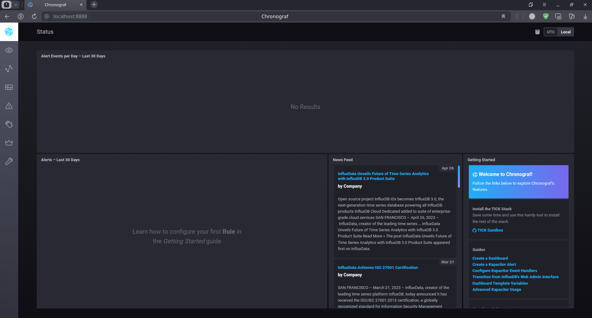
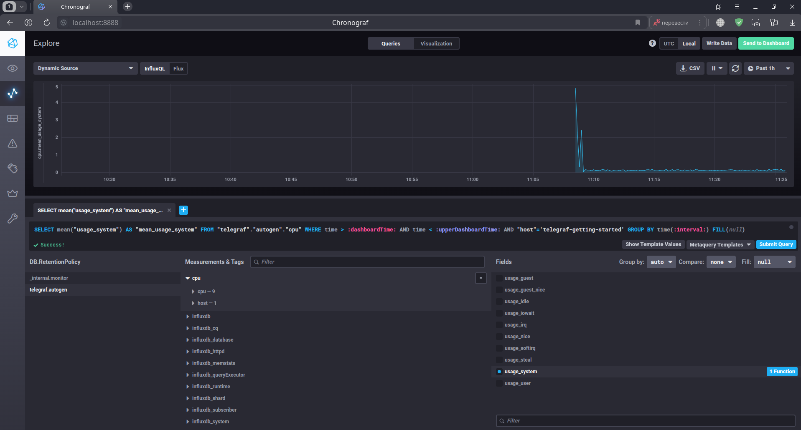
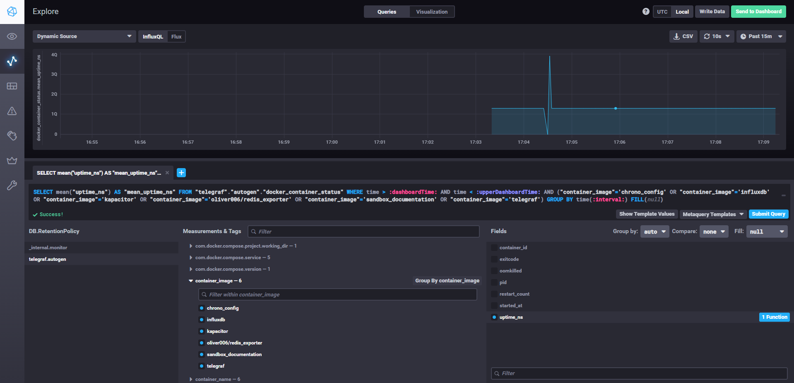

# Домашнее задание к занятию "13.Системы мониторинга"

## Обязательные задания

1. Вас пригласили настроить мониторинг на проект. На онбординге вам рассказали, что проект представляет из себя 
платформу для вычислений с выдачей текстовых отчетов, которые сохраняются на диск. Взаимодействие с платформой 
осуществляется по протоколу http. Также вам отметили, что вычисления загружают ЦПУ. Какой минимальный набор метрик вы
выведите в мониторинг и почему?

Одна из основных задач мониторинга - контроль важных для сервиса/проекта/бизнеса параметров. 

В данном примере для проекта явно указана нагрузка на ЦПУ и хранение результатов вычислений в виде текстовых отчетов на диске. Поэтому как минимум нужно выводить уровень загрузки ЦПУ вычислительных нод, а также доступную ёмкость нод, предназначенных для хранения отчётов. 

Уровень загрузки ЦПУ и доступная емкость дисков поможет определить уровень достаточности ресурсов для проекта в данный момент (а может быть оборудование простаивает и можно часть сократить, если это облачные ресурсы или перевести на другие проекты если "железо" своё), а также позволит спрогнозировать время модернизации. 

Также можно вывести другие параметры систем хранения данных, например, длину очереди на запись - возможно текущие накопители не справляются и нужно их масштабировать как в горизонталь, наращивая число накопителей в RAID массивах, так и в вертикаль - заменяя HDD на SSD, а может быть стоит реализовать гибридный вариант. 

Если в проекте вычислительные ноды отделены от нод хранения и/или они все отделены от точки входа в систему (Web сервер), то можно мониторить объём генерируемого трафика, задержки или длительность отправки данных от и до вычислительных нод, точки входа, ноды хранения - возможно, на каком-то участке есть узкое место, тормозящее всю систему.

В первую очередь я бы вывел отображение следующих метрик:

- CPU load average - средние значения загрузки процессора, выводится за 1, 5, и 15 минут. Даст представление величинах загрузки процессора. Далее можно будет отслеживать, какие процессы нагружают процессор сервера.

- Memory Info - Отображение информации об оперативной памяти: общее количество оперативной памяти, количество использованной оперативной памяти, количество свободной оперативной памяти; количество памяти, используемое swap файлом. По отображению этих данных можно будет искать процессы, сильно потребляющие оперативную память. А также по величине использования swap раздела можно будет сделать вывод о том, сколько оперативной памяти не достаточно для работы проекта. Большое использование swap раздела способно сильно замедлить работу проекта.

- Disk info - Отображение информации о диске: отображение свободного места на диске, для предотвращения его полного расходования; отображение количества свободных индексных дескрипторов (inodes), для возможности продолжения создания новых файлов на диске; Disk IOps для отображения производительности жесткого диска, то есть отображение числа операций чтения и записи в единицу времени.
Эти данные важны, т.к. не редко дисковая подсистема может являться "бутылочным горлышком" в производительности системы, особенно при использовании HDD дисков, а не SSD. Также процессор сервера может быть нагружен из-за недостаточной производительности дисковой подсистемы, потому, что процессор вынужден тратить больше времени на ожидание завершения операций ввода-вывода, вместо выполнения других операций.

- Состояние сетевых интерфейсов - отображение состояния сетевых интерфейсов; отображение скорости работы сетевых интерфейсов; количество сетевого трафика, проходящего через сетевой интерфейс; количество "отброшенных" пакетов. Эти данные помогут понять, справляются ли с работой сетевые контроллеры сервера, или их нужно заменить на более производительные либо выполнить какие-либо настройки программного обеспечения, взаимодействующего с сетевыми контроллерами.

- Статус сервиса web-сервера - Отображение информации о состоянии web-сервера, запущен ли он в настоящее время (Up/Down). Если сервис не запущен, то сайт не будет работать. Потребуется разобраться с причиной падения или невозможности запуска web-сервера.

- Коды ответов web-сервера. Коды ответов нужны для того, чтобы информировать клиентов (например web-браузеры), о статусе выполнения запросов. По кодам ответов можно будет понять о том, что запрос успешно обработан, произошла ошибка или требуется выполнение каких-либо дополнительных действий.

- Количество запросов к web-серверу в секунду. Чтобы своевременно отреагировать на возросшее количество запросов к web-серверу, понять о наличии проблем в его работе и возможной DDoS-атаке сервера.

#
2. Менеджер продукта посмотрев на ваши метрики сказал, что ему непонятно что такое RAM/inodes/CPUla. Также он сказал, 
что хочет понимать, насколько мы выполняем свои обязанности перед клиентами и какое качество обслуживания. Что вы 
можете ему предложить?

Описание метрик для менеджера:

- RAM - оперативная память. Может быть множество показателей работы оператвной памяти, такие как общее количество, доступное количество, скорость ее работы, коррекция ошибок. Размер оперативной памяти сервера влияет на скорость работы сервера, т.к. при большом объеме памяти сервер может выполнять больше задач и процессов одновременно.

- inodes - структуры данных, которые хранят метаданных о файлах или каталогах в файловой системе диска. Каждый файл на диске содержит свой inode, который содержит информацию о размещении этого файла на диске, его временных метках, размере, правах доступа. Количество inodes в файловой системе ограничено, поэтому при создании большого количества маленьких файлов может возникнуть проблема исчерпания inodes. В данном проекте при создании множества файлов текстовых отчетов может быстро закончиться количество доступных inodes, при том, что место на диске все ещё может быть много. Для решения этой проблемы может потребоваться изменение настроек файловой системы диска.

- CPUla - показатель того, на сколько интенсивно нагружен процессор. Значение средней загрузки процессора поможет определить, на сколько процессор справляется с работой. Но важно понимать, что каждый случай индивидуален и перед решением о замене процессора на более производительный нужно проанализировать, какие процессы и нагружают процессор и почему.

- Для того, чтобы понять, насколько компания выполняет свои обязанности перед клиентами и какое качество обслуживания предоставляет нужно и дальше развивать систему мониторинга. Построить мониторинг баз данных web-сервера, чтобы видеть время ответа на запросы к БД и вовремя на это реагировать. Мониторить срок действия SSL сертификатов, для исключения ситуаций, когда клиент не может попасть на сайт из-за проблем с его безопасностью. Обязательно выполнять резервное копирование. Периодически во времена с минимальным обращениями к сайту переводить его в режим технического обслуживания и выполнять это обслуживание. Позаботиться об энергоснабжении серверной инфраструктуры, чтобы исключить недоступность сайта в связи с перебоями питания.

Также можно внедрить в компании SLI (Service Level Indicator). SLI представляет собой измерение производительности, качества работы или надежности услуги в информационной технологии. С помощью SLI могут быть определены конкретные показатели, такие как время ответа, доступность системы, пропускная способность и другие индикаторы, позволяющие оценить уровень предоставляемой услуги.

#
3. Вашей DevOps команде в этом году не выделили финансирование на построение системы сбора логов. Разработчики в свою 
очередь хотят видеть все ошибки, которые выдают их приложения. Какое решение вы можете предпринять в этой ситуации, 
чтобы разработчики получали ошибки приложения?

В случае, если не выделено финансирование на построение системы сбора логов, я бы предложил следующее:

- Использовать локальные журналы или логи на уровне приложений, но в этом случае потребуется участие разработчиков, для анализа этих логов и журналов. А также разработчики должны "научить" приложения выводить логи в удобном для их чтения виде.

- Выводить показатели работы систем с помощью bash или python скриптов. Также можно использовать стандартные службы, такие как rsyslog.

- Использовать такие бесплатные системы сбора логов, как Clickhouse + Vector + LightHouse или Elasticsearch + Logstash + Kibana.

Если система мониторинга в каком-то виде уже существует, то можно сделать выведение алертов в необходимые каналы (E-mail, Telegraf и т.д.).

Выбор каждого способа зависит от того, в каком виде нужны логи приложений, сколько времени их нужно хранить и в каком виде их нужно просматривать.

#
4. Вы, как опытный SRE, сделали мониторинг, куда вывели отображения выполнения SLA=99% по http кодам ответов. 
Вычисляете этот параметр по следующей формуле: summ_2xx_requests/summ_all_requests. Данный параметр не поднимается выше 
70%, но при этом в вашей системе нет кодов ответа 5xx и 4xx. Где у вас ошибка?

Нужно собрать информацию обо всех имеющихся в логах кодах ответов. 

Вероятнее всего 30% запросов завершаются с кодами 100-199 (informational) или кодами 300-399 (redirectional), в общем случае не являющимися ошибочными. 

Из всех имеющихся групп запросов 4xx и 5xx исключаются как индикаторы ошибок. 

Коды группы 1xx носят информационный характер и по сути являются промежуточными кодами сервера перед финальным ответом на запрос, поэтому их также можно исключить.

Правильная формула выглядит так: `(summ_2xx_requests + summ_3xx_requests)/summ_all_requests`

#
5. Опишите основные плюсы и минусы pull и push систем мониторинга.

Push-модели: 

Плюсы:

- Упрощение репликации данных в разные системы мониторинга или их резервные копии (на клиенте настраивается конечная точка отправки или набор таких точек)
- Более гибкая настройка отправки пакетов данных с метриками (на каждом клиенте задается объем данных и частоту отправки)
- UDP является менее затратным способом передачи данных, вследствие чего может вырасти производительность сбора метрик (обратной стороной медали является отсутствие гарантии доставки пакетов)
- Удобно использовать в динамически изменяемом окружении - после включения очередного хоста, он начинает передавать логи в систему мониторинга.
- Есть возможность запускать события по получению определенных логов, не увеличивая частоту опроса со стороны системы мониторинга.

Минусы:

- При использовании UDP могут происходить потери пакетов, а соответственно и части логов.
- Настройка производится на каждом клиенте.
- Без дополнительной подготовки, возможны проблемы при смене ip адреса центрального сервера.

Pull-модели:

Плюсы:

- Легче контролировать подлинность данных (гарантия опроса только тех агентов, которые настроены в системе мониторинга)
- Можно настроить единый proxy-server до всех агентов с TLS (таким образом мы можем разнести систему мониторинга и агенты, с гарантией безопасности их взаимодействия)
- Упрощенная отладка получения данных с агентов (так как данные запрашиваются посредством HTTP, можно самостоятельно запрашивать эти данные, используя ПО вне системы мониторинга)
- В pull модели нет проблем с перегрузкой очередей т.к система мониторинга сама забирает данные, мониторинг никогда не станет узким местом системы.

Минусы:

- Для работы в динамически изменяемом окружении, требуется какой-либо вариант система обнаружения сервисов.
- Каждый агент представляет из себя сервер, со всеми плюсами и минусами со стороны безопасности.
- Без прокси-сервера требуется настройка доступа к каждому клиенту за NAT.

#
6. Какие из ниже перечисленных систем относятся к push модели, а какие к pull? А может есть гибридные?

    - Prometheus - использует pull модель, получает данные с экспортеров, которые установлены на мониторируемые хосты 
    - TICK - скорее всего push модель, т.к. Telegraf активно собирает метрики и отправляет их в InfluxDB.
    - Zabbix - использует гибридную модель, т.к. он принимает данные от своих агентов. Но при этом и отправляет запросы своим агентам, чтобы проверить их доступность либо доступность оборудования.
    - VictoriaMetrics - использует гибридную модель. Он может принимать данные с экспортеров или запрашивать данные из других систем мониторинга.
    - Nagios - использует гибридную модель, pull модель используется по умолчанию, но может быть настроен push режим работы.

#
7. Склонируйте себе [репозиторий](https://github.com/influxdata/sandbox/tree/master) и запустите TICK-стэк, 
используя технологии docker и docker-compose.

В виде решения на это упражнение приведите скриншот веб-интерфейса ПО chronograf (`http://localhost:8888`). 

P.S.: если при запуске некоторые контейнеры будут падать с ошибкой - проставьте им режим `Z`, например
`./data:/var/lib:Z`

#
Запустил TICK-стэк, скриншот Сhronograf:



#
8. Перейдите в веб-интерфейс Chronograf (http://localhost:8888) и откройте вкладку Data explorer.
        
    - Нажмите на кнопку Add a query
    - Изучите вывод интерфейса и выберите БД telegraf.autogen
    - В `measurments` выберите cpu->host->telegraf-getting-started, а в `fields` выберите usage_system. Внизу появится график утилизации cpu.
    - Вверху вы можете увидеть запрос, аналогичный SQL-синтаксису. Поэкспериментируйте с запросом, попробуйте изменить группировку и интервал наблюдений.

Для выполнения задания приведите скриншот с отображением метрик утилизации cpu из веб-интерфейса.



#
9. Изучите список [telegraf inputs](https://github.com/influxdata/telegraf/tree/master/plugins/inputs). 
Добавьте в конфигурацию telegraf следующий плагин - [docker](https://github.com/influxdata/telegraf/tree/master/plugins/inputs/docker):
```
[[inputs.docker]]
  endpoint = "unix:///var/run/docker.sock"
```

Дополнительно вам может потребоваться донастройка контейнера telegraf в `docker-compose.yml` дополнительного volume и 
режима privileged:
```
  telegraf:
    image: telegraf:1.4.0
    privileged: true
    volumes:
      - ./etc/telegraf.conf:/etc/telegraf/telegraf.conf:Z
      - /var/run/docker.sock:/var/run/docker.sock:Z
    links:
      - influxdb
    ports:
      - "8092:8092/udp"
      - "8094:8094"
      - "8125:8125/udp"
```

После настройке перезапустите telegraf, обновите веб интерфейс и приведите скриншотом список `measurments` в 
веб-интерфейсе базы telegraf.autogen . Там должны появиться метрики, связанные с docker.
#
Установил Docker Input Plugin для Telegraf, настроил его. Возникли проблемы с разрешением на доступ Telegraf к `/var/run/docker.sock`. После решения этой проблемы, удалось получить метрики от docker контейнеров:



[docker-compose.yml](docker-compose.yml)

[telegraf.conf](telegraf.conf)

Факультативно можете изучить какие метрики собирает telegraf после выполнения данного задания.

## Дополнительное задание (со звездочкой*) - необязательно к выполнению

# Дополнительное задание не сделал

1. Вы устроились на работу в стартап. На данный момент у вас нет возможности развернуть полноценную систему 
мониторинга, и вы решили самостоятельно написать простой python3-скрипт для сбора основных метрик сервера. Вы, как 
опытный системный-администратор, знаете, что системная информация сервера лежит в директории `/proc`. 
Также, вы знаете, что в системе Linux есть  планировщик задач cron, который может запускать задачи по расписанию.

Суммировав все, вы спроектировали приложение, которое:
- является python3 скриптом
- собирает метрики из папки `/proc`
- складывает метрики в файл 'YY-MM-DD-awesome-monitoring.log' в директорию /var/log 
(YY - год, MM - месяц, DD - день)
- каждый сбор метрик складывается в виде json-строки, в виде:
  + timestamp (временная метка, int, unixtimestamp)
  + metric_1 (метрика 1)
  + metric_2 (метрика 2)
  
     ...
     
  + metric_N (метрика N)
  
- сбор метрик происходит каждую 1 минуту по cron-расписанию

Для успешного выполнения задания нужно привести:

а) работающий код python3-скрипта,

б) конфигурацию cron-расписания,

в) пример верно сформированного 'YY-MM-DD-awesome-monitoring.log', имеющий не менее 5 записей,

P.S.: количество собираемых метрик должно быть не менее 4-х.
P.P.S.: по желанию можно себя не ограничивать только сбором метрик из `/proc`.

2. В веб-интерфейсе откройте вкладку `Dashboards`. Попробуйте создать свой dashboard с отображением:

    - утилизации ЦПУ
    - количества использованного RAM
    - утилизации пространства на дисках
    - количество поднятых контейнеров
    - аптайм
    - ...
    - фантазируйте)
    
    ---

### Как оформить ДЗ?

Выполненное домашнее задание пришлите ссылкой на .md-файл в вашем репозитории.

---

