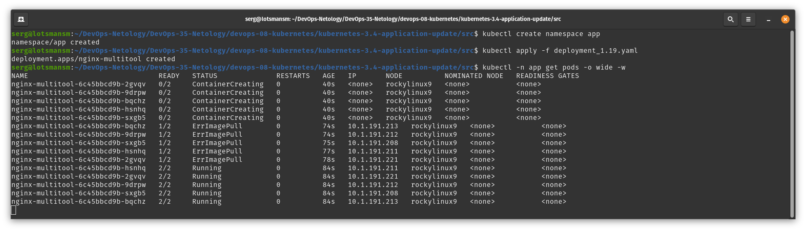
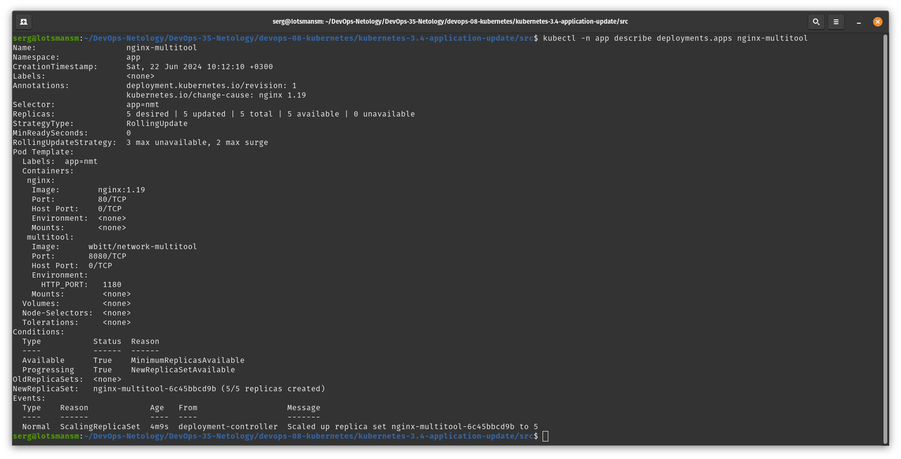
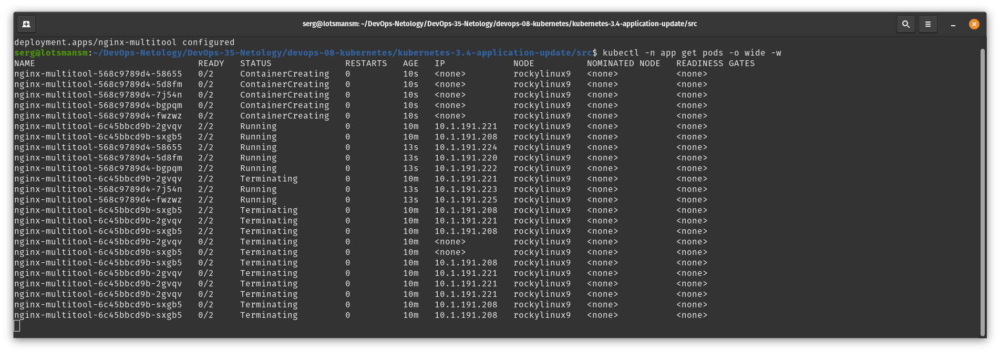
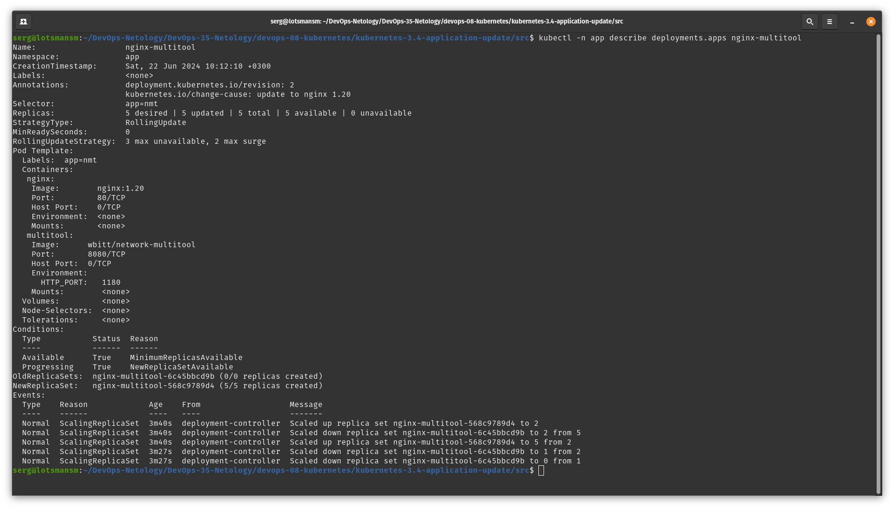
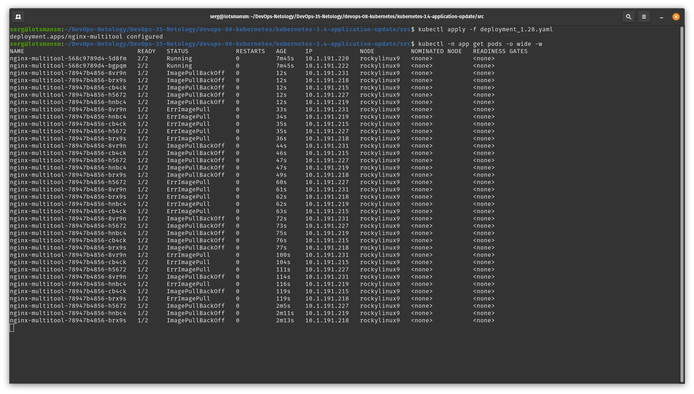

# Домашнее задание к занятию «Обновление приложений»

### Цель задания

Выбрать и настроить стратегию обновления приложения.

### Чеклист готовности к домашнему заданию

1. Кластер K8s.

### Инструменты и дополнительные материалы, которые пригодятся для выполнения задания

1. [Документация Updating a Deployment](https://kubernetes.io/docs/concepts/workloads/controllers/deployment/#updating-a-deployment).
2. [Статья про стратегии обновлений](https://habr.com/ru/companies/flant/articles/471620/).

-----

### Задание 1. Выбрать стратегию обновления приложения и описать ваш выбор

1. Имеется приложение, состоящее из нескольких реплик, которое требуется обновить.
2. Ресурсы, выделенные для приложения, ограничены, и нет возможности их увеличить.
3. Запас по ресурсам в менее загруженный момент времени составляет 20%.
4. Обновление мажорное, новые версии приложения не умеют работать со старыми.
5. Вам нужно объяснить свой выбор стратегии обновления приложения.

### Решение задания 1. Выбрать стратегию обновления приложения и описать ваш выбор

Считаю, что для описанных условий наиболее подходит стратегия `Rolling Update`. Это стратегия обновления по умолчанию и она не требовательна к ресурсам. Поскольку есть ограничения по ресурсам, то необходимо использовать параметры

```
maxSurge: 20%
maxUnavailable: 20%
```

`maxSurge: 20%` даст возможность дополнительно запустить 20% реплик с новой версией приложения сверх имеющегося количества. Например, если у меня 5 реплик приложения, то `maxSurge: 20%` даст возможность запустить еще одну реплику приложения с новой версией.

`maxUnavailable: 20%` даст возможность выключить 20% реплик со старой версией приложения во время обновления. Например, если у меня 5 реплик приложения, то во время обновления будет выключена одна реплика чтобы дать ресурсы реплике с новым приложением.

Но если учитывать то, что обновления мажорное и новые версии приложения не умеют работать со старыми, то можно поставить параметр `maxUnavailable: 100%`. Это позволит не удалять старые реплики до проверки новых. Старые реплики будут занимать ресурсы, но если обращений к этим репликам не будет, то значительного потребления ресурсов они не вызовут. После проверки новых реплик можно будет удалить старые.

Также стоит помнить, что обновления лучше проводить в то время, когда зафиксирован наибольший период простоя кластера Kubernetes.

Но если ресурсов нет совсем, то можно применить стратегию обновления `Recreate`. Это приведет к остановке старых подов, соответственно прекращению любых запросов к нему. После остановки старых подов создадутся новые поды и полностью удалятся старые поды.

### Задание 2. Обновить приложение

1. Создать deployment приложения с контейнерами nginx и multitool. Версию nginx взять 1.19. Количество реплик — 5.
2. Обновить версию nginx в приложении до версии 1.20, сократив время обновления до минимума. Приложение должно быть доступно.
3. Попытаться обновить nginx до версии 1.28, приложение должно оставаться доступным.
4. Откатиться после неудачного обновления.

### Решение задания 2. Обновить приложение

1. Пишу манифест deployment приложения с контейнерами nginx и multitool [deployment_1.19.yaml](/devops-08-kubernetes/kubernetes-3.4-application-update/src/deployment_1.19.yaml). Версию nginx для начала использую 1.19. Количество реплик — 5.

Применяю манифест, получаю 5 реплик приложения, где используется nginx версии 1.19:

```bash
╰─➤kubectl create namespace app
namespace/app created

╰─➤kubectl apply -f deployment_1.19.yaml 
deployment.apps/nginx-multitool created

╰─➤kubectl -n app get pods -o wide -w
NAME                               READY   STATUS              RESTARTS   AGE   IP       NODE          NOMINATED NODE   READINESS GATES
nginx-multitool-6c45bbcd9b-2gvqv   0/2     ContainerCreating   0          40s   <none>   rockylinux9   <none>           <none>
nginx-multitool-6c45bbcd9b-9drpw   0/2     ContainerCreating   0          40s   <none>   rockylinux9   <none>           <none>
nginx-multitool-6c45bbcd9b-bqchz   0/2     ContainerCreating   0          40s   <none>   rockylinux9   <none>           <none>
nginx-multitool-6c45bbcd9b-hsnhq   0/2     ContainerCreating   0          40s   <none>   rockylinux9   <none>           <none>
nginx-multitool-6c45bbcd9b-sxgb5   0/2     ContainerCreating   0          40s   <none>   rockylinux9   <none>           <none>
nginx-multitool-6c45bbcd9b-bqchz   1/2     ErrImagePull        0          74s   10.1.191.213   rockylinux9   <none>           <none>
nginx-multitool-6c45bbcd9b-9drpw   1/2     ErrImagePull        0          74s   10.1.191.212   rockylinux9   <none>           <none>
nginx-multitool-6c45bbcd9b-sxgb5   1/2     ErrImagePull        0          75s   10.1.191.208   rockylinux9   <none>           <none>
nginx-multitool-6c45bbcd9b-hsnhq   1/2     ErrImagePull        0          77s   10.1.191.211   rockylinux9   <none>           <none>
nginx-multitool-6c45bbcd9b-2gvqv   1/2     ErrImagePull        0          78s   10.1.191.221   rockylinux9   <none>           <none>
nginx-multitool-6c45bbcd9b-hsnhq   2/2     Running             0          84s   10.1.191.211   rockylinux9   <none>           <none>
nginx-multitool-6c45bbcd9b-2gvqv   2/2     Running             0          84s   10.1.191.221   rockylinux9   <none>           <none>
nginx-multitool-6c45bbcd9b-9drpw   2/2     Running             0          84s   10.1.191.212   rockylinux9   <none>           <none>
nginx-multitool-6c45bbcd9b-sxgb5   2/2     Running             0          84s   10.1.191.208   rockylinux9   <none>           <none>
nginx-multitool-6c45bbcd9b-bqchz   2/2     Running             0          84s   10.1.191.213   rockylinux9   <none>           <none>
```



```bash
╰─➤kubectl -n app describe deployments.apps nginx-multitool 
Name:                   nginx-multitool
Namespace:              app
CreationTimestamp:      Sat, 22 Jun 2024 10:12:10 +0300
Labels:                 <none>
Annotations:            deployment.kubernetes.io/revision: 1
                        kubernetes.io/change-cause: nginx 1.19
Selector:               app=nmt
Replicas:               5 desired | 5 updated | 5 total | 5 available | 0 unavailable
StrategyType:           RollingUpdate
MinReadySeconds:        0
RollingUpdateStrategy:  3 max unavailable, 2 max surge
Pod Template:
  Labels:  app=nmt
  Containers:
   nginx:
    Image:        nginx:1.19
    Port:         80/TCP
    Host Port:    0/TCP
    Environment:  <none>
    Mounts:       <none>
   multitool:
    Image:      wbitt/network-multitool
    Port:       8080/TCP
    Host Port:  0/TCP
    Environment:
      HTTP_PORT:   1180
    Mounts:        <none>
  Volumes:         <none>
  Node-Selectors:  <none>
  Tolerations:     <none>
Conditions:
  Type           Status  Reason
  ----           ------  ------
  Available      True    MinimumReplicasAvailable
  Progressing    True    NewReplicaSetAvailable
OldReplicaSets:  <none>
NewReplicaSet:   nginx-multitool-6c45bbcd9b (5/5 replicas created)
Events:
  Type    Reason             Age   From                   Message
  ----    ------             ----  ----                   -------
  Normal  ScalingReplicaSet  4m9s  deployment-controller  Scaled up replica set nginx-multitool-6c45bbcd9b to 5
```



2. Обновляю версию nginx в манифесте deployment до 1.20, также меняю аннотацию для дальнейшего понимания происходящих изменений. Стратегию обновления выберу RollingUpdate, в параметр `maxSurge` поставлю значение 2, в параметр `maxUnavailable` поставлю значение 3. Это даст возможность оставить работающими 2 реплики приложения со старой версией даже при проблемах с обновлением, что выполнит условие доступности приложения. Три реплики приложения начнут выключаться и вместо них будут создаваться три реплики с новой версией nginx. После запуска трех реплик с новой версией приложения, две старые реплики будут уничтожены и вместо них запустятся две реплики с новой версией приложения.

Применяю манифест с обновлением версии nginx:

```bash
╰─➤kubectl apply -f deployment_1.20.yaml 
deployment.apps/nginx-multitool configured

╰─➤kubectl -n app get pods -o wide -w
NAME                               READY   STATUS              RESTARTS   AGE   IP             NODE          NOMINATED NODE   READINESS GATES
nginx-multitool-568c9789d4-58655   0/2     ContainerCreating   0          10s   <none>         rockylinux9   <none>           <none>
nginx-multitool-568c9789d4-5d8fm   0/2     ContainerCreating   0          10s   <none>         rockylinux9   <none>           <none>
nginx-multitool-568c9789d4-7j54n   0/2     ContainerCreating   0          10s   <none>         rockylinux9   <none>           <none>
nginx-multitool-568c9789d4-bgpqm   0/2     ContainerCreating   0          10s   <none>         rockylinux9   <none>           <none>
nginx-multitool-568c9789d4-fwzwz   0/2     ContainerCreating   0          10s   <none>         rockylinux9   <none>           <none>
nginx-multitool-6c45bbcd9b-2gvqv   2/2     Running             0          10m   10.1.191.221   rockylinux9   <none>           <none>
nginx-multitool-6c45bbcd9b-sxgb5   2/2     Running             0          10m   10.1.191.208   rockylinux9   <none>           <none>
nginx-multitool-568c9789d4-58655   2/2     Running             0          13s   10.1.191.224   rockylinux9   <none>           <none>
nginx-multitool-568c9789d4-5d8fm   2/2     Running             0          13s   10.1.191.220   rockylinux9   <none>           <none>
nginx-multitool-568c9789d4-bgpqm   2/2     Running             0          13s   10.1.191.222   rockylinux9   <none>           <none>
nginx-multitool-6c45bbcd9b-2gvqv   2/2     Terminating         0          10m   10.1.191.221   rockylinux9   <none>           <none>
nginx-multitool-568c9789d4-7j54n   2/2     Running             0          13s   10.1.191.223   rockylinux9   <none>           <none>
nginx-multitool-568c9789d4-fwzwz   2/2     Running             0          13s   10.1.191.225   rockylinux9   <none>           <none>
nginx-multitool-6c45bbcd9b-sxgb5   2/2     Terminating         0          10m   10.1.191.208   rockylinux9   <none>           <none>
nginx-multitool-6c45bbcd9b-2gvqv   2/2     Terminating         0          10m   10.1.191.221   rockylinux9   <none>           <none>
nginx-multitool-6c45bbcd9b-sxgb5   2/2     Terminating         0          10m   10.1.191.208   rockylinux9   <none>           <none>
nginx-multitool-6c45bbcd9b-2gvqv   0/2     Terminating         0          10m   <none>         rockylinux9   <none>           <none>
nginx-multitool-6c45bbcd9b-sxgb5   0/2     Terminating         0          10m   <none>         rockylinux9   <none>           <none>
nginx-multitool-6c45bbcd9b-sxgb5   0/2     Terminating         0          10m   10.1.191.208   rockylinux9   <none>           <none>
nginx-multitool-6c45bbcd9b-2gvqv   0/2     Terminating         0          10m   10.1.191.221   rockylinux9   <none>           <none>
nginx-multitool-6c45bbcd9b-2gvqv   0/2     Terminating         0          10m   10.1.191.221   rockylinux9   <none>           <none>
nginx-multitool-6c45bbcd9b-2gvqv   0/2     Terminating         0          10m   10.1.191.221   rockylinux9   <none>           <none>
nginx-multitool-6c45bbcd9b-sxgb5   0/2     Terminating         0          10m   10.1.191.208   rockylinux9   <none>           <none>
nginx-multitool-6c45bbcd9b-sxgb5   0/2     Terminating         0          10m   10.1.191.208   rockylinux9   <none>           <none>
```



Постепенно запустилось 5 подов с новой версией nginx. В процессе обновления сначала 2 старых пода продолжали работать, 3 пода выключились и 3 пода создались, после чего 2 старых пода выключились и вместо них запустились 2 новых пода. Версия nginx обновилась до 1.20:

```bash
╰─➤kubectl -n app describe deployments.apps nginx-multitool 
Name:                   nginx-multitool
Namespace:              app
CreationTimestamp:      Sat, 22 Jun 2024 10:12:10 +0300
Labels:                 <none>
Annotations:            deployment.kubernetes.io/revision: 2
                        kubernetes.io/change-cause: update to nginx 1.20
Selector:               app=nmt
Replicas:               5 desired | 5 updated | 5 total | 5 available | 0 unavailable
StrategyType:           RollingUpdate
MinReadySeconds:        0
RollingUpdateStrategy:  3 max unavailable, 2 max surge
Pod Template:
  Labels:  app=nmt
  Containers:
   nginx:
    Image:        nginx:1.20
    Port:         80/TCP
    Host Port:    0/TCP
    Environment:  <none>
    Mounts:       <none>
   multitool:
    Image:      wbitt/network-multitool
    Port:       8080/TCP
    Host Port:  0/TCP
    Environment:
      HTTP_PORT:   1180
    Mounts:        <none>
  Volumes:         <none>
  Node-Selectors:  <none>
  Tolerations:     <none>
Conditions:
  Type           Status  Reason
  ----           ------  ------
  Available      True    MinimumReplicasAvailable
  Progressing    True    NewReplicaSetAvailable
OldReplicaSets:  nginx-multitool-6c45bbcd9b (0/0 replicas created)
NewReplicaSet:   nginx-multitool-568c9789d4 (5/5 replicas created)
Events:
  Type    Reason             Age    From                   Message
  ----    ------             ----   ----                   -------
  Normal  ScalingReplicaSet  3m40s  deployment-controller  Scaled up replica set nginx-multitool-568c9789d4 to 2
  Normal  ScalingReplicaSet  3m40s  deployment-controller  Scaled down replica set nginx-multitool-6c45bbcd9b to 2 from 5
  Normal  ScalingReplicaSet  3m40s  deployment-controller  Scaled up replica set nginx-multitool-568c9789d4 to 5 from 2
  Normal  ScalingReplicaSet  3m27s  deployment-controller  Scaled down replica set nginx-multitool-6c45bbcd9b to 1 from 2
  Normal  ScalingReplicaSet  3m27s  deployment-controller  Scaled down replica set nginx-multitool-6c45bbcd9b to 0 from 1
```



Историю обновлений можно посмотреть командой `kubectl -n app rollout history deployment`:

```bash
╰─➤kubectl -n app rollout history deployment
deployment.apps/nginx-multitool 
REVISION  CHANGE-CAUSE
1         nginx 1.19
2         update to nginx 1.20
```

В настоящее время нахожусь на второй ревизии приложения.

Ссылка на манифест deployment: [deployment_1.20.yaml](/devops-08-kubernetes/kubernetes-3.4-application-update/src/deployment_1.20.yaml)

3. Попытаюсь обновить версию nginx до 1.28:

```bash
╰─➤kubectl apply -f deployment_1.28.yaml 
deployment.apps/nginx-multitool configured

╰─➤kubectl -n app get pods -o wide -w
NAME                               READY   STATUS             RESTARTS   AGE     IP             NODE          NOMINATED NODE   READINESS GATES
nginx-multitool-568c9789d4-5d8fm   2/2     Running            0          7m45s   10.1.191.220   rockylinux9   <none>           <none>
nginx-multitool-568c9789d4-bgpqm   2/2     Running            0          7m45s   10.1.191.222   rockylinux9   <none>           <none>
nginx-multitool-78947b4856-8vr9n   1/2     ImagePullBackOff   0          12s     10.1.191.231   rockylinux9   <none>           <none>
nginx-multitool-78947b4856-brx9s   1/2     ImagePullBackOff   0          12s     10.1.191.218   rockylinux9   <none>           <none>
nginx-multitool-78947b4856-cb4ck   1/2     ImagePullBackOff   0          12s     10.1.191.215   rockylinux9   <none>           <none>
nginx-multitool-78947b4856-h5672   1/2     ImagePullBackOff   0          12s     10.1.191.227   rockylinux9   <none>           <none>
nginx-multitool-78947b4856-hnbc4   1/2     ImagePullBackOff   0          12s     10.1.191.219   rockylinux9   <none>           <none>
nginx-multitool-78947b4856-8vr9n   1/2     ErrImagePull       0          33s     10.1.191.231   rockylinux9   <none>           <none>
nginx-multitool-78947b4856-hnbc4   1/2     ErrImagePull       0          34s     10.1.191.219   rockylinux9   <none>           <none>
nginx-multitool-78947b4856-cb4ck   1/2     ErrImagePull       0          35s     10.1.191.215   rockylinux9   <none>           <none>
nginx-multitool-78947b4856-h5672   1/2     ErrImagePull       0          35s     10.1.191.227   rockylinux9   <none>           <none>
nginx-multitool-78947b4856-brx9s   1/2     ErrImagePull       0          36s     10.1.191.218   rockylinux9   <none>           <none>
nginx-multitool-78947b4856-8vr9n   1/2     ImagePullBackOff   0          44s     10.1.191.231   rockylinux9   <none>           <none>
nginx-multitool-78947b4856-cb4ck   1/2     ImagePullBackOff   0          46s     10.1.191.215   rockylinux9   <none>           <none>
nginx-multitool-78947b4856-h5672   1/2     ImagePullBackOff   0          47s     10.1.191.227   rockylinux9   <none>           <none>
nginx-multitool-78947b4856-hnbc4   1/2     ImagePullBackOff   0          47s     10.1.191.219   rockylinux9   <none>           <none>
nginx-multitool-78947b4856-brx9s   1/2     ImagePullBackOff   0          49s     10.1.191.218   rockylinux9   <none>           <none>
nginx-multitool-78947b4856-h5672   1/2     ErrImagePull       0          60s     10.1.191.227   rockylinux9   <none>           <none>
nginx-multitool-78947b4856-8vr9n   1/2     ErrImagePull       0          61s     10.1.191.231   rockylinux9   <none>           <none>
nginx-multitool-78947b4856-brx9s   1/2     ErrImagePull       0          62s     10.1.191.218   rockylinux9   <none>           <none>
nginx-multitool-78947b4856-hnbc4   1/2     ErrImagePull       0          62s     10.1.191.219   rockylinux9   <none>           <none>
nginx-multitool-78947b4856-cb4ck   1/2     ErrImagePull       0          63s     10.1.191.215   rockylinux9   <none>           <none>
nginx-multitool-78947b4856-8vr9n   1/2     ImagePullBackOff   0          72s     10.1.191.231   rockylinux9   <none>           <none>
nginx-multitool-78947b4856-h5672   1/2     ImagePullBackOff   0          73s     10.1.191.227   rockylinux9   <none>           <none>
nginx-multitool-78947b4856-hnbc4   1/2     ImagePullBackOff   0          75s     10.1.191.219   rockylinux9   <none>           <none>
nginx-multitool-78947b4856-cb4ck   1/2     ImagePullBackOff   0          76s     10.1.191.215   rockylinux9   <none>           <none>
nginx-multitool-78947b4856-brx9s   1/2     ImagePullBackOff   0          77s     10.1.191.218   rockylinux9   <none>           <none>
nginx-multitool-78947b4856-8vr9n   1/2     ErrImagePull       0          100s    10.1.191.231   rockylinux9   <none>           <none>
nginx-multitool-78947b4856-cb4ck   1/2     ErrImagePull       0          104s    10.1.191.215   rockylinux9   <none>           <none>
nginx-multitool-78947b4856-h5672   1/2     ErrImagePull       0          111s    10.1.191.227   rockylinux9   <none>           <none>
nginx-multitool-78947b4856-8vr9n   1/2     ImagePullBackOff   0          114s    10.1.191.231   rockylinux9   <none>           <none>
nginx-multitool-78947b4856-hnbc4   1/2     ErrImagePull       0          116s    10.1.191.219   rockylinux9   <none>           <none>
nginx-multitool-78947b4856-cb4ck   1/2     ImagePullBackOff   0          119s    10.1.191.215   rockylinux9   <none>           <none>
nginx-multitool-78947b4856-brx9s   1/2     ErrImagePull       0          119s    10.1.191.218   rockylinux9   <none>           <none>
nginx-multitool-78947b4856-h5672   1/2     ImagePullBackOff   0          2m5s    10.1.191.227   rockylinux9   <none>           <none>
nginx-multitool-78947b4856-hnbc4   1/2     ImagePullBackOff   0          2m11s   10.1.191.219   rockylinux9   <none>           <none>
nginx-multitool-78947b4856-brx9s   1/2     ImagePullBackOff   0          2m13s   10.1.191.218   rockylinux9   <none>           <none>
```



Видно, что две старые реплики продолжают работать, но три новые не могут запуститься из-за отсутствия образа nginx 1.28. За счет двух старых реплик доступность приложения сохраняется.

Ссылка на манифест deployment: [deployment_1.28.yaml](/devops-08-kubernetes/kubernetes-3.4-application-update/src/deployment_1.28.yaml)

4. Откачусь к прошлой версии приложения после неудачного обновления:

```bash
╰─➤kubectl -n app rollout undo deployment nginx-multitool 
deployment.apps/nginx-multitool rolled back

╰─➤kubectl -n app get pods -o wide -w
NAME                               READY   STATUS    RESTARTS   AGE   IP             NODE          NOMINATED NODE   READINESS GATES
nginx-multitool-568c9789d4-589p9   2/2     Running   0          6s    10.1.191.204   rockylinux9   <none>           <none>
nginx-multitool-568c9789d4-5d8fm   2/2     Running   0          14m   10.1.191.220   rockylinux9   <none>           <none>
nginx-multitool-568c9789d4-bgpqm   2/2     Running   0          14m   10.1.191.222   rockylinux9   <none>           <none>
nginx-multitool-568c9789d4-rcn2z   2/2     Running   0          6s    10.1.191.203   rockylinux9   <none>           <none>
nginx-multitool-568c9789d4-x2x46   2/2     Running   0          6s    10.1.191.207   rockylinux9   <none>           <none>
```

Те поды, что не смогли запуститься при прошлом обновлении были уничтожены, а вместо них запустились три пода с прошлой версией обновления.

Финальная история обновлений выглядит следующим образом:

```bash
╰─➤kubectl -n app rollout history deployment
deployment.apps/nginx-multitool 
REVISION  CHANGE-CAUSE
1         nginx 1.19
3         update to nginx 1.28
4         update to nginx 1.20
```

Поскольку на второй ревизии с обновлял версия nginx до 1.20, но дальше я на эту же версию откатился, то в истории была удалена вторя ревизия и текущая ревизия запущенного проложения стала четвертой.

### Задание 3*. Создать Canary deployment

1. Создать два deployment'а приложения nginx.
2. При помощи разных ConfigMap сделать две версии приложения — веб-страницы.
3. С помощью ingress создать канареечный деплоймент, чтобы можно было часть трафика перебросить на разные версии приложения.

### Выполнение задания 3*. Создать Canary deployment

# Задание 3* не делал