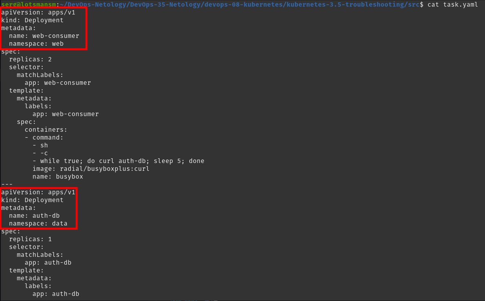

# Домашнее задание к занятию Troubleshooting

### Цель задания

Устранить неисправности при деплое приложения.

### Чеклист готовности к домашнему заданию

1. Кластер K8s.

### Задание. При деплое приложение web-consumer не может подключиться к auth-db. Необходимо это исправить

1. Установить приложение по команде:
```shell
kubectl apply -f https://raw.githubusercontent.com/netology-code/kuber-homeworks/main/3.5/files/task.yaml
```
2. Выявить проблему и описать.
3. Исправить проблему, описать, что сделано.
4. Продемонстрировать, что проблема решена.

### Решение задания. При деплое приложение web-consumer не может подключиться к auth-db. Необходимо это исправить

1. Устанавливаю приложение по указанной команде. Сразу вижу, что в кластере нет указанных в манифесте namespace:

```bash
╰─➤kubectl apply -f https://raw.githubusercontent.com/netology-code/kuber-homeworks/main/3.5/files/task.yaml
Error from server (NotFound): error when creating "https://raw.githubusercontent.com/netology-code/kuber-homeworks/main/3.5/files/task.yaml": namespaces "web" not found
Error from server (NotFound): error when creating "https://raw.githubusercontent.com/netology-code/kuber-homeworks/main/3.5/files/task.yaml": namespaces "data" not found
Error from server (NotFound): error when creating "https://raw.githubusercontent.com/netology-code/kuber-homeworks/main/3.5/files/task.yaml": namespaces "data" not found
```

Создаю namespace, скачаю манифест и продолжаю установку приложения:

```bash
╰─➤kubectl create ns data && kubectl create ns web
namespace/data created
namespace/web created

╰─➤wget https://raw.githubusercontent.com/netology-code/kuber-homeworks/main/3.5/files/task.yaml
--2024-06-25 21:24:32--  https://raw.githubusercontent.com/netology-code/kuber-homeworks/main/3.5/files/task.yaml
Распознаётся raw.githubusercontent.com (raw.githubusercontent.com)… 185.199.110.133, 185.199.109.133, 185.199.111.133, ...
Подключение к raw.githubusercontent.com (raw.githubusercontent.com)|185.199.110.133|:443... соединение установлено.
HTTP-запрос отправлен. Ожидание ответа… 200 OK
Длина: 937 [text/plain]
Сохранение в: ‘task.yaml’

task.yaml                                   100%[========================================================================================>]     937  --.-KB/s    за 0s      

2024-06-25 21:24:32 (64,6 MB/s) - ‘task.yaml’ сохранён [937/937]

╰─➤kubectl apply -f task.yaml
deployment.apps/web-consumer created
deployment.apps/auth-db created
service/auth-db created
```

Проверю статус deployments и pods:

```bash
╰─➤kubectl -n data get pods
NAME                       READY   STATUS    RESTARTS   AGE
auth-db-7b5cdbdc77-z866b   1/1     Running   0          14s

╰─➤kubectl -n data get deployments
NAME      READY   UP-TO-DATE   AVAILABLE   AGE
auth-db   1/1     1            1           26s

╰─➤kubectl -n web get pods
NAME                            READY   STATUS    RESTARTS   AGE
web-consumer-5f87765478-x6lm9   1/1     Running   0          45s
web-consumer-5f87765478-xj9vk   1/1     Running   0          45s
```

Deployments и pods запущены, ошибок нет.

2. Проверю статус  приложений внутри подов. Проверять буду с помощью просмотра логов подов:

```bash
╰─➤kubectl -n data logs auth-db-7b5cdbdc77-z866b 
/docker-entrypoint.sh: /docker-entrypoint.d/ is not empty, will attempt to perform configuration
/docker-entrypoint.sh: Looking for shell scripts in /docker-entrypoint.d/
/docker-entrypoint.sh: Launching /docker-entrypoint.d/10-listen-on-ipv6-by-default.sh
10-listen-on-ipv6-by-default.sh: Getting the checksum of /etc/nginx/conf.d/default.conf
10-listen-on-ipv6-by-default.sh: Enabled listen on IPv6 in /etc/nginx/conf.d/default.conf
/docker-entrypoint.sh: Launching /docker-entrypoint.d/20-envsubst-on-templates.sh
/docker-entrypoint.sh: Configuration complete; ready for start up

╰─➤kubectl -n web logs web-consumer-5f87765478-x6lm9 
curl: (6) Couldn't resolve host 'auth-db'
curl: (6) Couldn't resolve host 'auth-db'
curl: (6) Couldn't resolve host 'auth-db'
curl: (6) Couldn't resolve host 'auth-db'
curl: (6) Couldn't resolve host 'auth-db'
curl: (6) Couldn't resolve host 'auth-db'
curl: (6) Couldn't resolve host 'auth-db'
curl: (6) Couldn't resolve host 'auth-db'
```

Видно, что в приложении деплоймента auth-db все в порядке, но с приложением деплоймента web-consumer есть проблема, оно не может достучаться до auth-db по имени хоста.

Причина проблемы в том, что деплойменты находятся в разных namespace.



3. Вижу 2 варианта исправления данной проблемы:

      1. внести все поды в один  namespace

      2. в строке команды `curl auth-db` заменю на `curl auth-db.data`

Подозреваю, что поды разнесены не просто так по разным неймспейсам, поэтому воспользуюсь вторым вариантом. Отредактирую манифест деплоймента web-consumer и в строке команды `curl auth-db` заменю на `curl auth-db.data`:

[Ссылка на отредактированный манифест task.yaml](src/task.yaml)

Применяю манифест обновленного деплоймента и проверю логи пода web-consumer:

```bash
╰─➤kubectl apply -f task.yaml
deployment.apps/web-consumer configured
deployment.apps/auth-db unchanged
service/auth-db unchanged

╰─➤kubectl -n data logs auth-db-7b5cdbdc77-z866b 
/docker-entrypoint.sh: /docker-entrypoint.d/ is not empty, will attempt to perform configuration
/docker-entrypoint.sh: Looking for shell scripts in /docker-entrypoint.d/
/docker-entrypoint.sh: Launching /docker-entrypoint.d/10-listen-on-ipv6-by-default.sh
10-listen-on-ipv6-by-default.sh: Getting the checksum of /etc/nginx/conf.d/default.conf
10-listen-on-ipv6-by-default.sh: Enabled listen on IPv6 in /etc/nginx/conf.d/default.conf
/docker-entrypoint.sh: Launching /docker-entrypoint.d/20-envsubst-on-templates.sh
/docker-entrypoint.sh: Configuration complete; ready for start up
10.1.191.246 - - [25/Jun/2024:19:41:06 +0000] "GET / HTTP/1.1" 200 612 "-" "curl/7.35.0" "-"
10.1.191.236 - - [25/Jun/2024:19:41:06 +0000] "GET / HTTP/1.1" 200 612 "-" "curl/7.35.0" "-"
10.1.191.246 - - [25/Jun/2024:19:41:11 +0000] "GET / HTTP/1.1" 200 612 "-" "curl/7.35.0" "-"
10.1.191.236 - - [25/Jun/2024:19:41:11 +0000] "GET / HTTP/1.1" 200 612 "-" "curl/7.35.0" "-"


╰─➤kubectl -n web logs web-consumer-76669b5d6d-79dmv 
  % Total    % Received % Xferd  Average Speed   Time    Time     Time  Current
                                 Dload  Upload   Total   Spent    Left  Speed
<!DOCTYPE html>
<html>
<head>
100   612  100   612    0     0   152k      0 --:--:-- --:--:-- --:--:--  597k
<title>Welcome to nginx!</title>
<style>
    body {
        width: 35em;
        margin: 0 auto;
        font-family: Tahoma, Verdana, Arial, sans-serif;
    }
</style>
</head>
<body>
<h1>Welcome to nginx!</h1>
<p>If you see this page, the nginx web server is successfully installed and
working. Further configuration is required.</p>

<p>For online documentation and support please refer to
<a href="http://nginx.org/">nginx.org</a>.<br/>
Commercial support is available at
<a href="http://nginx.com/">nginx.com</a>.</p>

<p><em>Thank you for using nginx.</em></p>
</body>
</html>
```

Приложение в поде работает корректно, команда curl auth-db.data выполняется каждые 5 секунд.

Проблема решена, задание выполнено.