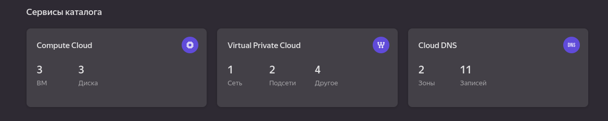
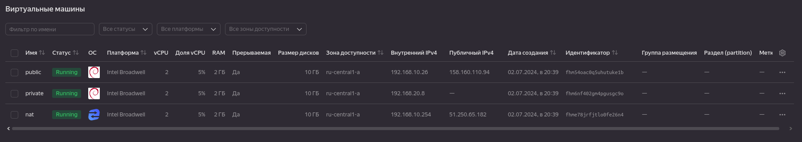
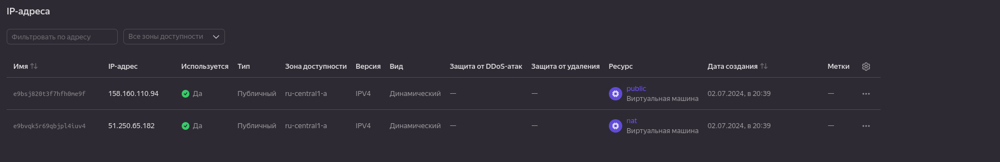
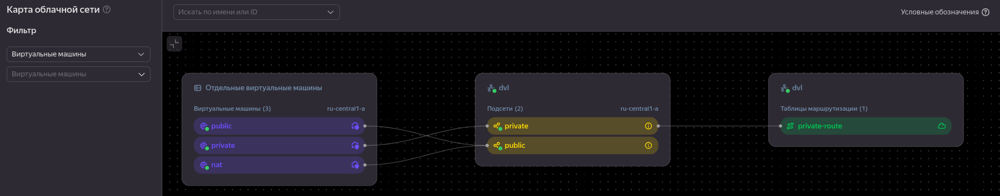
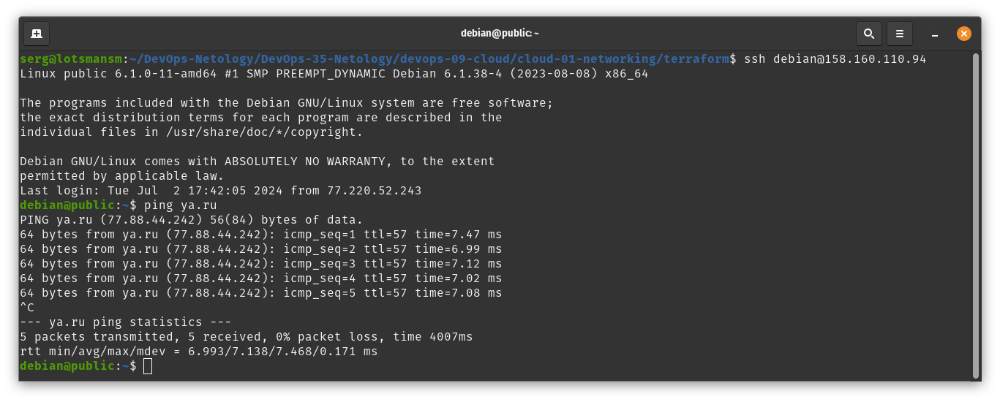
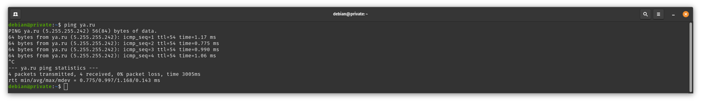
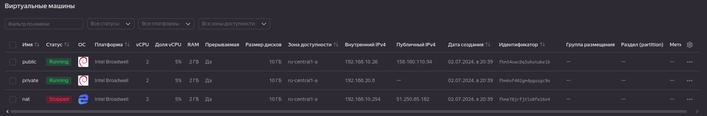
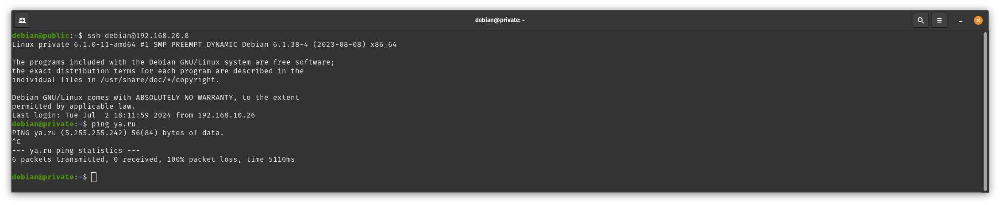
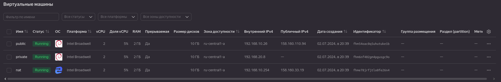

# Домашнее задание к занятию «Организация сети»

### Подготовка к выполнению задания

1. Домашнее задание состоит из обязательной части, которую нужно выполнить на провайдере Yandex Cloud, и дополнительной части в AWS (выполняется по желанию). 
2. Все домашние задания в блоке 15 связаны друг с другом и в конце представляют пример законченной инфраструктуры.  
3. Все задания нужно выполнить с помощью Terraform. Результатом выполненного домашнего задания будет код в репозитории. 
4. Перед началом работы настройте доступ к облачным ресурсам из Terraform, используя материалы прошлых лекций и домашнее задание по теме «Облачные провайдеры и синтаксис Terraform». Заранее выберите регион (в случае AWS) и зону.

---
### Задание 1. Yandex Cloud 

**Что нужно сделать**

1. Создать пустую VPC. Выбрать зону.
2. Публичная подсеть.

 - Создать в VPC subnet с названием public, сетью 192.168.10.0/24.
 - Создать в этой подсети NAT-инстанс, присвоив ему адрес 192.168.10.254. В качестве image_id использовать fd80mrhj8fl2oe87o4e1.
 - Создать в этой публичной подсети виртуалку с публичным IP, подключиться к ней и убедиться, что есть доступ к интернету.
3. Приватная подсеть.
 - Создать в VPC subnet с названием private, сетью 192.168.20.0/24.
 - Создать route table. Добавить статический маршрут, направляющий весь исходящий трафик private сети в NAT-инстанс.
 - Создать в этой приватной подсети виртуалку с внутренним IP, подключиться к ней через виртуалку, созданную ранее, и убедиться, что есть доступ к интернету.

Resource Terraform для Yandex Cloud:

- [VPC subnet](https://registry.terraform.io/providers/yandex-cloud/yandex/latest/docs/resources/vpc_subnet).
- [Route table](https://registry.terraform.io/providers/yandex-cloud/yandex/latest/docs/resources/vpc_route_table).
- [Compute Instance](https://registry.terraform.io/providers/yandex-cloud/yandex/latest/docs/resources/compute_instance).

### Решение задания 1. Yandex Cloud

1. Создаю пустую VPC с именем dvl:

```
resource "yandex_vpc_network" "dvl" {
  name = var.vpc_name

variable "vpc_name" {
  type        = string
  default     = "dvl"
  description = "VPC network"
}
```

2. Создаю в VPC публичную подсеть с названием public, сетью 192.168.10.0/24:

```
resource "yandex_vpc_subnet" "public" {
  name           = var.public_subnet
  zone           = var.default_zone
  network_id     = yandex_vpc_network.dvl.id
  v4_cidr_blocks = var.public_cidr
}

variable "public_cidr" {
  type        = list(string)
  default     = ["192.168.10.0/24"]
  description = "https://cloud.yandex.ru/docs/vpc/operations/subnet-create"
}

variable "public_subnet" {
  type        = string
  default     = "public"
  description = "subnet name"
}
```

Также ресурс и переменные можно посмотреть в файлах [network.tf](terraform/network.tf) и [variables.tf](terraform/variables.tf).

* Создаю в публичной подсети NAT-инстанс, присвоив ему адрес 192.168.10.254. В качестве image_id использую fd80mrhj8fl2oe87o4e1.

Листинг инстанса можно посмотреть в файле [nat_instance.tf](terraform/nat_instance.tf)

* Создаю в публичной подсети виртуальную машину с публичным IP.

Листинг виртуальной машины можно посмотреть в файле [public.tf](terraform/public.tf)

3. Создаю в VPC приватную подсеть с названием private, сетью 192.168.20.0/24:

```
resource "yandex_vpc_subnet" "private" {
  name           = var.private_subnet
  zone           = var.default_zone
  network_id     = yandex_vpc_network.dvl.id
  v4_cidr_blocks = var.private_cidr
  route_table_id = yandex_vpc_route_table.private-route.id
}

variable "private_cidr" {
  type        = list(string)
  default     = ["192.168.20.0/24"]
  description = "https://cloud.yandex.ru/docs/vpc/operations/subnet-create"
}

variable "private_subnet" {
  type        = string
  default     = "private"
  description = "subnet name"
}
```
Также ресурс и переменные можно посмотреть в файлах [network.tf](terraform/network.tf) и [variables.tf](terraform/variables.tf).

* Создаю route table. Добавляю статический маршрут, направляющий весь исходящий трафик private сети в NAT-инстанс:

```
resource "yandex_vpc_route_table" "private-route" {
  name       = "private-route"
  network_id = yandex_vpc_network.dvl.id
  static_route {
    destination_prefix = "0.0.0.0/0"
    next_hop_address   = "192.168.10.254"
  }
}
```

* Создаю в приватной подсети виртуальную машину с внутренним IP, внешний IP будет отсутствовать.

Листинг виртуальной машины можно посмотреть в файле [private.tf](terraform/private.tf)

Инициализирую проект, выполню код:

```bash
╰─➤terraform init
Initializing the backend...
Initializing provider plugins...
- Finding latest version of yandex-cloud/yandex...
- Installing yandex-cloud/yandex v0.123.0...
- Installed yandex-cloud/yandex v0.123.0 (unauthenticated)
Terraform has created a lock file .terraform.lock.hcl to record the provider
selections it made above. Include this file in your version control repository
so that Terraform can guarantee to make the same selections by default when
you run "terraform init" in the future.

╷
│ Warning: Incomplete lock file information for providers
│ 
│ Due to your customized provider installation methods, Terraform was forced to calculate lock file checksums locally for the following providers:
│   - yandex-cloud/yandex
│ 
│ The current .terraform.lock.hcl file only includes checksums for linux_amd64, so Terraform running on another platform will fail to install these providers.
│ 
│ To calculate additional checksums for another platform, run:
│   terraform providers lock -platform=linux_amd64
│ (where linux_amd64 is the platform to generate)
╵
Terraform has been successfully initialized!

You may now begin working with Terraform. Try running "terraform plan" to see
any changes that are required for your infrastructure. All Terraform commands
should now work.

If you ever set or change modules or backend configuration for Terraform,
rerun this command to reinitialize your working directory. If you forget, other
commands will detect it and remind you to do so if necessary.


╰─➤terraform plan

Terraform used the selected providers to generate the following execution plan. Resource actions are indicated with the following symbols:
  + create

Terraform will perform the following actions:

  # yandex_compute_instance.nat will be created
  + resource "yandex_compute_instance" "nat" {
      + created_at                = (known after apply)
      + folder_id                 = (known after apply)
      + fqdn                      = (known after apply)
      + gpu_cluster_id            = (known after apply)
      + hostname                  = "nat"
      + id                        = (known after apply)
      + maintenance_grace_period  = (known after apply)
      + maintenance_policy        = (known after apply)
      + metadata                  = {
          + "serial-port-enable" = "1"
          + "ssh-keys"           = <<-EOT
                admn:ssh-ed25519 XXXXXXXXXXXXXXXXXXXXXXXXXXXXXXXXXXXXXXXXXXXXXXXXXXXXXXXXXXXXXXXXXXXXXXXXXXXXXXXX
            EOT
        }
      + name                      = "nat"
      + network_acceleration_type = "standard"
      + platform_id               = "standard-v1"
      + service_account_id        = (known after apply)
      + status                    = (known after apply)
      + zone                      = (known after apply)

      + boot_disk {
          + auto_delete = true
          + device_name = (known after apply)
          + disk_id     = (known after apply)
          + mode        = (known after apply)

          + initialize_params {
              + block_size  = (known after apply)
              + description = (known after apply)
              + image_id    = "fd80mrhj8fl2oe87o4e1"
              + name        = (known after apply)
              + size        = 10
              + snapshot_id = (known after apply)
              + type        = "network-hdd"
            }
        }

      + metadata_options (known after apply)

      + network_interface {
          + index              = (known after apply)
          + ip_address         = "192.168.10.254"
          + ipv4               = true
          + ipv6               = (known after apply)
          + ipv6_address       = (known after apply)
          + mac_address        = (known after apply)
          + nat                = true
          + nat_ip_address     = (known after apply)
          + nat_ip_version     = (known after apply)
          + security_group_ids = (known after apply)
          + subnet_id          = (known after apply)
        }

      + placement_policy (known after apply)

      + resources {
          + core_fraction = 5
          + cores         = 2
          + memory        = 2
        }

      + scheduling_policy {
          + preemptible = true
        }
    }

  # yandex_compute_instance.private will be created
  + resource "yandex_compute_instance" "private" {
      + created_at                = (known after apply)
      + folder_id                 = (known after apply)
      + fqdn                      = (known after apply)
      + gpu_cluster_id            = (known after apply)
      + hostname                  = "private"
      + id                        = (known after apply)
      + maintenance_grace_period  = (known after apply)
      + maintenance_policy        = (known after apply)
      + metadata                  = {
          + "serial-port-enable" = "1"
          + "ssh-keys"           = <<-EOT
                admn:ssh-ed25519 XXXXXXXXXXXXXXXXXXXXXXXXXXXXXXXXXXXXXXXXXXXXXXXXXXXXXXXXXXXXXXXXXXXXXXXXXXXXXXXX
            EOT
        }
      + name                      = "private"
      + network_acceleration_type = "standard"
      + platform_id               = "standard-v1"
      + service_account_id        = (known after apply)
      + status                    = (known after apply)
      + zone                      = (known after apply)

      + boot_disk {
          + auto_delete = true
          + device_name = (known after apply)
          + disk_id     = (known after apply)
          + mode        = (known after apply)

          + initialize_params {
              + block_size  = (known after apply)
              + description = (known after apply)
              + image_id    = "fd89aken7ea5dq223o7t"
              + name        = (known after apply)
              + size        = 10
              + snapshot_id = (known after apply)
              + type        = "network-hdd"
            }
        }

      + metadata_options (known after apply)

      + network_interface {
          + index              = (known after apply)
          + ip_address         = (known after apply)
          + ipv4               = true
          + ipv6               = (known after apply)
          + ipv6_address       = (known after apply)
          + mac_address        = (known after apply)
          + nat                = false
          + nat_ip_address     = (known after apply)
          + nat_ip_version     = (known after apply)
          + security_group_ids = (known after apply)
          + subnet_id          = (known after apply)
        }

      + placement_policy (known after apply)

      + resources {
          + core_fraction = 5
          + cores         = 2
          + memory        = 2
        }

      + scheduling_policy {
          + preemptible = true
        }
    }

  # yandex_compute_instance.public will be created
  + resource "yandex_compute_instance" "public" {
      + created_at                = (known after apply)
      + folder_id                 = (known after apply)
      + fqdn                      = (known after apply)
      + gpu_cluster_id            = (known after apply)
      + hostname                  = "public"
      + id                        = (known after apply)
      + maintenance_grace_period  = (known after apply)
      + maintenance_policy        = (known after apply)
      + metadata                  = {
          + "serial-port-enable" = "1"
          + "ssh-keys"           = <<-EOT
                admn:ssh-ed25519 XXXXXXXXXXXXXXXXXXXXXXXXXXXXXXXXXXXXXXXXXXXXXXXXXXXXXXXXXXXXXXXXXXXXXXXXXXXXXXXX
            EOT
        }
      + name                      = "public"
      + network_acceleration_type = "standard"
      + platform_id               = "standard-v1"
      + service_account_id        = (known after apply)
      + status                    = (known after apply)
      + zone                      = (known after apply)

      + boot_disk {
          + auto_delete = true
          + device_name = (known after apply)
          + disk_id     = (known after apply)
          + mode        = (known after apply)

          + initialize_params {
              + block_size  = (known after apply)
              + description = (known after apply)
              + image_id    = "fd89aken7ea5dq223o7t"
              + name        = (known after apply)
              + size        = 10
              + snapshot_id = (known after apply)
              + type        = "network-hdd"
            }
        }

      + metadata_options (known after apply)

      + network_interface {
          + index              = (known after apply)
          + ip_address         = (known after apply)
          + ipv4               = true
          + ipv6               = (known after apply)
          + ipv6_address       = (known after apply)
          + mac_address        = (known after apply)
          + nat                = true
          + nat_ip_address     = (known after apply)
          + nat_ip_version     = (known after apply)
          + security_group_ids = (known after apply)
          + subnet_id          = (known after apply)
        }

      + placement_policy (known after apply)

      + resources {
          + core_fraction = 5
          + cores         = 2
          + memory        = 2
        }

      + scheduling_policy {
          + preemptible = true
        }
    }

  # yandex_vpc_network.dvl will be created
  + resource "yandex_vpc_network" "dvl" {
      + created_at                = (known after apply)
      + default_security_group_id = (known after apply)
      + folder_id                 = (known after apply)
      + id                        = (known after apply)
      + labels                    = (known after apply)
      + name                      = "dvl"
      + subnet_ids                = (known after apply)
    }

  # yandex_vpc_route_table.private-route will be created
  + resource "yandex_vpc_route_table" "private-route" {
      + created_at = (known after apply)
      + folder_id  = (known after apply)
      + id         = (known after apply)
      + labels     = (known after apply)
      + name       = "private-route"
      + network_id = (known after apply)

      + static_route {
          + destination_prefix = "0.0.0.0/0"
          + next_hop_address   = "192.168.10.254"
            # (1 unchanged attribute hidden)
        }
    }

  # yandex_vpc_subnet.private will be created
  + resource "yandex_vpc_subnet" "private" {
      + created_at     = (known after apply)
      + folder_id      = (known after apply)
      + id             = (known after apply)
      + labels         = (known after apply)
      + name           = "private"
      + network_id     = (known after apply)
      + route_table_id = (known after apply)
      + v4_cidr_blocks = [
          + "192.168.20.0/24",
        ]
      + v6_cidr_blocks = (known after apply)
      + zone           = "ru-central1-a"
    }

  # yandex_vpc_subnet.public will be created
  + resource "yandex_vpc_subnet" "public" {
      + created_at     = (known after apply)
      + folder_id      = (known after apply)
      + id             = (known after apply)
      + labels         = (known after apply)
      + name           = "public"
      + network_id     = (known after apply)
      + v4_cidr_blocks = [
          + "192.168.10.0/24",
        ]
      + v6_cidr_blocks = (known after apply)
      + zone           = "ru-central1-a"
    }

Plan: 7 to add, 0 to change, 0 to destroy.

Changes to Outputs:
  + nat_instance_info = {
      + ip_external = (known after apply)
      + ip_internal = "192.168.10.254"
      + name        = "nat"
      + network     = "dvl"
      + subnet      = "public"
    }
  + private_vm_info   = {
      + ip_external = (known after apply)
      + ip_internal = (known after apply)
      + name        = "private"
      + network     = "dvl"
      + subnet      = "private"
    }
  + public_vm_info    = {
      + ip_external = (known after apply)
      + ip_internal = (known after apply)
      + name        = "public"
      + network     = "dvl"
      + subnet      = "public"
    }

─────────────────────────────────────────────────────────────────────────────────────────────────────────────────────────────────────────────────────────────────────────────────────────────────────────

Note: You didn't use the -out option to save this plan, so Terraform can't guarantee to take exactly these actions if you run "terraform apply" now.


╰─➤terraform apply -auto-approve

Terraform used the selected providers to generate the following execution plan. Resource actions are indicated with the following symbols:
  + create

Terraform will perform the following actions:

  # yandex_compute_instance.nat will be created
  + resource "yandex_compute_instance" "nat" {
      + created_at                = (known after apply)
      + folder_id                 = (known after apply)
      + fqdn                      = (known after apply)
      + gpu_cluster_id            = (known after apply)
      + hostname                  = "nat"
      + id                        = (known after apply)
      + maintenance_grace_period  = (known after apply)
      + maintenance_policy        = (known after apply)
      + metadata                  = {
          + "serial-port-enable" = "1"
          + "ssh-keys"           = <<-EOT
                admn:ssh-ed25519 XXXXXXXXXXXXXXXXXXXXXXXXXXXXXXXXXXXXXXXXXXXXXXXXXXXXXXXXXXXXXXXXXXXXXXXXXXXXXXXX
            EOT
        }
      + name                      = "nat"
      + network_acceleration_type = "standard"
      + platform_id               = "standard-v1"
      + service_account_id        = (known after apply)
      + status                    = (known after apply)
      + zone                      = (known after apply)

      + boot_disk {
          + auto_delete = true
          + device_name = (known after apply)
          + disk_id     = (known after apply)
          + mode        = (known after apply)

          + initialize_params {
              + block_size  = (known after apply)
              + description = (known after apply)
              + image_id    = "fd80mrhj8fl2oe87o4e1"
              + name        = (known after apply)
              + size        = 10
              + snapshot_id = (known after apply)
              + type        = "network-hdd"
            }
        }

      + metadata_options (known after apply)

      + network_interface {
          + index              = (known after apply)
          + ip_address         = "192.168.10.254"
          + ipv4               = true
          + ipv6               = (known after apply)
          + ipv6_address       = (known after apply)
          + mac_address        = (known after apply)
          + nat                = true
          + nat_ip_address     = (known after apply)
          + nat_ip_version     = (known after apply)
          + security_group_ids = (known after apply)
          + subnet_id          = (known after apply)
        }

      + placement_policy (known after apply)

      + resources {
          + core_fraction = 5
          + cores         = 2
          + memory        = 2
        }

      + scheduling_policy {
          + preemptible = true
        }
    }

  # yandex_compute_instance.private will be created
  + resource "yandex_compute_instance" "private" {
      + created_at                = (known after apply)
      + folder_id                 = (known after apply)
      + fqdn                      = (known after apply)
      + gpu_cluster_id            = (known after apply)
      + hostname                  = "private"
      + id                        = (known after apply)
      + maintenance_grace_period  = (known after apply)
      + maintenance_policy        = (known after apply)
      + metadata                  = {
          + "serial-port-enable" = "1"
          + "ssh-keys"           = <<-EOT
                admn:ssh-ed25519 XXXXXXXXXXXXXXXXXXXXXXXXXXXXXXXXXXXXXXXXXXXXXXXXXXXXXXXXXXXXXXXXXXXXXXXXXXXXXXXXXXXXXXXXXXXXXXXXXXXX
            EOT
        }
      + name                      = "private"
      + network_acceleration_type = "standard"
      + platform_id               = "standard-v1"
      + service_account_id        = (known after apply)
      + status                    = (known after apply)
      + zone                      = (known after apply)

      + boot_disk {
          + auto_delete = true
          + device_name = (known after apply)
          + disk_id     = (known after apply)
          + mode        = (known after apply)

          + initialize_params {
              + block_size  = (known after apply)
              + description = (known after apply)
              + image_id    = "fd89aken7ea5dq223o7t"
              + name        = (known after apply)
              + size        = 10
              + snapshot_id = (known after apply)
              + type        = "network-hdd"
            }
        }

      + metadata_options (known after apply)

      + network_interface {
          + index              = (known after apply)
          + ip_address         = (known after apply)
          + ipv4               = true
          + ipv6               = (known after apply)
          + ipv6_address       = (known after apply)
          + mac_address        = (known after apply)
          + nat                = false
          + nat_ip_address     = (known after apply)
          + nat_ip_version     = (known after apply)
          + security_group_ids = (known after apply)
          + subnet_id          = (known after apply)
        }

      + placement_policy (known after apply)

      + resources {
          + core_fraction = 5
          + cores         = 2
          + memory        = 2
        }

      + scheduling_policy {
          + preemptible = true
        }
    }

  # yandex_compute_instance.public will be created
  + resource "yandex_compute_instance" "public" {
      + created_at                = (known after apply)
      + folder_id                 = (known after apply)
      + fqdn                      = (known after apply)
      + gpu_cluster_id            = (known after apply)
      + hostname                  = "public"
      + id                        = (known after apply)
      + maintenance_grace_period  = (known after apply)
      + maintenance_policy        = (known after apply)
      + metadata                  = {
          + "serial-port-enable" = "1"
          + "ssh-keys"           = <<-EOT
                admn:ssh-ed25519 XXXXXXXXXXXXXXXXXXXXXXXXXXXXXXXXXXXXXXXXXXXXXXXXXXXXXXXXXXXXXXXXXXXXXXXXXXXXXXXX
            EOT
        }
      + name                      = "public"
      + network_acceleration_type = "standard"
      + platform_id               = "standard-v1"
      + service_account_id        = (known after apply)
      + status                    = (known after apply)
      + zone                      = (known after apply)

      + boot_disk {
          + auto_delete = true
          + device_name = (known after apply)
          + disk_id     = (known after apply)
          + mode        = (known after apply)

          + initialize_params {
              + block_size  = (known after apply)
              + description = (known after apply)
              + image_id    = "fd89aken7ea5dq223o7t"
              + name        = (known after apply)
              + size        = 10
              + snapshot_id = (known after apply)
              + type        = "network-hdd"
            }
        }

      + metadata_options (known after apply)

      + network_interface {
          + index              = (known after apply)
          + ip_address         = (known after apply)
          + ipv4               = true
          + ipv6               = (known after apply)
          + ipv6_address       = (known after apply)
          + mac_address        = (known after apply)
          + nat                = true
          + nat_ip_address     = (known after apply)
          + nat_ip_version     = (known after apply)
          + security_group_ids = (known after apply)
          + subnet_id          = (known after apply)
        }

      + placement_policy (known after apply)

      + resources {
          + core_fraction = 5
          + cores         = 2
          + memory        = 2
        }

      + scheduling_policy {
          + preemptible = true
        }
    }

  # yandex_vpc_network.dvl will be created
  + resource "yandex_vpc_network" "dvl" {
      + created_at                = (known after apply)
      + default_security_group_id = (known after apply)
      + folder_id                 = (known after apply)
      + id                        = (known after apply)
      + labels                    = (known after apply)
      + name                      = "dvl"
      + subnet_ids                = (known after apply)
    }

  # yandex_vpc_route_table.private-route will be created
  + resource "yandex_vpc_route_table" "private-route" {
      + created_at = (known after apply)
      + folder_id  = (known after apply)
      + id         = (known after apply)
      + labels     = (known after apply)
      + name       = "private-route"
      + network_id = (known after apply)

      + static_route {
          + destination_prefix = "0.0.0.0/0"
          + next_hop_address   = "192.168.10.254"
            # (1 unchanged attribute hidden)
        }
    }

  # yandex_vpc_subnet.private will be created
  + resource "yandex_vpc_subnet" "private" {
      + created_at     = (known after apply)
      + folder_id      = (known after apply)
      + id             = (known after apply)
      + labels         = (known after apply)
      + name           = "private"
      + network_id     = (known after apply)
      + route_table_id = (known after apply)
      + v4_cidr_blocks = [
          + "192.168.20.0/24",
        ]
      + v6_cidr_blocks = (known after apply)
      + zone           = "ru-central1-a"
    }

  # yandex_vpc_subnet.public will be created
  + resource "yandex_vpc_subnet" "public" {
      + created_at     = (known after apply)
      + folder_id      = (known after apply)
      + id             = (known after apply)
      + labels         = (known after apply)
      + name           = "public"
      + network_id     = (known after apply)
      + v4_cidr_blocks = [
          + "192.168.10.0/24",
        ]
      + v6_cidr_blocks = (known after apply)
      + zone           = "ru-central1-a"
    }

Plan: 7 to add, 0 to change, 0 to destroy.

Changes to Outputs:
  + nat_instance_info = {
      + ip_external = (known after apply)
      + ip_internal = "192.168.10.254"
      + name        = "nat"
      + network     = "dvl"
      + subnet      = "public"
    }
  + private_vm_info   = {
      + ip_external = (known after apply)
      + ip_internal = (known after apply)
      + name        = "private"
      + network     = "dvl"
      + subnet      = "private"
    }
  + public_vm_info    = {
      + ip_external = (known after apply)
      + ip_internal = (known after apply)
      + name        = "public"
      + network     = "dvl"
      + subnet      = "public"
    }
yandex_vpc_network.dvl: Creating...
yandex_vpc_network.dvl: Creation complete after 2s [id=enp2r4g1ed5n4616vcen]
yandex_vpc_subnet.public: Creating...
yandex_vpc_route_table.private-route: Creating...
yandex_vpc_subnet.public: Creation complete after 0s [id=e9bukamfru5jd30oqd52]
yandex_compute_instance.nat: Creating...
yandex_compute_instance.public: Creating...
yandex_vpc_route_table.private-route: Creation complete after 1s [id=enpvh4qdag36gh7vhr98]
yandex_vpc_subnet.private: Creating...
yandex_vpc_subnet.private: Creation complete after 1s [id=e9bktf9f8odqrtnb84qc]
yandex_compute_instance.private: Creating...
yandex_compute_instance.public: Still creating... [10s elapsed]
yandex_compute_instance.nat: Still creating... [10s elapsed]
yandex_compute_instance.private: Still creating... [10s elapsed]
yandex_compute_instance.nat: Still creating... [20s elapsed]
yandex_compute_instance.public: Still creating... [20s elapsed]
yandex_compute_instance.private: Still creating... [20s elapsed]
yandex_compute_instance.public: Still creating... [30s elapsed]
yandex_compute_instance.nat: Still creating... [30s elapsed]
yandex_compute_instance.private: Still creating... [30s elapsed]
yandex_compute_instance.public: Still creating... [40s elapsed]
yandex_compute_instance.nat: Still creating... [40s elapsed]
yandex_compute_instance.public: Creation complete after 40s [id=fhm54oac0q5uhutuke1b]
yandex_compute_instance.private: Creation complete after 39s [id=fhm6nf402gm4pgusgc9o]
yandex_compute_instance.nat: Still creating... [50s elapsed]
yandex_compute_instance.nat: Creation complete after 59s [id=fhme78jrfjtlo0fe26n4]

Apply complete! Resources: 7 added, 0 changed, 0 destroyed.

Outputs:

nat_instance_info = {
  "ip_external" = "51.250.65.182"
  "ip_internal" = "192.168.10.254"
  "name" = "nat"
  "network" = "dvl"
  "subnet" = "public"
}
private_vm_info = {
  "ip_external" = ""
  "ip_internal" = "192.168.20.8"
  "name" = "private"
  "network" = "dvl"
  "subnet" = "private"
}
public_vm_info = {
  "ip_external" = "158.160.110.94"
  "ip_internal" = "192.168.10.26"
  "name" = "public"
  "network" = "dvl"
  "subnet" = "public"
```

Инфруструктура развёрнута, скрины прилагаю:










Подключусь к виртуальной машине и проверю, есть ли из неё доступ к интернету:



Хост ya.ru пингуется, интернет на публичной виртуальной машине есть, сеть работает.

Для проверки доступности интернета на приватной виртуальной машине и работы NAT-инстанса скопирую свой приватный ssh ключ на публичную виртуальную машину. Далее с публичной виртуальной машины подключусь к приватной по внутреннему IP адресу:

```bash
╰─➤scp /home/serg/.ssh/id_ed25519 debian@158.160.110.94:/home/debian/.ssh
id_ed25519
```


Хост ya.ru пингуется, интернет на приватной виртуальной машине есть, сеть работает.

Выключу виртуальную машину с NAT-инстансом:



Проверю работу интернета на приватной виртуальной машине:



Интернет на приватной виртуальной машине перестал работать после отключения NAT-инстанса.

Включу виртуальную машину с NAT-инстансом.



Интернет на приватной виртуальной машине снова заработал после включения NAT-инстанса, следовательно статический маршрут, направляющий весь исходящий трафик private сети в NAT-инстанс был настроен корректно.


После разворачивания инфраструктуры получаем следующие виртуальные машины:

```bash
╰─➤yc compute instance list
+----------------------+---------+---------------+---------+----------------+----------------+
|          ID          |  NAME   |    ZONE ID    | STATUS  |  EXTERNAL IP   |  INTERNAL IP   |
+----------------------+---------+---------------+---------+----------------+----------------+
| fhm54oac0q5uhutuke1b | public  | ru-central1-a | RUNNING | 158.160.110.94 | 192.168.10.26  |
| fhm6nf402gm4pgusgc9o | private | ru-central1-a | RUNNING |                | 192.168.20.8   |
| fhme78jrfjtlo0fe26n4 | nat     | ru-central1-a | RUNNING | 158.160.33.19  | 192.168.10.254 |
+----------------------+---------+---------------+---------+----------------+----------------+
```

Output вывод Terraform выглядит следующим образом:

```
Outputs:

nat_instance_info = {
  "ip_external" = "51.250.65.182"
  "ip_internal" = "192.168.10.254"
  "name" = "nat"
  "network" = "dvl"
  "subnet" = "public"
}
private_vm_info = {
  "ip_external" = ""
  "ip_internal" = "192.168.20.8"
  "name" = "private"
  "network" = "dvl"
  "subnet" = "private"
}
public_vm_info = {
  "ip_external" = "158.160.110.94"
  "ip_internal" = "192.168.10.26"
  "name" = "public"
  "network" = "dvl"
  "subnet" = "public"
```
---
### Задание 2. AWS* (задание со звёздочкой)

Это необязательное задание. Его выполнение не влияет на получение зачёта по домашней работе.

**Что нужно сделать**

1. Создать пустую VPC с подсетью 10.10.0.0/16.
2. Публичная подсеть.

 - Создать в VPC subnet с названием public, сетью 10.10.1.0/24.
 - Разрешить в этой subnet присвоение public IP по-умолчанию.
 - Создать Internet gateway.
 - Добавить в таблицу маршрутизации маршрут, направляющий весь исходящий трафик в Internet gateway.
 - Создать security group с разрешающими правилами на SSH и ICMP. Привязать эту security group на все, создаваемые в этом ДЗ, виртуалки.
 - Создать в этой подсети виртуалку и убедиться, что инстанс имеет публичный IP. Подключиться к ней, убедиться, что есть доступ к интернету.
 - Добавить NAT gateway в public subnet.
3. Приватная подсеть.
 - Создать в VPC subnet с названием private, сетью 10.10.2.0/24.
 - Создать отдельную таблицу маршрутизации и привязать её к private подсети.
 - Добавить Route, направляющий весь исходящий трафик private сети в NAT.
 - Создать виртуалку в приватной сети.
 - Подключиться к ней по SSH по приватному IP через виртуалку, созданную ранее в публичной подсети, и убедиться, что с виртуалки есть выход в интернет.

Resource Terraform:

1. [VPC](https://registry.terraform.io/providers/hashicorp/aws/latest/docs/resources/vpc).
2. [Subnet](https://registry.terraform.io/providers/hashicorp/aws/latest/docs/resources/subnet).
3. [Internet Gateway](https://registry.terraform.io/providers/hashicorp/aws/latest/docs/resources/internet_gateway).

### Решение задания 2. AWS* (задание со звёздочкой)

# Задание 2 не выполнялось из-за отсутствия учетки к AWS 

