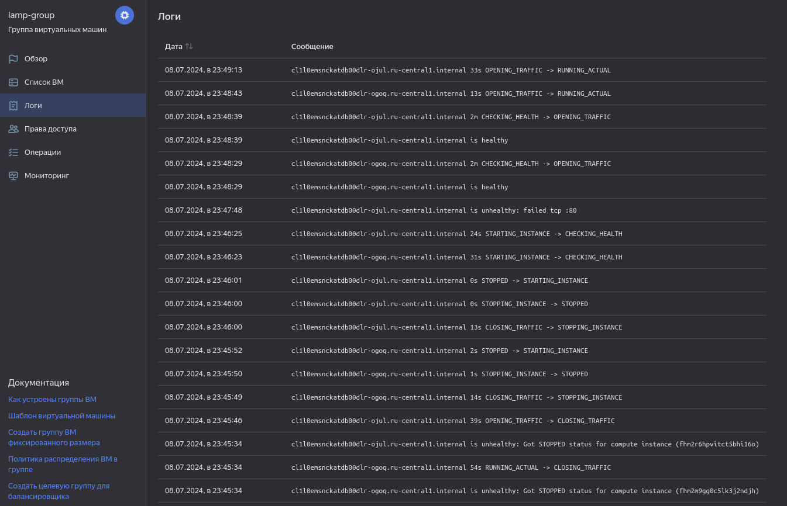

# Домашнее задание к занятию «Вычислительные мощности. Балансировщики нагрузки»  

### Подготовка к выполнению задания

1. Домашнее задание состоит из обязательной части, которую нужно выполнить на провайдере Yandex Cloud, и дополнительной части в AWS (выполняется по желанию). 
2. Все домашние задания в блоке 15 связаны друг с другом и в конце представляют пример законченной инфраструктуры.  
3. Все задания нужно выполнить с помощью Terraform. Результатом выполненного домашнего задания будет код в репозитории. 
4. Перед началом работы настройте доступ к облачным ресурсам из Terraform, используя материалы прошлых лекций и домашних заданий.

---
## Задание 1. Yandex Cloud 

**Что нужно сделать**

1. Создать бакет Object Storage и разместить в нём файл с картинкой:

 - Создать бакет в Object Storage с произвольным именем (например, _имя_студента_дата_).
 - Положить в бакет файл с картинкой.
 - Сделать файл доступным из интернета.
 
2. Создать группу ВМ в public подсети фиксированного размера с шаблоном LAMP и веб-страницей, содержащей ссылку на картинку из бакета:

 - Создать Instance Group с тремя ВМ и шаблоном LAMP. Для LAMP рекомендуется использовать `image_id = fd827b91d99psvq5fjit`.
 - Для создания стартовой веб-страницы рекомендуется использовать раздел `user_data` в [meta_data](https://cloud.yandex.ru/docs/compute/concepts/vm-metadata).
 - Разместить в стартовой веб-странице шаблонной ВМ ссылку на картинку из бакета.
 - Настроить проверку состояния ВМ.
 
3. Подключить группу к сетевому балансировщику:

 - Создать сетевой балансировщик.
 - Проверить работоспособность, удалив одну или несколько ВМ.
4. (дополнительно)* Создать Application Load Balancer с использованием Instance group и проверкой состояния.

Полезные документы:

- [Compute instance group](https://registry.terraform.io/providers/yandex-cloud/yandex/latest/docs/resources/compute_instance_group).
- [Network Load Balancer](https://registry.terraform.io/providers/yandex-cloud/yandex/latest/docs/resources/lb_network_load_balancer).
- [Группа ВМ с сетевым балансировщиком](https://cloud.yandex.ru/docs/compute/operations/instance-groups/create-with-balancer).

## Решение задания 1. Yandex Cloud

1. Создаю бакет в Object Storage с моими инициалами и текущей датой:

```
// Создаем сервисный аккаунт для backet
resource "yandex_iam_service_account" "service" {
  folder_id = var.folder_id
  name      = "bucket-sa"
}

// Назначение роли сервисному аккаунту
resource "yandex_resourcemanager_folder_iam_member" "bucket-editor" {
  folder_id = var.folder_id
  role      = "storage.editor"
  member    = "serviceAccount:${yandex_iam_service_account.service.id}"
  depends_on = [yandex_iam_service_account.service]
}

// Создание статического ключа доступа
resource "yandex_iam_service_account_static_access_key" "sa-static-key" {
  service_account_id = yandex_iam_service_account.service.id
  description        = "static access key for object storage"
}

// Создание бакета с использованием ключа
resource "yandex_storage_bucket" "fedorchukds" {
  access_key = yandex_iam_service_account_static_access_key.sa-static-key.access_key
  secret_key = yandex_iam_service_account_static_access_key.sa-static-key.secret_key
  bucket = local.bucket_name
  acl    = "public-read"
}
```

За текущую дату в названии бакета будет отвечать локальная переменная current_timestamp в формате "день-месяц-год":

```
locals {
    current_timestamp = timestamp()
    formatted_date = formatdate("DD-MM-YYYY", local.current_timestamp)
    bucket_name = "fedorchukds-${local.formatted_date}"
}
```

Код Terraform для создания бакета можно посмотреть в файле [bucket.tf](terraform/bucket.tf)

Загружу в бакет файл с картинкой:

```
resource "yandex_storage_object" "devops-picture" {
  access_key = yandex_iam_service_account_static_access_key.sa-static-key.access_key
  secret_key = yandex_iam_service_account_static_access_key.sa-static-key.secret_key
  bucket = local.bucket_name
  key    = "DevOps-Dark.png"
  source = "~/DevOps-Dark.png"
  acl = "public-read"
  depends_on = [yandex_storage_bucket.lotsmansm]
}
```

Источником картинки будет файл, лежащий в моей домашней директории, за публичность картинки будет отвечать параметр `acl = "public-read"`.

Код Terraform для загрузки картинки можно посмотреть в файле [upload_image.tf](terraform/upload_image.tf)

2. Создаю группу ВМ в public подсети фиксированного размера с шаблоном LAMP и веб-страницей, содержащей ссылку на картинку из бакета.

За сеть и подсеть public фиксированного размера будет отвечать код:

```
variable "default_cidr" {
  type        = list(string)
  default     = ["10.0.1.0/24"]
  description = "https://cloud.yandex.ru/docs/vpc/operations/subnet-create"
}

variable "vpc_name" {
  type        = string
  default     = "develop"
  description = "VPC network&subnet name"
}

variable "public_subnet" {
  type        = string
  default     = "public-subnet"
  description = "subnet name"
}

resource "yandex_vpc_network" "develop" {
  name = var.vpc_name
}

resource "yandex_vpc_subnet" "public" {
  name           = var.public_subnet
  zone           = var.default_zone
  network_id     = yandex_vpc_network.develop.id
  v4_cidr_blocks = var.default_cidr
}
```

За шаблон виртуальных машин с LAMP будет отвечать переменная в группе виртуальных машин `image_id = "fd827b91d99psvq5fjit"`.

За создание стартовой веб-страницы будет отвечать параметр user_data в разделе metadata:

```
    user-data  = <<EOF
#!/bin/bash
cd /var/www/html
echo '<html><head><title>Picture of DevOps</title></head> <body></body></html>' > index.html
EOF
```

За проверку состояния виртуальной машины будет отвечать код:

```
  health_check {
    interval = 30
    timeout  = 10
    tcp_options {
      port = 80
    }
  }
```

Проверка здоровья будет выполняться каждые 30 секунд и будет считаться успешной, если подключение к порту 80 виртуальной машины происходит успешно в течении 10 секунд.

Полный код Terraform для создания группы виртуальных машин можно посмотреть в файле [group_vm.tf](terraform/group_vm.tf)

3. Создам сетевой балансировщик и подключу к нему группу виртуальных машин:

```
resource "yandex_lb_network_load_balancer" "balancer" {
  name = "lamp-balancer"
  deletion_protection = "false"
  listener {
    name = "http-check"
    port = 80
    external_address_spec {
      ip_version = "ipv4"
    }
  }
  attached_target_group {
    target_group_id = yandex_compute_instance_group.group-vms.load_balancer[0].target_group_id
    healthcheck {
      name = "http"
      interval = 2
      timeout = 1
      unhealthy_threshold = 2
      healthy_threshold = 5
      http_options {
        port = 80
        path = "/"
      }
    }
  }
}
```

Балансировщик нагрузки будет проверять доступность порта 80 и путь "/" при обращении к целевой группе виртуальных машин. Проверка будет выполняться с интервалом 2 секунды, с таймаутом 1 секунда. Пороговые значения для определения состояния сервера будут следующими: 2 неудачные проверки для перевода сервера LAMP в недоступное состояние и 5 успешных проверок для возврата в доступное состояние.

4. Создаю Application Load Balancer с использованием Instance group и проверкой состояния.

Создаю целевую группу:

```
resource "yandex_alb_target_group" "application-balancer" {
  name           = "group-vms"

  target {
    subnet_id    = yandex_vpc_subnet.public.id
    ip_address   = yandex_compute_instance_group.group-vms.instances.0.network_interface.0.ip_address
  }

  target {
    subnet_id    = yandex_vpc_subnet.public.id
    ip_address   = yandex_compute_instance_group.group-vms.instances.1.network_interface.0.ip_address
  }

  target {
    subnet_id    = yandex_vpc_subnet.public.id
    ip_address   = yandex_compute_instance_group.group-vms.instances.2.network_interface.0.ip_address
  }
  depends_on = [
    yandex_compute_instance_group.group-vms
]
}
```

Создаю группу Бэкендов:

```
resource "yandex_alb_backend_group" "backend-group" {
  name                     = "backend-balancer"
  session_affinity {
    connection {
      source_ip = true
    }
  }

  http_backend {
    name                   = "http-backend"
    weight                 = 1
    port                   = 80
    target_group_ids       = [yandex_alb_target_group.alb-group.id]
    load_balancing_config {
      panic_threshold      = 90
    }    
    healthcheck {
      timeout              = "10s"
      interval             = "2s"
      healthy_threshold    = 10
      unhealthy_threshold  = 15 
      http_healthcheck {
        path               = "/"
      }
    }
  }
depends_on = [
    yandex_alb_target_group.alb-group
]
}
```

Создаю HTTP-роутер для HTTP-трафика и виртуальный хост:

```
resource "yandex_alb_http_router" "http-router" {
  name          = "http-router"
  labels        = {
    tf-label    = "tf-label-value"
    empty-label = ""
  }
}

resource "yandex_alb_virtual_host" "my-virtual-host" {
  name                    = "virtual-host"
  http_router_id          = yandex_alb_http_router.http-router.id
  route {
    name                  = "route-http"
    http_route {
      http_route_action {
        backend_group_id  = yandex_alb_backend_group.backend-group.id
        timeout           = "60s"
      }
    }
  }
depends_on = [
    yandex_alb_backend_group.backend-group
]
}
```

Создаю L7-балансировщик:

```
resource "yandex_alb_load_balancer" "application-balancer" {
  name        = "app-balancer"
  network_id  = yandex_vpc_network.develop.id

  allocation_policy {
    location {
      zone_id   = var.default_zone
      subnet_id = yandex_vpc_subnet.public.id
    }
  }

  listener {
    name = "listener"
    endpoint {
      address {
        external_ipv4_address {
        }
      }
      ports = [ 80 ]
    }
    http {
      handler {
        http_router_id = yandex_alb_http_router.http-router.id
      }
    }
  }

 depends_on = [
    yandex_alb_http_router.http-router
] 
}
```

За проверку состояния будет отвечать Healthcheck:

```
healthcheck {
      timeout              = "10s"
      interval             = "2s"
      healthy_threshold    = 10
      unhealthy_threshold  = 15 
      http_healthcheck {
        path               = "/"
      }
}
```


Инициализирую проект, выполню код:

```bash
╰─➤terraform init
Initializing the backend...
Initializing provider plugins...
- Finding latest version of yandex-cloud/yandex...
- Installing yandex-cloud/yandex v0.123.0...
- Installed yandex-cloud/yandex v0.123.0 (unauthenticated)
Terraform has created a lock file .terraform.lock.hcl to record the provider
selections it made above. Include this file in your version control repository
so that Terraform can guarantee to make the same selections by default when
you run "terraform init" in the future.

╷
│ Warning: Incomplete lock file information for providers
│ 
│ Due to your customized provider installation methods, Terraform was forced to calculate lock file checksums locally for the following providers:
│   - yandex-cloud/yandex
│ 
│ The current .terraform.lock.hcl file only includes checksums for linux_amd64, so Terraform running on another platform will fail to install these providers.
│ 
│ To calculate additional checksums for another platform, run:
│   terraform providers lock -platform=linux_amd64
│ (where linux_amd64 is the platform to generate)
╵
Terraform has been successfully initialized!

You may now begin working with Terraform. Try running "terraform plan" to see
any changes that are required for your infrastructure. All Terraform commands
should now work.

If you ever set or change modules or backend configuration for Terraform,
rerun this command to reinitialize your working directory. If you forget, other
commands will detect it and remind you to do so if necessary.


╰─➤terraform apply -auto-approve

Terraform used the selected providers to generate the following execution plan. Resource actions are indicated with the following symbols:
  + create

Terraform will perform the following actions:

  # yandex_alb_backend_group.backend-group will be created
  + resource "yandex_alb_backend_group" "backend-group" {
      + created_at = (known after apply)
      + folder_id  = (known after apply)
      + id         = (known after apply)
      + name       = "backend-balancer"

      + http_backend {
          + name             = "http-backend"
          + port             = 80
          + target_group_ids = (known after apply)
          + weight           = 1

          + healthcheck {
              + healthy_threshold   = 10
              + interval            = "2s"
              + timeout             = "10s"
              + unhealthy_threshold = 15

              + http_healthcheck {
                  + path = "/"
                }
            }

          + load_balancing_config {
              + mode            = "ROUND_ROBIN"
              + panic_threshold = 90
            }
        }

      + session_affinity {
          + connection {
              + source_ip = true
            }
        }
    }

  # yandex_alb_http_router.http-router will be created
  + resource "yandex_alb_http_router" "http-router" {
      + created_at = (known after apply)
      + folder_id  = (known after apply)
      + id         = (known after apply)
      + labels     = {
          + "empty-label" = null
          + "tf-label"    = "tf-label-value"
        }
      + name       = "http-router"
    }

  # yandex_alb_load_balancer.application-balancer will be created
  + resource "yandex_alb_load_balancer" "application-balancer" {
      + created_at   = (known after apply)
      + folder_id    = (known after apply)
      + id           = (known after apply)
      + log_group_id = (known after apply)
      + name         = "app-balancer"
      + network_id   = (known after apply)
      + status       = (known after apply)

      + allocation_policy {
          + location {
              + disable_traffic = false
              + subnet_id       = (known after apply)
              + zone_id         = "ru-central1-a"
            }
        }

      + listener {
          + name = "listener"

          + endpoint {
              + ports = [
                  + 80,
                ]

              + address {
                  + external_ipv4_address {
                      + address = (known after apply)
                    }
                }
            }

          + http {
              + handler {
                  + allow_http10       = false
                  + http_router_id     = (known after apply)
                  + rewrite_request_id = false
                }
            }
        }
    }

  # yandex_alb_target_group.alb-group will be created
  + resource "yandex_alb_target_group" "alb-group" {
      + created_at = (known after apply)
      + folder_id  = (known after apply)
      + id         = (known after apply)
      + name       = "group-vms"

      + target {
          + ip_address = (known after apply)
          + subnet_id  = (known after apply)
        }
      + target {
          + ip_address = (known after apply)
          + subnet_id  = (known after apply)
        }
      + target {
          + ip_address = (known after apply)
          + subnet_id  = (known after apply)
        }
    }

  # yandex_alb_virtual_host.my-virtual-host will be created
  + resource "yandex_alb_virtual_host" "my-virtual-host" {
      + http_router_id = (known after apply)
      + id             = (known after apply)
      + name           = "virtual-host"

      + route {
          + name = "route-http"

          + http_route {
              + http_route_action {
                  + backend_group_id = (known after apply)
                  + timeout          = "60s"
                }
            }
        }
    }

  # yandex_compute_instance_group.group-vms will be created
  + resource "yandex_compute_instance_group" "group-vms" {
      + created_at          = (known after apply)
      + deletion_protection = false
      + folder_id           = "b1gl6dqee4o5qromajnb"
      + id                  = (known after apply)
      + instances           = (known after apply)
      + name                = "lamp-group"
      + service_account_id  = (known after apply)
      + status              = (known after apply)

      + allocation_policy {
          + zones = [
              + "ru-central1-a",
            ]
        }

      + deploy_policy {
          + max_creating     = 0
          + max_deleting     = 0
          + max_expansion    = 0
          + max_unavailable  = 1
          + startup_duration = 0
          + strategy         = (known after apply)
        }

      + health_check {
          + healthy_threshold   = 2
          + interval            = 30
          + timeout             = 10
          + unhealthy_threshold = 2

          + tcp_options {
              + port = 80
            }
        }

      + instance_template {
          + labels      = (known after apply)
          + metadata    = (known after apply)
          + platform_id = "standard-v1"

          + boot_disk {
              + device_name = (known after apply)
              + mode        = "READ_WRITE"

              + initialize_params {
                  + image_id    = "fd827b91d99psvq5fjit"
                  + size        = 10
                  + snapshot_id = (known after apply)
                  + type        = "network-hdd"
                }
            }

          + metadata_options (known after apply)

          + network_interface {
              + ip_address   = (known after apply)
              + ipv4         = true
              + ipv6         = (known after apply)
              + ipv6_address = (known after apply)
              + nat          = true
              + network_id   = (known after apply)
              + subnet_ids   = (known after apply)
            }

          + resources {
              + core_fraction = 5
              + cores         = 2
              + memory        = 2
            }

          + scheduling_policy {
              + preemptible = true
            }
        }

      + load_balancer {
          + status_message    = (known after apply)
          + target_group_id   = (known after apply)
          + target_group_name = "lamp-group"
        }

      + scale_policy {
          + fixed_scale {
              + size = 3
            }
        }
    }

  # yandex_iam_service_account.groupvm-sa will be created
  + resource "yandex_iam_service_account" "groupvm-sa" {
      + created_at  = (known after apply)
      + description = "Сервисный аккаунт для управления группой ВМ."
      + folder_id   = (known after apply)
      + id          = (known after apply)
      + name        = "groupvm-sa"
    }

  # yandex_iam_service_account.service will be created
  + resource "yandex_iam_service_account" "service" {
      + created_at = (known after apply)
      + folder_id  = "b1gl6dqee4o5qromajnb"
      + id         = (known after apply)
      + name       = "bucket-sa"
    }

  # yandex_iam_service_account_static_access_key.sa-static-key will be created
  + resource "yandex_iam_service_account_static_access_key" "sa-static-key" {
      + access_key           = (known after apply)
      + created_at           = (known after apply)
      + description          = "static access key for object storage"
      + encrypted_secret_key = (known after apply)
      + id                   = (known after apply)
      + key_fingerprint      = (known after apply)
      + secret_key           = (sensitive value)
      + service_account_id   = (known after apply)
    }

  # yandex_lb_network_load_balancer.network-balancer will be created
  + resource "yandex_lb_network_load_balancer" "network-balancer" {
      + created_at          = (known after apply)
      + deletion_protection = false
      + folder_id           = (known after apply)
      + id                  = (known after apply)
      + name                = "lamp-balancer"
      + region_id           = (known after apply)
      + type                = "external"

      + attached_target_group {
          + target_group_id = (known after apply)

          + healthcheck {
              + healthy_threshold   = 5
              + interval            = 2
              + name                = "http"
              + timeout             = 1
              + unhealthy_threshold = 2

              + http_options {
                  + path = "/"
                  + port = 80
                }
            }
        }

      + listener {
          + name        = "http-check"
          + port        = 80
          + protocol    = (known after apply)
          + target_port = (known after apply)

          + external_address_spec {
              + address    = (known after apply)
              + ip_version = "ipv4"
            }
        }
    }

  # yandex_resourcemanager_folder_iam_member.bucket-editor will be created
  + resource "yandex_resourcemanager_folder_iam_member" "bucket-editor" {
      + folder_id = "b1gl6dqee4o5qromajnb"
      + id        = (known after apply)
      + member    = (known after apply)
      + role      = "storage.editor"
    }

  # yandex_resourcemanager_folder_iam_member.group-editor will be created
  + resource "yandex_resourcemanager_folder_iam_member" "group-editor" {
      + folder_id = "b1gl6dqee4o5qromajnb"
      + id        = (known after apply)
      + member    = (known after apply)
      + role      = "editor"
    }

  # yandex_storage_bucket.lotsmansm will be created
  + resource "yandex_storage_bucket" "lotsmansm" {
      + access_key            = (known after apply)
      + acl                   = "public-read"
      + bucket                = (known after apply)
      + bucket_domain_name    = (known after apply)
      + default_storage_class = (known after apply)
      + folder_id             = (known after apply)
      + force_destroy         = false
      + id                    = (known after apply)
      + secret_key            = (sensitive value)
      + website_domain        = (known after apply)
      + website_endpoint      = (known after apply)

      + anonymous_access_flags (known after apply)

      + versioning (known after apply)
    }

  # yandex_storage_object.devops-picture will be created
  + resource "yandex_storage_object" "devops-picture" {
      + access_key   = (known after apply)
      + acl          = "public-read"
      + bucket       = (known after apply)
      + content_type = (known after apply)
      + id           = (known after apply)
      + key          = "DevOps-Dark.png"
      + secret_key   = (sensitive value)
      + source       = "~/DevOps-Dark.png"
    }

  # yandex_vpc_network.develop will be created
  + resource "yandex_vpc_network" "develop" {
      + created_at                = (known after apply)
      + default_security_group_id = (known after apply)
      + folder_id                 = (known after apply)
      + id                        = (known after apply)
      + labels                    = (known after apply)
      + name                      = "develop"
      + subnet_ids                = (known after apply)
    }

  # yandex_vpc_subnet.public will be created
  + resource "yandex_vpc_subnet" "public" {
      + created_at     = (known after apply)
      + folder_id      = (known after apply)
      + id             = (known after apply)
      + labels         = (known after apply)
      + name           = "public-subnet"
      + network_id     = (known after apply)
      + v4_cidr_blocks = [
          + "10.0.1.0/24",
        ]
      + v6_cidr_blocks = (known after apply)
      + zone           = "ru-central1-a"
    }

Plan: 16 to add, 0 to change, 0 to destroy.

Changes to Outputs:
  + Application_Load_Balancer_Address = [
      + [
          + {
              + address = (known after apply)
            },
        ],
    ]
  + Network_Load_Balancer_Address     = [
      + (known after apply),
    ]
  + Picture_URL                       = (known after apply)
  + all_vms                           = (known after apply)
yandex_iam_service_account.groupvm-sa: Creating...
yandex_iam_service_account.service: Creating...
yandex_vpc_network.develop: Creating...
yandex_alb_http_router.http-router: Creating...
yandex_alb_http_router.http-router: Creation complete after 1s [id=ds7s240a600f6chastgk]
yandex_vpc_network.develop: Creation complete after 3s [id=enp0nnuf35havg2itndf]
yandex_vpc_subnet.public: Creating...
yandex_iam_service_account.service: Creation complete after 3s [id=ajel9c79fpaos2pf3bs5]
yandex_resourcemanager_folder_iam_member.bucket-editor: Creating...
yandex_iam_service_account_static_access_key.sa-static-key: Creating...
yandex_vpc_subnet.public: Creation complete after 0s [id=e9bbolf1lgiu4c0n6ohe]
yandex_alb_load_balancer.application-balancer: Creating...
yandex_iam_service_account_static_access_key.sa-static-key: Creation complete after 2s [id=ajebp0l110231bhh3ld5]
yandex_storage_bucket.lotsmansm: Creating...
yandex_iam_service_account.groupvm-sa: Creation complete after 5s [id=aje9ldbbml7j90jtr89a]
yandex_resourcemanager_folder_iam_member.group-editor: Creating...
yandex_storage_bucket.lotsmansm: Creation complete after 2s [id=lotsmansm-08-07-2024]
yandex_storage_object.devops-picture: Creating...
yandex_resourcemanager_folder_iam_member.bucket-editor: Creation complete after 4s [id=b1gl6dqee4o5qromajnb/storage.editor/serviceAccount:ajel9c79fpaos2pf3bs5]
yandex_storage_object.devops-picture: Creation complete after 0s [id=DevOps-Dark.png]
yandex_resourcemanager_folder_iam_member.group-editor: Creation complete after 6s [id=b1gl6dqee4o5qromajnb/editor/serviceAccount:aje9ldbbml7j90jtr89a]
yandex_compute_instance_group.group-vms: Creating...
yandex_alb_load_balancer.application-balancer: Still creating... [10s elapsed]
yandex_compute_instance_group.group-vms: Still creating... [10s elapsed]
yandex_alb_load_balancer.application-balancer: Still creating... [20s elapsed]
yandex_compute_instance_group.group-vms: Still creating... [20s elapsed]
yandex_alb_load_balancer.application-balancer: Still creating... [30s elapsed]
yandex_compute_instance_group.group-vms: Still creating... [30s elapsed]
yandex_alb_load_balancer.application-balancer: Still creating... [41s elapsed]
yandex_compute_instance_group.group-vms: Still creating... [40s elapsed]
yandex_alb_load_balancer.application-balancer: Still creating... [51s elapsed]
yandex_compute_instance_group.group-vms: Still creating... [50s elapsed]
yandex_alb_load_balancer.application-balancer: Still creating... [1m1s elapsed]
yandex_compute_instance_group.group-vms: Still creating... [1m0s elapsed]
yandex_alb_load_balancer.application-balancer: Still creating... [1m11s elapsed]
yandex_compute_instance_group.group-vms: Still creating... [1m10s elapsed]
yandex_alb_load_balancer.application-balancer: Still creating... [1m21s elapsed]
yandex_compute_instance_group.group-vms: Still creating... [1m20s elapsed]
yandex_alb_load_balancer.application-balancer: Still creating... [1m31s elapsed]
yandex_compute_instance_group.group-vms: Still creating... [1m30s elapsed]
yandex_alb_load_balancer.application-balancer: Still creating... [1m41s elapsed]
yandex_compute_instance_group.group-vms: Still creating... [1m40s elapsed]
yandex_alb_load_balancer.application-balancer: Still creating... [1m51s elapsed]
yandex_compute_instance_group.group-vms: Still creating... [1m50s elapsed]
yandex_alb_load_balancer.application-balancer: Still creating... [2m1s elapsed]
yandex_compute_instance_group.group-vms: Still creating... [2m0s elapsed]
yandex_alb_load_balancer.application-balancer: Still creating... [2m11s elapsed]
yandex_compute_instance_group.group-vms: Still creating... [2m10s elapsed]
yandex_alb_load_balancer.application-balancer: Still creating... [2m21s elapsed]
yandex_compute_instance_group.group-vms: Still creating... [2m20s elapsed]
yandex_alb_load_balancer.application-balancer: Still creating... [2m31s elapsed]
yandex_compute_instance_group.group-vms: Still creating... [2m30s elapsed]
yandex_alb_load_balancer.application-balancer: Still creating... [2m41s elapsed]
yandex_compute_instance_group.group-vms: Still creating... [2m40s elapsed]
yandex_alb_load_balancer.application-balancer: Still creating... [2m51s elapsed]
yandex_compute_instance_group.group-vms: Still creating... [2m50s elapsed]
yandex_alb_load_balancer.application-balancer: Still creating... [3m1s elapsed]
yandex_compute_instance_group.group-vms: Still creating... [3m0s elapsed]
yandex_alb_load_balancer.application-balancer: Still creating... [3m11s elapsed]
yandex_compute_instance_group.group-vms: Still creating... [3m10s elapsed]
yandex_alb_load_balancer.application-balancer: Still creating... [3m21s elapsed]
yandex_compute_instance_group.group-vms: Still creating... [3m20s elapsed]
yandex_alb_load_balancer.application-balancer: Still creating... [3m31s elapsed]
yandex_compute_instance_group.group-vms: Still creating... [3m30s elapsed]
yandex_alb_load_balancer.application-balancer: Still creating... [3m41s elapsed]
yandex_compute_instance_group.group-vms: Still creating... [3m40s elapsed]
yandex_alb_load_balancer.application-balancer: Still creating... [3m51s elapsed]
yandex_compute_instance_group.group-vms: Still creating... [3m50s elapsed]
yandex_alb_load_balancer.application-balancer: Still creating... [4m1s elapsed]
yandex_compute_instance_group.group-vms: Still creating... [4m0s elapsed]
yandex_alb_load_balancer.application-balancer: Still creating... [4m11s elapsed]
yandex_compute_instance_group.group-vms: Creation complete after 4m7s [id=cl1l0emsnckatdb00dlr]
yandex_alb_target_group.alb-group: Creating...
yandex_lb_network_load_balancer.network-balancer: Creating...
yandex_alb_target_group.alb-group: Creation complete after 0s [id=ds70pjdkurqqugubits4]
yandex_alb_backend_group.backend-group: Creating...
yandex_alb_backend_group.backend-group: Creation complete after 0s [id=ds7d4q05nj04u8q8l72p]
yandex_alb_virtual_host.my-virtual-host: Creating...
yandex_alb_virtual_host.my-virtual-host: Creation complete after 2s [id=ds7s240a600f6chastgk/virtual-host]
yandex_lb_network_load_balancer.network-balancer: Creation complete after 3s [id=enp0fuic1iis8cbhhqkc]
yandex_alb_load_balancer.application-balancer: Still creating... [4m21s elapsed]
yandex_alb_load_balancer.application-balancer: Still creating... [4m31s elapsed]
yandex_alb_load_balancer.application-balancer: Still creating... [4m41s elapsed]
yandex_alb_load_balancer.application-balancer: Still creating... [4m51s elapsed]
yandex_alb_load_balancer.application-balancer: Still creating... [5m1s elapsed]
yandex_alb_load_balancer.application-balancer: Still creating... [5m11s elapsed]
yandex_alb_load_balancer.application-balancer: Still creating... [5m21s elapsed]
yandex_alb_load_balancer.application-balancer: Still creating... [5m31s elapsed]
yandex_alb_load_balancer.application-balancer: Still creating... [5m41s elapsed]
yandex_alb_load_balancer.application-balancer: Still creating... [5m51s elapsed]
yandex_alb_load_balancer.application-balancer: Still creating... [6m1s elapsed]
yandex_alb_load_balancer.application-balancer: Still creating... [6m11s elapsed]
yandex_alb_load_balancer.application-balancer: Creation complete after 6m13s [id=ds76a2mb7bhjbbks5e8t]

Apply complete! Resources: 16 added, 0 changed, 0 destroyed.

Outputs:

Application_Load_Balancer_Address = tolist([
  tolist([
    {
      "address" = "158.160.141.110"
    },
  ]),
])
Network_Load_Balancer_Address = tolist([
  "158.160.169.163",
])
Picture_URL = "https://lotsmansm-08-07-2024.storage.yandexcloud.net/DevOps-Dark.png"
all_vms = [
  {
    "ip_external" = "62.84.112.9"
    "ip_internal" = "10.0.1.12"
    "name" = "cl1l0emsnckatdb00dlr-acud"
  },
  {
    "ip_external" = "158.160.48.209"
    "ip_internal" = "10.0.1.31"
    "name" = "cl1l0emsnckatdb00dlr-ojul"
  },
  {
    "ip_external" = "84.201.172.159"
    "ip_internal" = "10.0.1.11"
    "name" = "cl1l0emsnckatdb00dlr-ogoq"
  },
]
```

Инфруструктура развёрнута, скрины прилагаю:


Проверю созданный бакет:

```bash
╰─➤yc storage bucket list
+----------------------+----------------------+----------+-----------------------+---------------------+
|         NAME         |      FOLDER ID       | MAX SIZE | DEFAULT STORAGE CLASS |     CREATED AT      |
+----------------------+----------------------+----------+-----------------------+---------------------+
| lotsmansm-08-07-2024 | b1gl6dqee4o5qromajnb |        0 | STANDARD              | 2024-07-08 20:04:05 |
+----------------------+----------------------+----------+-----------------------+---------------------+


╰─➤yc storage bucket stats --name lotsmansm-08-07-2024
name: lotsmansm-08-07-2024
default_storage_class: STANDARD
anonymous_access_flags:
  read: true
  list: true
  config_read: true
created_at: "2024-07-08T20:04:05.724298Z"
updated_at: "2024-07-08T20:04:05.724298Z"
```


Бакет создан и имеет в себе один объект.

После применения кода Terraform получаем три настроенные по шаблону LAMP виртуальные машины:

```bash
╰─➤yc compute instance list
+----------------------+---------------------------+---------------+---------+----------------+-------------+
|          ID          |           NAME            |    ZONE ID    | STATUS  |  EXTERNAL IP   | INTERNAL IP |
+----------------------+---------------------------+---------------+---------+----------------+-------------+
| fhm2m9gg0c5lk3j2ndjh | cl1l0emsnckatdb00dlr-ogoq | ru-central1-a | RUNNING | 84.201.172.159 | 10.0.1.11   |
| fhm2r6hpvitct5bhi16o | cl1l0emsnckatdb00dlr-ojul | ru-central1-a | RUNNING | 158.160.48.209 | 10.0.1.31   |
| fhmc5g1s0sme654cuho6 | cl1l0emsnckatdb00dlr-acud | ru-central1-a | RUNNING | 62.84.112.9    | 10.0.1.12   |
+----------------------+---------------------------+---------------+---------+----------------+-------------+
```


Проверю статус балансировщика нагрузки и подключенной к нему группе виртуальных машин после применения кода:

```bash
╰─➤yc load-balancer network-load-balancer list
+----------------------+---------------+-------------+----------+----------------+------------------------+--------+
|          ID          |     NAME      |  REGION ID  |   TYPE   | LISTENER COUNT | ATTACHED TARGET GROUPS | STATUS |
+----------------------+---------------+-------------+----------+----------------+------------------------+--------+
| enp0fuic1iis8cbhhqkc | lamp-balancer | ru-central1 | EXTERNAL |              1 | enpora4d3hoknn4ih645   | ACTIVE |
+----------------------+---------------+-------------+----------+----------------+------------------------+--------+

╰─➤yc load-balancer network-load-balancer target-states --id enp0fuic1iis8cbhhqkc --target-group-id enpora4d3hoknn4ih645
+----------------------+-----------+---------+
|      SUBNET ID       |  ADDRESS  | STATUS  |
+----------------------+-----------+---------+
| e9bbolf1lgiu4c0n6ohe | 10.0.1.11 | HEALTHY |
| e9bbolf1lgiu4c0n6ohe | 10.0.1.12 | HEALTHY |
| e9bbolf1lgiu4c0n6ohe | 10.0.1.31 | HEALTHY |
+----------------------+-----------+---------+
```


Балансировщик нагрузки создан и активен, подключенные к нему виртуальные машины в статусе "HEALTHY".

Проверю доступность сайта, через балансировщик нагрузки, открыв его внешний ip-адрес. Но для начала, нужно найти его внешний ip-адрес:

```bash
╰─➤yc load-balancer network-load-balancer get --name lamp-balancer
id: enp0fuic1iis8cbhhqkc
folder_id: b1gl6dqee4o5qromajnb
created_at: "2024-07-08T20:08:19Z"
name: lamp-balancer
region_id: ru-central1
status: ACTIVE
type: EXTERNAL
listeners:
  - name: http-check
    address: 158.160.169.163
    port: "80"
    protocol: TCP
    target_port: "80"
    ip_version: IPV4
attached_target_groups:
  - target_group_id: enpora4d3hoknn4ih645
    health_checks:
      - name: http
        interval: 2s
        timeout: 1s
        unhealthy_threshold: "2"
        healthy_threshold: "5"
        http_options:
          port: "80"
          path: /

```

Открыв внешний ip-адрес балансировщика нагрузки я попадаю на созданную мной страницу:


Следовательно, балансировщик нагрузки работает.

Теперь нужно проверить, будет ли сохраняться доступность сайта после отключения пары виртуальных машин. Для этого выключаю две виртуальные машины из трех:

```bash
╰─➤yc compute instance list
+----------------------+---------------------------+---------------+---------+----------------+-------------+
|          ID          |           NAME            |    ZONE ID    | STATUS  |  EXTERNAL IP   | INTERNAL IP |
+----------------------+---------------------------+---------------+---------+----------------+-------------+
| fhm2m9gg0c5lk3j2ndjh | cl1l0emsnckatdb00dlr-ogoq | ru-central1-a | RUNNING | 84.201.172.159 | 10.0.1.11   |
| fhm2r6hpvitct5bhi16o | cl1l0emsnckatdb00dlr-ojul | ru-central1-a | RUNNING | 158.160.48.209 | 10.0.1.31   |
| fhmc5g1s0sme654cuho6 | cl1l0emsnckatdb00dlr-acud | ru-central1-a | RUNNING | 62.84.112.9    | 10.0.1.12   |
+----------------------+---------------------------+---------------+---------+----------------+-------------+

╰─➤yc compute instance stop --id fhm2m9gg0c5lk3j2ndjh

╰─➤yc compute instance stop --id fhm2r6hpvitct5bhi16o

╰─➤yc compute instance list
+----------------------+---------------------------+---------------+---------+-------------+-------------+
|          ID          |           NAME            |    ZONE ID    | STATUS  | EXTERNAL IP | INTERNAL IP |
+----------------------+---------------------------+---------------+---------+-------------+-------------+
| fhm2m9gg0c5lk3j2ndjh | cl1l0emsnckatdb00dlr-ogoq | ru-central1-a | STOPPED |             | 10.0.1.11   |
| fhm2r6hpvitct5bhi16o | cl1l0emsnckatdb00dlr-ojul | ru-central1-a | STOPPED |             | 10.0.1.31   |
| fhmc5g1s0sme654cuho6 | cl1l0emsnckatdb00dlr-acud | ru-central1-a | RUNNING | 62.84.112.9 | 10.0.1.12   |
+----------------------+---------------------------+---------------+---------+-------------+-------------+
```

Сайт по прежнему доступен, так как одна из виртуальных машин продолжила работать и балансировщик нагрузки переключился на неё.

Через некоторое время, после срабатывания Healthcheck, выключенные виртуальные машины LAMP были заново запущены:



Таким образом доступность сайта была сохранена.

Проверю созданные ресурсы после применения кода:

```bash
╰─➤yc alb target-group list
+----------------------+-----------+--------------+
|          ID          |   NAME    | TARGET COUNT |
+----------------------+-----------+--------------+
| ds70pjdkurqqugubits4 | group-vms |            3 |
+----------------------+-----------+--------------+

╰─➤yc alb backend-group list
+----------------------+------------------+---------------------+--------------+---------------+----------------------------+
|          ID          |       NAME       |       CREATED       | BACKEND TYPE | BACKEND COUNT |          AFFINITY          |
+----------------------+------------------+---------------------+--------------+---------------+----------------------------+
| ds7d4q05nj04u8q8l72p | backend-balancer | 2024-07-08 20:08:19 | HTTP         |             1 | connection(source_ip=true) |
+----------------------+------------------+---------------------+--------------+---------------+----------------------------+

╰─➤yc alb http-router list
+----------------------+-------------+-------------+-------------+
|          ID          |    NAME     | VHOST COUNT | ROUTE COUNT |
+----------------------+-------------+-------------+-------------+
| ds7s240a600f6chastgk | http-router |           1 |           1 |
+----------------------+-------------+-------------+-------------+

╰─➤yc alb load-balancer list
+----------------------+--------------+-----------+----------------+--------+
|          ID          |     NAME     | REGION ID | LISTENER COUNT | STATUS |
+----------------------+--------------+-----------+----------------+--------+
| ds76a2mb7bhjbbks5e8t | app-balancer |           |              1 | ACTIVE |
+----------------------+--------------+-----------+----------------+--------+
```

Все ресурсы создались.

[Весь код Terraform](terraform/)

---
## Задание 2*. AWS (задание со звёздочкой)

Это необязательное задание. Его выполнение не влияет на получение зачёта по домашней работе.

**Что нужно сделать**

Используя конфигурации, выполненные в домашнем задании из предыдущего занятия, добавить к Production like сети Autoscaling group из трёх EC2-инстансов с  автоматической установкой веб-сервера в private домен.

1. Создать бакет S3 и разместить в нём файл с картинкой:

 - Создать бакет в S3 с произвольным именем (например, _имя_студента_дата_).
 - Положить в бакет файл с картинкой.
 - Сделать доступным из интернета.
2. Сделать Launch configurations с использованием bootstrap-скрипта с созданием веб-страницы, на которой будет ссылка на картинку в S3. 
3. Загрузить три ЕС2-инстанса и настроить LB с помощью Autoscaling Group.

Resource Terraform:

- [S3 bucket](https://registry.terraform.io/providers/hashicorp/aws/latest/docs/resources/s3_bucket)
- [Launch Template](https://registry.terraform.io/providers/hashicorp/aws/latest/docs/resources/launch_template).
- [Autoscaling group](https://registry.terraform.io/providers/hashicorp/aws/latest/docs/resources/autoscaling_group).
- [Launch configuration](https://registry.terraform.io/providers/hashicorp/aws/latest/docs/resources/launch_configuration).

Пример bootstrap-скрипта:

```
#!/bin/bash
yum install httpd -y
service httpd start
chkconfig httpd on
cd /var/www/html
echo "<html><h1>My cool web-server</h1></html>" > index.html
```

### Решение задания 2. AWS* (задание со звёздочкой)

# Задание 2 не выполнялось из-за отсутствия учетки к AWS 
