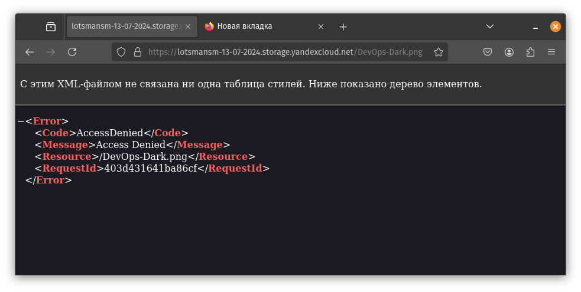
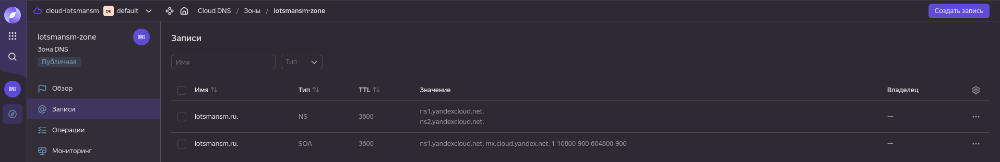
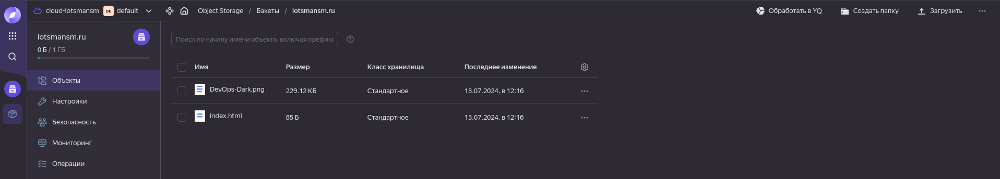
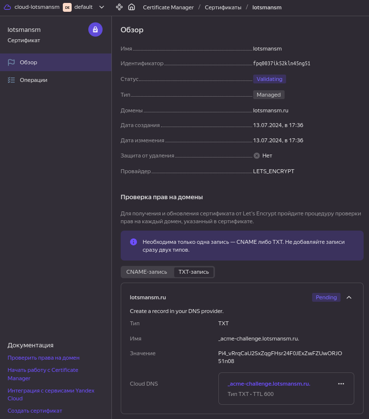
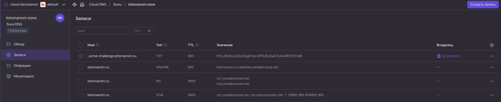

# Домашнее задание к занятию «Безопасность в облачных провайдерах»  

Используя конфигурации, выполненные в рамках предыдущих домашних заданий, нужно добавить возможность шифрования бакета.

---
## Задание 1. Yandex Cloud   

1. С помощью ключа в KMS необходимо зашифровать содержимое бакета:

 - создать ключ в KMS;
 - с помощью ключа зашифровать содержимое бакета, созданного ранее.
2. (Выполняется не в Terraform)* Создать статический сайт в Object Storage c собственным публичным адресом и сделать доступным по HTTPS:

 - создать сертификат;
 - создать статическую страницу в Object Storage и применить сертификат HTTPS;
 - в качестве результата предоставить скриншот на страницу с сертификатом в заголовке (замочек).

Полезные документы:

- [Настройка HTTPS статичного сайта](https://cloud.yandex.ru/docs/storage/operations/hosting/certificate).
- [Object Storage bucket](https://registry.terraform.io/providers/yandex-cloud/yandex/latest/docs/resources/storage_bucket).
- [KMS key](https://registry.terraform.io/providers/yandex-cloud/yandex/latest/docs/resources/kms_symmetric_key).


### Решение задания 1. Yandex Cloud

1. Для выполнения задания буду использовать код Terraform выполненный в прошлом задании, т.к. в нем уже есть бакет и загрузка изображения в него.

Создаю роль для службы KMS, которая даст возможность зашифровывать и расшифровывать данные:

```
resource "yandex_resourcemanager_folder_iam_member" "sa-editor-encrypter-decrypter" {
  folder_id = var.folder_id
  role      = "kms.keys.encrypterDecrypter"
  member    = "serviceAccount:${yandex_iam_service_account.service.id}"
}
```

Создаю симметричный ключ шифрования с алгоритмом шифрования AES_128 и временем жизни 24 часа:

```
resource "yandex_kms_symmetric_key" "secret-key" {
  name              = "key-1"
  description       = "ключ для шифрования бакета"
  default_algorithm = "AES_128"
  rotation_period   = "24h"
}
```

Применяю ключ шифрования к созданному ранее бакету:

```
  server_side_encryption_configuration {
    rule {
      apply_server_side_encryption_by_default {
        kms_master_key_id = yandex_kms_symmetric_key.secret-key.id
        sse_algorithm     = "aws:kms"
      }
    }
  }
```

Применяю [код Terraform](terraform/)

```bash
╰─➤terraform init
Initializing the backend...
Initializing provider plugins...
- Finding latest version of yandex-cloud/yandex...
- Installing yandex-cloud/yandex v0.123.0...
- Installed yandex-cloud/yandex v0.123.0 (unauthenticated)
Terraform has created a lock file .terraform.lock.hcl to record the provider
selections it made above. Include this file in your version control repository
so that Terraform can guarantee to make the same selections by default when
you run "terraform init" in the future.

╷
│ Warning: Incomplete lock file information for providers
│ 
│ Due to your customized provider installation methods, Terraform was forced to calculate lock file checksums locally for the following providers:
│   - yandex-cloud/yandex
│ 
│ The current .terraform.lock.hcl file only includes checksums for linux_amd64, so Terraform running on another platform will fail to install these providers.
│ 
│ To calculate additional checksums for another platform, run:
│   terraform providers lock -platform=linux_amd64
│ (where linux_amd64 is the platform to generate)
╵
Terraform has been successfully initialized!

You may now begin working with Terraform. Try running "terraform plan" to see
any changes that are required for your infrastructure. All Terraform commands
should now work.

If you ever set or change modules or backend configuration for Terraform,
rerun this command to reinitialize your working directory. If you forget, other
commands will detect it and remind you to do so if necessary.


╰─➤terraform apply -auto-approve

Terraform used the selected providers to generate the following execution plan. Resource actions are indicated with the following symbols:
  + create

Terraform will perform the following actions:

  # yandex_alb_backend_group.backend-group will be created
  + resource "yandex_alb_backend_group" "backend-group" {
      + created_at = (known after apply)
      + folder_id  = (known after apply)
      + id         = (known after apply)
      + name       = "backend-balancer"

      + http_backend {
          + name             = "http-backend"
          + port             = 80
          + target_group_ids = (known after apply)
          + weight           = 1

          + healthcheck {
              + healthy_threshold   = 10
              + interval            = "2s"
              + timeout             = "10s"
              + unhealthy_threshold = 15

              + http_healthcheck {
                  + path = "/"
                }
            }

          + load_balancing_config {
              + mode            = "ROUND_ROBIN"
              + panic_threshold = 90
            }
        }

      + session_affinity {
          + connection {
              + source_ip = true
            }
        }
    }

  # yandex_alb_http_router.http-router will be created
  + resource "yandex_alb_http_router" "http-router" {
      + created_at = (known after apply)
      + folder_id  = (known after apply)
      + id         = (known after apply)
      + labels     = {
          + "empty-label" = null
          + "tf-label"    = "tf-label-value"
        }
      + name       = "http-router"
    }

  # yandex_alb_load_balancer.application-balancer will be created
  + resource "yandex_alb_load_balancer" "application-balancer" {
      + created_at   = (known after apply)
      + folder_id    = (known after apply)
      + id           = (known after apply)
      + log_group_id = (known after apply)
      + name         = "app-balancer"
      + network_id   = (known after apply)
      + status       = (known after apply)

      + allocation_policy {
          + location {
              + disable_traffic = false
              + subnet_id       = (known after apply)
              + zone_id         = "ru-central1-a"
            }
        }

      + listener {
          + name = "listener"

          + endpoint {
              + ports = [
                  + 80,
                ]

              + address {
                  + external_ipv4_address {
                      + address = (known after apply)
                    }
                }
            }

          + http {
              + handler {
                  + allow_http10       = false
                  + http_router_id     = (known after apply)
                  + rewrite_request_id = false
                }
            }
        }
    }

  # yandex_alb_target_group.alb-group will be created
  + resource "yandex_alb_target_group" "alb-group" {
      + created_at = (known after apply)
      + folder_id  = (known after apply)
      + id         = (known after apply)
      + name       = "group-vms"

      + target {
          + ip_address = (known after apply)
          + subnet_id  = (known after apply)
        }
      + target {
          + ip_address = (known after apply)
          + subnet_id  = (known after apply)
        }
      + target {
          + ip_address = (known after apply)
          + subnet_id  = (known after apply)
        }
    }

  # yandex_alb_virtual_host.my-virtual-host will be created
  + resource "yandex_alb_virtual_host" "my-virtual-host" {
      + http_router_id = (known after apply)
      + id             = (known after apply)
      + name           = "virtual-host"

      + route {
          + name = "route-http"

          + http_route {
              + http_route_action {
                  + backend_group_id = (known after apply)
                  + timeout          = "60s"
                }
            }
        }
    }

  # yandex_compute_instance_group.group-vms will be created
  + resource "yandex_compute_instance_group" "group-vms" {
      + created_at          = (known after apply)
      + deletion_protection = false
      + folder_id           = "b1gl6dqee4o5qromajnb"
      + id                  = (known after apply)
      + instances           = (known after apply)
      + name                = "lamp-group"
      + service_account_id  = (known after apply)
      + status              = (known after apply)

      + allocation_policy {
          + zones = [
              + "ru-central1-a",
            ]
        }

      + deploy_policy {
          + max_creating     = 0
          + max_deleting     = 0
          + max_expansion    = 0
          + max_unavailable  = 1
          + startup_duration = 0
          + strategy         = (known after apply)
        }

      + health_check {
          + healthy_threshold   = 2
          + interval            = 30
          + timeout             = 10
          + unhealthy_threshold = 2

          + tcp_options {
              + port = 80
            }
        }

      + instance_template {
          + labels      = (known after apply)
          + metadata    = (known after apply)
          + platform_id = "standard-v1"

          + boot_disk {
              + device_name = (known after apply)
              + mode        = "READ_WRITE"

              + initialize_params {
                  + image_id    = "fd827b91d99psvq5fjit"
                  + size        = 10
                  + snapshot_id = (known after apply)
                  + type        = "network-hdd"
                }
            }

          + metadata_options (known after apply)

          + network_interface {
              + ip_address   = (known after apply)
              + ipv4         = true
              + ipv6         = (known after apply)
              + ipv6_address = (known after apply)
              + nat          = true
              + network_id   = (known after apply)
              + subnet_ids   = (known after apply)
            }

          + resources {
              + core_fraction = 5
              + cores         = 2
              + memory        = 2
            }

          + scheduling_policy {
              + preemptible = true
            }
        }

      + load_balancer {
          + status_message    = (known after apply)
          + target_group_id   = (known after apply)
          + target_group_name = "lamp-group"
        }

      + scale_policy {
          + fixed_scale {
              + size = 3
            }
        }
    }

  # yandex_iam_service_account.groupvm-sa will be created
  + resource "yandex_iam_service_account" "groupvm-sa" {
      + created_at  = (known after apply)
      + description = "Сервисный аккаунт для управления группой ВМ."
      + folder_id   = (known after apply)
      + id          = (known after apply)
      + name        = "groupvm-sa"
    }

  # yandex_iam_service_account.service will be created
  + resource "yandex_iam_service_account" "service" {
      + created_at = (known after apply)
      + folder_id  = "b1gl6dqee4o5qromajnb"
      + id         = (known after apply)
      + name       = "bucket-sa"
    }

  # yandex_iam_service_account_static_access_key.sa-static-key will be created
  + resource "yandex_iam_service_account_static_access_key" "sa-static-key" {
      + access_key           = (known after apply)
      + created_at           = (known after apply)
      + description          = "static access key for object storage"
      + encrypted_secret_key = (known after apply)
      + id                   = (known after apply)
      + key_fingerprint      = (known after apply)
      + secret_key           = (sensitive value)
      + service_account_id   = (known after apply)
    }

  # yandex_kms_symmetric_key.secret-key will be created
  + resource "yandex_kms_symmetric_key" "secret-key" {
      + created_at          = (known after apply)
      + default_algorithm   = "AES_128"
      + deletion_protection = false
      + description         = "ключ для шифрования бакета"
      + folder_id           = (known after apply)
      + id                  = (known after apply)
      + name                = "key-1"
      + rotated_at          = (known after apply)
      + rotation_period     = "24h"
      + status              = (known after apply)
    }

  # yandex_lb_network_load_balancer.network-balancer will be created
  + resource "yandex_lb_network_load_balancer" "network-balancer" {
      + created_at          = (known after apply)
      + deletion_protection = false
      + folder_id           = (known after apply)
      + id                  = (known after apply)
      + name                = "lamp-balancer"
      + region_id           = (known after apply)
      + type                = "external"

      + attached_target_group {
          + target_group_id = (known after apply)

          + healthcheck {
              + healthy_threshold   = 5
              + interval            = 2
              + name                = "http"
              + timeout             = 1
              + unhealthy_threshold = 2

              + http_options {
                  + path = "/"
                  + port = 80
                }
            }
        }

      + listener {
          + name        = "http-check"
          + port        = 80
          + protocol    = (known after apply)
          + target_port = (known after apply)

          + external_address_spec {
              + address    = (known after apply)
              + ip_version = "ipv4"
            }
        }
    }

  # yandex_resourcemanager_folder_iam_member.bucket-editor will be created
  + resource "yandex_resourcemanager_folder_iam_member" "bucket-editor" {
      + folder_id = "b1gl6dqee4o5qromajnb"
      + id        = (known after apply)
      + member    = (known after apply)
      + role      = "storage.editor"
    }

  # yandex_resourcemanager_folder_iam_member.group-editor will be created
  + resource "yandex_resourcemanager_folder_iam_member" "group-editor" {
      + folder_id = "b1gl6dqee4o5qromajnb"
      + id        = (known after apply)
      + member    = (known after apply)
      + role      = "editor"
    }

  # yandex_resourcemanager_folder_iam_member.sa-editor-encrypter-decrypter will be created
  + resource "yandex_resourcemanager_folder_iam_member" "sa-editor-encrypter-decrypter" {
      + folder_id = "b1gl6dqee4o5qromajnb"
      + id        = (known after apply)
      + member    = (known after apply)
      + role      = "kms.keys.encrypterDecrypter"
    }

  # yandex_storage_bucket.lotsmansm will be created
  + resource "yandex_storage_bucket" "lotsmansm" {
      + access_key            = (known after apply)
      + acl                   = "public-read-write"
      + bucket                = (known after apply)
      + bucket_domain_name    = (known after apply)
      + default_storage_class = (known after apply)
      + folder_id             = (known after apply)
      + force_destroy         = false
      + id                    = (known after apply)
      + secret_key            = (sensitive value)
      + website_domain        = (known after apply)
      + website_endpoint      = (known after apply)

      + anonymous_access_flags (known after apply)

      + versioning (known after apply)
    }

  # yandex_storage_object.devops-picture will be created
  + resource "yandex_storage_object" "devops-picture" {
      + access_key   = (known after apply)
      + acl          = "public-read"
      + bucket       = (known after apply)
      + content_type = (known after apply)
      + id           = (known after apply)
      + key          = "DevOps-Dark.png"
      + secret_key   = (sensitive value)
      + source       = "~/DevOps-Dark.png"
    }

  # yandex_vpc_network.develop will be created
  + resource "yandex_vpc_network" "develop" {
      + created_at                = (known after apply)
      + default_security_group_id = (known after apply)
      + folder_id                 = (known after apply)
      + id                        = (known after apply)
      + labels                    = (known after apply)
      + name                      = "develop"
      + subnet_ids                = (known after apply)
    }

  # yandex_vpc_subnet.public will be created
  + resource "yandex_vpc_subnet" "public" {
      + created_at     = (known after apply)
      + folder_id      = (known after apply)
      + id             = (known after apply)
      + labels         = (known after apply)
      + name           = "public-subnet"
      + network_id     = (known after apply)
      + v4_cidr_blocks = [
          + "10.0.1.0/24",
        ]
      + v6_cidr_blocks = (known after apply)
      + zone           = "ru-central1-a"
    }

Plan: 18 to add, 0 to change, 0 to destroy.

Changes to Outputs:
  + Application_Load_Balancer_Address = [
      + [
          + {
              + address = (known after apply)
            },
        ],
    ]
  + Network_Load_Balancer_Address     = [
      + (known after apply),
    ]
  + Picture_URL                       = (known after apply)
  + all_vms                           = (known after apply)
yandex_iam_service_account.service: Creating...
yandex_vpc_network.develop: Creating...
yandex_iam_service_account.groupvm-sa: Creating...
yandex_kms_symmetric_key.secret-key: Creating...
yandex_alb_http_router.http-router: Creating...
yandex_kms_symmetric_key.secret-key: Creation complete after 1s [id=abj70jav01fepoij40qi]
yandex_alb_http_router.http-router: Creation complete after 1s [id=ds7qedjuovjmu8jr47mc]
yandex_vpc_network.develop: Creation complete after 3s [id=enp596ss06gndlc9gvpm]
yandex_vpc_subnet.public: Creating...
yandex_iam_service_account.groupvm-sa: Creation complete after 3s [id=ajeakunr054uoki2algp]
yandex_resourcemanager_folder_iam_member.group-editor: Creating...
yandex_vpc_subnet.public: Creation complete after 0s [id=e9b5ka9rs32r60npeuei]
yandex_alb_load_balancer.application-balancer: Creating...
yandex_iam_service_account.service: Creation complete after 5s [id=ajesmvdt1bni1fv1h1ea]
yandex_resourcemanager_folder_iam_member.bucket-editor: Creating...
yandex_resourcemanager_folder_iam_member.sa-editor-encrypter-decrypter: Creating...
yandex_iam_service_account_static_access_key.sa-static-key: Creating...
yandex_iam_service_account_static_access_key.sa-static-key: Creation complete after 1s [id=aje25l1k5qng1hrh0jhn]
yandex_storage_bucket.lotsmansm: Creating...
yandex_resourcemanager_folder_iam_member.group-editor: Creation complete after 4s [id=b1gl6dqee4o5qromajnb/editor/serviceAccount:ajeakunr054uoki2algp]
yandex_resourcemanager_folder_iam_member.bucket-editor: Creation complete after 7s [id=b1gl6dqee4o5qromajnb/storage.editor/serviceAccount:ajesmvdt1bni1fv1h1ea]
yandex_alb_load_balancer.application-balancer: Still creating... [10s elapsed]
yandex_storage_bucket.lotsmansm: Creation complete after 7s [id=lotsmansm-13-07-2024]
yandex_storage_object.devops-picture: Creating...
yandex_compute_instance_group.group-vms: Creating...
yandex_storage_object.devops-picture: Creation complete after 0s [id=DevOps-Dark.png]
yandex_resourcemanager_folder_iam_member.sa-editor-encrypter-decrypter: Still creating... [10s elapsed]
yandex_resourcemanager_folder_iam_member.sa-editor-encrypter-decrypter: Creation complete after 10s [id=b1gl6dqee4o5qromajnb/kms.keys.encrypterDecrypter/serviceAccount:ajesmvdt1bni1fv1h1ea]
yandex_alb_load_balancer.application-balancer: Still creating... [20s elapsed]
yandex_compute_instance_group.group-vms: Still creating... [10s elapsed]
yandex_alb_load_balancer.application-balancer: Still creating... [30s elapsed]
yandex_compute_instance_group.group-vms: Still creating... [20s elapsed]
yandex_alb_load_balancer.application-balancer: Still creating... [40s elapsed]
yandex_compute_instance_group.group-vms: Still creating... [30s elapsed]
yandex_alb_load_balancer.application-balancer: Still creating... [50s elapsed]
yandex_compute_instance_group.group-vms: Still creating... [40s elapsed]
yandex_alb_load_balancer.application-balancer: Still creating... [1m0s elapsed]
yandex_compute_instance_group.group-vms: Still creating... [50s elapsed]
yandex_alb_load_balancer.application-balancer: Still creating... [1m10s elapsed]
yandex_compute_instance_group.group-vms: Still creating... [1m0s elapsed]
yandex_alb_load_balancer.application-balancer: Still creating... [1m20s elapsed]
yandex_compute_instance_group.group-vms: Still creating... [1m10s elapsed]
yandex_alb_load_balancer.application-balancer: Still creating... [1m30s elapsed]
yandex_compute_instance_group.group-vms: Still creating... [1m20s elapsed]
yandex_alb_load_balancer.application-balancer: Still creating... [1m40s elapsed]
yandex_compute_instance_group.group-vms: Still creating... [1m30s elapsed]
yandex_compute_instance_group.group-vms: Still creating... [1m40s elapsed]
yandex_alb_load_balancer.application-balancer: Still creating... [1m50s elapsed]
yandex_alb_load_balancer.application-balancer: Still creating... [2m0s elapsed]
yandex_compute_instance_group.group-vms: Still creating... [1m50s elapsed]
yandex_alb_load_balancer.application-balancer: Still creating... [2m10s elapsed]
yandex_compute_instance_group.group-vms: Still creating... [2m0s elapsed]
yandex_alb_load_balancer.application-balancer: Still creating... [2m20s elapsed]
yandex_compute_instance_group.group-vms: Still creating... [2m10s elapsed]
yandex_alb_load_balancer.application-balancer: Still creating... [2m30s elapsed]
yandex_compute_instance_group.group-vms: Still creating... [2m20s elapsed]
yandex_alb_load_balancer.application-balancer: Still creating... [2m40s elapsed]
yandex_compute_instance_group.group-vms: Still creating... [2m30s elapsed]
yandex_compute_instance_group.group-vms: Still creating... [2m40s elapsed]
yandex_alb_load_balancer.application-balancer: Still creating... [2m50s elapsed]
yandex_compute_instance_group.group-vms: Still creating... [2m50s elapsed]
yandex_alb_load_balancer.application-balancer: Still creating... [3m0s elapsed]
yandex_compute_instance_group.group-vms: Still creating... [3m0s elapsed]
yandex_alb_load_balancer.application-balancer: Still creating... [3m10s elapsed]
yandex_alb_load_balancer.application-balancer: Still creating... [3m20s elapsed]
yandex_compute_instance_group.group-vms: Still creating... [3m10s elapsed]
yandex_alb_load_balancer.application-balancer: Still creating... [3m30s elapsed]
yandex_compute_instance_group.group-vms: Still creating... [3m20s elapsed]
yandex_alb_load_balancer.application-balancer: Still creating... [3m40s elapsed]
yandex_compute_instance_group.group-vms: Still creating... [3m30s elapsed]
yandex_compute_instance_group.group-vms: Creation complete after 3m37s [id=cl1k0u6hp886o12ulp59]
yandex_lb_network_load_balancer.network-balancer: Creating...
yandex_alb_target_group.alb-group: Creating...
yandex_alb_target_group.alb-group: Creation complete after 1s [id=ds7bmrr168c9j1ounrpr]
yandex_alb_backend_group.backend-group: Creating...
yandex_alb_backend_group.backend-group: Creation complete after 0s [id=ds79qlitgv4njmma14vc]
yandex_alb_virtual_host.my-virtual-host: Creating...
yandex_alb_virtual_host.my-virtual-host: Creation complete after 1s [id=ds7qedjuovjmu8jr47mc/virtual-host]
yandex_lb_network_load_balancer.network-balancer: Creation complete after 3s [id=enpvr9b2ucok943isepi]
yandex_alb_load_balancer.application-balancer: Still creating... [3m50s elapsed]
yandex_alb_load_balancer.application-balancer: Still creating... [4m0s elapsed]
yandex_alb_load_balancer.application-balancer: Still creating... [4m10s elapsed]
yandex_alb_load_balancer.application-balancer: Still creating... [4m20s elapsed]
yandex_alb_load_balancer.application-balancer: Still creating... [4m30s elapsed]
yandex_alb_load_balancer.application-balancer: Still creating... [4m40s elapsed]
yandex_alb_load_balancer.application-balancer: Still creating... [4m50s elapsed]
yandex_alb_load_balancer.application-balancer: Still creating... [5m0s elapsed]
yandex_alb_load_balancer.application-balancer: Still creating... [5m10s elapsed]
yandex_alb_load_balancer.application-balancer: Still creating... [5m20s elapsed]
yandex_alb_load_balancer.application-balancer: Still creating... [5m30s elapsed]
yandex_alb_load_balancer.application-balancer: Creation complete after 5m36s [id=ds7clmfksico7n0qsfmi]

Apply complete! Resources: 18 added, 0 changed, 0 destroyed.

Outputs:

Application_Load_Balancer_Address = tolist([
  tolist([
    {
      "address" = "158.160.141.180"
    },
  ]),
])
Network_Load_Balancer_Address = tolist([
  "158.160.163.243",
])
Picture_URL = "https://lotsmansm-13-07-2024.storage.yandexcloud.net/DevOps-Dark.png"
all_vms = [
  {
    "ip_external" = "158.160.50.165"
    "ip_internal" = "10.0.1.3"
    "name" = "cl1k0u6hp886o12ulp59-uqal"
  },
  {
    "ip_external" = "158.160.43.59"
    "ip_internal" = "10.0.1.17"
    "name" = "cl1k0u6hp886o12ulp59-evyv"
  },
  {
    "ip_external" = "158.160.35.14"
    "ip_internal" = "10.0.1.25"
    "name" = "cl1k0u6hp886o12ulp59-ahad"
  },
]
```

После применения кода Terraform проверю результат:

```bash
╰─➤yc kms symmetric-key list
+----------------------+-------+----------------------+-------------------+---------------------+--------+
|          ID          | NAME  |  PRIMARY VERSION ID  | DEFAULT ALGORITHM |     CREATED AT      | STATUS |
+----------------------+-------+----------------------+-------------------+---------------------+--------+
| abj70jav01fepoij40qi | key-1 | abj4327lqtk8f6urrs94 | AES_128           | 2024-07-13 08:28:44 | ACTIVE |
+----------------------+-------+----------------------+-------------------+---------------------+--------+

╰─➤yc kms symmetric-key get --id abj70jav01fepoij40qi
id: abj70jav01fepoij40qi
folder_id: b1gl6dqee4o5qromajnb
created_at: "2024-07-13T08:28:44Z"
name: key-1
description: ключ для шифрования бакета
status: ACTIVE
primary_version:
  id: abj4327lqtk8f6urrs94
  key_id: abj70jav01fepoij40qi
  status: ACTIVE
  algorithm: AES_128
  created_at: "2024-07-13T08:28:44Z"
  primary: true
default_algorithm: AES_128
rotation_period: 86400s

```

Ключ шифрования создан.

Открою зашифрованный файл в браузере:



Доступа к файлу в бакете нет, т.к. он зашифрован.

2. Для выполнения этого задания зарегистрирую свой домен и укажу NS записи ссылающие на NS yandexcloud.net:



Создаю новый бакет загружаю в него индексную страницу:



Создаю запрос на сертификат Let's Encrypt и DNS запись для подтверждения подлинности сайта:





Через некоторое время после проверки подлинности сайта сертификат становится валидным:


Включаю HTTPS для сайта, привязав к нему созданный сертификат:


Проверю результат, открыв сайт в браузере:


Сайт открывается. Видно, что шифрование обеспечивается сертификатом Let's Encrypt.

--- 
## Задание 2*. AWS (задание со звёздочкой)

Это необязательное задание. Его выполнение не влияет на получение зачёта по домашней работе.

**Что нужно сделать**

1. С помощью роли IAM записать файлы ЕС2 в S3-бакет:
 - создать роль в IAM для возможности записи в S3 бакет;
 - применить роль к ЕС2-инстансу;
 - с помощью bootstrap-скрипта записать в бакет файл веб-страницы.
2. Организация шифрования содержимого S3-бакета:

 - используя конфигурации, выполненные в домашнем задании из предыдущего занятия, добавить к созданному ранее бакету S3 возможность шифрования Server-Side, используя общий ключ;
 - включить шифрование SSE-S3 бакету S3 для шифрования всех вновь добавляемых объектов в этот бакет.

3. *Создание сертификата SSL и применение его к ALB:

 - создать сертификат с подтверждением по email;
 - сделать запись в Route53 на собственный поддомен, указав адрес LB;
 - применить к HTTPS-запросам на LB созданный ранее сертификат.

Resource Terraform:

- [IAM Role](https://registry.terraform.io/providers/hashicorp/aws/latest/docs/resources/iam_role).
- [AWS KMS](https://registry.terraform.io/providers/hashicorp/aws/latest/docs/resources/kms_key).
- [S3 encrypt with KMS key](https://registry.terraform.io/providers/hashicorp/aws/latest/docs/resources/s3_bucket_object#encrypting-with-kms-key).

Пример bootstrap-скрипта:

```
#!/bin/bash
yum install httpd -y
service httpd start
chkconfig httpd on
cd /var/www/html
echo "<html><h1>My cool web-server</h1></html>" > index.html
aws s3 mb s3://mysuperbacketname2021
aws s3 cp index.html s3://mysuperbacketname2021
```

### Решение задания 2. AWS* (задание со звёздочкой)

# Задание 2 не выполнялось из-за отсутствия учетки к AWS 


```bash
╰─➤

```
